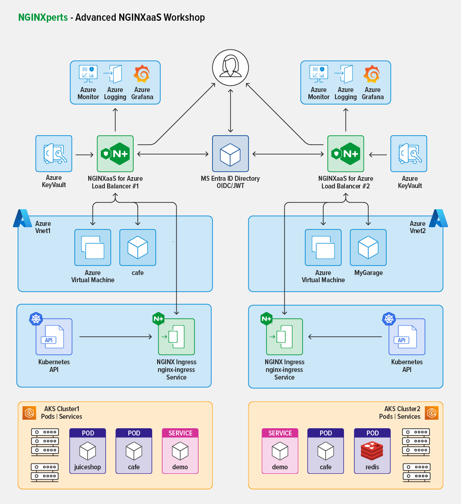

#  Setup your Computer for NGINX Workshops 

## Introduction

In this Workshop, you will build a working Lab environment in Azure, and use Nginx for Azure to control traffic to these Azure Resources.  The architecture you will build will look like this diagram:

  
In order to build this environment, your computer hardware, software, and applications must be properly installed and functional.  This is the list of Prerequisite needed to successfully complete this Workshop as a Student.

>It is `highly recommended` for Students attending this Workshop to be proficient with NGINX and Azure and have some experience with Kubernetes and Docker administration, networking tools, and Load Balancing concepts.  An `Azure Subscription` and Admin level access to Azure Portal is required. Previous experience with Visual Studio Code and Redis Tools is also recommended.

 

## Prerequisites

In this Lab0, the requirements for both the Student and the Azure environment will be described.  

> **IMPORTANT!** It is imperative that you have the appropriate computer, tools, and Azure Subscription privileges to successfully complete the Workshop.

 

NGINXaaS for Azure  |  NGINX Plus  |  Kubernetes | Docker | Redis
:-------------------------:|:-------------------------:|:-------------------------:|:-------------------------:|:-------------------------:
  |     |   |   |  

 

## Student Azure Subscription Requirements

**IMPORTANT:** Students taking this Workshop will require `Owner` level privileges to complete the Lab Exercises.  In addition, Students will also require the following Subscription privileges. Consult with your IT Cloud Team to ensure you have the necessary privileges for the following items, *prior* to attempting the Workshop Exercises:

1. Multiple `Public Ip Addresses` used in this lab.

    - Public IP Address for the Nginx for Azure instance
    - Public IP Address for the UbuntuVM
    - Public IP Address for the Kubernetes Cluster API Server for the AKS instance(s)

2. `Azure Key Vault` used in this lab, to create TLS certificates and keys.

3. `Entra ID` used in this lab, to create Applications and Settings for the OIDC/JWT integration with Nginx. 

 

### Student Hardware/Software/Azure Requirements

Verify you have the proper computer requirements - hardware and software.
- Hardware:  Laptop, Admin rights, Internet connection
- Software:  Visual Studio, Terminal, Chrome, Docker, AKS and Azure CLI.
    - You will need the Azure Command Line Interface tool (version 2.61.0 or higher) installed on your client machine to manage your Azure services. See [Azure CLI Installation](https://learn.microsoft.com/en-us/cli/azure/install-azure-cli) for instructions.
    - You will also need the Azure CLI `NGINX` extension added.  See [Azure CLI Extensions](https://learn.microsoft.com/en-us/cli/azure/azure-cli-extensions-overview) for instructions.
- Verify you have proper computer skills:  Linux CLI, files, SSH/Terminal, Docker/Compose, Azure Portal, Load Balancing concepts, Linux tools, Azure CLI
- Verify you have the proper access to Azure resources: Azure Subscription with Admin/Owner level access

 

### Required Skills

- Nginx for Azure NGINXperts Workshop has minimum REQUIRED Nginx Skills: Students must be familiar with Nginx operation, configurations, and concepts for HTTP traffic.
- The NGINXperts Basics Workshop is HIGHLY recommended, students should have taken this workshop prior.
- The NGINXperts Plus Ingress Controller workshop is also HIGHLY recommended, students should have taken this workshop prior.
- Azure admin skills, previous training from Microsoft Learn is HIGHLY recommended.
- Recommended: TLS, DNS, HTTP caching, Grafana, Redis

 

[NGINXperts Basics Workshop](https://github.com/nginxinc/nginx-basics-workshops)

[NGINXperts Nginx Plus Ingress Controller Workshop](https://github.com/nginxinc/nginx-ingress-workshops/tree/main/Plus/labs)

 

**This completes Lab0.**

 

## References:

- [NGINX As A Service for Azure](https://docs.nginx.com/nginxaas/azure/)
- [NGINX Plus Product Page](https://docs.nginx.com/nginx/)
- [NGINX Ingress Controller](https://docs.nginx.com//nginx-ingress-controller/)
- [NGINX on Docker](https://docs.nginx.com/nginx/admin-guide/installing-nginx/installing-nginx-docker/)
- [NGINX Directives Index](https://nginx.org/en/docs/dirindex.html)
- [NGINX Variables Index](https://nginx.org/en/docs/varindex.html)
- [NGINX Technical Specs](https://docs.nginx.com/nginx/technical-specs/)
- [NGINX - Join Community Slack](https://community.nginx.org/joinslack)

 

### Authors

- Chris Akker - Solutions Architect - Community and Alliances @ F5, Inc.
- Shouvik Dutta - Solutions Architect - Community and Alliances @ F5, Inc.
- Adam Currier - Solutions Architect - Community and Alliances @ F5, Inc.
- Steve Wagner - Solutions Architect - Community and Alliances @ F5, Inc.

-------------

Navigate to ([Lab1](../lab1/readme.md) | [LabGuide](../readme.md))
