# Steps to login to NGINXperts provided Azure tenant

1. Once you type below command within the terminal, you would notice a browser window would open and prompt you to sign in to Microsoft Azure.

1. All attendees who have registered to this workshop should use their registration email id to login. The username format would be as below:

    Let say your workshop registration email id is `b.gates@f5.com` then your username for the workshop Azure tenant would be `b.gates#f5.com@f5nginxpert.onmicrosoft.com`. Essentially replace `@` with a `#` and then suffix it with `@f5nginxpert.onmicrosoft.com`. Please refer to below screenshot. Provide your username and click on `Next`.

    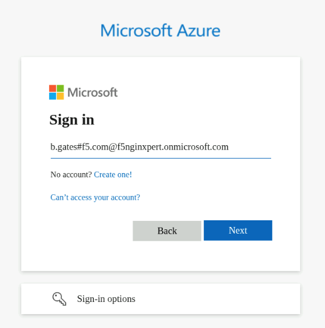

1. After providing your username, you would be prompted to provide a password. Enter the default password (`Nginx123`) and click on `Sign in`.

    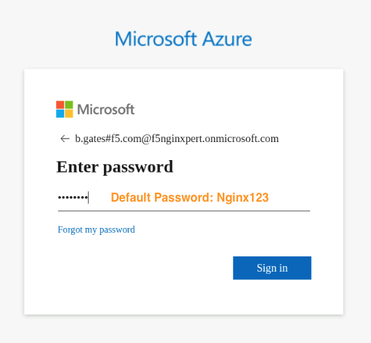

1. Next you would be prompted to secure your account by enabling multi factor authentication using Microsoft Authenticator. click `Next` to continue.

    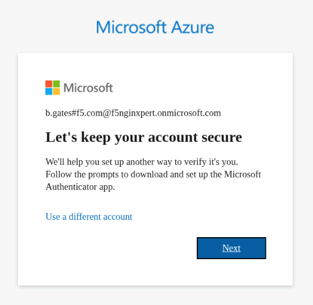

1. Download Microsoft Authenticator application on your phone and then click `Next` to continue.

    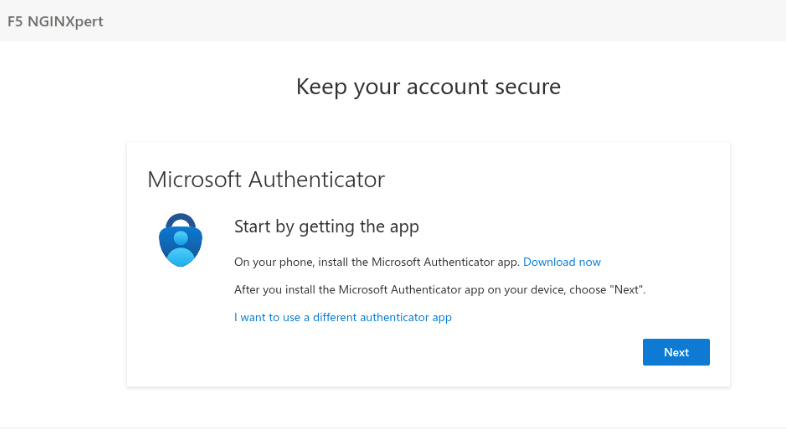

1. In the next prompt, read through the instruction and when ready click on `Next` to continue.

    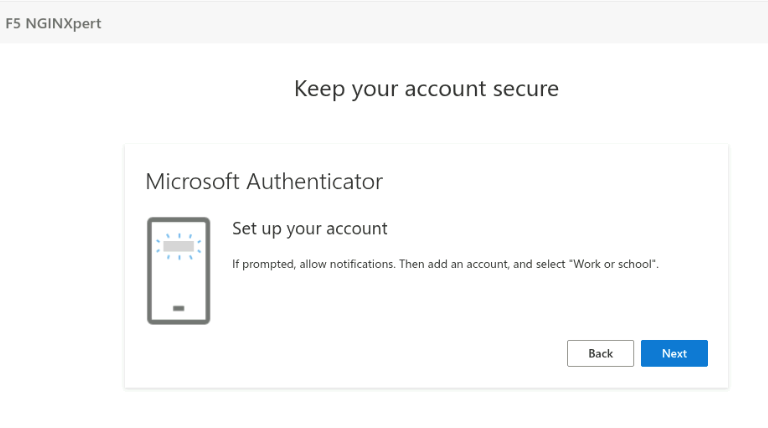

1. In the next prompt, you need to scan a QR code using the Microsoft Authenticator App in your phone. Once done, click `Next` to continue.

    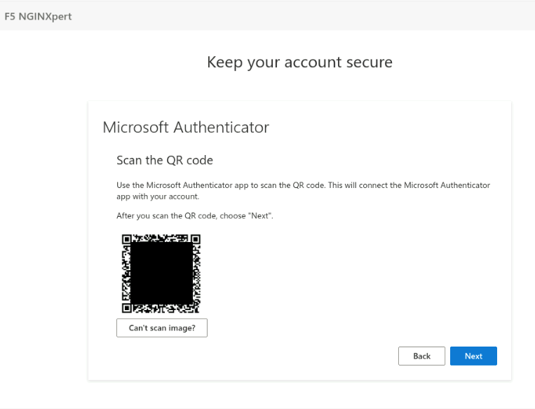

1. In the next prompt, you will test out and verify the setup was successful by following the instructions on the screen.

    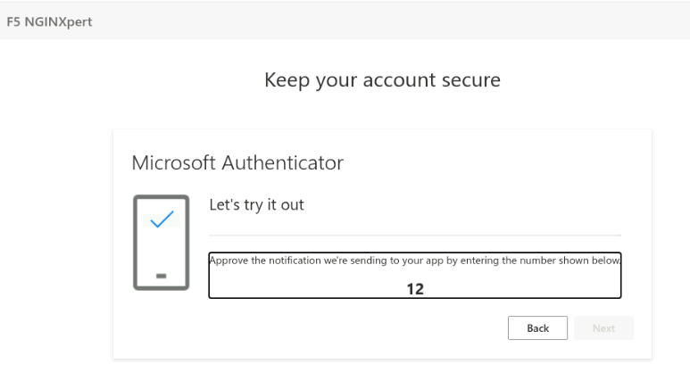

1. If you have entered the provided number properly within your Authenticator app then you would see a `Notification Approved` message as shown in below screenshot. Click `Next` to continue.

    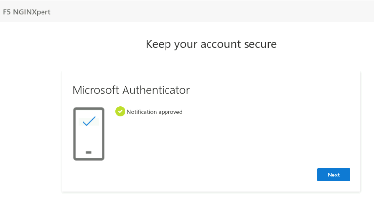

1. Finally, if you have successfully set up your multi factor authentication then you will see the `Success` page as shown in below screenshot. Click `Done` to finish authenticator setup.

    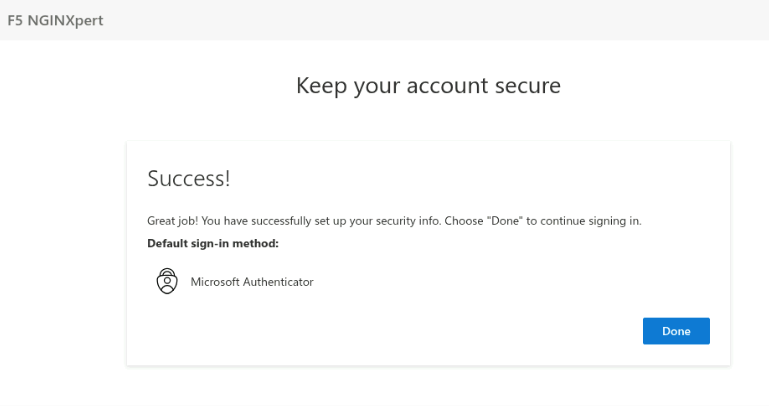

1. Once multi factor authentication is all set your `az login` should be done. You would see a below message in your browser confirming that you have successfully logged into Microsoft Azure.

    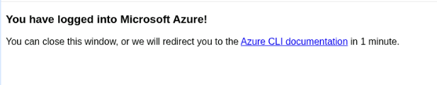

1. Navigate back to the terminal within vscode. Since this temporary account is tied to a single `F5 NGINXpert` tenant, press `Enter` to confirm no change to subscription and tenant when prompted in the terminal window.

    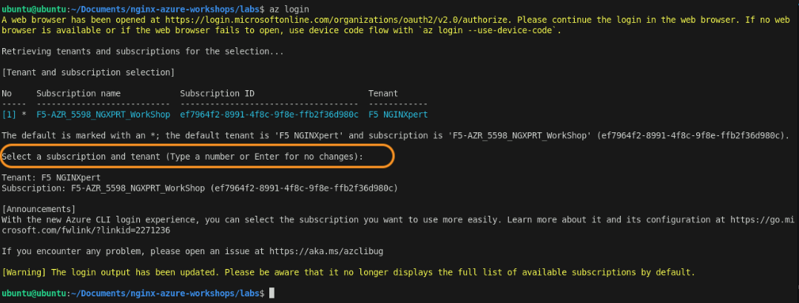

 

**This completes the login process to the Azure tenant provided for this workshop. You can now navigate back to the main lab1 readme file and continue with the next section.**

---

Navigate to ([Lab1](./readme.md) | [LabGuide](../readme.md))