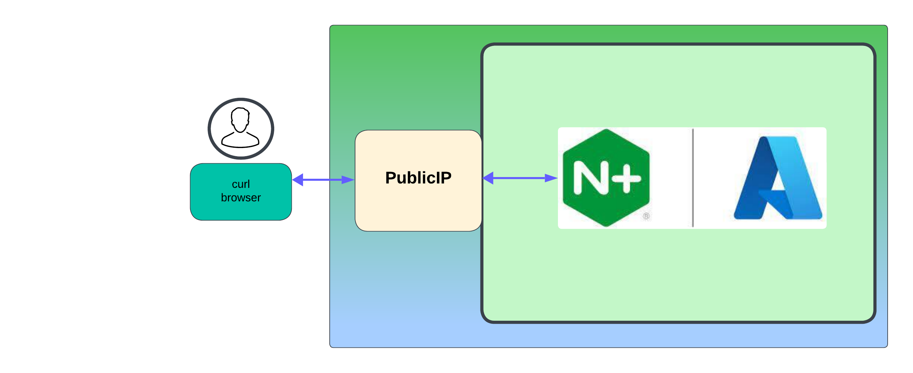
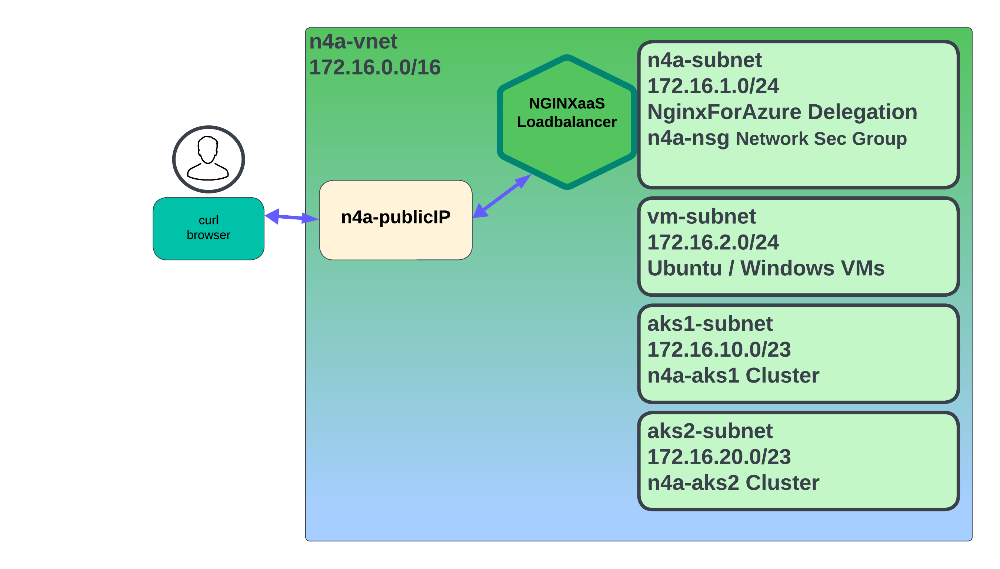
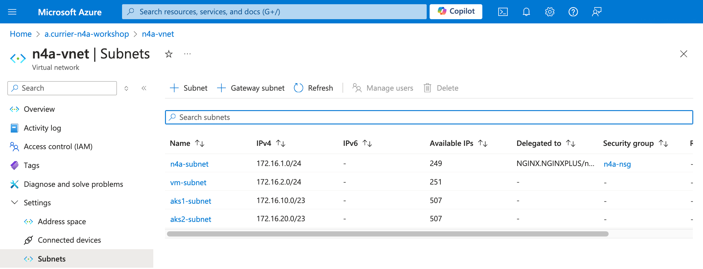

# Azure Network Build and NGINX for Azure Overview

## Introduction

In this lab, you will be adding and configuring the Azure components needed for this workshop.  This will require a few network resources, a Network Security Group and a Public IP to allow incoming traffic to your NGINX for Azure workshop resource. You will also deploy NGINX for Azure resource. Then you will explore the Nginx for Azure product, as a quick Overview of what it is and how to deploy it.

<br/>

NGINX aaS for Azure |
:-------------------------:|
 
  
<br/>

## Learning Objectives

By the end of the lab you will be able to:

- Setup your Azure Resource Group for this workshop
- Setup your Azure Virtual Network, Subnets and Network Security Group for inbound traffic
- Create a Public IP and user assigned managed identity to access NGINX for Azure
- Deploy an Nginx for Azure resource
- Explore Nginx for Azure
- Create an initial Nginx configuration for testing
- Create Log Analytics workspace to collect NGINX error and access logs from Nginx for Azure

## Prerequisites

- You must have an Azure account
- You must have the Azure CLI software installed on your local system
- See `Lab0` for instructions on setting up your system for this Workshop
- Familiarity with basic Linux concepts and commands
- Familiarity with basic Azure concepts and commands
- Familiarity with basic Nginx concepts and commands

<br/>


Lab1 Diagram

<br/>

### Setup your Azure Resource group for this workshop

1. In your local machine open terminal and make sure you have Azure Command Line Interface (CLI) installed by running below command.

    ```bash
    az --version
    ```

    > NOTE: If this command throws an error then it means Azure CLI is not installed. Follow lab0 instructions to get it installed in your local machine.

1. Create a new Azure Resource Group called `<name>-workshop` , where `<name>` is your last name (or any unique value).  This would hold all the Azure resources that you would create for this workshop.

    Check out the available [Datacenter regions](https://azure.microsoft.com/en-us/explore/global-infrastructure/geographies/#geographies) and decide on a region that is closest to you and meets your needs.

    You can make use of [Azure Latency Test](https://www.azurespeed.com/Azure/Latency) to select a region that provides the lowest latency.

    I am located in Chicago, Illinois so I will opt to use `Central US` as my Azure location.

    ```bash
   az group create --name <name>-workshop --location <MY_Location>

   ## example
   az group create --name s.dutta-workshop --location centralus
   ```

2. Make sure the new Azure Resource Group has been created by running below command.

   ```bash
   az group list -o table | grep workshop
   ```

<br/>

### Setup your Azure Virtual Network, Subnets and Network Security Group


Lab1 Vnet/Subnets

You will create an Azure Vnet for this Workshop.  Inside of this Vnet are 4 different subnets, representing various backend networks for Azure resources like Nginx for Azure, VMs, and Kubernetes clusters.

Name | Subnet | Assignment
:---:|:----:|:---:
n4a-subnet | 172.16.1.0/24 | Nginx for Azure
vm-subnet | 172.16.2.0/24 | Virtual Machines
aks1-subnet | 172.16.10.0/23 | AKS Cluster #1
aks2-subnet | 172.16.20.0/23 | AKS Cluster #2

<br/>

1. Create a virtual network (vnet) named `n4a-vnet` using below command.

    ```bash
    ## Set environment variables
    export MY_RESOURCEGROUP=s.dutta-workshop
    export MY_PUBLICIP=$(curl -4 ifconfig.co)
    ```

    ```bash
    az network vnet create \
    --resource-group $MY_RESOURCEGROUP \
    --name n4a-vnet \
    --address-prefixes 172.16.0.0/16
    ```

    ```bash
    ##Sample Output##
    {
        "newVNet": {
            "addressSpace": {
            "addressPrefixes": [
                "172.16.0.0/16"
            ]
            },
            "enableDdosProtection": false,
            "etag": "W/\"be1dfac2-9879-4a22-abe4-717badebb0ec\"",
            "id": "/subscriptions/<SUBSCRIPTION_ID>/resourceGroups/s.dutta-workshop/providers/Microsoft.Network/virtualNetworks/n4a-vnet",
            "location": "centralus",
            "name": "n4a-vnet",
            "provisioningState": "Succeeded",
            "resourceGroup": "s.dutta-workshop",
            "resourceGuid": "xxxx-xxxx-xxxx-xxxx-xxxx",
            "subnets": [],
            "type": "Microsoft.Network/virtualNetworks",
            "virtualNetworkPeerings": []
        }
    }
    ```

    > **NOTE:** Within the output json you should have a `"provisioningState": "Succeeded"` field which validates the command successfully provisioned the resource.

2. Create a network security group (NSG) named `n4a-nsg` using below command.

    ```bash
    az network nsg create \
    --resource-group $MY_RESOURCEGROUP \
    --name n4a-nsg
    ```

3. Add two NSG rules to allow any traffic on port 80 and 443 from your system's public IP. Run below command to create the two rules.

    ```bash
    ## Rule 1 for HTTP traffic

    az network nsg rule create \
    --resource-group $MY_RESOURCEGROUP \
    --nsg-name n4a-nsg \
    --name HTTP \
    --priority 320 \
    --source-address-prefix $MY_PUBLICIP \
    --source-port-range '*' \
    --destination-address-prefix '*' \
    --destination-port-range 80 \
    --direction Inbound \
    --access Allow \
    --protocol Tcp \
    --description "Allow HTTP traffic"
    ```

    ```bash
    ## Rule 2 for HTTPS traffic
    
    az network nsg rule create \
    --resource-group $MY_RESOURCEGROUP \
    --nsg-name n4a-nsg \
    --name HTTPS \
    --priority 300 \
    --source-address-prefix $MY_PUBLICIP \
    --source-port-range '*' \
    --destination-address-prefix '*' \
    --destination-port-range 443 \
    --direction Inbound \
    --access Allow \
    --protocol Tcp \
    --description "Allow HTTPS traffic"
    ```

    ```bash
    ##Sample Output##
    
    #Rule1 Output
    {
        "access": "Allow",
        "description": "Allow HTTP traffic",
        "destinationAddressPrefix": "*",
        "destinationAddressPrefixes": [],
        "destinationPortRange": "80",
        "destinationPortRanges": [],
        "direction": "Inbound",
        "etag": "W/\"7a178961-d3b8-4562-8493-4fcd7752e37b\"",
        "id": "/subscriptions/<SUBSCRIPTION_ID>/resourceGroups/s.dutta-workshop/providers/Microsoft.Network/networkSecurityGroups/n4a-nsg/securityRules/HTTP",
        "name": "HTTP",
        "priority": 320,
        "protocol": "Tcp",
        "provisioningState": "Succeeded",
        "resourceGroup": "s.dutta-workshop",
        "sourceAddressPrefix": "<MY_PUBLICIP>",
        "sourceAddressPrefixes": [],
        "sourcePortRange": "*",
        "sourcePortRanges": [],
        "type": "Microsoft.Network/networkSecurityGroups/securityRules"
    }

    #Rule2 Output
    {
        "access": "Allow",
        "description": "Allow HTTPS traffic",
        "destinationAddressPrefix": "*",
        "destinationAddressPrefixes": [],
        "destinationPortRange": "443",
        "destinationPortRanges": [],
        "direction": "Inbound",
        "etag": "W/\"dc717c9f-3790-45ba-b7aa-e5e39c11142d\"",
        "id": "/subscriptions/<SUBSCRIPTION_ID>/resourceGroups/s.dutta-workshop/providers/Microsoft.Network/networkSecurityGroups/n4a-nsg/securityRules/HTTPS",
        "name": "HTTPS",
        "priority": 300,
        "protocol": "Tcp",
        "provisioningState": "Succeeded",
        "resourceGroup": "s.dutta-workshop",
        "sourceAddressPrefix": "<MY_PUBLICIP>",
        "sourceAddressPrefixes": [],
        "sourcePortRange": "*",
        "sourcePortRanges": [],
        "type": "Microsoft.Network/networkSecurityGroups/securityRules"
    }
    ```

4. Create a subnet that you will use with NGINX for Azure resource. You will also attach the NSG that you just created to this subnet.

    ```bash
    az network vnet subnet create \
    --resource-group $MY_RESOURCEGROUP \
    --name n4a-subnet \
    --vnet-name n4a-vnet \
    --address-prefixes 172.16.1.0/24 \
    --network-security-group n4a-nsg \
    --delegations NGINX.NGINXPLUS/nginxDeployments
    ```

    ```bash
    ##Sample Output##
    {
        "addressPrefix": "172.16.1.0/24",
        "delegations": [
            {
                "actions": [
                    "Microsoft.Network/virtualNetworks/subnets/join/action"
                ],
                "etag": "W/\"a615708f-145c-4568-a7b1-29b262f04065\"",
                "id": "/subscriptions/<SUBSCRIPTION_ID>/resourceGroups/s.dutta-workshop/providers/Microsoft.Network/virtualNetworks/n4a-vnet/subnets/n4a-subnet/delegations/0",
                "name": "0",
                "provisioningState": "Succeeded",
                "resourceGroup": "s.dutta-workshop",
                "serviceName": "NGINX.NGINXPLUS/nginxDeployments",
                "type": "Microsoft.Network/virtualNetworks/subnets/delegations"
            }
        ],
        "etag": "W/\"a615708f-145c-4568-a7b1-29b262f04065\"",
        "id": "/subscriptions/<SUBSCRIPTION_ID>/resourceGroups/s.dutta-workshop/providers/Microsoft.Network/virtualNetworks/n4a-vnet/subnets/n4a-subnet",
        "name": "n4a-subnet",
        "networkSecurityGroup": {
            "id": "/subscriptions/<SUBSCRIPTION_ID>/resourceGroups/s.dutta-workshop/providers/Microsoft.Network/networkSecurityGroups/n4a-nsg",
            "resourceGroup": "s.dutta-workshop"
        },
        "privateEndpointNetworkPolicies": "Disabled",
        "privateLinkServiceNetworkPolicies": "Enabled",
        "provisioningState": "Succeeded",
        "resourceGroup": "s.dutta-workshop",
        "type": "Microsoft.Network/virtualNetworks/subnets"
    }
    ```

5. In similar fashion create three more subnets that would be used with docker virtual machines and AKS clusters in later labs.

    ```bash
    # VM Subnet
    az network vnet subnet create \
    --resource-group $MY_RESOURCEGROUP \
    --name vm-subnet \
    --vnet-name n4a-vnet \
    --address-prefixes 172.16.2.0/24
    ```

    ```bash
    # AKS1 Subnet
    az network vnet subnet create \
    --resource-group $MY_RESOURCEGROUP \
    --name aks1-subnet \
    --vnet-name n4a-vnet \
    --address-prefixes 172.16.10.0/23
    ```

    ```bash
    # AKS2 Subnet
    az network vnet subnet create \
    --resource-group $MY_RESOURCEGROUP \
    --name aks2-subnet \
    --vnet-name n4a-vnet \
    --address-prefixes 172.16.20.0/23
    ```

Your completed Vnet/Subnets should look similar to this:


Lab1 Vnet/Subnets

<br/>

### Create Public IP and user assigned managed identity to access NGINX for Azure

1. Create a Public IP that you will attach to NGINX for Azure. You will use this public IP to access NGINX for Azure from outside the Azure network. Use below command to create a new Public IP.

    ```bash
    az network public-ip create \
    --resource-group $MY_RESOURCEGROUP \
    --name n4a-publicIP \
    --allocation-method Static \
    --sku Standard
    ```

    ```bash
    ##Sample Output##
    {
        "publicIp": {
            "ddosSettings": {
                "protectionMode": "VirtualNetworkInherited"
            },
            "etag": "W/\"cbeb62f5-3ecc-404f-919d-bdea24c7b9f3\"",
            "id": "/subscriptions/<SUBSCRIPTION_ID>/resourceGroups/s.dutta-workshop/providers/Microsoft.Network/publicIPAddresses/n4a-publicIP",
            "idleTimeoutInMinutes": 4,
            "ipAddress": "<AZURE_ASSIGNED_PUBLICIP>",
            "ipTags": [],
            "location": "centralus",
            "name": "n4a-publicIP",
            "provisioningState": "Succeeded",
            "publicIPAddressVersion": "IPv4",
            "publicIPAllocationMethod": "Static",
            "resourceGroup": "s.dutta-workshop",
            "resourceGuid": "xxxx-xxxx-xxxx-xxxx-xxxx",
            "sku": {
                "name": "Standard",
                "tier": "Regional"
            },
            "type": "Microsoft.Network/publicIPAddresses"
        }
    }
    ```

1. Create a user assigned managed identity that would be tied to the NGINX for Azure resource. This managed identity would be used to read certificates and keys from Azure key vault in later labs.

   ```bash
   az identity create \
   --resource-group $MY_RESOURCEGROUP \
   --name n4a-useridentity
   ```

   ```bash
   ##Sample Output##
   {
        "clientId": "xxxx-xxxx-xxxx-xxxx-xxxx",
        "id": "/subscriptions/<SUBSCRIPTION_ID>/resourcegroups/s.dutta-workshop/providers/Microsoft.ManagedIdentity/userAssignedIdentities/n4a-useridentity",
        "location": "centralus",
        "name": "n4a-useridentity",
        "principalId": "xxxx-xxxx-xxxx-xxxx-xxxx",
        "resourceGroup": "s.dutta-workshop",
        "systemData": null,
        "tags": {},
        "tenantId": "xxxx-xxxx-xxxx-xxxx-xxxx",
        "type": "Microsoft.ManagedIdentity/userAssignedIdentities"
    }
   ```

<br/>

## Deploy an Nginx for Azure Resource

<br/>

1. Once all the previous Azure resources have been created, you will then create the NGINX for Azure resource using below commands (This will take couple of minutes to finish):

    ```bash
    ## Set environment variables
    export MY_RESOURCEGROUP=s.dutta-workshop
    export MY_SUBSCRIPTIONID=$(az account show --query id -o tsv)
    ```

    ```bash
    az nginx deployment create \
    --resource-group $MY_RESOURCEGROUP \
    --name nginx4a \
    --sku name="standard_Monthly" \
    --network-profile front-end-ip-configuration="{public-ip-addresses:[{id:/subscriptions/$MY_SUBSCRIPTIONID/resourceGroups/$MY_RESOURCEGROUP/providers/Microsoft.Network/publicIPAddresses/n4a-publicIP}]}" network-interface-configuration="{subnet-id:/subscriptions/$MY_SUBSCRIPTIONID/resourceGroups/$MY_RESOURCEGROUP/providers/Microsoft.Network/virtualNetworks/n4a-vnet/subnets/n4a-subnet}" \
    --identity="{type:UserAssigned,userAssignedIdentities:{/subscriptions/$MY_SUBSCRIPTIONID/resourceGroups/$MY_RESOURCEGROUP/providers/Microsoft.ManagedIdentity/userAssignedIdentities/n4a-useridentity:{}}}"
    ```

    ```bash
    ##Sample Output##
    {
        "id": "/subscriptions/<SUBSCRIPTION_ID>/resourceGroups/s.dutta-workshop/providers/Nginx.NginxPlus/nginxDeployments/nginx4a",
        "identity": {
            "type": "UserAssigned",
            "userAssignedIdentities": {
                "/subscriptions/<SUBSCRIPTION_ID>/resourceGroups/s.dutta-workshop/providers/Microsoft.ManagedIdentity/userAssignedIdentities/n4a-useridentity": {
                    "clientId": "xxxx-xxxx-xxxx-xxxx-xxxx",
                    "principalId": "xxxx-xxxx-xxxx-xxxx-xxxx"
                }
            }
        },
        "location": "centralus",
        "name": "nginx4a",
        "properties": {
            "autoUpgradeProfile": {
                "upgradeChannel": "stable"
            },
            "enableDiagnosticsSupport": false,
            "ipAddress": "<AZURE_ASSIGNED_PUBLICIP>",
            "managedResourceGroup": "NGX_s.dutta-workshop_nginx4a_centralus",
            "networkProfile": {
                "frontEndIPConfiguration": {
                    "publicIPAddresses": [
                        {
                            "id": "/subscriptions/<SUBSCRIPTION_ID>/resourceGroups/s.dutta-workshop/providers/Microsoft.Network/publicIPAddresses/n4a-publicIP",
                            "resourceGroup": "s.dutta-workshop"
                        }
                    ]
                },
                "networkInterfaceConfiguration": {
                    "subnetId": "/subscriptions/<SUBSCRIPTION_ID>/resourceGroups/s.dutta-workshop/providers/Microsoft.Network/virtualNetworks/n4a-vnet/subnets/n4a-subnet"
                }
            },
            "nginxVersion": "1.25.1 (nginx-plus-r30-p2)",
            "provisioningState": "Succeeded",
            "scalingProperties": {
                "capacity": 20
            },
            "userProfile": {}
        },
        "resourceGroup": "s.dutta-workshop",
        "sku": {
            "name": "standard_Monthly"
        },
        "systemData": {
            "createdAt": "2024-04-16T22:51:28.3015754Z",
            "createdBy": "nginx@f5.com",
            "createdByType": "User",
            "lastModifiedAt": "2024-04-16T22:51:28.3015754Z",
            "lastModifiedBy": "nginx@f5.com",
            "lastModifiedByType": "User"
        },
        "type": "nginx.nginxplus/nginxdeployments"
    }
    ```

    > **NOTE:** Within the output json you should have a `"provisioningState": "Succeeded"` field which validates the command successfully provisioned the resource.

<br/>

### Explore Nginx for Azure

<br/>

NGINX as a Service for Azure is a service offering that is tightly integrated into Microsoft Azure public cloud and its ecosystem, making applications fast, efficient, and reliable with full lifecycle management of advanced NGINX traffic services. NGINXaaS for Azure is available in the Azure Marketplace.

NGINXaaS for Azure is powered by NGINX Plus, which extends NGINX Open Source with advanced functionality and provides customers with a complete application delivery solution. Initial use cases covered by NGINXaaS include L4 TCP and L7 HTTP load balancing and reverse proxy which can be managed through various Azure management tools. NGINXaaS allows you to provision distinct deployments as per your business or technical requirements.

In this section you will be looking at NGINX for Azure resource that you created within Azure portal.

1. Open Azure portal within your browser and then open your resource group.
   

2. Click on your NGINX for Azure resource (nginx4a) which should open the Overview section of your resource. You can see useful information like Status, NGINX for Azure resource's public IP, which Nginx version is running, which vnet/subnet it is using, etc.
   

3. From the left pane click on `NGINX Configuration`. As you are opening this resource for first time and you do not have any configuration present, Azure will prompt you to "Get started with a Configuration example". Click on `Populate now` button to start with a sample configuration example.
   

4. Once you click on the `Populate now` button you will see the configuration editor section has been populated with `nginx.conf` and an `index.html` page. Click on the `Submit` button to deploy this sample config files to the NGINX for Azure resource.
   

5. Once you have submitted the configuration, you can watch its progress in the notification tab present in right top corner. Intially status would be "Updating NGINX configuration" which would change to "Updated NGINX configuration successfully".
   

6. Navigate back to Overview section and copy the public IP address of NGINX for Azure resource.

7. In a new browser window, paste the public IP into the address bar. You will notice the sample index page gets rendered into your browser.
   

8. This completes the validation of all the resources that you created using Azure CLI. In the upcoming labs you would be modifying the configuration files and exploring various features of NGINX for Azure resources.

<br/>

### Create Log Analytics workspace to collect NGINX error and Access logs from NGINX for azure

In this section you will create a Log Analytics resource that would collect Nginx logs from your Nginx for Azure resource. As this resource takes time to get provisioned and attached to NGINX for Azure resource, you are building it up here.

1. Within the NGINX for Azure resource (nginx4a), navigate to managed identity section by clicking on `Identity` from the left menu. Within this section, inside the `System assigned` tab, enable system managed identity by changing the status to `on`. Click on `Save` to save your changes. Press `Yes` within the "Enable system assigned managed identity" prompt.
    

2. If you open up the Notifications pane, you should see a success status as shown below.
   

3. Now go back to your terminal and create a Log Analytics workspace resource that you will attach to NGINX for Azure using Azure CLI. This resource would be used to capture and store NGINX error and access logs. Use below command to create this resource.

    ```bash
    ## Set environment variables
    export MY_RESOURCEGROUP=s.dutta-workshop
    ```

    ```bash
    az monitor log-analytics workspace create \
    --resource-group $MY_RESOURCEGROUP \
    --name n4a-loganalytics
    ```

    ```bash
    {
        "createdDate": "2024-04-17T20:42:48.2028783Z",
        "customerId": "xxxx-xxxx-xxxx-xxxx-xxxx",
        "etag": "\"98028759-0000-0500-0000-662fc5330000\"",
        "features": {
            "enableLogAccessUsingOnlyResourcePermissions": true
        },
        "id": "/subscriptions/<SUBSCRIPTION_ID>/resourceGroups/s.dutta-workshop/providers/Microsoft.OperationalInsights/workspaces/n4a-loganalytics",
        "location": "centralus",
        "modifiedDate": "2024-04-29T16:05:07.3687572Z",
        "name": "n4a-loganalytics",
        "provisioningState": "Succeeded",
        "publicNetworkAccessForIngestion": "Enabled",
        "publicNetworkAccessForQuery": "Enabled",
        "resourceGroup": "s.dutta-workshop",
        "retentionInDays": 30,
        "sku": {
            "lastSkuUpdate": "2024-04-17T20:42:48.2028783Z",
            "name": "PerGB2018"
        },
        "type": "Microsoft.OperationalInsights/workspaces",
        "workspaceCapping": {
            "dailyQuotaGb": -1.0,
            "dataIngestionStatus": "RespectQuota",
            "quotaNextResetTime": "2024-04-30T09:00:00Z"
        }
    }
    ```

     > **NOTE:** Within the output json you should have a `"provisioningState": "Succeeded"` field which validates the command successfully provisioned the resource.

4. Next you will update your NGINX for Azure resource to enable sending metrics to Azure monitor by setting the `--enable-diagnostics` flag to `true` using below command.

    ```bash
    az nginx deployment update \
    --resource-group $MY_RESOURCEGROUP \
    --name nginx4a \
    --enable-diagnostics true
    ```

    ```bash
    ##Sample Output##
    {
        "id": "/subscriptions/<SUBSCRIPTION_ID>/resourceGroups/s.dutta-workshop/providers/Nginx.NginxPlus/nginxDeployments/nginx4a",
        "identity": {
            "principalId": "xxxx-xxxx-xxxx-xxxx-xxxx",
            "tenantId": "xxxx-xxxx-xxxx-xxxx-xxxx",
            "type": "SystemAssigned, UserAssigned",
            "userAssignedIdentities": {
            "/subscriptions/<SUBSCRIPTION_ID>/resourceGroups/s.dutta-workshop/providers/Microsoft.ManagedIdentity/userAssignedIdentities/n4a-useridentity": {
                    "clientId": "xxxx-xxxx-xxxx-xxxx-xxxx",
                    "principalId": "xxxx-xxxx-xxxx-xxxx-xxxx"
                }
            }
        },
        "location": "centralus",
        "name": "nginx4a",
        "properties": {
            "autoUpgradeProfile": {
            "upgradeChannel": "stable"
            },
            "enableDiagnosticsSupport": true,
            
            ...
        },

        ...
    }
    ```

5. The last step that you need to perform to start collecting NGINX logs is to create an Azure diagnostic settings resource that will stream the NGINX logs to the log-analytics workspace that you created in previous step. Run below commands to create this resource.

    ```bash
    ## Set environment variables
    export MY_N4A_ID=$(az nginx deployment show \
    --resource-group $MY_RESOURCEGROUP \
    --name nginx4a \
    --query id \
    --output tsv)

    export MY_LOG_ANALYTICS_ID=$(az monitor log-analytics workspace show \
    --resource-group $MY_RESOURCEGROUP \
    --name n4a-loganalytics \
    --query id \
    --output tsv)
    ```

    ```bash
    az monitor diagnostic-settings create \
    --resource $MY_N4A_ID \
    --name n4a-nginxlogs \
    --resource-group $MY_RESOURCEGROUP \
    --workspace $MY_LOG_ANALYTICS_ID \
    --logs "[{category:NginxLogs,enabled:true,retention-policy:{enabled:false,days:0}}]"
    ```

    ```bash
    ##Sample Output##
    {
        "id": "/subscriptions/<SUBSCRIPTION_ID>/resourcegroups/s.dutta-workshop/providers/nginx.nginxplus/nginxdeployments/nginx4a/providers/microsoft.insights/diagnosticSettings/n4a-nginxlogs",
        "logs": [
            {
            "category": "NginxLogs",
            "enabled": true,
            "retentionPolicy": {
                "days": 0,
                "enabled": false
            }
            }
        ],
        "metrics": [],
        "name": "n4a-nginxlogs",
        "resourceGroup": "s.dutta-workshop",
        "type": "Microsoft.Insights/diagnosticSettings",
        "workspaceId": "/subscriptions/<SUBSCRIPTION_ID>/resourceGroups/s.dutta-workshop/providers/Microsoft.OperationalInsights/workspaces/n4a-loganalytics"
    }
    ```

6. In upcoming labs, you will explore and learn more about NGINX logs and make use of these resources that you built in this section.

<br/>

**This completes Lab1.**

<br/>

## References:

- [NGINX As A Service for Azure](https://docs.nginx.com/nginxaas/azure/)
- [NGINX Plus Product Page](https://docs.nginx.com/nginx/)
- [NGINX Azure CLI command Reference](https://learn.microsoft.com/en-us/cli/azure/nginx?view=azure-cli-latest)
- [Azure CLI Reference](https://learn.microsoft.com/en-us/cli/azure/)
- [NGINX - Join Community Slack](https://community.nginx.org/joinslack)

<br/>

### Authors

- Chris Akker - Solutions Architect - Community and Alliances @ F5, Inc.
- Shouvik Dutta - Solutions Architect - Community and Alliances @ F5, Inc.
- Adam Currier - Solutions Architect - Community and Alliances @ F5, Inc.

-------------

Navigate to ([Lab2](../lab2/readme.md) | [LabX](../labX/readme.md))
