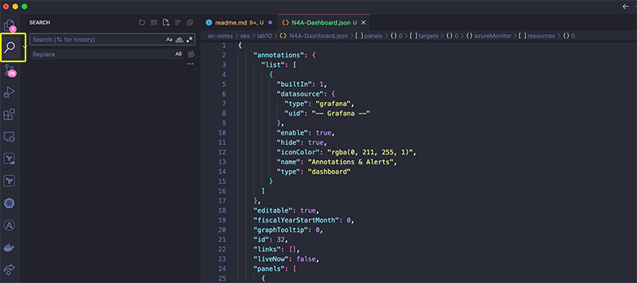
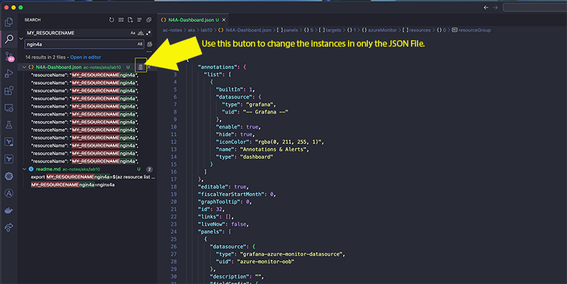
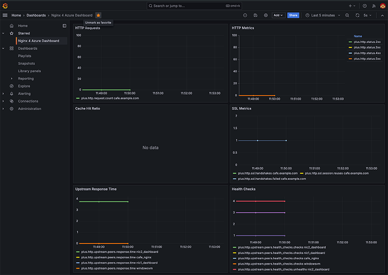

# Monitoring NGINXaaS for Azure with Grafana

## Introduction

In this lab, you will be exploring the integration between NGINXaaS for Azure and Grafana for monitoring of the service. NGINX as a Service for Azure is a service offering that is tightly integrated into Microsoft Azure public cloud and its ecosystem, making applications fast, efficient, and reliable with full lifecycle management of advanced NGINX traffic services.

NGINXaaS is powered by NGINX Plus, so much of the configuration is similar to what you are already used to. We will use Grafana to create a dashboard in which we will monitor:
- HTTP requests
- HTTP Metrics
- Cache Hit Ratio
- SSL Metrics 
- Upstream Response Time
- Health checks 

The data for these will be based on the work done in previous labs.


NGINXaaS for Azure | Grafana
:-------------------------:|:-------------------------:
 | 
  
## Learning Objectives

By the end of the lab you will be able to:

- Create a Grafana managed instance in Azure
- Create a Dashboard to monitor metrics in NGINXaaS for Azure
- Test the Grafana Server
- View Grafana Dashboard

## Pre-Requisites

- You must be using NGINXaaS for Azure
- See `Lab0` for instructions on setting up your system for this Workshop
- Have Docker installed to run workloads (for graph data)
- Familiarity with basic Linux commands and commandline tools
- Familiarity with basic HTTP protocol
- Familiarity with Grafana


1. Ensure you are in the `lab10` folder. We will set two environment variables and then use these to create the Grafana Instance via the Azure CLI. 

> Please Note there is a charge associated with standing up a Managed Grafana instance in Azure and you should be sure to delete the resources when you are finished exploring the lab.

The resource group should be the same as the one you have been using for the whole workshop. If it is not set, do it here. The MY_GRAFANA variable is what the resource will be called when you are looking for it in Azure.

```bash
export MY_RESOURCEGROUP=a.currier-workshop
export MY_GRAFANA=grafanaworkshop

az grafana create --name $MY_GRAFANA --resource-group $MY_RESOURCEGROUP
```

2. In the output of the above command, take note of the endpoint that has been created for you. It should be found in a key labelled *endpoint*.

 

Using the endpoint URL you can log into the Managed Grafana instance using your Microsoft Entra ID (that you have been using for these labs). If you forgot to grab the endpoint URL, you can retrieve it via the Azure CLI tool:
```bash
az grafana show --name $MY_GRAFANA= --resource-group $MY_RESOURCEGROUP --query "properties.endpoint" --output tsv   
```

Open a web browser and go to the endpoint address listed. You should see an Entra ID login which may or may not have your credentials pre-populated:


 

Once signed in, you will be taken to the default Grafana landing page.

 

From here we will want to click on the Dashboards Menu on the left hand side.

 

In the upper right of the page is a blue drop down button. We will select *Import*:


In Visual Studio Code we will need to modify the template JSON to reflect the values of our resources. First let's grab the values we will need in the terminal:

```bash
export MY_RESOURCEGROUP=$(az resource list --resource-group a.currier-workshop --resource-type Nginx.NginxPlus/nginxDeployments --query "[].resourceGroup" -o tsv)
export MY_RESOURCENAME=$(az resource list --resource-group a.currier-workshop --resource-type Nginx.NginxPlus/nginxDeployments --query "[].name" -o tsv)
export MY_SUBSCRIPTIONID=$(az account show --query id -o tsv)
export MY_LOCATION=$(az resource list --resource-group a.currier-workshop --resource-type Nginx.NginxPlus/nginxDeployments --query "[].location" -o tsv)
```

Confirm the values were set:
```bash
set | grep MY
MY_LOCATION=eastus
MY_RESOURCEGROUP=a.currier-workshop
MY_RESOURCENAME=nginx4a
MY_SUBSCRIPTIONID=<INSERT SUBSCRIPTION ID>
```

Now that we have these 4 values we can use the Find/Replace function in Visual Studio to modify the JSON of the dashboad file. In the Lab10 folder, open the N4A-Dashboard.json file.


In the search field look for MY_RESOURCENAME and in the replace field use the value of that environment variable (here it is nginx4a).



> Note: Be careful using the replace all button, you only want to use the button next to the N4A-Dashboard.json file name. Otherwise it will replace the names in ALL of your files which we don't want to do.

Repeat this step for the other three variable names MY_RESOURCEGROUP, MY_LOCATION & MY_SUBSCRIPTIONID and replace with the values you just retrieved.


Copy the entire modified JSON code. In the grafana import window, paste the code into the import field and then click the blue load button.


### Generate a workload

1. Start the WRK load generation tool. This will provide some traffic to the NGINXaaS for Azure instance, so the statistics will be increasing.

```bash
docker run --rm williamyeh/wrk -t20 -d360s -c5000 https://cafe.example.com/ 
```

<br/>


### Grafana

We now have a working dashboard displaying some key metrics of the NGINX for Azure service. As with most dashboards, you can adjust the time intervals, etc. to get a better look at the data. Feel free to explore the dashboards.  



There are many different Grafana Dashboards available, and you have the option to create and build dashboards to suite your needs. There are many metrics for TCP, HTTP, SSL, Virtual Servers, Locations, Rate Limits, and Upstreams.

> If `wrk` load generation tool is still running, then you can stop it by pressing `ctrl + c`.


<br/>

**This completes Lab 10.**

<br/>

## References:

- [NGINX For Azure](https://docs.nginx.com/nginxaas/azure/)
- [Azure Managed Grafana Docs](https://learn.microsoft.com/en-us/azure/managed-grafana/)
- [Build a Grafana Dashboard](https://grafana.com/docs/grafana/latest/getting-started/build-first-dashboard/)
- [NGINX Admin Guide](https://docs.nginx.com/nginx/admin-guide/)
- [NGINX Technical Specs](https://docs.nginx.com/nginx/technical-specs/)

<br/>

<br/>

### Authors

- Chris Akker - Solutions Architect - Community and Alliances @ F5, Inc.
- Shouvik Dutta - Solutions Architect - Community and Alliances @ F5, Inc.
- Adam Currier - Solutions Architect - Community and Alliances @ F5, Inc.

-------------


Navigate to ([Main Menu](../readme.md))