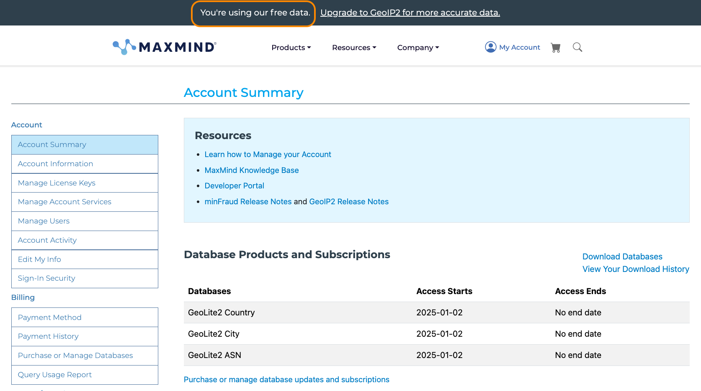

# NGINXaaS for Azure and MaxMind GeoIP2

## Introduction

The NGINX for Azure as a Service now includes the`MaxMind GeoIP2 Database modules` for HTTP and TCP traffic processing.  The MaxMind GeoIP Location database is available as both a free service (called GeoLite) and a Paid Subscription service (called GeoIP2).  The Paid Subscription service adds additional databases,metadata and increased accuracy.  The NGINX for Azure geoip2 modules can work with either service.  The GeoIP2 module uses the client Source IP Address as the key when looking up database metadata, the accuracy of this data varies by many factors.  The MaxMind paid Subscription service continually updates the database, and the NGINX for Azure Instance continually updates it's local copy of this database, providing access to the most current database available.

Knowing the client IP Address can be used to create Solutions and solve many different challenges for processing requests to NGINX.  This lab exercise will explore a couple Solutions, and provide step by step instructions as lab exercises for installation, configuration and testing.

<br/>

NGINXaaS for Azure | MaxMind | GeoIP2
:-------------------------:|:-------------------------:|:-----------------:
 |  | 

<br/>

## Learning Objectives 

By the end of the lab you will be able to: 
- Signup for a free MaxMind account
- Enable and test the MaxMind GeoIP2 module for HTTP
- NGINXperts Solution:  Route users to closest Data Center
- Just say NO to GSLB on DNS
- NGINXperts Solution: Use NGINX for MaxMind database queries
- NGINXperts Solution: Software Export Controls with NGINX and GeoIP2 
- NGINX Enhanced Logging with GeoIP2 metadata

<br/>

## Prerequisites

- NGINX for Azure subscription
- MaxMind Database subscription

## Sign up for a free MaxMind Account

In order to use the MaxMind databases with the GeoIP2 module, you must have an active Account.  If you do not have an account, you must create one before proceeding with this lab.  You can create an account by going to the MaxMind website (https://www.maxmind.com/en/geolite2/signup).  This is a one page form asking just a few questions, and you will receive an email with your account details.  After logging into your account, will need the following information:

- AccountID
- LicenseKey
- EditionIDs

    

1. Click on `Account Information` to find your AccountID.

    

1. Click on Manage License Keys, then Click on `Generate new license key`, give it a Description, and then `Confirm` to create one.

    

    

1. *IMPORTANT: Save your License Key safely* Click the `copy button` next to the License key, and paste it somewhere safe to save it.  *It is only displayed here, one time only.*  If you lose it, you can create a new one, but will then need to download a new GeoIP.conf file.

1. Click the `Download Config`, and also save this file somewhere safe.  This is the `GeoIP.conf` file that will be used by NGINX to contact MaxMind and update the GeoIP database on your NGINX instance.

    ```nginx
    # GeoIP.conf file for `geoipupdate` program, for versions >= 3.1.1.
    # Used to update GeoIP databases from https://www.maxmind.com.
    # For more information about this config file, visit the docs at
    # https://dev.maxmind.com/geoip/updating-databases.

    # `AccountID` is from your MaxMind account.
    AccountID xxxxxxx

    # `LicenseKey` is from your MaxMind account.
    LicenseKey xxxxxxxxxxxxxxxxxxxxxxxxxxxxxxxxxxxxxxxx

    # `EditionIDs` is from your MaxMind account.
    EditionIDs GeoLite2-ASN GeoLite2-City GeoLite2-Country   # These are free Editions

    ```

Notice the `EditionIDs`, these are the (free) databases available to you, the ASN ISP info, the City, and Country.  If you have a Paid Subscription, there are additional databases provided (not covered in this lab exercise).

<br/>

## Enable and test the GeoIP2 module


In your NGINX for Azure instance, the main NGINX `/etc/nginx/nginx.conf` file must be updated to load the geoip2 modules into memory so NGINX can use them.  These dynamic software modules are already installed on your Instance's disk. You will load the `ngx_http_geoip2_module.so` module, so you can explore it in this lab exercise. There is also a geoip2 module for the NGINX TCP stream context (not covered in this lab exercise).

1. Using the N4A web console, edit the `nginx.conf` `main context` to add the load_module command, as shown here.  Note: the main context is at the top of the file, just *before* the `events {}` context:

    ```nginx
    ...

    # Load geoip2 software into memory
    load_module modules/ngx_http_geoip2_module.so;


    events {
        # ...
    }

    ```

    Submit your NGINX Configuration, NGINX for Azure will validate it for you.  You must fix any errors before proceeding.

<br/>

## Add MaxMind GeoIP Config to NGINX

1. Using the N4A web console, create a new file, `/etc/nginx/GeoIP.conf`, copy and paste the entire contents from your previously downloaded file.  Note, the /path and name of the file must be exactly as stated here, you cannot use a different path or filename.

    Submit your NGINX changes, and NGINX for Azure will confirm that the configuration is valid.  If you see any errors, you must fix them before proceeding.

### Create NGINX GeoIP Test Configurations

In this exercise, you will create a simple NGINX configuration that you can use for testing the metadata from the MaxMind database.

1. Create a file that includes NGINX $variables that will contain GeoIP2 metadata.  You will create these in the `/etc/nginx/includes/geoip2_variables.conf` file.  As a shared resource in the /includes folder, this can then be used by any server block in your NGINX config files.  (Create it once, use it many times - an NGINX best practice).

    Using the N4A web console, create a new file, `/etc/nginx/includes/geoip2_variables.conf`, you can copy/paste this example:

    ```nginx
    # NGINX 4 Azure - geoip2_variables.conf
    # Chris Akker, Shouvik Dutta, Adam Currier - Jan 2025
    #
    # Using "GeoLite2-Country" as one of the EditionIDs in /etc/nginx/GeoIP.conf
    # Using "GeoLite2-City" as one of the EditionIDs in /etc/nginx/GeoIP.conf
    #
    # Set geoip2_ variables from City Database
    geoip2 /usr/local/share/GeoIP/GeoLite2-City.mmdb {
        $geoip2_data_city_name   city names en;
        $geoip2_data_postal_code postal code;
        $geoip2_data_latitude    location latitude;
        $geoip2_data_longitude   location longitude;
        $geoip2_data_state_name  subdivisions 0 names en;
        $geoip2_data_state_code  subdivisions 0 iso_code;
    }

    # Set geoip2_ variables from Country Database
    geoip2 /usr/local/share/GeoIP/GeoLite2-Country.mmdb {
        $geoip2_data_continent_code   continent code;
        $geoip2_data_country_iso_code country iso_code;
    }

    ```

    Take *NOTE* that you are creating these NGINX variables that reference different tables and values from the GeoLite2 database files.

1. Using the N4A web console, create a new file, `/etc/nginx/conf.d/geo.example.com.conf`, for your new test Host, http://geo.example.com.  You can copy/paste this example:

    ```nginx
    # NGINX 4 Azure - geo.example.com.conf
    # Chris Akker, Shouvik Dutta, Adam Currier - Jan 2025
    #
    server {
        listen 80;
        server_name geo.example.com;
        location / {

            return 200 "Welcome to N4A Workshop, GeoIP tracked your IP: $remote_addr from\nContinent: $geoip2_data_continent_code\nCountryISO: $geoip2_data_country_iso_code\nCity: $geoip2_data_city_name\nPostal: $geoip2_data_postal_code\nLat-Long: $geoip2_data_latitude $geoip2_data_longitude\nState: $geoip2_data_state_name\nStateISO: $geoip2_data_state_code\n";
        }
    }

    ```

1. Update your local DNS hosts file, to use your NGINX for Azure public IP address for `geo.example.com`.

    ```bash
    cat /etc/hosts

    ```

    ```
    ## Sample output ##
    20.29.28.3 geo.example.com

    ```

1. Test with curl:

    ```bash
    curl http://geo.example.com

    ```

    ```
    ## Sample output ##
    Welcome to N4A Workshop, GeoIP tracked your IP: 73.24.193.234 from
    Continent: NA
    CountryISO: US
    City: Tucson
    Postal: 85718
    Lat-Long: 32.30980 -110.91500
    State: Arizona
    StateISO: AZ

    ```

    >Nice!!  The geoip2 module is working, as it delivered metadata via NGINX variables to your Curl command.

1. Inspect the NGINX `return 200 Directive` in `geo.example.com.conf`, you will see that your IP address ($remote_addr), as well as 7 different GeoIP2 fields were sent back to you.

1. Using your browser, go to `http://geo.example.com`, and you should see something similar to this.  You will notice that we are using both the Country and City MaxMind data to populate the NGINX $variables used for this HTTP Response from NGINX.

    

>OK, it seems to be working, now what?  You will build and test a couple common Solutions for using this GeoIP2 metadata to control traffic.

<br/>

## NGINXperts Solution:  Choosing the Nearest Data Center, without GSLB/DNS

NGINXaaS for Azure | Global Data Centers | GeoIP2
:-------------------------:|:-------------------------:|:-----------------:
 |  | 

<br/>

As you are likely a DevOps Engineer, Application Architect/Developer, or NGINX Admin with Global responsibilities, you have `multiple Data Centers spread around the world or the country`.  As you also have users also around the world, you are probably using traditional `Global Server Load Balancing` and "SmartDNS" systems, to respond to DNS queries for your FQDNs.  However, these systems are not usually in your control, and there is likely an entirely different team responsible for DNS administration/management, right?  OH groan, more tickets and waiting...  

>**What if there was an easier way, to find a user's location, and route the users to the closest data center?**

You can easily do that with NGINX and the MaxMind GeoIP2 module, without requiring many changes from your DNS admin team.

There are several Benefits, but also some Drawbacks, to this Solution:

Benefits | Drawbacks
:-------:|:---------:
DNS Admin not required | Except for new FQDNs
No DNS changes |
No DNS TTL / Caching issues |
No DNS propagation delays |
Reduce DNS Posioning |
Immediate Change Effect |
Controlled by NGINX / DevOps team |
Traffic Control moved to HTTP |
Reduce the cost of GSLB systems |

<br/>

But this Solution *does* eliminate or minimize many of the current challenges that exist with GSLB/DNS systems.  The two most common NGINX-DevOps headaches are:

- Lack of DNS Admin access/control 
- *DNS caching of A records at multple points in the DNS system that you can't see or control, such as*:
    - Clients'/Browsers' local DNS Resolver cache 
    - Internet/Cloud provider's DNS servers' cache
    - Your Company's DNS SOA/Nameservers in the Data Centers

In this exercise, you will route traffic to three Data Centers spread around the world, without using DNS.  One Data Center in North America, one in Europe, and one in Asia.  


You will use the NGINX `$geoip2_data_continent_code variable` to redirect users to the Data Center in those three regions.  You will use the NGINX `map directive` to associate the MaxMind Continent Code to a 2-character identifier, as a DNS sub-domain, as shown here:

```nginx
map $geoip2_data_continent_code $nearest_data_center {  
    EU      eu;      # Routes to eu.geo.example.com
    NA      na;      # Routes to na.geo.example.com
    AS      as;      # Routes to as.geo.example.com
    default na;      # Routes to na.geo.example.com

}

```

1. Using the N4A web console, edit the `/etc/nginx/conf.d/geo.example.com.conf` to add this `map block` to the top of the config file, as shown:

    ```nginx
    # NGINX 4 Azure - geo.example.com.conf
    # Chris Akker, Shouvik Dutta, Adam Currier - Jan 2025
    #
    # NGINX Map Block for GeoIP Continent Routing
    #
    map $geoip2_data_continent_code $nearest_data_center {  
        EU      eu;      # Routes to eu.geo.example.com
        NA      na;      # Routes to na.geo.example.com
        AS      as;      # Routes to as.geo.example.com
        default na;      # Routes to na.geo.example.com

    }

    ...

    ```

1. Also edit the same `/etc/nginx/conf.d/geo.example.com.conf` file to add a new `location block` called `/dctest` to the config file, as shown.  Notice that the Redirect URL prefixes the Hostname with the 2 letter Continent code from the map block $nearest_data_center variable as a DNS sub-domain.  NGINX also adds a Header so you can see which map variable was chosen:

    ```nginx
    ...
    # Data Center Redirect based on Continent
    #
    location /dctest {
            return 301 http://$nearest_data_center.geo.example.com;     # Use HTTP Redirect to closest Data Center
            add_header X-GeoIP-Continent $nearest_data_center;          # Add an HTTP Header for tracking
        }

    ...

    ```

    Submit your NGINX Configuration.

1. Using the N4A web console, create three new config files, one for each Continent matching the list in the map block.  These are the NGINX Configs for each Continent, configured to receive the Redirected traffic.  In this example, you will create:

    - na.geo.example.com.conf for North American Data Center, and default for other Continents
    - eu.geo.example.com.conf for Europe Data Center
    - as.geo.example.com.conf for Asia Data Center

    These will be located in the `/etc/nginx/conf.d` folder for HTTP configurations.

    NGINX will also ADD another HTTP Header for you, so you can track the requests/responses.

    Here are the three new files, just copy/paste:

    ```nginx
    # NGINX 4 Azure - na.geo.example.com.conf
    # Chris Akker, Shouvik Dutta, Adam Currier - Jan 2025
    # NGINX Server Block for GeoIP Continent Routing
    #
    # North America Data Center
    #
    server {
        listen 80;
        server_name na.geo.example.com;

        location / {

            return 200 "Welcome to N4A Workshop, website $host\n";
            add_header X-DCTEST-FQDN $host;

        }
    }

    ```

    ```nginx
    # NGINX 4 Azure - eu.geo.example.com.conf
    # Chris Akker, Shouvik Dutta, Adam Currier - Jan 2025
    # NGINX Server Block for GeoIP Continent Routing
    #
    # European Data Center
    #
    server {
        listen 80;
        server_name eu.geo.example.com;

        location / {

            return 200 "Welcome to N4A Workshop, website $host\n";
            add_header X-DCTEST-FQDN $host;

        }
    }

    ```

    ```nginx
    # NGINX 4 Azure - as.geo.example.com.conf
    # Chris Akker, Shouvik Dutta, Adam Currier - Jan 2025
    # NGINX Server Block for GeoIP Continent Routing
    #
    # Asia Data Center
    #
    server {
        listen 80;
        server_name as.geo.example.com;

        location / {

            return 200 "Welcome to N4A Workshop, website $host\n";
            add_header X-DCTEST-FQDN $host;

        }

    }

    ```

    Submit your NGINX Configuration.

### Test your NGINX Global Data Center Routing

Check your the GeoIP2 lookups and the HTTP Redirect to the correct Continent / Data Center as follows:

1. Using curl, test your new /dctest location block, verify the HTTP Redirect to each Continent's FQDN. You are looking at the HTTP Headers to see how NGINX is Redirecting and routing your requests:

    ```bash
    curl -IL http://geo.example.com/dctest

    ```

    ```bash
    ## Sample output ##
    HTTP/1.1 301 Moved Permanently
    Date: Tue, 07 Jan 2025 19:32:43 GMT
    Content-Type: text/html
    Content-Length: 134
    Connection: keep-alive
    Location: http://na.geo.example.com
    X-GeoIP-Continent: na                # Added Header

    HTTP/1.1 200 OK
    Date: Tue, 07 Jan 2025 19:32:43 GMT
    Content-Type: text/plain
    Content-Length: 52
    Connection: keep-alive
    X-DCTEST-FQDN: na.geo.example.com    # Added Header

    ```

1. Try with Chrome, Right Click to Inspect the traffic.  Select the Network tab.  Again, look at the Headers:

    You see NGINX sending the HTTP 301 Redirect to `na.geo.example.com`.  

    

    You see Chrome following the Redirect, and landing on the correct FQDN, which NGINX will route to the matching Server block in that Data Center.

    

    >NOTE:  The Solution above could easily be adapted for States, or Regions, or Languages, or even Postal Codes request routing, using the appropriate MaxMind $geoip2 variables for your NGINX map blocks.


<br/>

## NGINXperts Solution: Test GeoIP2 lookups on NGINX with an HTTP Header

 | 

<br/>

**NO WAY you say...** Yes, that's right!  You can use NGINX with GeoIP2 to perform MaxMind Database lookups on your NGINX server.  You only need to add three things to your NGINX configs:

- Create new GeoIP2 `test` variables
- Create a new `/testip` location block
- Update the new `return Directive` to use the new $test_geoip2 variables.

1. Add new NGINX $variables: Update your `/etc/nginx/includes/geoip2_variables.conf` to include 8 new `test_` variables, with the `SOURCE = X-Forward-For Header` parameter, as shown.  You do Remember that NGINX converts all HTTP Request Headers to lower case, changes any dashes to underscores, and adds the `http_` prefix.  So the Header `X-Forwarded-For` will become the NGINX $variable `$http_x_fowarded_for`.

    ```nginx
    # NGINX 4 Azure - geoip2_variables.conf
    # Chris Akker, Shouvik Dutta, Adam Currier - Jan 2025
    #
    # Using "GeoLite2-Country" as one of the EditionIDs in /etc/nginx/GeoIP.conf
    # Using "GeoLite2-City" as one of the EditionIDs in /etc/nginx/GeoIP.conf
    #
    # Set geoip2_ variables from City Database
    geoip2 /usr/local/share/GeoIP/GeoLite2-City.mmdb {
        $geoip2_data_city_name   city names en;
        $geoip2_data_postal_code postal code;
        $geoip2_data_latitude    location latitude;
        $geoip2_data_longitude   location longitude;
        $geoip2_data_state_name  subdivisions 0 names en;
        $geoip2_data_state_code  subdivisions 0 iso_code;

    # Test IP Address from XFF Header
        $test_geoip2_data_city_name   source=$http_x_forwarded_for city names en;
        $test_geoip2_data_postal_code source=$http_x_forwarded_for postal code;
        $test_geoip2_data_latitude    source=$http_x_forwarded_for location latitude;
        $test_geoip2_data_longitude   source=$http_x_forwarded_for location longitude;
        $test_geoip2_data_state_name  source=$http_x_forwarded_for subdivisions 0 names en;
        $test_geoip2_data_state_code  source=$http_x_forwarded_for subdivisions 0 iso_code;
    }

    # Set geoip2_ variables from Country Database
    geoip2 /usr/local/share/GeoIP/GeoLite2-Country.mmdb {
        $geoip2_data_continent_code   continent code;
        $geoip2_data_country_iso_code country iso_code;
        
    # Test IP address using XFF Header value
        $test_geoip2_data_continent_code   source=$http_x_forwarded_for continent code;
        $test_geoip2_data_country_iso_code source=$http_x_forwarded_for country iso_code;
    }

    ```

1. Edit your `/etc/nginx/conf.d/geo.example.com.conf` file to add a new location block for `/testip`, as shown.  Notice the geoip2 $variables are using the new ones with `$test_geoip2_`, using the `$http_x-forward-for` $variable instead of $remote_addr:

    ```nginx
    ...

            location /testip {

            return 200 "Welcome to N4A Workshop, GeoIP2 tested IP: $http_x_forwarded_for from\nContinent: $test_geoip2_data_continent_code\nCountryISO: $test_geoip2_data_country_iso_code\nCity: $test_geoip2_data_city_name\nPostal: $test_geoip2_data_postal_code\nLat-Long: $test_geoip2_data_latitude $test_geoip2_data_longitude\nState: $test_geoip2_data_state_name\nStateISO: $test_geoip2_data_state_code\n";

        }

    ...

    ```

Submit your NGINX Configuration.

### Test your GeoIP2 Lookups with HTTP Header

Check various IP Addresses from around the world in the XFF Header value, as shown:

1. Try one from Azure Cloud, US East Region, adding the XFF Header with an IP Address to lookup:

    ```bash
    curl http://geo.example.com/testip -H "X-Forwarded-For: 20.242.1.1"

    ```

    ```bash
    ## Sample output ##
    Welcome to N4A Workshop, GeoIP2 tested IP: 20.242.1.1 from
    Continent: NA
    CountryISO: US
    City: Boydton
    Postal: 23917
    Lat-Long: 36.66760 -78.38750
    State: Virginia
    StateISO: VA

    ```

1. Try an IP Address from Switzerland in Europe with curl, add the XFF Header with an IP Address to lookup:

    ```bash
    curl http://geo.example.com/testip -H "X-Forwarded-For: 109.202.192.1"

    ```

    ```bash
    ## Sample output ##
    Welcome to N4A Workshop, GeoIP tested IP: 109.202.192.1 from
    Continent: EU
    CountryISO: CH
    City: Bern
    Postal: 3012
    Lat-Long: 46.96330 7.42270
    State: Bern
    StateISO: BE

    ```

1. Copy/paste the Lat-Long value into Google Maps, http://maps.google.com, where is it?

1. Try one from AWS Asia in Japan with curl, adding the XFF Header with an IP Address to lookup:

    ```bash
    curl http://geo.example.com/testip -H "X-Forwarded-For: 43.206.101.204"

    ```

    ```bash
    ## Sample output ##
    Welcome to N4A Workshop, GeoIP tested IP: 43.206.101.204 from
    Continent: AS
    CountryISO: JP
    City: Tokyo
    Postal: 151-0053
    Lat-Long: 35.68930 139.68990
    State: Tokyo
    StateISO: 13

    ``` 

>**Security NOTE:** Do NOT use this example in production, as there are NO access-lists or other protections for the /testip location block, take appropriate measures as needed to secure it properly.

* Kudos:  Credit to Echorand and Google search AI for this example: https://echorand.me/posts/nginx-geoip2-mmdblookup/

<br/>

## Software Export Controls with NGINX and GeoIP2 

 | 

<br/>

A common requirement for software companies is to control and limit access to their software for `Export Compliance`.  The company may provide advanced software features, have government contracts, or be under other regulations that require limitations on who can use their software or other assets.  In this lab exercise, you are the DevOps NGINX admin tasked with `limiting access to the Downloads of company software` based on the user's Country.  You will use the GeoIP2 module with NGINX to only allow downloads of your high security software from Countries that are in the G7 Group.  You must also log every download for the `Explort Compliance Audit` paperwork required.

This Solution is actually quite easy, you just need three things:

- A new `NGINX map block` using the GeoIP2 Country ISO code data, and map that to a yes|no $variable value.  
- Then use the yes|no $varible with an `if statement` to check if access to the `/downloads` location is allowed.  
- Create an NGINX custom access log-format to log all the important metadata.

The new NGINX map block will look something like this:

```nginx
map $geoip2_data_country_iso_code $is_allowed {
    CA      1;    # Canada
    FR      1;    # France
    DE      1;    # Germany
    IT      1;    # Italy
    JP      1;    # Japan
    UK      1;    # United Kingdom
    US      1;    # United States
    default 0;    
}

```

1. Using the N4A web console, create a new file, `/etc/nginx/conf.d/downloads.example.com.conf` for this lab exercise.  Here is an example, you can just copy/paste.

    ```nginx
    # NGINX 4 Azure - downloads.example.com.conf
    # Chris Akker, Shouvik Dutta, Adam Currier - Jan 2025
    #
    # NGINX Map Block for Country Download Export Control
    #
    map $geoip2_data_country_iso_code $is_allowed {
        CA      1;    # Canada
        FR      1;    # France
        DE      1;    # Germany
        IT      1;    # Italy
        JP      1;    # Japan
        UK      1;    # United Kingdom
        US      1;    # United States
        default 0;   
    }
    #
    # Download Server
    #
    server {
        listen 80;
        server_name downloads.example.com;

        location /downloads {

            if ($is_allowed = 0) {

                return 403 "Access not allowed from\nCountry: $geoip2_data_country_iso_code\n";
            }

            return 200 "Welcome to the /downloads URI\nYour IP Address is: $remote_addr\nFrom CountryISO: $geoip2_data_country_iso_code\n";
            
        }
        #
        # Test Source IPs using XFF Header
        #
        location /testip {

            return 200 "Welcome to /downloads test, GeoIP2 tested IP: $http_x_forwarded_for from\nContinent: $test_geoip2_data_continent_code\nCountryISO: $test_geoip2_data_country_iso_code\n";

        }

    }

    ```

1. Create a new NGINX Access log format with GeoIP2 $variables.

    In this exercise, you will extend the default NGINX access log and add all of the GeoIP2 $variables, so you have the metadata required for the Export Compliance auditors.

1. Review the current default NGINX Access log format called `combined`, as shown here:

    ```nginx
    log_format combined '$remote_addr - $remote_user [$time_local] '
                        '"$request" $status $body_bytes_sent '
                        '"$http_referer" "$http_user_agent"';

    ```

    Notice that there are no GeoIP2 logging fields, and no fields about which download server delivered the content, or the X-Forward-For Header information.  You will add all these fields to a new log format called `geoip2`, as shown here:

    ```nginx
    log_format geoip2 '$remote_addr - $remote_user [$time_local] '
                        '"$request" $status $body_bytes_sent '
                        '"$http_referer" "$http_user_agent" "http_x_forwarded_for" "$geoip2_data_continent_code" "$geoip2_data_country_iso_code" "$geoip2_data_city_name" "$geoip2_data_postal_code" "$geoip2_data_latitude-$geoip2_data_longitude" "$geoip2_data_state_name" "$geoip2_data_state_code" ua=$upstream_addr';

    ```

1. Using the N4A web console, edit your `/etc/nginx/nginx.conf`, and copy/paste the new log format.  This file is placed in the http{} context so you can use as many times as needed.  You can edit this new log format to meet the metadata required for your Export Compliance Audits.

    ```nginx
    user nginx;
    worker_processes auto;
    worker_rlimit_nofile 8192;
    pid /run/nginx/nginx.pid;

    # Load geoip2 software into memory
    load_module modules/ngx_http_geoip2_module.so;

    events {
        worker_connections 4000;
    }

    error_log /var/log/nginx/error.log error;

    http {

        # New Access Log Format
        #
        log_format geoip2 '$remote_addr - $remote_user [$time_local] ' '"$request" $status $body_bytes_sent ' '"$http_referer" "$http_user_agent" "http_x_forwarded_for" "$geoip2_data_continent_code" "$geoip2_data_country_iso_code" "$geoip2_data_city_name" "$geoip2_data_postal_code" "$geoip2_data_latitude-$geoip2_data_longitude" "$geoip2_data_state_name" "$geoip2_data_state_code" ua=$upstream_addr';

        server_tokens "";
        server {
            listen 80;
            server_name localhost;
            location / {
                # Points to a directory with a basic html index file with
                # a "Welcome to NGINX as a Service for Azure!" page
                root /var/www;
                index index.html;
            }
        }

        include /etc/nginx/conf.d/*.conf;
        include /etc/nginx/includes/*.conf;    # shared files
        
    }
    ```

1. Edit the `downloads.example.com.conf` file, and add your new GeoIP2 logging format, as shown:

    ```nginx
    ...
    # Download Server
    #
    server {
        listen 80;
        server_name downloads.example.com;

        access_log /var/log/nginx/downloads.example.com.log geoip2;  # Add new GeoIP2 logging

        location /downloads {

            if ($is_allowed = 0) {
                return 403 "Access not allowed from\nCountry: $geoip2_data_country_iso_code\n";
            }

            return 200 "Welcome to the /downloads URI\nYour IP Address is: $remote_addr\nFrom CountryISO: $geoip2_data_country_iso_code\n";

        }

    ...


    ```

1. Using curl or Chrome, test access to http://downloads.example.com/downloads, and then verify the Azure logs contain the new GeoIP2 data fields.

    


>You can find detailed information on Viewing NGINX Access Logs using Azure's Logging / Analytics Workspace, in this Workshop in `Lab6`.

<br/>

>>Final Note:  All of these NGINXperts Solutions and NGINX/GeoIP configurations will work with NGINX Plus and the MaxMind GeoIP2 modules.  You can run NGINX in a Docker Container, VM, or bare-metal server.  The NGINX config files should work as-is, no modifications needed.  You too, can become an NGINXpert!

<br/>

**This completes Lab 11.**

<br/>

## References:

- [NGINX As A Service for Azure](https://docs.nginx.com/nginxaas/azure/)
- [NGINX As A Service for Azure with GeoIP2](https://docs.nginx.com/nginxaas/azure/quickstart/geoip2/)
- [NGINX GeoIP2 Module](https://docs.nginx.com/nginx/admin-guide/dynamic-modules/geoip2/)
- [NGINX GeoIP2 Admin Guide](https://docs.nginx.com/nginx/admin-guide/security-controls/controlling-access-by-geoip/)
- [NGINX GeoIP2 Examples](https://docs.nginx.com/nginx/admin-guide/security-controls/controlling-access-by-geoip/)
- [MaxMind GeoIP Databases](https://www.maxmind.com/en/geoip-databases)
- [NGINX Plus Product Page](https://docs.nginx.com/nginx/)
- [NGINX Directives Index](https://nginx.org/en/docs/dirindex.html)
- [NGINX Variables Index](https://nginx.org/en/docs/varindex.html)
- [NGINX Technical Specs](https://docs.nginx.com/nginx/technical-specs/)

<br/>

### Authors

- Chris Akker - Solutions Architect - Community and Alliances @ F5, Inc.
- Shouvik Dutta - Solutions Architect - Community and Alliances @ F5, Inc.
- Adam Currier - Solutions Architect - Community and Alliances @ F5, Inc.

-------------

Navigate to ([Lab12](../lab12/readme.md) | [LabGuide](../readme.md))
