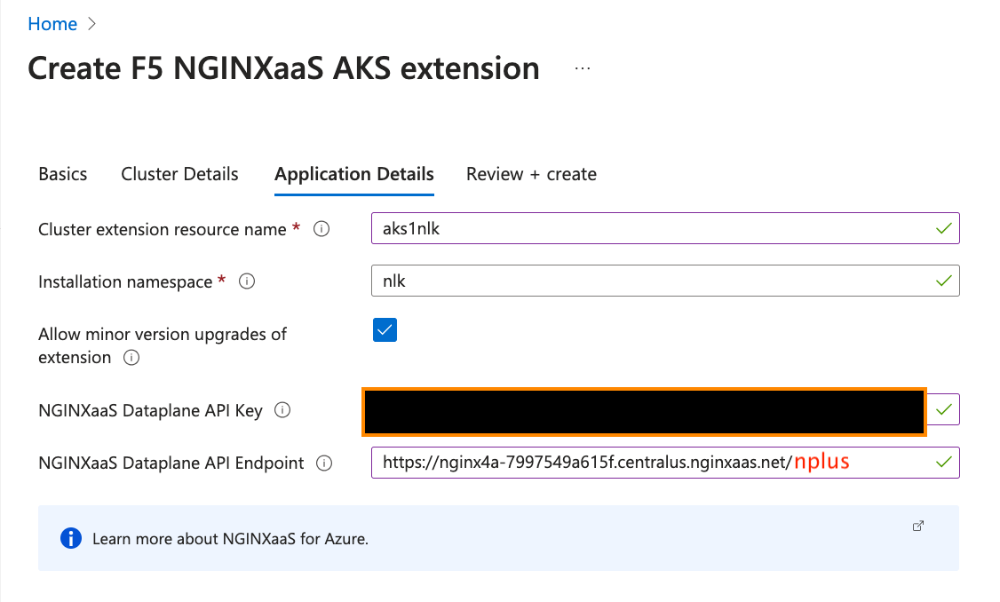
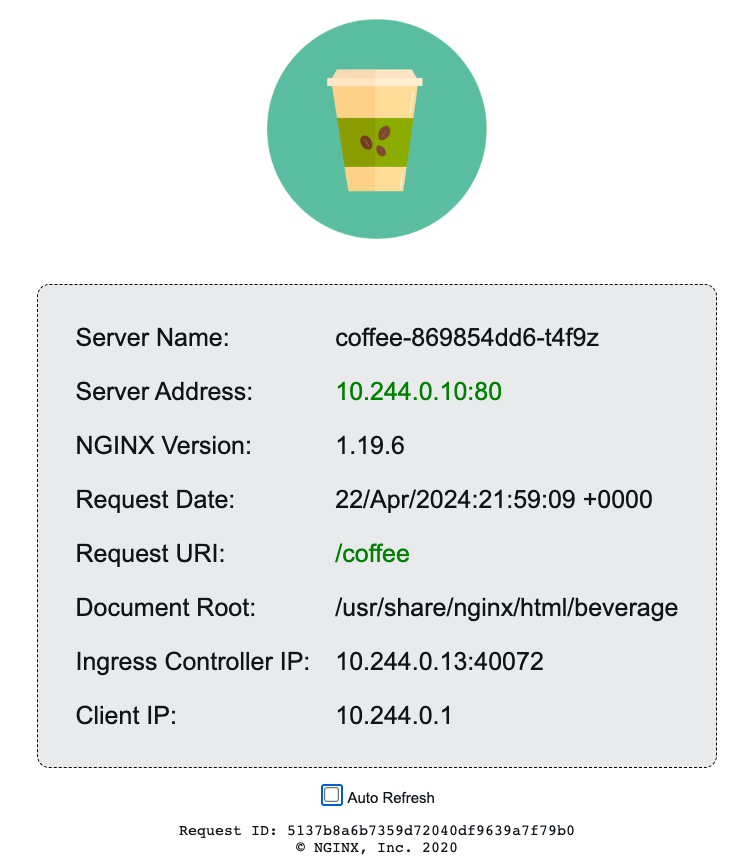

# NGINXaaS for Azure and NLK - NGINXaaS Loadbalancer for Kubernetes

## Introduction

The `NGINX as a Servive for Azure` now includes the **NGINX Loadbalancer for Kubernetes Controller**, to support both manual and dynamic AutoScaling of AKS clusters with matching NGINXaaS configurations.

>Using NGINXaaS with NGINX Loadbalancer Kubernetes synchronizes the AKS Worker Nodes of the cluster with the NGINX UpstreamServer list automatically, so that all Worker nodes can receive incoming traffic.  This provides High Availability, increased Performance, dynamic Node Scaling, and allows NGINXaaS to match the Kubernetes Node or Service changes made to the cluster by the AKS admin or any cluster automation tools.

<br/>

What is the NLK Controller and how does it work?  It is a standard Kubernetes Container, written as a Controller object that interfaces with the Kubernetes cluster control plane, including the Kubernetes Cluster API.  It Registers itself as a Controller with the API, which allows it to `Watch and be Notified` of certain Kubernetes Events.  When the Controller receives Notifications of `Node or Service changes`, it triggers the Controller to then send it's own API updates to the Nginx for Azure instance.  The updates are limited to updating the `upstream server IP:Ports` in the Nginx config files, without an Nginx Reload!  You will configure and test it in this lab exercise.


Using both manual and autoscaling with AKS clusters is a common practice, the most common scenario is the need for the Cluster resources to be scaled `in response to changing workload demands` running in the Cluster.  If you scale Worker nodepools up/down, NLK will detect these changes and update your Nginx configuration for you, automatically.

<br/>

NGINXaaS for Azure | AKS | Nginx Loadbalancer Kubernetes
:-------------------------:|:-------------------------:|:-----------------:
 |  | 

<br/>

## Learning Objectives 

By the end of the lab you will be able to:
- Create NGINXaaS API Key 
- Deploy the NLK Controller to your cluster
- Configure NGINXaaS for NLK updates
- Deploy the nginx-ingress Service for NLK
- Test the traffic flows for Nginx Cafe
- Test AKS Scaling and NLK integration

<br/>

## Prerequisites

- NGINX for Azure Subscription
- Complete Labs 1-4 deployment in your Azure Resource Group

<br/>

## Create new NGINXaaS API Key

The NLK controller uses an API key to send updates to your Nginx instance.  Create a new one following these steps:

1. Using the N4A Web Console, in your N4A deployment, Settings, click on `NGINX API keys`, then `+ New API Key`.

1. On the right in `Add API Key` sidebar, give it a name.  Optionally change the Expiration Date.  In this example, you will use:

  - Name: nlk-api-key
  - Expiration Date: 365 Days (12 months), or longer if you choose

  Click `Add API Key` at the bottom.

  *NOTE:*  Click the Copy icon next to the Value, and `SAVE this API Key` somewhere safe, is it only displayed in full here, one time only!

On this same window, copy/paste/save the `Dataplane API endpoint` at the top of the screen, you will also need this value.  Add `/nplus` to the end of the URL, this is the endpoint where NLK will send the API updates.  It should look similar to this:

`https://nginx4a-xxxxxxxxxxx.centralus.nginxaas.net/nplus`


<br/>

## Deploy the NGINX Loadbalancer Kubernetes Controller using Azure Portal


Go the Azure Marketplane, and search for `NGINX`.  Or click on this link to take you directly to the NLK Controller.  https://azuremarketplace.microsoft.com/en-us/marketplace/apps/f5-networks.f5-nginx-for-azure-aks-extension


1. Click on `Get It Now`, then `Continue`.

  Select the Subscription and Resource Group for the deployment; Select `No` for a new AKS cluster.  You will use your existing clusters from Lab3 for this lab exercise.

1. Click `Next`, and chose `n4a-aks1` under Cluster Details.

1. Click `Next`, and fill out as follows:
  - Type `aks1nlk` for the Cluster extension resouce name
  - Leave the namespace as `nlk`
  - Check the `Allow minor version updates`
  - Paste your Dataplane API Key value
  - Paste your Dataplane API Endpoint URL **and ADD `nplus` to the end**
  - Optional: Add new KeyValue pair:  `nlk.config.logLevel` `info`

1. Click `Next`, Review your settings.

  If you scroll to the bottom, you will see your entered data, take a screenshot if you did not SAVE it somewhere.  If you are satisifed with your Settiings, click `Create`.  *You can safely ignore the billing warning, NLK is free of charge at the time of this writing.*

  

  Wait for the Deployment to be successful, it can take several minutes.

  

1. Verify it is running in your `n4a-aks1` cluster.

  Check that your kubectl config context is set for n4a-aks1, and check for everything in the `nlk` namespace, as shown:

  ```bash
  kubectl config use-context n4a-aks1
  kubectl get all -n nlk

  ```

You should see a pod, deployment, and replicaset, all in a READY state.

```bash
## Sample output ##
NAME                                                            READY   STATUS    RESTARTS   AGE
pod/aks1nlk-nginxaas-loadbalancer-kubernetes-79d8655d7d-kspxc   1/1     Running   0          2m21s

NAME                                                       READY   UP-TO-DATE   AVAILABLE   AGE
deployment.apps/aks1nlk-nginxaas-loadbalancer-kubernetes   1/1     1            1           2m21s

NAME                                                                  DESIRED   CURRENT   READY   AGE
replicaset.apps/aks1nlk-nginxaas-loadbalancer-kubernetes-79d8655d7d   1         1         1       2m21s

```

<br/>

## Configure NGINXaaS for NLK updates

  

Now that the NLK Controller is running, you need a matching Upstream Server block configuration in your N4A instance, that will forward traffic to your Cluster.  In this example, you will great a new upstream config named `aks1-nlk-upstreams.conf`.  *Notice - this upstream block will NOT contain any server IP:PORT directives*, because the NLK Controller will be dynamically adding them for you, using the NginxPlus API.  

1. Ensure you are in the `labs/lab12` folder for these exercises.

1. Using the N4A web console, create a new file `/etc/nginx/conf.d/aks1-nlk-upstreams.conf`.  You can use this example as shown, just copy/paste.

  ```nginx
  # Chris Akker, Shouvik Dutta, Adam Currier - Jan 2025
  # Nginx Upstream Block for NLK Controller
  #
  # Nginx 4 Azure - aks1-nlk-upstreams.conf
  #
  upstream aks1-nlk-upstreams {
    zone aks1-nlk-upstreams 256K;             # required for metrics
    state /tmp/aks1-nlk-upstreams.state;      # required for backup

    least_time last_byte;                # choose the fastest NodePort

    # Server List dynamically managed by NLK Controller

    keepalive 16;

  }

  ```


>DeepDive Explanation of the Upstream block:

- **upstream name**; - choose a name that will be easy to remember, which cluster, and a NLK tag (you can change this as needed, of course)
- **zone name**; this is the shared memory zone used by Nginx Plus to collect all the upstream server metrics; like connections, health checks, handshakes, requests, response codes, and response time
- **state file**; - this is a backup file of the UpstreamServer List, in case Nginx is restarted, or the host is rebooted.  Because this UpstreamServer List only exists in memory, this backup file is required, the file name should match the upstream name.
- **least_time last_byte**; - this is the `Nginx advanced load balancing algorithm` that watches the HTTP Response time, and favors the fastest server.  This is a critical setting for obtaining optimal performance in Kubernetes environments.
- **keepalive num**; - this creates a TCP connection pool that Nginx uses for Requests.  Also critical for optimal performance
- Consult the Nginx Plus documentation for further details on these Directives, there is a link in the References Section.

Submit your Nginx Configuration.

<br/>

## Update Proxy_Pass for NGINX Cafe


NGINX | Nginx Cafe
:-------------------------:|:-------------------------:
 | 

<br/>

Update your `/etc/nginx/conf.d/cafe.example.com.conf` configuration, to `proxy_pass to your new aks1-nlk-upstreams` Upstream block, as shown.  This changes where N4A will load balance your traffic:

```nginx
# Nginx 4 Azure - Cafe Nginx to AKS1 with NLK
# Chris Akker, Shouvik Dutta, Adam Currier - Jan 2025
#
server {
    
    listen 80;      # Listening on port 80

    server_name cafe.example.com;   # Set hostname to match in request
    status_zone cafe.example.com;   # Metrics zone name

    access_log  /var/log/nginx/cafe.example.com.log main;
    error_log   /var/log/nginx/cafe.example.com_error.log info;

    location / {
        status_zone /;              # Metrics zone name
        #
        # return 200 "You have reached cafe.example.com, location /\n";
         
        proxy_pass http://aks1-nlk-upstreams;        # Proxy AND load balance to AKS1 NLK UpstreamServer List
        add_header X-Proxy-Pass aks1-nlk-upstreams;  # Custom Header
        add_header X-Aks1-Upstream $upstream_addr;   # Which AKS1 NodeIP:Port
        
        # proxy_pass http://cafe_nginx;          # Proxy AND load balance to Docker VM
        # add_header X-Proxy-Pass cafe_nginx;    # Custom Header

        # proxy_pass http://aks1_ingress;        # Proxy AND load balance to AKS1 Nginx Ingress
        # add_header X-Proxy-Pass aks1_ingress;  # Custom Header

        # proxy_pass http://aks2_ingress;        # Proxy AND load balance to AKS2 Nginx Ingress
        # add_header X-Proxy-Pass aks2_ingress;  # Custom Header

    }
    
}

```

Submit your Nginx Configuration.

<br>

## Create the Kubernetes NodePort Service


Now a Kubernetes Service is required, to expose your application outside of the cluster.  NLK uses a standard `NodePort` definition, with a few additions needed for the NLK Controller.  In this exercise, you will expose the `nginx-ingress Service`, which is the Nginx Ingress Controller running inside the Cluster.  

>IMPORTANT: This create TWO layers of Nginx Loadbalancing - N4A outside the Cluster is sending traffic to Nginx Ingress inside the Cluster.  

Nginx Ingress will then route the requests to the correct Services and Pods.  (NOTE that data plane traffic does NOT go through the NLK Controller at all, as it is part of the control plane).


1. Using kubectl, set your config context for `n4a-aks1`, and apply the NodePort manifest file provided here:

```bash
kubectl config use-context n4a-aks1
kubectl apply -f nodeport-aks1-nlk.yaml

```


>DeepDive Explanation of the `nodeport-aks1-nlk.yaml` manifest:

```yaml
apiVersion: v1
kind: Service
metadata:
  name: nginx-ingress
  namespace: nginx-ingress
  annotations:
    # Let the controller know to pay attention to this K8s Service.
    nginx.com/nginxaas: nginxaas
spec:
  # expose the HTTP port on the nodes
  type: NodePort
  ports:
  - port: 80
    targetPort: 80
    protocol: TCP
    # The port name maps to N4A upstream. It must be prefixed with `http-`
    # and the rest of the name must match the name of an upstream
    name: http-aks1-nlk-upstreams
  selector:
    app: nginx-ingress

```

- The Service name is `nginx-ingress`
- The namespace matches the Nginx Ingress Controller, `nginx-ingress`
- Annotation is set for `nginxaas`, tells the NLK Controller to `Watch this Service`
- Type is NodePort
- Cluster Port is 80, to the Pods
- The `name` of the port is the mapping to the proper `upstream name`, with a prefix of `http-`.  This is done to ensure the NLK's HTTP NodePort does not duplicate/overwrite other NodePorts you might have defined.

1. Verify that your `nginx-ingress` Service was created.

```bash
kubectl describe svc nginx-ingress -n nginx-ingress

```

```
## Sample output ##
Name:                     nginx-ingress
Namespace:                nginx-ingress
Labels:                   <none>
Annotations:              nginx.com/nginxaas: nginxaas
Selector:                 app=nginx-ingress
Type:                     NodePort
IP Family Policy:         SingleStack
IP Families:              IPv4
IP:                       10.0.47.161
IPs:                      10.0.47.161
Port:                     http-aks1-nlk-upstreams  80/TCP
TargetPort:               80/TCP
NodePort:                 http-aks1-nlk-upstreams  31039/TCP
Endpoints:                10.244.0.4:80
Session Affinity:         None
External Traffic Policy:  Cluster
Events:                   <none>

```

`Take NOTE:` Notice that Kubernetes chooses an ephemeral high-numbered TCP Port, `31039` in this example.  The NLK Controller is Notified of this Service change, and will send the API commands to N4A to update the UpstreamServer List.  The UpstreamServer List will be each Worker's `NodeIP:31039`.  (Kubernetes Control Nodes are intentionally excluded from this List).

You can confirm this in several ways.


1. Using curl, see if the Nginx Cafe application works and what Header Values are returned, ready for coffee?

```bash
curl -I http://cafe.example.com/coffee

```

```bash
## Sample output ##
HTTP/1.1 200 OK
Date: Fri, 17 Jan 2025 18:20:27 GMT
Content-Type: text/html; charset=utf-8
Connection: keep-alive
Expires: Fri, 17 Jan 2025 18:20:26 GMT
Cache-Control: no-cache
X-Proxy-Pass: aks1-nlk-upstreams       # this is the proxy pass Header
X-Aks1-Upstream: 172.16.10.4:31039     # this is the upstream Header

```

Notice that the `X-Ask1-Upstream Header` value is one of your AKS1 worker nodes, with the NodePort `31039`.

Verify your AKS1 worker Node IPs, ask Kubernetes:

```bash
kubectl describe nodes |grep Internal

```
```bash
## Sample output
  InternalIP:  172.16.10.5
  InternalIP:  172.16.10.4
  InternalIP:  172.16.10.6

```

Try the curl command serveral times, you should see the X-Aks1-Upstream Header value change, as Nginx is load balancing traffic to all your AKS Workers.

```bash
## Sample output ##

HTTP/1.1 200 OK
Date: Fri, 17 Jan 2025 18:27:03 GMT
Content-Type: text/html; charset=utf-8
Connection: keep-alive
Expires: Fri, 17 Jan 2025 18:27:02 GMT
Cache-Control: no-cache
X-Proxy-Pass: aks1-nlk-upstreams
X-Aks1-Upstream: 172.16.10.4:31039      # worker #1

HTTP/1.1 200 OK
Date: Fri, 17 Jan 2025 18:27:08 GMT
Content-Type: text/html; charset=utf-8
Connection: keep-alive
Expires: Fri, 17 Jan 2025 18:27:07 GMT
Cache-Control: no-cache
X-Proxy-Pass: aks1-nlk-upstreams
X-Aks1-Upstream: 172.16.10.5:31039      # worker #2

HTTP/1.1 200 OK
Date: Fri, 17 Jan 2025 18:26:57 GMT
Content-Type: text/html; charset=utf-8
Connection: keep-alive
Expires: Fri, 17 Jan 2025 18:26:56 GMT
Cache-Control: no-cache
X-Proxy-Pass: aks1-nlk-upstreams
X-Aks1-Upstream: 172.16.10.6:31039      # worker #3

```

You can see this using Azure Metrics as well, as shown here.  Notice that you can add the Filter and Splitting, to see the IP Addresses of the Nginx Upstreams.  The Upstream `aks1-nlk-upstreams` and it's IP Addresses should match your Worker Node IPs, and the Port number should match your NodePort `nginx-ingress` Service.


### Optional - NLK Logging

If you want to see what the NLK Controller is doing, you have to change the Logging Level to `info`.  This requires just adding the correct Annotation to the Controller.

Using the N4A web console, go to your Azure Resource Group, then your n4a-aks1 Cluster, Setting, then `Extensions + applications`, then click on `aks1nlk`.  Under `Configuration settings` at the bottom, add a new Key: `nlk.config.logLevel` and Value: `info`.


Click Save.  This will update the NLK Controller to change the Logging Level to `info`.

**Optional:** Verify the ConfigMap is set correctly:

``` bash
kubectl describe cm aks1nlk-nginxaas-loadbalancer-kubernetes-nlk-config -n nlk

```

```bash
## Sample output ##
Name:         aks1nlk-nginxaas-loadbalancer-kubernetes-nlk-config
Namespace:    nlk
Labels:       app.kubernetes.io/managed-by=Helm
Annotations:  meta.helm.sh/release-name: aks1nlk
              meta.helm.sh/release-namespace: nlk

Data
====
config.yaml:
----
log-level: "info"             ## Log Level setting ##
nginx-hosts: "https://nginx4a-7997549a615f.centralus.nginxaas.net/nplus"
tls-mode: "ca-tls"


BinaryData
====

Events:  <none>

```

Now you can watch the NLK Controller log messages, as you make changes.  Type the following command to follow the Kubernetes logs for the NLK deployment:

```bash
kubectl logs deployment/aks1nlk-nginxaas-loadbalancer-kubernetes -n nlk --follow

```
```bash
## Sample output ##
{"time":"2025-01-17T18:36:14.994747303Z","level":"INFO","msg":"Watcher::buildServiceEventHandlerForAdd","version":"0.8.0"}
{"time":"2025-01-17T18:36:14.994839603Z","level":"INFO","msg":"Watcher::buildServiceEventHandlerForDelete","version":"0.8.0"}
{"time":"2025-01-17T18:36:14.994845703Z","level":"INFO","msg":"Watcher::buildServiceEventHandlerForUpdate","version":"0.8.0"}
{"time":"2025-01-17T18:36:14.994849103Z","level":"INFO","msg":"Watcher::buildEndpointSlicesEventHandlerForAdd","version":"0.8.0"}
{"time":"2025-01-17T18:36:14.994852203Z","level":"INFO","msg":"Watcher::buildEndpointSlicesEventHandlerForDelete","version":"0.8.0"}
{"time":"2025-01-17T18:36:14.994855103Z","level":"INFO","msg":"Watcher::buildEndpointSlicesEventHandlerForUpdate","version":"0.8.0"}
{"time":"2025-01-17T18:36:14.994858503Z","level":"INFO","msg":"Watcher::buildNodesEventHandlerForAdd","version":"0.8.0"}
{"time":"2025-01-17T18:36:14.994861503Z","level":"INFO","msg":"Watcher::buildNodesEventHandlerForDelete","version":"0.8.0"}
{"time":"2025-01-17T18:36:14.994864403Z","level":"INFO","msg":"Watcher::buildNodesEventHandlerForUpdate","version":"0.8.0"}
{"time":"2025-01-17T18:36:15.095250329Z","level":"INFO","msg":"Started probe listener","version":"0.8.0","address":":51031"}
{"time":"2025-01-17T18:36:17.643745867Z","level":"INFO","msg":"Synchronizer::handleEvent: successfully handled the event","version":"0.8.0","type":"Created","upstreamName":"aks1-nlk-upstreams","eventID":"[0:0]-[tmJZbL5b5d9c]-[aks1-nlk-upstreams]-[https://nginx4a-7997549a615f.centralus.nginxaas.net/nplus]"}
{"time":"2025-01-17T18:37:04.752382349Z","level":"INFO","msg":"Synchronizer::handleEvent: successfully handled the event","version":"0.8.0","type":"Updated","upstreamName":"aks1-nlk-upstreams","eventID":"[0:0]-[AqG0q4OWnGy8]-[aks1-nlk-upstreams]-[https://nginx4a-7997549a615f.centralus.nginxaas.net/nplus]"}

```

*You can keep this log open for the next Exercise*.

<br/>

## AKS Node Scaling

 


Now for the actual Scaling Test!!  Does the NLK Controller detect when you `scale your AKS Cluster nodes up/down` (Node Scaling)?  You will test that now.

1. Using the N4A web console, manually scale your `n4a-aks1 nodepool` from 3 to 5 workers.  

  

  Watching the NLK Logs, you should see some NLK `Updated messages` scroll by.

1. Open a new Terminal, check with Curl, do you find 5 different IP addresses in the in X-Aks1-Upstream Header values?

  ```bash
  while true; do curl -I http://cafe.example.com/coffee; sleep .5; done

  ```

  Confirm - what are the 5 n4a-aks1 Node IPs?  Ask Kubernetes ...

  ```bash
  kubectl describe nodes |grep Internal

  ```

  ```bash
  ## Sample output
    InternalIP:  172.16.10.5
    InternalIP:  172.16.10.4
    InternalIP:  172.16.10.6
    InternalIP:  172.16.10.8
    InternalIP:  172.16.10.7

  ```

  **MOST EXCELLENT!!**  NLK saw the change in the `nginx-ingress` Service.  Remember, the nginx-ingress Service is Type NodePort, which means an open high-port socket on every Worker node.  When you SCALED UP the nodepool from 3 > 5, Kubernetes had to open that socket on the two new Nodes after they were up and running, triggering a CHANGE in the `nginx-ingress` NodePort Service ... 

1. Go back your N4A Web Console, and check the `plus.http.upstream.peer.address` of your Metrics Filter... you should also find 5 IP:NodePort Addresses, one for each upstream/worker.


### Now for the `SCALE DOWN Test`  

As it is the `end of day` business time for your company, the workload demands of the cluster will drop after hours.  Scale the `n4a-aks1 nodepool` to just ONE worker node.  You intentionally only scale to one so we can still test traffic, making sure the application is still running, and you need at least one worker for the Nginx Ingress and NLK Controllers to run...right ?


After a few minutes, Kubernetes will Drain 4 of the Nodes and shutdown the VMs, Replica controllers will restart any Containers as needed (including the NLK Controller, and Nginx Ingress Controllers - depending on which Node they were running).  Now you have a single worker Cluster...

Test again with curl, you should only find ONE IP:Port in your X-Aks1-Header.  Try with Chrome, you will see the same Header and Value.

NLK did see the NodePort Service change when the Cluster was scaled down, and now only has one Upstream to send traffic to, `saving your budget $$$` while workloads are small.

>Important NOTE!  The Scale Down process CAN drop traffic, because you can't control which Nodes are drained, and if any Nginx Controller pods will be  restarted ... so use CAUTION when scaling down.  You *should* expect a brief outage during a scale down event, as a matter of practice.

>>Nginx Best Practice Recommendation:  Run the Nginx Ingress Controllers as a DaemonSet, one NIC on every Worker, so there will be `at least one running at all times`.  This should help minimize traffic drops.

Check your Azure Metrics, there should only be ONE upstream server in the `aks1-nlk-upstreams`, but you may have wait at least 30 minutes for the timespan of the Chart to update.

### Optional Exercise - Debugging

If you are curious, you can change the NLK Controller LogLevel to `debug`, and see many more details about what NLK is doing.  While watching the debug log, Scale your n4a-aks1 cluster back to 3 Nodes.  You will find something like this:

```bash
## Sample output ##
#Debug Logging enabled
{"time":"2025-01-17T19:58:19.525465343Z","level":"DEBUG","msg":"Settings::setLogLevel","version":"0.8.0","level":"debug"}

...
# Add Node detected
{"time":"2025-01-17T19:58:19.558371895Z","level":"DEBUG","msg":"received node add event","version":"0.8.0"}

# Collect Node IPs
...
{"time":"2025-01-17T19:58:21.563684657Z","level":"DEBUG","msg":"Translator::retrieveNodeIps","version":"0.8.0"}

# Collect NodePort
{"time":"2025-01-17T19:58:21.563678057Z","level":"DEBUG","msg":"Translate::buildNodeIPEvents","version":"0.8.0","ports":[{"name":"http-aks1-nlk-upstreams","protocol":"TCP","port":80,"targetPort":80,"nodePort":31039}]}

...
# Update Upstream

{"time":"2025-01-17T20:02:32.354571067Z","level":"DEBUG","msg":"Synchronizer::AddEvent","version":"0.8.0","event":{"ClientType":"http","ID":"[0:0]-[gqw6zPyi51EW]-[aks1-nlk-upstreams]-[https://nginx4a-7997549a615f.centralus.nginxaas.net/nplus]","NginxHost":"https://nginx4a-7997549a615f.centralus.nginxaas.net/nplus","Type":1,"UpstreamName":"aks1-nlk-upstreams","UpstreamServers":[{"Host":"172.16.10.6:31039"},{"Host":"172.16.10.5:31039"},{"Host":"172.16.10.4:31039"}]}}

```

Notice there are now three UpstreamServers in the `aks1-nlk-upstreams` List, as expected.  

>*Change the LogLevel back to INFO when you are finished.*

<br/>

## Wrap Up

You can also see that the NLK Controller will track your Cluster Node Scaling changes if you enabled AutoScaling, or had some other systems that would make nodepool changes.  This allows NGINXaaS to track your AKS cluster sizing automatically as needed.

<br/>

**This completes Lab 12.**

<br/>

## References:

- [NGINX As A Service for Azure](https://docs.nginx.com/nginxaas/azure/)
- [NGINX Loadbalancer Kubernetes](https://docs.nginx.com/nginxaas/azure/quickstart/loadbalancer-kubernetes/)
- [NGINX Plus Product Page](https://docs.nginx.com/nginx/)
- [NGINX Directives Index](https://nginx.org/en/docs/dirindex.html)
- [NGINX Variables Index](https://nginx.org/en/docs/varindex.html)
- [NGINX Technical Specs](https://docs.nginx.com/nginx/technical-specs/)

<br/>

### Authors

- Chris Akker - Solutions Architect - Community and Alliances @ F5, Inc.
- Shouvik Dutta - Solutions Architect - Community and Alliances @ F5, Inc.
- Adam Currier - Solutions Architect - Community and Alliances @ F5, Inc.

-------------

Navigate to [LabGuide](../readme.md))