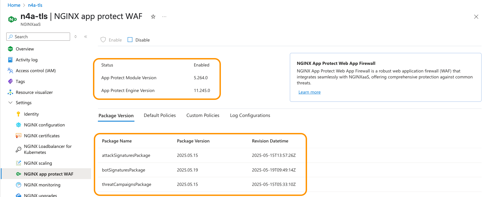

# NGINXaaS for Azure with App Protect Web Application Firewall (NAP)

## Introduction

The `NGINX as a Servive for Azure` now includes the **NGINX App Protect Web Application Firewall**, to support HTTP and HTTPS security protections and features.

>Using NGINXaaS with NGINX App Protect provides a fast, lightweight, and powerful WAF engine, built by the security experts from F5 Networks and NGINX.  App Protect is provided as an NGINX module, easy to install and configure.  The integration of NGINXaaS with Azure Services integrate easily with Azure KeyVault, Logging, Monitoring, and other tools.

<br/>

What is the NAP Module?  It is the same WAF engine used across various F5 products and services, notably Distributed Cloud App and API Protection, BIG-IP Application Security Manager (ASM), App Protect for NGINX, and App Protect for NGINX Ingress Controller.


Using both provided and customized App Protect Policies allow you to fine tune your security profile for traffic incoming to and NGINXaaS instance.

<br/>

NGINXaaS for Azure | NAP | Backend Web Applications
:-------------------------:|:-------------------------:|:-----------------:
 |  | 

<br/>

## Learning Objectives 

By the end of the lab you will be able to:
- Install and Enable App Protect
- Install and test the Juiceshop OWASP Demo application
- Configure and test security policies
- Create and test custom security policies
- Use Azure Monitoring to watch traffic
- Use Azure Logging to view Request/Response metadata

<br/>

## Prerequisites

- NGINXaaS for Azure Subscription
- NGINX App Protect WAF enabled
- Complete Labs 1-4 deployment in your Azure Resource Group
- Workshop UbuntuVM with Juiceshop application

<br/>

## Install and Enable App Protect

NOTE: The NGINX App Protect WAF can only be enabled on the NGINXaaS Azure Deployment with a `Standard v2 Pricing Plan`.  It will not work with other plans.

1. Using the Azure Portal Console, in your Resource Group, Select your NGINXaaS Deployment, then Select `NGINX App Protect WAF` from the left menu, then Click the Blue `Enable` button.  This will load the app protect module on your deployment, so it can be enabled and configured.  Click on the `Learn more` link to read more about the many types of protections offered by App Protect.


After Azure and Nginx provisioning, you will see a `Success` message, and information about the WAF Module, Attack Signatures, Bot signatures, and Threat Campaigns will be displayed.  The `Status` should show `Enabled`. This metadata is useful to ensure you know what the Versions and Timestamps are to track these different packages.



*Simple Explanation of the Packages*

- Attack Signatures are a list of protections for well-known CVEs and other threats.
- Bot Signatures are a list of well-known Bots.
- Threat Campaigns are a recent list of `new, evolving, and even zero-day threats`.  These are updated quickly in response to recent, current threats, that are *NOT* in the Attack or Bot signatures.
- For details on these and more features of the Signature Sets, consult the App Protect documentation.  These Signatures Sets are updated `automatically for you`, as part of your NGINXaaS subscription plan.

> HOW NICE!  No more headaches with Signatures downloads, updates and restarts = awesome!


1. Under your N4A Instance, go to Settings, then `NGINX configuration`. You need to add two directives:

- in the main{} context, enable the app protect module in your `/etc/nginx/nginx.conf` file, using the Nginx `load_module` directive.
- in the http{} context, configure the Enforcer Address, as shown in this example:


    ```nginx
    user nginx;
    worker_processes auto;
    worker_rlimit_nofile 8192;
    pid /run/nginx/nginx.pid;

    error_log /var/log/nginx/error.log error;

    # Enable App Protect WAF Module and Enforcer
    load_module modules/ngx_http_app_protect_module.so;    # app protect module

    http {
    #Enable WAF Enforcer
    app_protect_enforcer_address 127.0.0.1:50000;          # enforcer address

    ...snip

    }

    ```

1. Click Submit to enable App Protect.

<br/>

## Install and test the Juiceshop OWASP Demo application


### Test Various HTTP Attacks to Juiceshop application - NO App Protect

Using a browser, try the following Attacks as URLs:

*Cross-Site Scripting*
https://juiceshop.example.com/?%3Cscript%3E

*Embedded iFrame*
https://juiceshop.example.com/index.html/?id=%3Ciframe%20src%3D%22javascript:alert(%60data%20all%20over%20this%20screen%20that%20wasnt%20planned%60)%22%3E

*SQL Injection*
https://juiceshop.example.com//rest/products/search?q=qwert%27%29%29%20UNION%20SELECT%20id%2C%20email%2C%20password%2C%20%274%27%2C%20%275%27%2C%20%276%27%2C%20%277%27%2C%20%278%27%2C%20%279%27%20FROM%20Users--


<br/>

## Configure and test security policies

  

Now that the NLK Controller is running, you need a matching Upstream Server block configuration in your N4A instance, that will forward traffic to your Cluster.  In this example, you will create a new upstream config named `aks1-nlk-upstreams.conf`.  *Notice - this upstream block will NOT contain any server IP:PORT directives*, because the NLK Controller will be dynamically adding them for you, using the NGINX Plus API.  

1. Ensure you are in the `labs/lab12` folder for these exercises.

1. Using the N4A web console, create a new file `/etc/nginx/conf.d/aks1-nlk-upstreams.conf`.  You can use this example as shown, just copy/paste.

    ```nginx
    # Chris Akker, Shouvik Dutta, Adam Currier - Jan 2025
    # NGINX Upstream Block for NLK Controller
    #
    # NGINX 4 Azure - aks1-nlk-upstreams.conf
    #
    upstream aks1-nlk-upstreams {
      zone aks1-nlk-upstreams 256K;             # required for metrics
      state /tmp/aks1-nlk-upstreams.state;      # required for backup

      least_time last_byte;                # choose the fastest NodePort

      # Server List dynamically managed by NLK Controller

      keepalive 16;

    }

    ```

    > ### Deep Dive Explanation of the Upstream block

    

    - **upstream name**; - choose a name that will be easy to remember, which cluster, and a NLK tag (you can change this as needed, of course)
    - **zone name**; - this is the shared memory zone used by NGINX Plus to collect all the upstream server metrics; like connections, health checks, handshakes, requests, response codes, and response time
    - **state file**; - this is a backup file of the UpstreamServer List, in case NGINX is restarted, or the host is rebooted.  Because this UpstreamServer List only exists in memory, this backup file is required, the file name should match the upstream name.
    - **least_time last_byte**; - this is the `NGINX advanced load balancing algorithm` that watches the HTTP Response time, and favors the fastest server.  This is a critical setting for obtaining optimal performance in Kubernetes environments.
    - **keepalive num**; - this creates a TCP connection pool that NGINX uses for Requests.  Also critical for optimal performance
    - Consult the NGINX Plus documentation for further details on these Directives, there is a link in the References Section.

1. Submit your NGINX Configuration.

<br/>

## Create and test custom security policies


NGINX | NGINX Cafe
:-------------------------:|:-------------------------:
 | 

<br/>

1. Update your `/etc/nginx/conf.d/cafe.example.com.conf` configuration, to `proxy_pass to your new aks1-nlk-upstreams` Upstream block, as shown.  This changes where N4A will load balance your traffic:

    ```nginx
    # NGINX 4 Azure - Cafe NGINX to AKS1 with NLK
    # Chris Akker, Shouvik Dutta, Adam Currier - Jan 2025
    #
    server {
        
        listen 80;      # Listening on port 80

        server_name cafe.example.com;   # Set hostname to match in request
        status_zone cafe.example.com;   # Metrics zone name

        access_log  /var/log/nginx/cafe.example.com.log main;
        error_log   /var/log/nginx/cafe.example.com_error.log info;

        location / {
            status_zone /;              # Metrics zone name
            #
            # return 200 "You have reached cafe.example.com, location /\n";
            
            proxy_pass http://aks1-nlk-upstreams;        # Proxy AND load balance to AKS1 NLK UpstreamServer List
            add_header X-Proxy-Pass aks1-nlk-upstreams;  # Custom Header
            add_header X-Aks1-Upstream $upstream_addr;   # Which AKS1 NodeIP:Port
            
            # proxy_pass http://cafe_nginx;          # Proxy AND load balance to Docker VM
            # add_header X-Proxy-Pass cafe_nginx;    # Custom Header

            # proxy_pass http://aks1_ingress;        # Proxy AND load balance to AKS1 NGINX Ingress
            # add_header X-Proxy-Pass aks1_ingress;  # Custom Header

            # proxy_pass http://aks2_ingress;        # Proxy AND load balance to AKS2 NGINX Ingress
            # add_header X-Proxy-Pass aks2_ingress;  # Custom Header

        }
        
    }

    ```

1. Submit your NGINX Configuration.

<br>

## Use Azure Monitoring to watch traffic


Now a Kubernetes Service is required, to expose your application outside of the cluster.  NLK uses a standard `NodePort` definition, with a few additions needed for the NLK Controller.  In this exercise, you will expose the `nginx-ingress Service`, which is the NGINX Ingress Controller running inside the Cluster.  

>IMPORTANT: This create TWO layers of NGINX Loadbalancing - N4A outside the Cluster is sending traffic to NGINX Ingress inside the Cluster.  

NGINX Ingress will then route the requests to the correct Services and Pods.  (NOTE that data plane traffic does NOT go through the NLK Controller at all, as it is part of the control plane).


1. Using kubectl, set your config context for `n4a-aks1`, and apply the NodePort manifest file provided here:

    ```bash
    kubectl config use-context n4a-aks1
    kubectl apply -f nodeport-aks1-nlk.yaml

    ```

    > ### DeepDive Explanation of the `nodeport-aks1-nlk.yaml` manifest:

    

    ```yaml
    apiVersion: v1
    kind: Service
    metadata:
      name: nginx-ingress
      namespace: nginx-ingress
      annotations:
        # Let the controller know to pay attention to this K8s Service.
        nginx.com/nginxaas: nginxaas
    spec:
      # expose the HTTP port on the nodes
      type: NodePort
      ports:
      - port: 80
        targetPort: 80
        protocol: TCP
        # The port name maps to N4A upstream. It must be prefixed with `http-`
        # and the rest of the name must match the name of an upstream
        name: http-aks1-nlk-upstreams
      selector:
        app: nginx-ingress

    ```

    - The Service name is `nginx-ingress`
    - The namespace matches the NGINX Ingress Controller, `nginx-ingress`
    - Annotation is set for `nginxaas`, tells the NLK Controller to `Watch this Service`
    - Type is NodePort
    - Cluster Port is 80, to the Pods
    - The `name` of the port is the mapping to the proper `upstream name`, with a prefix of `http-`.  This is done to ensure the NLK's HTTP NodePort does not duplicate/overwrite other NodePorts you might have defined.

1. Verify that your `nginx-ingress` Service was created.

    ```bash
    kubectl describe svc nginx-ingress -n nginx-ingress

    ```

    ```
    ## Sample output ##
    Name:                     nginx-ingress
    Namespace:                nginx-ingress
    Labels:                   <none>
    Annotations:              nginx.com/nginxaas: nginxaas
    Selector:                 app=nginx-ingress
    Type:                     NodePort
    IP Family Policy:         SingleStack
    IP Families:              IPv4
    IP:                       10.0.47.161
    IPs:                      10.0.47.161
    Port:                     http-aks1-nlk-upstreams  80/TCP
    TargetPort:               80/TCP
    NodePort:                 http-aks1-nlk-upstreams  31039/TCP
    Endpoints:                10.244.0.4:80
    Session Affinity:         None
    External Traffic Policy:  Cluster
    Events:                   <none>

    ```

    `Take NOTE:` Notice that Kubernetes chooses an ephemeral high-numbered TCP Port, `31039` in this example.  The NLK Controller is Notified of this Service change, and will send the API commands to N4A to update the UpstreamServer List.  The UpstreamServer List will be each Worker's `NodeIP:31039`.  (Kubernetes Control Nodes are intentionally excluded from this List).

    You can confirm this in several ways.

1. Using curl, see if the NGINX Cafe application works and what Header Values are returned, ready for coffee?

    

    ```bash
    curl -I http://cafe.example.com/coffee

    ```

    ```bash
    ## Sample output ##
    HTTP/1.1 200 OK
    Date: Fri, 17 Jan 2025 18:20:27 GMT
    Content-Type: text/html; charset=utf-8
    Connection: keep-alive
    Expires: Fri, 17 Jan 2025 18:20:26 GMT
    Cache-Control: no-cache
    X-Proxy-Pass: aks1-nlk-upstreams       # this is the proxy pass Header
    X-Aks1-Upstream: 172.16.10.4:31039     # this is the upstream Header

    ```

    Notice that the `X-Ask1-Upstream Header` value is one of your AKS1 worker nodes, with the NodePort `31039`.

1. Verify your AKS1 worker Node IPs, ask Kubernetes:

    ```bash
    kubectl config use-context n4a-aks1
    kubectl describe nodes |grep Internal

    ```

    ```bash
    ## Sample output ##
      InternalIP:  172.16.10.5
      InternalIP:  172.16.10.4
      InternalIP:  172.16.10.6

    ```

1. Try the curl command serveral times, you should see the `X-Aks1-Upstream` Header value change, as NGINX is load balancing traffic to all your AKS Workers.

    ```bash
    ## Sample output ##

    HTTP/1.1 200 OK
    Date: Fri, 17 Jan 2025 18:27:03 GMT
    Content-Type: text/html; charset=utf-8
    Connection: keep-alive
    Expires: Fri, 17 Jan 2025 18:27:02 GMT
    Cache-Control: no-cache
    X-Proxy-Pass: aks1-nlk-upstreams
    X-Aks1-Upstream: 172.16.10.4:31039      # worker #1

    HTTP/1.1 200 OK
    Date: Fri, 17 Jan 2025 18:27:08 GMT
    Content-Type: text/html; charset=utf-8
    Connection: keep-alive
    Expires: Fri, 17 Jan 2025 18:27:07 GMT
    Cache-Control: no-cache
    X-Proxy-Pass: aks1-nlk-upstreams
    X-Aks1-Upstream: 172.16.10.5:31039      # worker #2

    HTTP/1.1 200 OK
    Date: Fri, 17 Jan 2025 18:26:57 GMT
    Content-Type: text/html; charset=utf-8
    Connection: keep-alive
    Expires: Fri, 17 Jan 2025 18:26:56 GMT
    Cache-Control: no-cache
    X-Proxy-Pass: aks1-nlk-upstreams
    X-Aks1-Upstream: 172.16.10.6:31039      # worker #3

    ```

1. You can see this using Azure Metrics as well, as shown here.  Notice that you can add the Filter and Splitting, to see the IP Addresses of the NGINX Upstreams.  The Upstream `aks1-nlk-upstreams` and it's IP Addresses should match your Worker Node IPs, and the Port number should match your NodePort `nginx-ingress` Service.

    

### Optional - NLK Logging

If you want to see what the NLK Controller is doing, you have to change the Logging Level to `info`.  This requires just adding the correct Annotation to the Controller.

1. Using the Azure portal, go to your Azure Resource Group, then your n4a-aks1 Cluster, Setting, then `Extensions + applications`, then click on `aks1nlk`.  Under `Configuration settings` at the bottom, add a new Key: `nlk.config.logLevel` and Value: `info`.

    

    Click `Save`.  This will update the NLK Controller to change the Logging Level to `info`.

1. **Optional:** Verify the ConfigMap is set correctly:

    ``` bash
    kubectl describe cm aks1nlk-nginxaas-loadbalancer-kubernetes-nlk-config -n nlk

    ```

    ```bash
    ## Sample output ##
    Name:         aks1nlk-nginxaas-loadbalancer-kubernetes-nlk-config
    Namespace:    nlk
    Labels:       app.kubernetes.io/managed-by=Helm
    Annotations:  meta.helm.sh/release-name: aks1nlk
                  meta.helm.sh/release-namespace: nlk

    Data
    ====
    config.yaml:
    ----
    log-level: "info"             ## Log Level setting ##
    nginx-hosts: "https://nginx4a-7997549a615f.centralus.nginxaas.net/nplus"
    tls-mode: "ca-tls"


    BinaryData
    ====

    Events:  <none>

    ```

1. Now you can watch the NLK Controller log messages, as you make changes.  Type the following command to follow the Kubernetes logs for the NLK deployment:

    ```bash
    kubectl logs deployment/aks1nlk-nginxaas-loadbalancer-kubernetes -n nlk --follow
    ```

    ```bash
    ## Sample output ##
    {"time":"2025-01-17T18:36:14.994747303Z","level":"INFO","msg":"Watcher::buildServiceEventHandlerForAdd","version":"0.8.0"}
    {"time":"2025-01-17T18:36:14.994839603Z","level":"INFO","msg":"Watcher::buildServiceEventHandlerForDelete","version":"0.8.0"}
    {"time":"2025-01-17T18:36:14.994845703Z","level":"INFO","msg":"Watcher::buildServiceEventHandlerForUpdate","version":"0.8.0"}
    {"time":"2025-01-17T18:36:14.994849103Z","level":"INFO","msg":"Watcher::buildEndpointSlicesEventHandlerForAdd","version":"0.8.0"}
    {"time":"2025-01-17T18:36:14.994852203Z","level":"INFO","msg":"Watcher::buildEndpointSlicesEventHandlerForDelete","version":"0.8.0"}
    {"time":"2025-01-17T18:36:14.994855103Z","level":"INFO","msg":"Watcher::buildEndpointSlicesEventHandlerForUpdate","version":"0.8.0"}
    {"time":"2025-01-17T18:36:14.994858503Z","level":"INFO","msg":"Watcher::buildNodesEventHandlerForAdd","version":"0.8.0"}
    {"time":"2025-01-17T18:36:14.994861503Z","level":"INFO","msg":"Watcher::buildNodesEventHandlerForDelete","version":"0.8.0"}
    {"time":"2025-01-17T18:36:14.994864403Z","level":"INFO","msg":"Watcher::buildNodesEventHandlerForUpdate","version":"0.8.0"}
    {"time":"2025-01-17T18:36:15.095250329Z","level":"INFO","msg":"Started probe listener","version":"0.8.0","address":":51031"}
    {"time":"2025-01-17T18:36:17.643745867Z","level":"INFO","msg":"Synchronizer::handleEvent: successfully handled the event","version":"0.8.0","type":"Created","upstreamName":"aks1-nlk-upstreams","eventID":"[0:0]-[tmJZbL5b5d9c]-[aks1-nlk-upstreams]-[https://nginx4a-7997549a615f.centralus.nginxaas.net/nplus]"}
    {"time":"2025-01-17T18:37:04.752382349Z","level":"INFO","msg":"Synchronizer::handleEvent: successfully handled the event","version":"0.8.0","type":"Updated","upstreamName":"aks1-nlk-upstreams","eventID":"[0:0]-[AqG0q4OWnGy8]-[aks1-nlk-upstreams]-[https://nginx4a-7997549a615f.centralus.nginxaas.net/nplus]"}
    ```

    *You can keep this log open for the next Exercise*.

<br/>

## Use Azure Logging to view Request/Response metadata

  

Now for the actual Scaling Test!!  Does the NLK Controller detect when you `scale your AKS Cluster nodes up/down` (Node Scaling)?  You will test that now.

1. Using the Azure Portal web console, manually scale your `n4a-aks1 nodepool` from 3 to 5 workers.  

   

   Watching the NLK Logs, you should see some NLK `Updated messages` scroll by.

1. Open a new Terminal, check with Curl, do you find 5 different IP addresses in the in `X-Aks1-Upstream Header` values?

    ```bash
    while true; do curl -I http://cafe.example.com/coffee; sleep .5; done
    ```

    Confirm - what are the 5 n4a-aks1 Node IPs?  Ask Kubernetes ...

    ```bash
    kubectl config use-context n4a-aks1
    kubectl describe nodes |grep Internal
    ```

    ```bash
    ## Sample output
      InternalIP:  172.16.10.5
      InternalIP:  172.16.10.4
      InternalIP:  172.16.10.6
      InternalIP:  172.16.10.8
      InternalIP:  172.16.10.7
    ```


1. Go back your N4A Metrics Panel, and check the `plus.http.upstream.peer.address` of your Metrics Filter... you should also find 5 IP:NodePort Addresses, one for each upstream/worker.

    

<br/>


<br/>

**This completes Lab 13.**

<br/>

## References:

- [NGINX As A Service for Azure](https://docs.nginx.com/nginxaas/azure/)
- [NGINX Loadbalancer Kubernetes](https://docs.nginx.com/nginxaas/azure/quickstart/loadbalancer-kubernetes/)
- [NGINX Plus Product Page](https://docs.nginx.com/nginx/)
- [NGINX Directives Index](https://nginx.org/en/docs/dirindex.html)
- [NGINX Variables Index](https://nginx.org/en/docs/varindex.html)
- [NGINX Technical Specs](https://docs.nginx.com/nginx/technical-specs/)

<br/>

### Authors

- Chris Akker - Solutions Architect - Community and Alliances @ F5, Inc.
- Shouvik Dutta - Solutions Architect - Community and Alliances @ F5, Inc.
- Adam Currier - Solutions Architect - Community and Alliances @ F5, Inc.

-------------

Navigate to [LabGuide](../readme.md)
