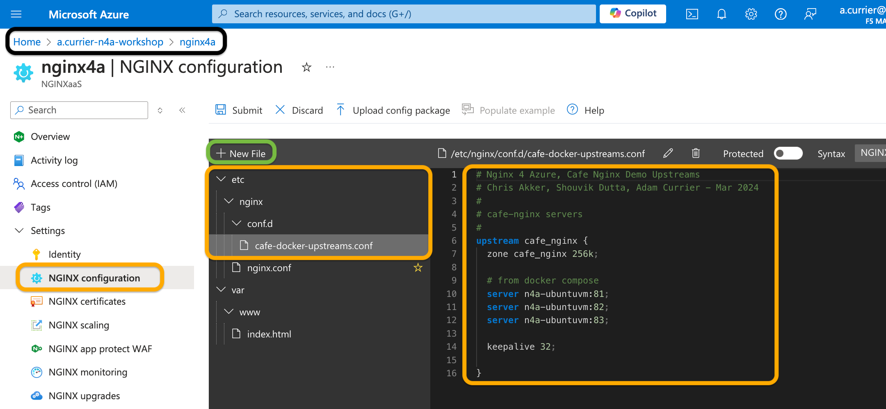

# Ubuntu VM / Docker / Windows VM / Cafe Demo Deployment

## Introduction

In this lab, you will be creating various application backend resources.  You will create and deploy an Ubuntu VM for hosting Docker containers.  You will install Docker, and a demo application will be deployed with Docker-compose.  You will also deploy a Windows VM.  These containers and VMs will be your backend applications running in Azure.  You will configure and test Nginx for Azure to proxy and load balance these resources.

Your completed Ubuntu and Windows VM deployment will look like this:


<br/>

NGINX aaS | Ubuntu | Docker | Windows
:---------------------:|:---------------------:|:---------------------:|:---------------------:
 | | |

<br/>

## Learning Objectives

By the end of the lab you will be able to:

- Deploy Ubuntu VM with Docker and Docker-Compose preinstalled using Azure CLI
- Run Nginx demo application containers
- Configure Nginx for Azure to Load Balance Docker containers
- Test and validate your lab environment
- Deploy Windows VM with Azure CLI
- Configure Nginx for Azure to proxy to the Windows VM
- Test your Nginx for Azure configs

## Pre-Requisites

- You must have Azure Networking configured for this Workshop
- You must have proper access to create Azure VMs
- You must have Azure CLI tool installed on your local system
- You must have an SSH client software installed on your local system
- You must have your Nginx for Azure instance deployed and running
- Familiarity with basic Linux commands and commandline tools
- Familiarity with basic Docker concepts and commands
- Familiarity with basic HTTP protocol
- See `Lab0` for instructions on setting up your system for this Workshop

<br/>

## Deploy Ubuntu VM with Docker and Docker-Compose preinstalled using Azure CLI

1. In your local machine open terminal and make sure you are logged onto your Azure tenant. Set the following Environment variable which points to your Resource Group:

    ```bash
    ## Set environment variables
    export MY_RESOURCEGROUP=s.dutta-workshop
    ```

    >*Make sure your Terminal is the `nginx-azure-workshops/labs` directory for all commands during this Workshop.*

1. Create the Ubuntu VM that would be acting as your backend application server using below command:

    ```bash
    az vm create \
        --resource-group $MY_RESOURCEGROUP \
        --name n4a-ubuntuvm \
        --image Ubuntu2204 \
        --admin-username azureuser \
        --vnet-name n4a-vnet \
        --subnet vm-subnet \
        --assign-identity \
        --generate-ssh-keys \
        --public-ip-sku Standard \
        --custom-data lab2/init.sh
    ```

    ```bash
    ##Sample Output##
    {
      "fqdns": "",
      "id": "/subscriptions/<SUBSCRIPTION_ID>/resourceGroups/s.dutta-workshop/providers/Microsoft.Compute/virtualMachines/n4a-ubuntuvm",
      "identity": {
        "systemAssignedIdentity": "xxxx-xxxx-xxxx-xxxx-xxxx",
        "userAssignedIdentities": {}
      },
      "location": "centralus",
      "macAddress": "00-22-48-4A-3B-1E",
      "powerState": "VM running",
      "privateIpAddress": "172.16.2.4",
      "publicIpAddress": "<AZURE_ASSIGNED_PUBLICIP>",
      "resourceGroup": "s.dutta-workshop",
      "zones": ""
    }
    ```

    Make a Note of the `publicIpAddress`, this IP would be needed later on to access your VM remotely, with SSH.

    The above command would create below resources within your resource group:
      - **n4a-ubuntuvm:** This is your virtual machine(vm) resource.
      - **n4a-ubuntuvm_OsDisk_1_<Random_HEX_String>:** This is your OS Disk resource tied to your vm.
      - **n4a-ubuntuvmVMNic:** This is your network interface resource tied to your vm.
      - **n4a-ubuntuvmNSG:** This is your network security group resource tied to the network interface of your vm.
      - **n4a-ubuntuvmPublicIP:** This is your public IP resource tied to your vm.
  
    This command will also generate a SSH key file named `id_rsa` under `~/.ssh` folder if you don't have one already.

    **SECURITY WARNING:** This new VM has SSH/port22 open to the entire Internet, and is only using an SSH Key file for security. Take appropriate steps to secure your VM if you will be using it for more than a couple hours!

1. **(Optional Step):** You can lock down your Network Security Group by allowing SSH/port22 access only to your publicIP using below command.

    ```bash
    ##Set environment variable
    export MY_PUBLICIP=$(curl ipinfo.io/ip)
    ```

    ```bash
    az network nsg rule update \
    --resource-group $MY_RESOURCEGROUP \
    --nsg-name n4a-ubuntuvmNSG \
    --name default-allow-ssh \
    --source-address-prefix $MY_PUBLICIP
    ```

1. Verify you have SSH access to the Ubuntu VM that you deployed in previous steps. Open a Terminal, and use your public IP tied to ubuntu vm, to start a new ssh session.

    ```bash
    ssh azureuser@<UBUNTU_VM_PUBLICIP>

    #eg
    ssh azureuser@11.22.33.44
    ```

    Where:
    - `ssh` - is the local command to start an SSH session, or use another applcation of your choosing.
    - `azureuser` is the local user for Azure VM that you created.
    - `@11.22.33.44` is the Public IP Address assigned to your Ubuntu VM.

    **Note:** If you cannot connect using your local machine, you likely having ssh client issues. You can make use of Azure CloudShell to access your VM which would create an `id_rsa` ssh key file within the `~/.ssh` directory of your Azure cloud shell.

    

1. Within the Ubuntu VM, run below commands to validate docker and docker compose are installed as part of the `init.sh` script that you passed as one of the parameters to the `az vm create` command

    ```bash
    docker version
    docker-compose version
    ```

1. Test and see if Docker will run the `Hello-World` container:

    ```bash
    sudo docker run hello-world
    ```

    ```bash
    ##Sample Output##
    Unable to find image 'hello-world:latest' locally
    latest: Pulling from library/hello-world
    c1ec31eb5944: Pull complete
    Digest: sha256:53641cd209a4fecfc68e21a99871ce8c6920b2e7502df0a20671c6fccc73a7c6
    Status: Downloaded newer image for hello-world:latest

    Hello from Docker!
    This message shows that your installation appears to be working correctly.

    To generate this message, Docker took the following steps:
    1. The Docker client contacted the Docker daemon.
    2. The Docker daemon pulled the "hello-world" image from the Docker Hub.
        (amd64)
    3. The Docker daemon created a new container from that image which runs the
        executable that produces the output you are currently reading.
    4. The Docker daemon streamed that output to the Docker client, which sent it
        to your terminal.

    To try something more ambitious, you can run an Ubuntu container with:
    $ docker run -it ubuntu bash

    Share images, automate workflows, and more with a free Docker ID:
    https://hub.docker.com/

    For more examples and ideas, visit:
    https://docs.docker.com/get-started/
    ```

1. Checkout a few Docker things:

    ```bash
    sudo docker images
    ```

    ```bash
    sudo docker ps -a
    ```

    You should find the hello-world image was pulled, and that the container ran and exited.

    >Success!  You have an Ubuntu VM with Docker that can run various containers needed for future Lab exercises. Reminder: Don't forget to shutdown this VM when you are finished with it later, or set an Auto Shutdown policy using Azure Portal.

    Leave your SSH Terminal running, you will use it in the next section.

<br/>

### Deploy Nginx Demo containers

You will now use Docker Compose to create and deploy three Nginx `ingress-demo` containers.  These will be your first group of `backends` that will be used for load balancing with Nginx for Azure.

1. Inspect the `lab2/docker-compose.yml` file.  Notice you are pulling the `nginxinc/ingress-demo` image, and starting three containers.  The three containers are configured as follows:

    Container Name | Name:port
    :-------------:|:------------:
    docker-web1 | ubuntuvm:81
    docker-web2 | ubuntuvm:82
    docker-web3 | ubuntuvm:83

1. On the Ubuntu VM, create a new sub-directory in the `/home/azureuser` directory, call it `cafe`.

      ```bash
      cd $HOME
      mkdir cafe
      ```

1. Within the `cafe` sub-directory, you will now add `docker-compose.yml`.
    You can do this in two ways. You can create a new `docker-compose.yml` file and copy the contents from the `lab2/docker-compose.yml` file, into this new file on the Ubuntu VM using editor of your choice (Below example uses vi tool).

      ```bash
      cd cafe
      vi docker-compose.yml
      ```

    Alternatively, you can get this file by running the `wget` command as shown below:

    ```bash
    cd cafe
    wget https://raw.githubusercontent.com/nginxinc/nginx-azure-workshops/main/labs/lab2/docker-compose.yml
    ```

1. Start up the three Nginx demo containers using below command. This instructs Docker to read the compose file and start the three containers:

    ```bash
    sudo docker-compose up -d
    ```

1. Check the containers are running:

    ```bash
    sudo docker ps
    ```

    ```bash
    ##Sample Output##
    CONTAINER ID   IMAGE                   COMMAND                  CREATED          STATUS                      PORTS                                                                        NAMES
    33ca8329cece   nginxinc/ingress-demo   "/docker-entrypoint.…"   2 minutes ago    Up 2 minutes                0.0.0.0:82->80/tcp, :::82->80/tcp, 0.0.0.0:4432->443/tcp, :::4432->443/tcp   docker-web2
    d3bf38f7b575   nginxinc/ingress-demo   "/docker-entrypoint.…"   2 minutes ago    Up 2 minutes                0.0.0.0:83->80/tcp, :::83->80/tcp, 0.0.0.0:4433->443/tcp, :::4433->443/tcp   docker-web3
    1982b1a4356d   nginxinc/ingress-demo   "/docker-entrypoint.…"   2 minutes ago    Up 2 minutes                0.0.0.0:81->80/tcp, :::81->80/tcp, 0.0.0.0:4431->443/tcp, :::4431->443/tcp   docker-web1
    ```

    Notice that each container is listening on a unique TCP port on the Docker host - Ports 81, 82, and 83 for docker-web1, docker-web2 and docker-web3, respectively.

1. Verify that all THREE containers have their TCP ports exposed on the Ubuntu VM host:

    ```bash
    netstat -tnl
    ```

    ```bash
    #Sample output
    Active Internet connections (only servers)
    Proto Recv-Q Send-Q Local Address           Foreign Address         State
    tcp        0      0 127.0.0.53:53           0.0.0.0:*               LISTEN
    tcp        0      0 0.0.0.0:22              0.0.0.0:*               LISTEN
    tcp        0      0 0.0.0.0:81              0.0.0.0:*               LISTEN
    tcp        0      0 0.0.0.0:83              0.0.0.0:*               LISTEN
    tcp        0      0 0.0.0.0:82              0.0.0.0:*               LISTEN
    tcp        0      0 0.0.0.0:4433            0.0.0.0:*               LISTEN
    tcp        0      0 0.0.0.0:4432            0.0.0.0:*               LISTEN
    tcp        0      0 0.0.0.0:4431            0.0.0.0:*               LISTEN
    tcp6       0      0 :::22                   :::*                    LISTEN
    tcp6       0      0 :::81                   :::*                    LISTEN
    tcp6       0      0 :::83                   :::*                    LISTEN
    tcp6       0      0 :::82                   :::*                    LISTEN
    tcp6       0      0 :::4433                 :::*                    LISTEN
    tcp6       0      0 :::4432                 :::*                    LISTEN
    tcp6       0      0 :::4431                 :::*                    LISTEN
    ```

    Yes, looks like ports 81, 82, and 83 are Listening.  Note:  If you used a different VM, you may need to update the VM Host Firewall rules to allow traffic to the containers.

1. Test all three containers by running curl command within the Ubuntu VM:

    ```bash
    curl -s localhost:81 |grep Server
    ```

    Gives you the 1st Container Name as `Server Name`, and Container's IP address as `Server Address`:

    ```bash
    ##Sample Output##
          <p class="smaller"><span>Server Name:</span> <span>docker-web1</span></p>
          <p class="smaller"><span>Server Address:</span> <span><font color="green">172.18.0.2:80</font></span></p>
    ```

    ```bash
    curl -s localhost:82 |grep Server
    ```

    Gives you the 2nd Container Name as `Server Name`, and Container's IP address as `Server Address`:

    ```bash
    ##Sample Output##
          <p class="smaller"><span>Server Name:</span> <span>docker-web2</span></p>
          <p class="smaller"><span>Server Address:</span> <span><font color="green">172.18.0.3:80</font></span></p>
    ```

    ```bash
    curl -s localhost:83 |grep Server
    ```

    Gives you the 3rd Container Name as `Server Name`, and Container's IP address as `Server Address`:

    ```bash
    ##Sample Output##
          <p class="smaller"><span>Server Name:</span> <span>docker-web3</span></p>
          <p class="smaller"><span>Server Address:</span> <span><font color="green">172.18.0.4:80</font></span></p>
    ```

    If you able to see Responses from all THREE containers, you can continue.

<br/>

## Configure Nginx for Azure to Load Balance Docker containers

<br/>

In this exercise, you will create your first Nginx config files, for the Nginx Server, Location, and Upstream blocks, to load balance your three Docker containers running on the Ubuntu VM.


<br/>

NGINX aaS | Docker | Cafe Demo
:-------------------------:|:-------------------------:|:-------------------------:
  |  |

1. Open Azure portal within your browser and then open your Resource Group. Click on your NGINX for Azure resource (nginx4a) which should open the Overview section of your resource. From the left pane click on `NGINX Configuration` under Settings.

1. Click on `+ New File`, to create a new Nginx config file. Name the new file `/etc/nginx/conf.d/cafe-docker-upstreams.conf`.

    **Important:** You must use the full Linux /directory/filename path for every Nginx config file, for it to be properly created and placed in the correct directory.  If you forget, you can delete it and must re-create it.  The Azure Portal Text Edit panels do not let you move, or drag-n-drop files or directories.  You can `rename` a file by clicking the Pencil icon, and `delete` a file by clicking the Trashcan icon at the top.

1. Copy and paste the contents from the matching file present in `lab2` directory from Github, into the Configuration Edit window, shown here:

    ```nginx
    # Nginx 4 Azure, Cafe Nginx Demo Upstreams
    # Chris Akker, Shouvik Dutta, Adam Currier - Mar 2024
    #
    # cafe-nginx servers
    #
    upstream cafe_nginx {
        zone cafe_nginx 256k;
        
        # from docker compose
        server n4a-ubuntuvm:81;
        server n4a-ubuntuvm:82;
        server n4a-ubuntuvm:83;

        keepalive 32;

    }
    ```

    

    This creates an Nginx Upstream Block, which defines the backend server group that Nginx will load balance traffic to.

    Click `Submit` to save your Nginx configuration.

1. Click the ` + New File` again, and create a second Nginx config file, using the same Nginx for Azure Configuration editor tool. Name the second file `/etc/nginx/conf.d/cafe.example.com.conf`.

1. Copy and paste the contents of the matching file present in `lab2` directory from Github, into the Configuration Edit window, shown here:

    ```nginx
    # Nginx 4 Azure - Cafe Nginx HTTP
    # Chris Akker, Shouvik Dutta, Adam Currier - Mar 2024
    #
    server {
        
        listen 80;      # Listening on port 80 on all IP addresses on this machine

        server_name cafe.example.com;   # Set hostname to match in request
        status_zone cafe.example.com;   # Metrics zone name

        access_log  /var/log/nginx/cafe.example.com.log main;
        error_log   /var/log/nginx/cafe.example.com_error.log info;

        location / {
            #
            # return 200 "You have reached cafe.example.com, location /\n";
            
            proxy_pass http://cafe_nginx;        # Proxy AND load balance to a list of servers
            add_header X-Proxy-Pass cafe_nginx;  # Custom Header

            # proxy_pass http://windowsvm;        # Proxy AND load balance to a list of servers
            # add_header X-Proxy-Pass windowsvm;  # Custom Header

        }

    }

    ```

    Click `Submit` to save your Nginx configuration.

1. Now you need to include these new files into your main `nginx.conf` file within your `nginx4a` resource. Copy and paste the contents of the `nginx.conf` file present in `lab2` directory from Github, into the `nginx.conf` file using Configuration Edit window, shown here:

    ```nginx
    # Nginx 4 Azure - Default - Updated Nginx.conf
    # Chris Akker, Shouvik Dutta, Adam Currier - Mar 2024
    #
    user nginx;
    worker_processes auto;
    worker_rlimit_nofile 8192;
    pid /run/nginx/nginx.pid;

    events {
        worker_connections 4000;
    }

    error_log /var/log/nginx/error.log error;

    http {
        log_format  main  '$remote_addr - $remote_user [$time_local] "$request" '
                      '$status $body_bytes_sent "$http_referer" '
                      '"$http_user_agent" "$http_x_forwarded_for"';
                      
        access_log off;
        server_tokens "";
        server {
            listen 80 default_server;
            server_name localhost;
            location / {
                # Points to a directory with a basic html index file with
                # a "Welcome to NGINX as a Service for Azure!" page
                root /var/www;
                index index.html;
            }
        }

        include /etc/nginx/conf.d/*.conf;
        # include /etc/nginx/includes/*.conf;    # shared files
    
    }

    # stream {
        
    #     include /etc/nginx/stream/*.conf;          # Stream TCP nginx files

    # }
    ```

    Notice that the Nginx standard / Best Practice of placing the HTTP Context config files in the `/etc/nginx/conf.d` folder is being followed, and the `include` directive is being used to read these files at Nginx configuration load time.

1. Click the `Submit` Button above the Editor.  Nginx will validate your configurations, and if successful, will reload Nginx with your new configurations.  If you receive an error, you will need to fix it before you proceed.

<br/>

### Test your Nginx for Azure configuration

1. For easy access your new website, update your local system's DNS `/etc/hosts` file. You will add the hostname `cafe.example.com` and the Nginx for Azure Public IP address, to your local system DNS hosts file for name resolution.  Your Nginx for Azure Public IP address can be found in your Azure Portal, under `n4a-publicIP`.  Use vi tool or any other text editor to add an entry to `/etc/hosts` as shown below:

    ```bash
    cat /etc/hosts

    127.0.0.1 localhost
    ...

    # Nginx for Azure testing
    11.22.33.44 cafe.example.com

    ...
    ```

    where
   - `11.22.33.44` replace with your `n4a-publicIP` resource IP address.

1. Once you have updated the host your /etc/hosts file, save it and quit vi tool.

1. Using a new Terminal, send a curl command to `http://cafe.example.com`, what do you see ?

    ```bash
    curl -I http://cafe.example.com
    ```

    ```bash
    ##Sample Output##
    HTTP/1.1 200 OK
    Date: Thu, 04 Apr 2024 21:36:30 GMT
    Content-Type: text/html; charset=utf-8
    Connection: keep-alive
    Expires: Thu, 04 Apr 2024 21:36:29 GMT
    Cache-Control: no-cache
    X-Proxy-Pass: cafe_nginx
    ```

    Try the coffee and tea URLs, at http://cafe.example.com/coffee and http://cafe.example.com/tea.

    You should see a 200 OK Response.  Did you see the `X-Proxy-Pass` header - set to the Upstream block name?  

1. Now try access to your cafe application with a Browser. Open Chrome, and nagivate to `http://cafe.example.com`. You should see an `Out of Stock` image, with a gray metadata panel, filled with names, IP addresses, URLs, etc. This panel comes from the Docker container, using Nginx $variables to populate the gray panel fields. If you Right+Click, and Inspect to open Chrome Developer Tools, and look at the Response Headers, you should be able to see the `Server and X-Proxy-Pass Headers` set respectively.


Click Refresh serveral times.  You will notice the `Server Name` and `Server Ip` fields changing, as N4A is round-robin load balancing the three Docker containers - docker-web1, 2, and 3 respectively.  If you open Chrome Developer Tools, and look at the Response Headers, you should be able to see the Server and X-Proxy-Pass Headers set respectively.


Try http://cafe.example.com/coffee and http://cafe.example.com/tea in Chrome, refreshing several times.  You should find Nginx for Azure is load balancing these Docker web containers as expected.

>**Congratulations!!**  You have just completed launching a simple web application with Nginx for Azure, running on the Internet, with just a VM, Docker, and 2 config files for Nginx for Azure.  That pretty easy, not so hard now, was it?

<br/>

### Deploy Windows VM with Azure CLI

Similar to how you deployed an Ubuntu VM, you will now deploy a Windows VM.

1. In your local machine open terminal and make sure you are logged onto your Azure tenant. Set the following Environment variables:

    ```bash
    export MY_RESOURCEGROUP=s.dutta-workshop
    export MY_VM_IMAGE=cognosys:iis-on-windows-server-2016:iis-on-windows-server-2016:1.2019.1009
    ```

1. Create the Windows VM (This will take some time to deploy):

    ```bash
    az vm create \
        --resource-group $MY_RESOURCEGROUP \
        --name n4a-windowsvm \
        --image $MY_VM_IMAGE \
        --vnet-name n4a-vnet \
        --subnet vm-subnet \
        --admin-username azureuser \
        --public-ip-sku Standard
    ```

    ```bash
    ##Sample Output##
    Admin Password: 
    Confirm Admin Password: 
    Consider upgrading security for your workloads using Azure Trusted Launch VMs. To know more about Trusted Launch, please visit https://aka.ms/TrustedLaunch.
    {
    "fqdns": "",
    "id": "/subscriptions/<SUBSCRIPTION_ID>/resourceGroups/s.dutta-workshop/providers/Microsoft.Compute/virtualMachines/n4a-windowsvm",
    "location": "centralus",
    "macAddress": "00-0D-3A-96-C5-F1",
    "powerState": "VM running",
    "privateIpAddress": "172.16.2.5",
    "publicIpAddress": "<AZURE_ASSIGNED_PUBLICIP>",
    "resourceGroup": "s.dutta-workshop",
    "zones": ""
    }
    ```

    The above command would create below resources within your resource group:
    - **n4a-windowsvm:** This is your virtual machine(vm) resource.
    - **n4a-windowsvm_OsDisk_1_<Random_HEX_String>:** This is your OS Disk resource tied to your vm.
    - **n4a-windowsvmVMNic:** This is your network interface resource tied to your vm.
    - **n4a-windowsvmNSG:** This is your network security group resource tied to the network interface of your vm.
    - **n4a-windowsvmPublicIP:** This is your public IP resource tied to your vm.

    **SECURITY WARNING:** This new VM has rdp/port3389 open to the entire Internet. Take appropriate steps to secure your VM if you will be using it for more than a couple hours!

1. **(Optional Step):** You can lock down your Network Security Group by allowing rdp/port3389 access only to your publicIP using below command.

    ```bash
    ##Set environment variable
    export MY_PUBLICIP=$(curl ipinfo.io/ip)
    ```

    ```bash
    az network nsg rule update \
    --resource-group $MY_RESOURCEGROUP \
    --nsg-name n4a-windowsvmNSG \
    --name rdp \
    --source-address-prefix $MY_PUBLICIP
    ```

<br/>

## Configure Nginx for Azure to proxy the Windows VM

In this exercise, you will create another Nginx config file, for the Windows VM Upstream block, to proxy your IIS Server running on the Windows VM.


NGINX aaS | Windows VM / IIS
:-------------------------:|:-------------------------:
 | 

<br/>

1. Open Azure portal within your browser and then open your Resource Group. Click on your NGINX for Azure resource (nginx4a) which should open the Overview section of your resource. From the left pane click on `NGINX Configuration` under settings.

1. Click on `+ New File`, to create a new Nginx config file. Name the new file `/etc/nginx/conf.d/windows-upstreams.conf`.

    **Important:** You must use the full Linux /folder/filename path for every Nginx config file, for it to be properly created and placed in the correct folder.  If you forget, you can delete it and must re-create it.  The Azure Portal Text Edit panels do not let you move, or drag-n-drop files or folders.  You can `rename` a file by clicking the Pencil icon, and `delete` a file by clicking the Trashcan icon at the top.

1. Copy and paste the contents from the matching file present in `lab2` directory from Github, into the Configuration Edit window, shown here:

    ```nginx
    # Nginx 4 Azure, Windows IIS Upstreams
    # Chris Akker, Shouvik Dutta, Adam Currier - Mar 2024
    #
    # windows IIS server
    #
    upstream windowsvm {
    zone windowsvm 256k;
    
    server n4a-windowsvm:80;      # IIS Server

    keepalive 32;

    }
    ```

    

    Click `Submit` to save your Nginx configuration.
    
    This creates a new Nginx Upstream Block, which defines the Windows IIS backend server group that Nginx will load balance traffic to.

1. Edit the comment characters in `/etc/nginx/conf.d/cafe.example.com.conf`, to enable the `proxy_pass` to the `windowsvm`, and disable it for the `cafe-nginx`, as follows:

    ```nginx
    # Nginx 4 Azure - Cafe Nginx and Windows IIS HTTP
    # Chris Akker, Shouvik Dutta, Adam Currier - Mar 2024
    #
    server {
        
        listen 80;      # Listening on port 80 on all IP addresses on this machine

        server_name cafe.example.com;   # Set hostname to match in request
        status_zone cafe.example.com;   # Metrics zone name

        access_log  /var/log/nginx/cafe.example.com.log main;
        error_log   /var/log/nginx/cafe.example.com_error.log info;

        location / {
            #
            # return 200 "You have reached cafe.example.com, location /\n";
            
            # proxy_pass http://cafe_nginx;        # Proxy AND load balance to a list of servers
            # add_header X-Proxy-Pass cafe_nginx;  # Custom Header

            proxy_pass http://windowsvm;        # Proxy AND load balance to a list of servers
            add_header X-Proxy-Pass windowsvm;  # Custom Header

        }

    }
    ```

1. Click the `Submit` Button above the Editor.  Nginx will validate your configuration, and if successfull, will reload Nginx with your new configuration.  If you receive an error, you will need to fix it before you proceed.

<br/>

### Test your Nginx for Azure configs

1. Test access again to http://cafe.example.com.  You will now see the IIS default server page, instead of the Cafe Out of Stock page.  If you check Chrome Dev Tools, the X-Proxy-Pass Header should now show `windowsvm`.

    

    >Notice how easy it was, to create a new backend server, and then tell Nginx to `proxy_pass` to a different Upstream. You used the same Hostname, DNS record, and Nginx Server block, but you just told Nginx to switch backends with a different `proxy_pass` directive.

1. Edit the `cafe.example.com.conf` file again, and change the comments to disable `windowsvm`, and re-enable the `proxy_pass` for `cafe_nginx`, as you will use it again in a future lab exercise.

1. Submit your Nginx changes, and re-test to verify that http://cafe.example.com works again for Cafe Nginx.  Don't forget to change the custom Header as well.

<br>

**This completes Lab2.**

<br/>

## References:

- [NGINX As A Service for Azure](https://docs.nginx.com/nginxaas/azure/)
  
- [NGINX Plus Product Page](https://docs.nginx.com/nginx/)

- [NGINX Directives Index](https://nginx.org/en/docs/dirindex.html)
- [NGINX Variables Index](https://nginx.org/en/docs/varindex.html)
- [NGINX Technical Specs](https://docs.nginx.com/nginx/technical-specs/)
- [NGINX - Join Community Slack](https://community.nginx.org/joinslack)

<br/>

### Authors

- Chris Akker - Solutions Architect - Community and Alliances @ F5, Inc.
- Shouvik Dutta - Solutions Architect - Community and Alliances @ F5, Inc.
- Adam Currier - Solutions Architect - Community and Alliances @ F5, Inc.

-------------

Navigate to ([Lab3](../lab3/readme.md) | [LabGuide](../readme.md))
