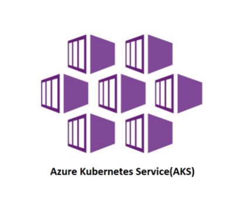
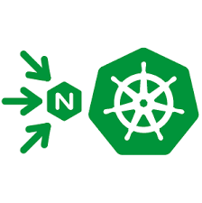
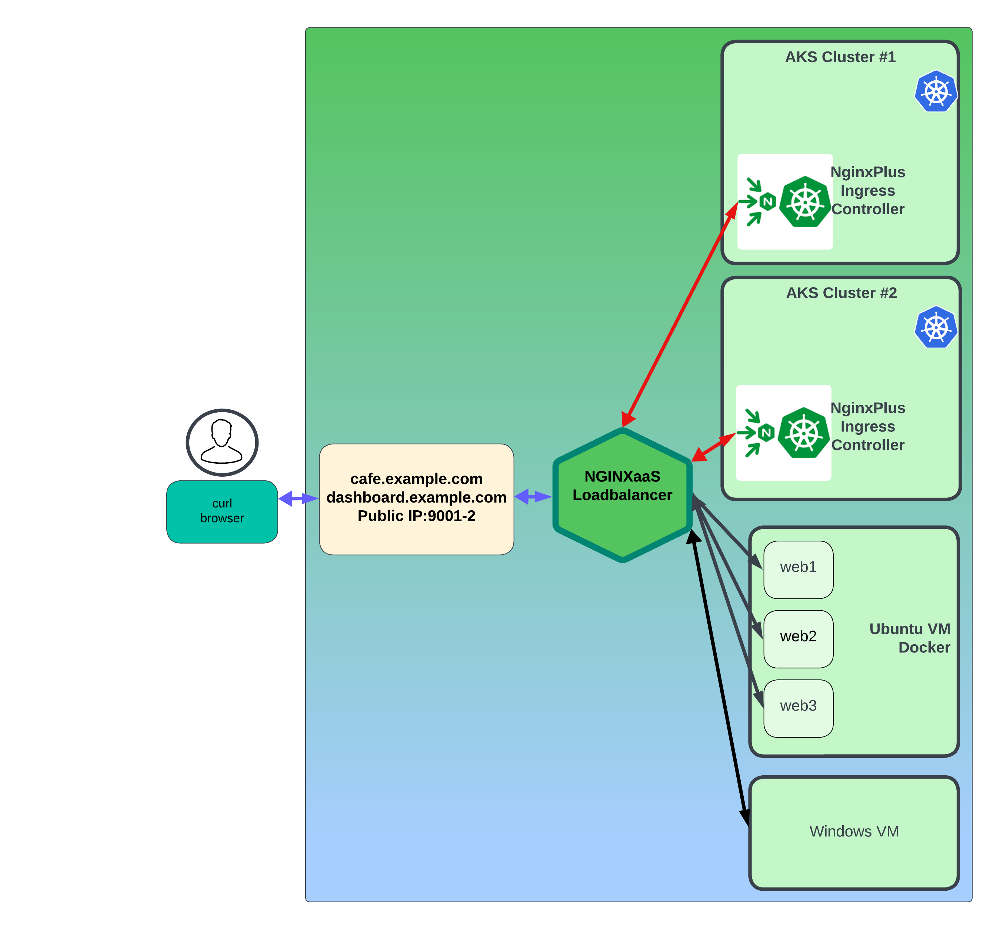
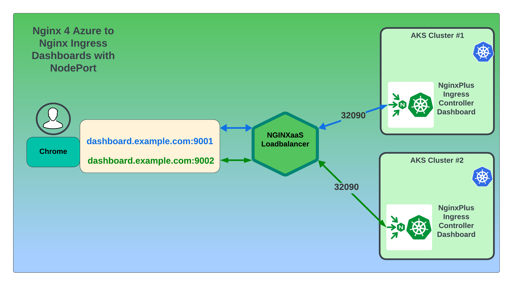

#  AKS / Nginx Ingress Controller Deployment 

## Introduction

In this lab, you will expand your test environment by adding AKS, Azure Kubernetes Resources. You will create 2 new AKS Kubernetes clusters, and deploy NGINX Plus Ingress Controller.  This will be your testing platform for Nginx for Azure with AKS - deploying and managing applications, networking, and using both NGINX for Azure and NGINX Plus Ingress features to control traffic to your Modern Apps running in the clusters.  You will use a Kubernetes Service to access the Nginx Plus Ingress Dashboard, and expose it with Nginx for Azure, so you can see in real time what is happening inside both AKS clusters.

<br/>

NGINX aaS | AKS | Nginx Plus Ingress
:---------------------:|:---------------------:|:---------------------:
 | |

<br/>

## Learning Objectives

- Deploy 2 Kubernetes clusters using Azure CLI.
- Test and verify proper operation of both AKS clusters.
- Deploy the NGINX Plus Ingress Controller image.
- Deploy the Nginx Plus Ingress Dashboard.
- Expose the Nginx Ingress Dashboards with Nginx for Azure.

## Prerequisites

- You must have Azure Networking configured for this Workshop
- You must have Azure CLI tool installed on your local system
- You must have Kubectl installed on your local system
- You must have Git installed on your local system
- You must Docker Desktop or Docker client tools installed on your local system
- You must have your Nginx for Azure instance deployed and running
- Familiarity with Azure Resource types - Resource Groups, VMs, NSG, AKS, etc 
- Familiarity with basic Linux commands and commandline tools
- Familiarity with Kubernetes / AKS concepts and commands
- Familiarity with basic HTTP protocol
- Familiarity with Ingress Controller concepts
- See `Lab0` for instructions on setting up your system for this Workshop

<br/>

Your new Lab Diagram will look similar to this:



<br/>

## What is Azure AKS?

Azure Kubernetes Service is a service provided for Kubernetes on Azure infrastructure. The Kubernetes resources will be fully managed by Microsoft Azure, which offloads the burden of maintaining the infrastructure, and makes sure these resources are highly available and reliable at all times.  This is often a good choice for Modern Applications running as containers, and using Kubernetes Services to control them.

## Workshop and Azure naming convention suggestions

1. Check out the available [Azure Regions](https://learn.microsoft.com/en-us/azure/reliability/availability-zones-overview).<br/>
Decide on a [Datacenter region](https://azure.microsoft.com/en-us/explore/global-infrastructure/geographies/#geographies) that is closest to you and meets your needs. <br/>
Check out the [Azure latency test](https://www.azurespeed.com/Azure/Latency)! You will need to choose one and provide a region name in the following steps.

2. Consider a naming and tagging convention to organize your Azure assets to support user identification of shared subscriptions.  If you share a subscription with others, it's important to minimize duplication and identify owners of Resources in Azure.  (Or you will get nag mail for excessive charges from the boss.)

**Example:** 

You are located in Chicago, Illinois.  You choose the Datacenter region `Central US`.  These labs will use the following naming convention:

```bash
n4a-<asset_type>

```

So for the 2 AKS Clusters you will deploy in `Central US`, and
will name your Clusters: 

- `n4a-aks1`
- `n4a-aks2`

- You will also use your name or email for the Owner tag, like  `owner=s.dutta` to further identify your assets in a shared Azure account.

## Deploy 1st Kubernetes Cluster with Azure CLI

1. With the use of Azure CLI, you can deploy a production-ready AKS cluster with some options using a single command (**This will take a while**).

First, you need to set multiple ENVIRONMENT variables, which are passed to the Azure CLI, to create the objects required for the Workshop.  Set your Environment variables as follows:

   ```bash
    # Set Variables to match your Workshop settings
    MY_RESOURCEGROUP=s.dutta
    MY_LOCATION=centralus
    MY_AKS=n4a-aks1
    MY_NAME=s.dutta
    K8S_VERSION=1.27
    MY_SUBNET=$(az network vnet subnet show -g $MY_RESOURCEGROUP -n aks1-subnet --vnet-name n4a-vnet --query id -o tsv)

    ```
    
    ```bash
    # Create First AKS Cluster
    az aks create \
        --resource-group $MY_RESOURCEGROUP \
        --name $MY_AKS \
        --location $MY_LOCATION \
        --node-count 3 \
        --node-vm-size Standard_B2s \
        --kubernetes-version $K8S_VERSION \
        --tags owner=$MY_NAME \
        --vnet-subnet-id=$MY_SUBNET
        --enable-addons monitoring \
        --generate-ssh-keys

   ```
   >**Note**: 
   >At the time of this writing, 1.27 is the latest kubernetes version available in Azure AKS. 


2. **(Optional Step)**: If kubectl ultility tool is not installed in your workstation then you can install `kubectl` locally using below command:
   ```bash
   az aks install-cli
   ```

3. Configure `kubectl` to connect to your Azure AKS cluster using below command.
   ```bash
   MY_RESOURCEGROUP=s.dutta
   MY_AKS=n4a-aks1

   az aks get-credentials --resource-group $MY_RESOURCEGROUP --name $MY_AKS

   ```

## Deploy 2nd Kubernetes Cluster with script in Azure Bash

< TODO - create and test script for AKS2 >

1. Open a second Terminal, log into to Azure, and repeat the Steps above for the Second AKS Cluster, this one has 4 nodes and a different name, `n4a-aks2`.

   ```bash
    # Set Variables to match your Workshop settings
    MY_RESOURCEGROUP=s.dutta
    MY_LOCATION=centralus
    MY_AKS=n4a-aks2                # Change name 
    MY_NAME=s.dutta
    K8S_VERSION=1.27
    MY_SUBNET=$(az network vnet subnet show -g $MY_RESOURCEGROUP -n aks2-subnet --vnet-name n4a-vnet --query id -o tsv)

    ```

    ### Create Second AKS Cluster

    ```bash
    az aks create \
        --resource-group $MY_RESOURCEGROUP \
        --name $MY_AKS \
        --location $MY_LOCATION \
        --node-count 4 \
        --node-vm-size Standard_B2s \
        --kubernetes-version $K8S_VERSION \
        --tags owner=$MY_NAME \
        --vnet-subnet-id=$MY_SUBNET \
        --network-plugin option: azure \
        --enable-addons monitoring \
        --generate-ssh-keys
   ```

< TODO - check that both Kube Contexts are created >

1. **Managing Both Clusters:** As you are managing multiple Kubernetes clusters, you can easily change between Kubectl Config Contexts using the `kubectl config use-context` command:
   
   ```bash
   # Get a list of kubernetes contexts in your local .kube config file:
   kubectl config get-contexts

   ```

   ```bash
   ###Sample Output###
   CURRENT   NAME                          CLUSTER           AUTHINFO                         NAMESPACE
*         n4a-aks1                   n4a-aks1        clusterUser_s.dutta-workshop_n4a-aks1
          n4a-aks2                   n4a-aks2        clusterUser_s.dutta-workshop_n4a-aks2
          kubernetes-admin@kubernetes   kubernetes        kubernetes-admin
          rancher-desktop               rancher-desktop   rancher-desktop

   ```
   ```bash 
   # Set context
   kubectl config use-context n4a-aks1

   ```
   ```bash
   # Check which context you are currently targeting
   kubectl config current-context

   ```
   ```bash
   ###Sample Output###
   n4a-aks1

   ```
   ```bash
   # Allows you to switch between contexts using their name
   kubectl config use-context <CONTEXT_NAME>

   ```

1. Test if you are able to access your Second AKS2 cluster.
   ```bash
   # Get Nodes in the target kubernetes cluster
   kubectl get nodes
   ```
   ```bash
   ###Sample Output###
   NAME                                STATUS   ROLES   AGE     VERSION
   aks-nodepool1-76910942-vmss000000   Ready    agent   9m23s   v1.27.3
   aks-nodepool1-76910942-vmss000001   Ready    agent   9m32s   v1.27.3
   aks-nodepool1-76910942-vmss000002   Ready    agent   9m30s   v1.27.3    
   ```

1. Finally to stop a running AKS cluster use this command.
   ```bash
   MY_RESOURCEGROUP=s.dutta
   MY_AKS=n4a-aks1

   az aks stop --resource-group $MY_RESOURCEGROUP --name $MY_AKS
   ```

1. To start an already deployed AKS cluster use this command.
   ```bash
   MY_RESOURCEGROUP=s.dutta
   MY_AKS=n4a-aks1

   az aks start --resource-group $MY_RESOURCEGROUP --name $MY_AKS
   ```

<br/>

## Installing NGINX Plus Ingress Controller


<br/>

1. For NGINX Plus Ingress Controller, you must have a software subscription license – download the NGINX Plus Ingress Controller license JWT Token file (`nginx-repo.jwt`) from your account on [MyF5](https://my.f5.com/). 

Optional:  If you do not have a license, you can request a 30-day Trial key from [here](https://www.nginx.com/free-trial-connectivity-stack-kubernetes/).  An email will arrive in your Inbox in a few minutes, with links to download the license files.

>However, in this Workshop, a Trial License will be provided to you, so you can pull and run the Nginx Plus Commercial version of the Ingress Controller.  This is NOT the same Ingress Controller provided by the Kubernetes Community.  (If you are unsure which Ingress Controller you are using in your other Kubernetes environments, you can find a link to the Blog from Nginx that explains the differences).
   
1. Once your Workshop Instructor has provide the JWT file, follow these instructions to create a Kubernetes Secret named `regcred`, of type `docker-registry`.  You will need to create the Secret in both of your AKS clusters. 

1. Copy the `nginx-repo.jwt` file provided in the newly created directory.

1. Export the contents of the JWT file to an environment variable.

```bash
export JWT=$(cat nginx-repo.jwt)

```
```bash
# Check $JWT
echo $JWT

```

1. Create a Kubernetes `docker-registry` Secret on your First  cluster, using the JWT token as the username and none for password (as the password is not used).  The name of the docker server is `private-registry.nginx.com`.  Replace the <docker-username> parameter with the contents of the `nginx-repo.jwt` file:

    ```bash
    kubectl config use-context n4a-aks1
    kubectl create secret docker-registry regcred --docker-server=private-registry.nginx.com --docker-username=$JWT --docker-password=none -n nginx-ingress
    ```
    
   > It is important that the --docker-username=<JWT Token> contains the contents of the token and is not pointing to the token itself. Ensure that when you copy the contents of the JWT token, there are no additional characters or extra whitespaces. This can invalidate the token and cause 401 errors when trying to authenticate to the registry.

1. Confirm the Secret was created successfully by running:

```bash
kubectl get secret regcred -n nginx-ingress -o yaml

```
```bash
# Sample output
apiVersion: v1
data:
  .dockerconfigjson: TokenHere
  ...snipped
kind: Secret
metadata:
  creationTimestamp: "2024-04-16T19:21:09Z"
  name: regcred
  namespace: nginx-ingress
  resourceVersion: "5838852"
  uid: 30c60523-6b89-41b3-84d8-d22ec60d30a5
type: kubernetes.io/dockerconfigjson

```

1. Repeat the previous step in your Second AKS Cluster, n4a-aks2:  

1. Create a Docker Config Secret in your Second cluster.  Replace the <docker-username> parameter with the contents of the `nginx-repo.jwt` file:

    ```bash
    kubectl config use-context n4a-aks2
    kubectl create secret docker-registry regcred --docker-server=private-registry.nginx.com --docker-username=$JWT --docker-password=none -n nginx-ingress
    ```

1. Confirm the Secret was created successfully by running:

```bash
kubectl get secret regcred -n nginx-ingress -o yaml

```
```bash
# Sample output
apiVersion: v1
data:
  .dockerconfigjson: Token Here
  ...snipped
kind: Secret
metadata:
  creationTimestamp: "2024-04-16T23:16:07Z"
  name: regcred
  namespace: nginx-ingress
  resourceVersion: "5921203"
  uid: a3e36152-62ce-47b0-bc22-3644bcd9aa3d
type: kubernetes.io/dockerconfigjson

```

1. Once you are sure you have correctly created the Secrets on both Clusters, switch Context back to `n4a-aks1`, and you can continue with the next step.

<br/>

## Deploy Nginx Plus Ingress Controller to both clusters

In this section, you will be installing NGINX Plus Ingress Controller in both AKS clusters using manifest files. You will be then checking and verifying the Ingress Controller is running. 

<br/>

1. Make sure your AKS cluster is running. Check the Nodes using below command. 
   ```bash
   kubectl get nodes

   ```
   ```bash
   #Sample output
   NAME                                STATUS   ROLES   AGE   VERSION
   aks-agentpool-25373057-vmss00000k   Ready    agent   21h   v1.27.9
   aks-agentpool-25373057-vmss00000l   Ready    agent   21h   v1.27.9
   aks-userpool-76919110-vmss000008    Ready    agent   21h   v1.27.9
   aks-userpool-76919110-vmss000009    Ready    agent   21h   v1.27.9
   ```

1. Git Clone the Nginx Ingress Controller repo and navigate into the /deployments folder to make it your working directory:
   ```bash
   git clone https://github.com/nginxinc/kubernetes-ingress.git --branch v3.3.2
   cd kubernetes-ingress/deployments

   ```
   >**Note**: At the time of this writing `3.3.2` is the latest NGINX Plus Ingress version that is available. Please feel free to use the latest version of NGINX Plus Ingress Controller. Look into [references](#references) for the latest Ingress images.

1. Create a namespace and a service account for the Ingress Controller:
    ```bash
    kubectl apply -f common/ns-and-sa.yaml

    ```
1. Create a cluster role and cluster role binding for the service account:
    ```bash
    kubectl apply -f rbac/rbac.yaml

    ```

1. Create Common Resources:
     1. Create a secret with TLS certificate and a key for the default server in NGINX.
        ```bash
        kubectl apply -f ../examples/shared-examples/default-server-secret/default-server-secret.yaml

        ```
     2. Create a config map for customizing NGINX configuration.
        ```bash
        kubectl apply -f common/nginx-config.yaml

        ```
     3. Create an IngressClass resource. 
   
        ```bash
        kubectl apply -f common/ingress-class.yaml

        ```

1. Create Nginx Custom Resource Definitions
    1. Create custom resource definitions for VirtualServer and VirtualServerRoute, TransportServer and Policy resources:
        ```bash
        kubectl apply -f common/crds/k8s.nginx.org_virtualservers.yaml
        kubectl apply -f common/crds/k8s.nginx.org_virtualserverroutes.yaml
        kubectl apply -f common/crds/k8s.nginx.org_transportservers.yaml
        kubectl apply -f common/crds/k8s.nginx.org_policies.yaml

        ```
   
    2. Create a custom resource for GlobalConfiguration resource:
        ```bash
        kubectl apply -f common/crds/k8s.nginx.org_globalconfigurations.yaml

        ```
1. Deploy the Ingress Controller as a Deployment:

   You will find the sample deployment file (`nginx-plus-ingress.yaml`) in the `deployment` sub-directory within your present working directory.  *Do not use this file, use the one provided in the `/lab3 folder`.*

   You will use the Manifest provided in the /lab3 folder, which has the follow changes highlighted below:

   - Change Image Pull to Nginx Private Repo with Docker Secret
   - Enable Prometheus
   - Add port and name for dashboard
   - Change Dashboard Port to 9000
   - Allow all IPs to access dashboard
   - Make use of default TLS certificate
   - Enable Global Configuration for Transport Server
   
1. Navigate back to the Workshop's `labs` directory 
    ```bash
    cd ../../labs

    ```
  
    Inspect the `lab3/nginx-plus-ingress.yaml` looking at these changes:

     - On lines #16-19, we have enabled `Prometheus` related annotations.
     - On Lines #22-23, the ImagePullSecret is set to the Docker Config Secret `regcred` you created previously.
     - On line #36, the `nginx-plus-ingress:3.3.2` placeholder is changed to the Nginx Private Registry image.
     - On lines #52-53, we have added TCP port 9000 for the Plus Dashboard.
     - On line #97, uncomment to make use of default TLS secret
     - On lines #98-99, we have enabled the Dashboard and set the IP access controls to the Dashboard.
     - On line #108, we have enabled Prometheus to collect metrics from the NGINX Plus stats API.
     - On line #111, uncomment to enable the use of Global Configurations.

    Now deploy NGINX Ingress Controller as a Deployment using your updated manifest file.
    ```bash
    kubectl apply -f lab3/nginx-plus-ingress.yaml

    ```
    ```bash
    #Sample output
    deployment.apps/nginx-ingress created

    ```

### Check your NGINX Ingress Controller

1. Verify the NGINX Plus Ingress controller is up and running correctly in the Kubernetes cluster:

   ```bash
   kubectl get pods -n nginx-ingress
   ```

   ```bash
   ###Sample Output###
   NAME                            READY   STATUS    RESTARTS   AGE
   nginx-ingress-5764ddfd78-ldqcs   1/1     Running   0          17s
   ```

   **Note**: You must use the `kubectl` "`-n`", namespace switch, followed by namespace name, to see pods that are not in the default namespace.

2. Instead of remembering the unique pod name, `nginx-ingress-xxxxxx-yyyyy`, we can store the Ingress Controller pod name into the `$NIC` variable to be used throughout the lab.

   >**Note:** This variable is stored for the duration of the Terminal session, and so if you close the Terminal it will be lost. At any time you can refer back to this step to create the `$NIC` variable again.

   ```bash
   export NIC=$(kubectl get pods -n nginx-ingress -o jsonpath='{.items[0].metadata.name}')

   ```

   You can also create a bash alias, that makes this easy.

   ```bash
   alias nic='export NIC=$(kubectl get pods -n nginx-ingress -o jsonpath={.items[0].metadata.name})'

   ```
   
   Verify the variable is set correctly.
   ```bash
   echo $NIC

   ```
   **Note:** If this command doesn't show the name of the pod then run the previous command again.

### Test Access to the Nginx Plus Ingress Dashboard

Just a quick test, is your Nginx Plus Ingress Controller running, and can you see the Dashboard?  Let's try it:

1. Using Kubernetes Port-Forward, connect to the $NIC pod:

   ```bash
   kubectl port-forward $NIC -n nginx-ingress 9000:9000

   ```

1. Open your browser to http://localhost:9000/dashboard.html.

   You should see the Nginx Plus Dashboard.  It should have the `HTTP Zone` dashboard.example.com - these are your VirtualServers / Hostnames.  If you check the `HTTP Upstreams` tab, it should have some Pods. There is not much to see for now, but you will be adding Pods/Services to your clusters, and configuring resources to Nginx Ingress in the next few steps and Labs.

Type Ctrl+C to stop the Port-Forward when you are finished.

## Deploy the NGINX Plus Ingress Controller Dashboard

Next you are going to use the NGINX Plus Dashboard to monitor both NGINX Ingress Controller as well as your backend applications as Upstreams. This is a great Plus feature to allow you to watch and triage any potential issues with NGINX Plus Ingress controller as well as any issues with your backend applications in real time.

You will deploy a `Service` and a `VirtualServer` resource to provide access to the NGINX Plus Dashboard for live monitoring.  NGINX Ingress [`VirtualServer`](https://docs.nginx.com/nginx-ingress-controller/configuration/virtualserver-and-virtualserverroute-resources/) is a [Custom Resource Definition (CRD)](https://kubernetes.io/docs/concepts/extend-kubernetes/api-extension/custom-resources/) used by NGINX to configure NGINX Server and Location blocks for NGINX configurations.

1. In the `lab3` folder, apply the `dashboard-vs.yaml` file to deploy a `Service` and a `VirtualServer` resource to provide access to the NGINX Plus Dashboard for live monitoring:

    ```bash
    kubectl apply -f lab3/dashboard-vs.yaml

    ```
    ```bash
    ###Sample output###
    service/dashboard-svc created
    virtualserver.k8s.nginx.org/dashboard-vs created

    ```

1. Inspect the `lab3/dashboard-vs` manifest.  This will create an `nginx-ingress` Service and a VirtualServer that will be used to expose the Nginx Ingress Controller's Plus Dashboard outside the cluster, so you can see what Nginx Ingress Controller is doing.

```bash
kubectl apply -f lab3/dashboard-vs.yaml

```

1. Verify the Service and Virtual Server were created are Valid:

```bash
kubectl get svc,vs -n nginx-ingress

```

```bash
#Sample output
NAME                             TYPE        CLUSTER-IP    EXTERNAL-IP   PORT(S)                                                                   AGE
service/dashboard-svc            ClusterIP   10.0.58.119   <none>        9000/TCP                                                                  21d

NAME                                       STATE   HOST                         IP    PORTS   AGE
virtualserver.k8s.nginx.org/dashboard-vs   Valid   dashboard.example.com                 21d

```

### Deploy the NGINX Plus Ingress Controller Dashboard to AKS2

1. Change your `Kube Context` to your second AKS cluster.  Deploy the same `dashboard-vs.yaml` Manifest.  Check the Services and VirtualServer are Valid.  Then Port-Forward and check access to the Dashboard using the steps as above.  You should find the exact same thing, the Nginx Ingress Plus Dashboard running, with Zones and Upstreams similar.  However, the IP addresses of the Upstreams `WILL` be different between the clusters, because each cluster assigns different IPs to the Pods.  

1.  **Optional Exercise:**  If you want to see both NIC Dashboards at the same time, you can use 2 Terminals, each with a different Kube Context and different Port-Forward commands.  In Terminal#1, try port-forward 9001:9000 for cluster1, and in Terminal#2, try port-forward 9002:9000 for cluster2.  Then open two browser windows side by side for comparison, first one at http://localhost:9001/dashboard.html, second one at http://localhost:9002/dashboard.html.

## Expose your Nginx Ingress Controller with NodePort

1. Inspect the `lab3/nodeport-static.yaml` manifest.  This is a NodePort Service defintion that will open high-numbered ports on the Kubernetes nodes, to expose several Services that are running on the Nginx Ingress.  The NodePorts are intentionally defined as static, because you will be using these port numbers with Nginx 4 Azure, and you don't want them to change.  (Note: If you use ephemeral NodePorts, you see **HTTP 502 Errors** when they change!) We are using the following table to expose different Services on different Ports:

Service Port | External NodePort | Name
|:--------:|:------:|:-------:|
80 | 32080 | http
443 | 32443 | https
9000 | 32090 | dashboard


1. Deploy a NodePort Service to expose the Nginx Ingress Controller outside the cluster.

   ```bash
   kubectl apply -f lab3/nodeport-static.yaml

   ```

1. Verify the NodePort Service was created:

   ```bash
   kubectl get svc nginx-ingress -n nginx-ingress

   ```

   ```bash
   #Sample output
   NAME            TYPE       CLUSTER-IP    EXTERNAL-IP   PORT(S)                                                                   AGE
   nginx-ingress   NodePort   10.0.169.30   <none>        80:32080/TCP,443:32443/TCP,9000:32090/TCP   2h

   ```

   Note there are THREE NodePorts open to the Ingress Controller - for port 80 HTTP traffic, port 443 for HTTPS traffic, and port 9000 for the Plus Dashboard.

**QUESTION?** You are probably asking, why not use the AKS/Azure Loadbalancer Service to expose the Ingress Controllers?  It will automatically give you an External-IP, right? You can certainly do that.  But if you do, you would need 2 additional Public external IP addresses, one for each NIC that you have to manage.  Instead, you will be using your Nginx for Azure instance for your Public External-IP, thereby `simplifying your Architecture`, running on Nginx!  Nginx will use Host / Port / Path-based routing to forward the requests to the appropriate backends, including VMs, Docker containers, both AKS clusters, Ingress Controllers, Services, and Pods.  You will do ALL of this in the next few labs.

## Expose the Nginx Ingress Dashboards with Nginx for Azure

Being able to see your Nginx Ingress Dashboards remotely will be a big help in observing your traffic metrics and patterns within each AKS cluster.  It will require only 2 Nginx for Azure configuration items for each cluster - a new Nginx Server block and a new Upstream block.

This will be the logical network diagram for accessing the Nginx Ingress Dashboards.




1. First, create the Upstream server block for AKS cluster #1.  You will need the AKS1 Node Names from the Node Pool.  Make sure your Kube Context is n4a-aks1:

   ```bash
   kubeclt config use-context n4a-aks1
   kubectl get nodes

   ```
   ```bash
   #Sample output
   NAME                                STATUS   ROLES   AGE   VERSION
   aks-userpool-76919110-vmss000008    Ready    agent   26h   v1.27.9
   aks-userpool-76919110-vmss000009    Ready    agent   27h   v1.27.9

   ```

   Use the 2 Node Names as your Upstream Servers, and add `:32090` as your port number.  This matches the NodePort-Static that you configured previously.

   Using the Nginx 4 Azure Configuration Console in Azure Portal, create a new Nginx config file called `/etc/nginx/conf.d/nic1-dashboard-upstreams.conf`.  You can use the example provided, just edit the Node Names to match your cluster:

   ```nginx
   # Nginx 4 Azure to NIC, AKS Node for Upstreams
   # Chris Akker, Shouvik Dutta, Adam Currier - Mar 2024
   #
   # nginx ingress dashboard
   #
   upstream nic1_dashboard {
   zone nic1_dashboard 256k;
   
   # from nginx-ingress NodePort Service / aks1 Node IPs
   server aks-userpool-76919110-vmss000001:32090;    #aks1 node1:
   server aks-userpool-76919110-vmss000002:32090;    #aks1 node2:

   keepalive 8;

   }

   ```

   Submit your Nginx for Azure configuration.

1. Repeat the previous Step, but for your Second AKS Cluster:

   Using the Nginx4Azure Console, create a new Nginx config file called `/etc/nginx/conf.d/nic2-dashboard-upstreams.conf`.  You can use the example provided, just edit the Node Names to match your cluster:

   ```nginx
   # Nginx 4 Azure to NIC, AKS Node for Upstreams
   # Chris Akker, Shouvik Dutta, Adam Currier - Mar 2024
   #
   # nginx ingress dashboard
   #
   upstream nic2_dashboard {
   zone nic2_dashboard 256k;
   
   # from nginx-ingress NodePort Service / aks Node IPs
   server aks-nodepool1-19485366-vmss000004:32090;    #aks2 node1:
   server aks-nodepool1-19485366-vmss000005:32090;    #aks2 node2:
   server aks-nodepool1-19485366-vmss000006:32090;    #aks2 node3:     

   keepalive 8;

   }

   ```

   >Notice, there are 2 upstreams for Cluster1, and 3 upstreams for Cluster2, matching the Node count for each cluster.  This was intentional so you can see the differences.

1. Again using the N4A Configuration Console, create a new file, called `/etc/nginx/conf.d/nic1-dashboard.conf`, using the example provided, just copy/paste.  This is the new Nginx Server block, with a hostname, port number 9001, and proxy_pass directive needed to route requests for the Dashboard to AKS Cluster1:NodePort where the Ingress Dashboard is listening:

   ```nginx
   # N4A NIC Dashboard config for AKS1
   #
   server {
      listen 9001;
      server_name dashboard.example.com;
      access_log off;
      
      location = /dashboard.html {
      #return 200 "You have reached /nic1dashboard.";

      proxy_pass http://nic1_dashboard;

      }

      location /api/ {
      
      proxy_pass http://nic1_dashboard;
      }

   }

   ```

   Submit your Nginx for Azure configuration.

1. Repeat the previous step, for the NIC Dashboard in AKS2:

   Using the N4A Configuration Console, create a new file, called `/etc/nginx/conf.d/nic2-dashboard.conf`, using the example provided, just copy/paste.  This is the Second new Nginx Server block, with the same hostname, but using `port number 9002`, and proxy_pass directives needed to route requests for the Dashboard to AKS Cluster2:NodePort where the Ingress Dashboard is listening:

   ```nginx
   # N4A NIC Dashboard config for AKS2
   #
   server {
      listen 9002;
      server_name dashboard.example.com;
      access_log off;
      
      location = /dashboard.html {
      #return 200 "You have reached /nic2dashboard.";

      proxy_pass http://nic2_dashboard;

      }

      location /api/ {
      
      proxy_pass http://nic2_dashboard;
      }

   }

   ```

   Submit your Nginx for Azure configuration.

   You have just configured `Port-based routing with Nginx 4 Azure`, sending traffic on port 9001 to AKS1 NIC Dashboard, and port 9002 to send traffic to AKS2 NIC Dashboard.

1. Using the Azure CLI, add ports 9001-9002 to the NSG for your n4a-vnet:

   ```bash
   < TODO - update NSG here >

   ```

   >**Security Warning!** These Nginx Ingress Dashboards are now exposed to the open Internet, with only your Network Security Group for protection.  This is probably fine for a few hours during the Workshop, but do NOT do this in Production, use appropriate Security measures to protect them (not covered in this Workshop).

1. Update your local system DNS `/etc/hosts` file, to add `dashboard.example.com`, using the same public IP of your N4A instance.

   ```bash
   cat /etc/hosts

   127.0.0.1 localhost
   ...
   # Nginx for Azure testing
   20.3.16.67 cafe.example.com dashboard.example.com
   ...

   ```

1. Use Chrome or other browser to test remote access to your NIC Dashboards.  Create a new Tab or Window for each Dashboard.

   http://dashboard.example.com:9001/dashboard.html   > AKS1-NIC

   http://dashboard.example.com:9002/dashboard.html   > AKS2-NIC

   Bookmark these pages, and leave both of these browser Tabs or Windows open during the Workshop, you will be using them often in the next Lab Exercises, watching what Nginx Ingress is doing in each Cluster.

   If you are not familiar with the Nginx Plus Dashboard, you can find a link to more information in the References Section.

**This completes the Lab.** 

<br/>

## References: 

- [Deploy AKS cluster using Azure CLI](https://learn.microsoft.com/en-us/azure/aks/learn/quick-kubernetes-deploy-cli)
- [Azure CLI command list for AKS](https://learn.microsoft.com/en-us/cli/azure/aks?view=azure-cli-latest)
- [Installing NGINX Plus Ingress Controller Image](https://docs.nginx.com/nginx-ingress-controller/installation/nic-images/using-the-jwt-token-docker-secret/)
- [Latest NGINX Plus Ingress Images](https://docs.nginx.com/nginx-ingress-controller/technical-specifications/#images-with-nginx-plus)
- [Nginx Live Monitoring Dashboard](https://docs.nginx.com/nginx/admin-guide/monitoring/live-activity-monitoring/)
- [Nginx Ingress Controller Product](https://docs.nginx.com/nginx-ingress-controller/)
- [Nginx Ingress Installation - the REAL Nginx](https://docs.nginx.com/nginx-ingress-controller/installation/installing-nic/installation-with-manifests/)
- [Nginx Blog - Which Ingress AM I RUNNING?](https://www.nginx.com/blog/guide-to-choosing-ingress-controller-part-1-identify-requirements/)

<br/>


### Authors

- Chris Akker - Solutions Architect - Community and Alliances @ F5, Inc.
- Shouvik Dutta - Solutions Architect - Community and Alliances @ F5, Inc.

-------------

Navigate to ([Lab4](../lab4/readme.md) | [LabX](../labX/readme.md))
