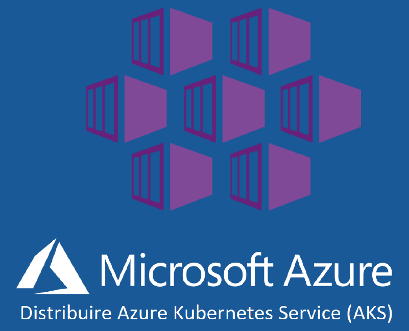

# AKS / Nginx Ingress Controller Deployment

## Introduction

In this lab, you will expand your test environment by adding AKS, Azure Kubernetes Services. You will create a new AKS Kubernetes cluster, and deploy NGINX Plus Ingress Controller.  This will be your testing platform for Nginx for Azure with AKS - deploying and managing applications, networking, and using both NGINX for Azure and NGINX Plus Ingress features to control traffic to your Modern Apps running in the cluster.  You will use a Kubernetes Service to access the Nginx Plus Ingress Dashboard, and expose it with Nginx for Azure, so you can see in real time what is happening inside the AKS cluster.  *You can optionally create a second AKS cluster for testing `Multi Cluster Load Balancing`*.

<br/>

NGINXaaS | AKS | Nginx Plus Ingress
:---------------------:|:---------------------:|:---------------------:
 | |

<br/>

## Learning Objectives

- Understand what is Azure AKS?
- Deploy an Azure AKS Kubernetes cluster using Azure CLI.
- Test and verify proper operation of the AKS cluster.
- Deploy the NGINX Plus Ingress Controller image.
- Deploy the Nginx Plus Ingress Dashboard.
- Expose the Nginx Ingress Dashboard with Nginx for Azure.
- Optional: Create second AKS Cluster and deploy Nginx Ingress.


## Automation script to skip this lab

This lab focusses on building out two AKS Kubernetes cluster in your Azure environment using Azure CLI. Once the cluster are built, this lab guides you how to install NGINX Plus Ingress Controller and expose Nginx Plus Ingress Dashboard. If you are familiar with those concepts then you can skip through this lab by running the below commands which would automate all the lab steps within this lab.

- To deploy NGINX Plus Ingress Controller, you must have a software subscription license – download the NGINX Plus Ingress Controller license JWT Token file (`nginx-repo.jwt`) from your account on [MyF5](https://my.f5.com/).

   > **NOTE:**  If you do not have a license, you can request a 30-day Trial key from [here](https://www.nginx.com/free-trial-connectivity-stack-kubernetes/).  
   An email will arrive in your Inbox in a few minutes, with links to download the license files.

   However, for this workshop, **a Trial License will be provided to you**, so you can pull and run the Nginx Plus Commercial version of the Ingress Controller.  This is NOT the same Ingress Controller provided by the Kubernetes Community.  (If you are unsure which Ingress Controller you are using in your other Kubernetes environments, you can find a link to the Blog from Nginx that explains the differences in the References Section).

- Once your Workshop Instructor has provided the JWT file, copy the `nginx-repo.jwt` file provided in the `/labs/lab3` directory within your cloned workshop repository.

- In your terminal, navigate back to the cloned workshop repository directory (`nginx-azure-workshops`)  and run below command

    ```bash
    ./auto-lab.sh -l 3 
    ```

- Once the script has completed its execution, you can skip rest of this lab guide and move to the next lab. The testing of all the resources that the script automatically creates would be done in later labs.

- For additional information on the script you can run the same command with `-h` flag as shown below

    ```bash
    ./auto-lab.sh -h
    ```

## Prerequisites

- You must have Azure Networking configured for this Workshop
- You must have Azure CLI installed on your local system
- You must have Kubectl installed on your local system
- You must have Git installed on your local system
- You must Docker Desktop or Docker client tools installed on your local system
- You must have your Nginx for Azure instance deployed and running
- Familiarity with Azure Resource types - Resource Groups, VMs, NSG, AKS, etc
- Familiarity with basic Linux commands and commandline tools
- Familiarity with Kubernetes / AKS concepts and commands
- Familiarity with basic HTTP protocol
- Familiarity with Ingress Controller concepts
- See `Lab0` for instructions on setting up your system for this Workshop

<br/>

Your new Lab Diagram will look similar to this:


<br/>

### What is Azure AKS?

Azure Kubernetes Service is a service provided for Kubernetes on Azure infrastructure. The Kubernetes resources will be fully managed by Microsoft Azure, which offloads the burden of maintaining the infrastructure, and makes sure these resources are highly available and reliable at all times.  This is often a good choice for Modern Applications running as containers, and using Kubernetes Services to control them.

### Deploy Azure AKS Kubernetes Cluster with Azure CLI


With the use of single Azure CLI command, you will deploy a production-ready AKS cluster with some additional options. (**This will take a while**).

1. First, initialise the Environment variables based on your setup, which are passed to the Azure CLI command as shown below:

   ```bash
    ## Set environment variables
    export MY_RESOURCEGROUP=s.dutta-workshop
    export MY_AKS=n4a-aks1
    export MY_NAME=s.dutta
    export K8S_VERSION=1.27
    export MY_SUBNET=$(az network vnet subnet show -g $MY_RESOURCEGROUP -n aks1-subnet --vnet-name n4a-vnet --query id -o tsv)
    ```

    ```bash
    # Create First AKS Cluster
    az aks create \
        --resource-group $MY_RESOURCEGROUP \
        --name $MY_AKS \
        --node-count 3 \
        --node-vm-size Standard_B2s \
        --kubernetes-version $K8S_VERSION \
        --tags owner=$MY_NAME \
        --vnet-subnet-id=$MY_SUBNET \
        --enable-addons monitoring \
        --generate-ssh-keys
    ```

   >**Note**: At the time of this writing, 1.27 is the latest kubernetes long-term supported (LTS) version available in Azure AKS.

1. **(Optional Step)**: If kubectl ultility tool is not installed in your workstation then you can install `kubectl` locally using below command:

   ```bash
   az aks install-cli
   ```

1. Configure `kubectl` to connect to your Azure AKS cluster using below command.

   ```bash
   az aks get-credentials \
        --resource-group $MY_RESOURCEGROUP \
        --name n4a-aks1
   ```

### Install NGINX Plus Ingress Controller to first cluster


In this section, you will be installing NGINX Plus Ingress Controller in your first AKS cluster using manifest files. You will be then checking and verifying the Ingress Controller is running.

1. Make sure your AKS cluster is running. Check the Nodes using below command.

   ```bash
   kubectl get nodes
   ```

   ```bash
   ##Sample Output##
   NAME                                STATUS   ROLES   AGE     VERSION
   aks-nodepool1-19055428-vmss000003   Ready    agent   3m52s   v1.27.9
   aks-nodepool1-19055428-vmss000004   Ready    agent   3m12s   v1.27.9
   aks-nodepool1-19055428-vmss000005   Ready    agent   3m37s   v1.27.9
   ```

1. Ensure that you are in the `/labs` directory of the workshop repository within your terminal.

    ```bash
    # Check your current directory
    pwd
    ```

    ```bash
    ##Sample Output##
    <Parent directory where you git cloned the workshop repo>/nginx-azure-workshops/labs
    ```

1. Git Clone the Nginx Ingress Controller repo and navigate into the `/deployments` directory to make it your working directory for installing NGINX Ingress Controller:

   ```bash
   git clone https://github.com/nginxinc/kubernetes-ingress.git --branch v3.3.2
   cd kubernetes-ingress/deployments
   ```

   >**Note**: At the time of this writing `3.3.2` is the latest NGINX Plus Ingress version that is available. Please feel free to use the latest version of NGINX Plus Ingress Controller. Look into [references](#references) for the latest Ingress images.

1. Create necessary Kubernetes objects needed for Ingress Controller:

   ```bash
   # Create namespace and a service account
   kubectl apply -f common/ns-and-sa.yaml

   # Create cluster role and cluster role bindings
   kubectl apply -f rbac/rbac.yaml

   # Create default server secret with TLS certificate and a key
   kubectl apply -f ../examples/shared-examples/default-server-secret/default-server-secret.yaml

   # Create config map
   kubectl apply -f common/nginx-config.yaml

   # Create IngressClass resource
   kubectl apply -f common/ingress-class.yaml

   # Create CRDs
   kubectl apply -f common/crds/k8s.nginx.org_virtualservers.yaml
   kubectl apply -f common/crds/k8s.nginx.org_virtualserverroutes.yaml
   kubectl apply -f common/crds/k8s.nginx.org_transportservers.yaml
   kubectl apply -f common/crds/k8s.nginx.org_policies.yaml
   
   # Create GlobalConfiguration resource
   kubectl apply -f common/crds/k8s.nginx.org_globalconfigurations.yaml
   ```

   ```bash
   ##Sample Output##
   namespace/nginx-ingress created
   serviceaccount/nginx-ingress created
   clusterrole.rbac.authorization.k8s.io/nginx-ingress created
   clusterrolebinding.rbac.authorization.k8s.io/nginx-ingress created
   secret/default-server-secret created
   configmap/nginx-config created
   ingressclass.networking.k8s.io/nginx created
   customresourcedefinition.apiextensions.k8s.io/virtualservers.k8s.nginx.org created
   customresourcedefinition.apiextensions.k8s.io/virtualserverroutes.k8s.nginx.org created
   customresourcedefinition.apiextensions.k8s.io/transportservers.k8s.nginx.org created
   customresourcedefinition.apiextensions.k8s.io/policies.k8s.nginx.org created
   customresourcedefinition.apiextensions.k8s.io/globalconfigurations.k8s.nginx.org created
   ```

1. To deploy NGINX Plus Ingress Controller, you must have a software subscription license – download the NGINX Plus Ingress Controller license JWT Token file (`nginx-repo.jwt`) from your account on [MyF5](https://my.f5.com/).

   **NOTE:**  If you do not have a license, you can request a 30-day Trial key from [here](https://www.nginx.com/free-trial-connectivity-stack-kubernetes/).  
   An email will arrive in your Inbox in a few minutes, with links to download the license files.

   However, for this workshop, **a Trial License will be provided to you**, so you can pull and run the Nginx Plus Commercial version of the Ingress Controller.  This is NOT the same Ingress Controller provided by the Kubernetes Community.  (If you are unsure which Ingress Controller you are using in your other Kubernetes environments, you can find a link to the Blog from Nginx that explains the differences in the References Section).

1. Once your Workshop Instructor has provided the JWT file, follow these instructions to create a Kubernetes Secret named `regcred`, of type `docker-registry`.

1. Copy the `nginx-repo.jwt` file provided in the `/labs/lab3` directory within your cloned workshop repository.

1. Navigate back to `/labs` directory and export the contents of the JWT file to an environment variable.

   ```bash
   cd <Parent directory where you git cloned the workshop repo>/nginx-azure-workshops/labs
   
   export JWT=$(cat lab3/nginx-repo.jwt)
   ```

   ```bash
   # Check $JWT
   echo $JWT
   ```

1. Create a Kubernetes `docker-registry` Secret on your First cluster, using the JWT token as the username and none for password (as the password is not used).  The name of the docker server is `private-registry.nginx.com`.  Notice how `$JWT` variable, which holds the contents of the `nginx-repo.jwt` file, is passed to  `docker-username` flag:

    ```bash
    kubectl create secret docker-registry regcred \
      --docker-server=private-registry.nginx.com \
      --docker-username=$JWT \
      --docker-password=none \
      -n nginx-ingress
    ```

   > **Note:** It is important to note that the --docker-username=<JWT Token> contains the contents of the token and is not pointing to the token itself. Ensure that when you copy the contents of the JWT token, there are no additional characters or extra whitespaces. This can invalidate the token and cause 401 errors when trying to authenticate to the registry.

1. Confirm the Secret was created successfully by running:

   ```bash
   kubectl get secret regcred -n nginx-ingress -o yaml
   ```

   ```bash
   ##Sample Output##
   apiVersion: v1
   data:
   .dockerconfigjson: <Your JWT Token>
   kind: Secret
   metadata:
   creationTimestamp: "2024-04-16T19:21:09Z"
   name: regcred
   namespace: nginx-ingress
   resourceVersion: "5838852"
   uid: 30c60523-6b89-41b3-84d8-d22ec60d30a5
   type: kubernetes.io/dockerconfigjson
   ```

1. Once you have created the `regcred` kubernetes secret, you are ready to deploy the Ingress Controller as a Deployment:

   You will find the sample deployment file (`nginx-plus-ingress.yaml`) in the `deployment` sub-directory within your `kubernetes-ingress` directory that was added when you ran the git clone command.  ***Do not use this file, use the updated one provided in the `/lab3 directory`.***

   You will use the `nginx-plus-ingress.yaml` manifest file provided in the `/lab3` directory, which has the follow changes highlighted below:

   - Change Image Pull to Nginx Private Repo with Docker Secret
   - Enable Prometheus
   - Add port and name for dashboard
   - Change Dashboard Port to 9000
   - Allow all IPs to access dashboard
   - Make use of default TLS certificate
   - Enable Global Configuration for Transport Server
  
1. Inspect the `lab3/nginx-plus-ingress.yaml` looking at these changes:

     - On lines #16-19, we have enabled `Prometheus` related annotations.
     - On Lines #22-23, the ImagePullSecret is set to the Docker Config Secret `regcred` you created previously.
     - On line #38, the `nginx-plus-ingress:3.3.2` placeholder is changed to the Nginx Private Registry image.
     - On lines #52-53, we have added TCP port 9000 for the Plus Dashboard.
     - On line #97, uncomment to make use of default TLS secret
     - On lines #98-99, we have enabled the Dashboard and set the IP access controls to the Dashboard.
     - On line #108, we have enabled Prometheus to collect metrics from the NGINX Plus stats API.
     - On line #111, uncomment to enable the use of Global Configurations.

1. Now deploy NGINX Ingress Controller as a Deployment using the updated manifest file.

   ```bash
   kubectl apply -f lab3/nginx-plus-ingress.yaml
   ```

   ```bash
   ##Sample Output##
   deployment.apps/nginx-ingress created
   ```

### Check your NGINX Ingress Controller within first cluster

1. Verify the NGINX Plus Ingress controller is up and running correctly in the Kubernetes cluster:

   ```bash
   kubectl get pods -n nginx-ingress
   ```

   ```bash
   ##Sample Output##
   NAME                            READY   STATUS    RESTARTS   AGE
   nginx-ingress-5764ddfd78-ldqcs   1/1     Running   0          17s
   ```

   **Note**: You must use the `kubectl` "`-n`", namespace flag, followed by namespace name, to see pods that are not in the default namespace.

2. Instead of remembering the unique pod name, `nginx-ingress-xxxxxx-yyyyy`, you can store the Ingress Controller pod name into the `$AKS1_NIC` variable to be used throughout the lab.

   >**Note:** This variable is stored for the duration of the Terminal session, and so if you close the Terminal it will be lost. At any time you can refer back to this step to create the `$AKS1_NIC` variable again.

   ```bash
   export AKS1_NIC=$(kubectl get pods -n nginx-ingress -o jsonpath='{.items[0].metadata.name}')

   ```

   Verify the variable is set correctly.

   ```bash
   echo $AKS1_NIC
   ```

   **Note:** If this command doesn't show the name of the pod then run the previous command again.

### Test Access to the Nginx Plus Ingress Dashboard within first cluster

Just a quick test, is your Nginx Plus Ingress Controller running, and can you see the Dashboard?  Let's try it:

1. Using Kubernetes Port-Forward, connect to the $AKS1_NIC pod:

   ```bash
   kubectl port-forward $AKS1_NIC -n nginx-ingress 9000:9000

   ```

1. Open your browser to http://localhost:9000/dashboard.html.

   You should see the Nginx Plus Dashboard. This dashboard would provide more metrics as you progress through the workshop.

   

   Type `Ctrl+C` within your terminal to stop the Port-Forward when you are finished.

<br/>

### Expose NGINX Plus Ingress Controller Dashboard using Virtual Server

In this section, you are going to expose the NGINX Plus Dashboard to monitor both NGINX Ingress Controller as well as your backend applications as Upstreams. This is a great Plus feature to allow you to watch and triage any potential issues with NGINX Plus Ingress controller as well as any issues with your backend applications in real time.

You will deploy a `Service` and a `VirtualServer` resource to provide access to the NGINX Plus Dashboard for live monitoring.  NGINX Ingress [`VirtualServer`](https://docs.nginx.com/nginx-ingress-controller/configuration/virtualserver-and-virtualserverroute-resources/) is a [Custom Resource Definition (CRD)](https://kubernetes.io/docs/concepts/extend-kubernetes/api-extension/custom-resources/) used by NGINX to configure NGINX Server and Location blocks for NGINX configurations.

1. Switch your context to point to first AKS cluster using below command:

   ```bash
   # Set context to 1st cluster(n4a-aks1)
   kubectl config use-context n4a-aks1
   ```

   ```bash
   ##Sample Output##
   Switched to context "n4a-aks1". 
   ```

1. Inspect the `lab3/dashboard-vs` manifest.  This will deploy a `Service` and a `VirtualServer` resource that will be used to expose the NGINX Plus Ingress Controller Dashboard outside the cluster, so you can see what it is doing.

   ```bash
   kubectl apply -f lab3/dashboard-vs.yaml
   ```

   ```bash
    ##Sample Output##
    service/dashboard-svc created
    virtualserver.k8s.nginx.org/dashboard-vs created
    ```

1. Verify the Service and Virtual Server were created in first cluster and are Valid:

   ```bash
   kubectl get svc,vs -n nginx-ingress
   ```

   ```bash
   ##Sample Output##
   NAME                    TYPE        CLUSTER-IP     EXTERNAL-IP   PORT(S)    AGE
   service/dashboard-svc   ClusterIP   10.0.197.220   <none>        9000/TCP   4m55s

   NAME                                       STATE   HOST                    IP    PORTS   AGE
   virtualserver.k8s.nginx.org/dashboard-vs   Valid   dashboard.example.com                 4m54s
   ```

### Expose your Nginx Ingress Controller with NodePort

1. Inspect the `lab3/nodeport-static.yaml` manifest.  This is a NodePort Service defintion that will open high-numbered ports on the Kubernetes nodes, to expose several Services that are running on the Nginx Ingress.  The NodePorts are intentionally defined as static, because you will be using these port numbers with Nginx for Azure, and you don't want them to change.  (Note: If you use ephemeral NodePorts, you see **HTTP 502 Errors** when they change!) We are using the following table to expose different Services on different Ports:

   Service Port | External NodePort | Name
   |:--------:|:------:|:-------:|
   80 | 32080 | http
   443 | 32443 | https
   9000 | 32090 | dashboard

1. Deploy a NodePort Service within first cluster to expose the NGINX Plus Ingress Controller outside the cluster.

   ```bash
   # Set context to 1st cluster(n4a-aks1)
   kubectl config use-context n4a-aks1

   kubectl apply -f lab3/nodeport-static.yaml
   ```

1. Verify the NodePort Service was created within first cluster:

   ```bash
   kubectl get svc nginx-ingress -n nginx-ingress
   ```

   ```bash
   ##Sample Output##
   NAME            TYPE       CLUSTER-IP    EXTERNAL-IP   PORT(S)                                     AGE
   nginx-ingress   NodePort   10.0.211.17   <none>        80:32080/TCP,443:32443/TCP,9000:32090/TCP   14s
   ```

   Note there are THREE NodePorts open to the Ingress Controller - for port 80 HTTP traffic, port 443 for HTTPS traffic, and port 9000 for the Plus Dashboard.

**QUESTION?** You are probably asking, why not use the AKS/Azure Loadbalancer Service to expose the Ingress Controller?  It will automatically give you an External-IP, right? You can certainly do that.  But if you do, you would need additional Public external IP addresses, one for each NIC that you have to manage.  Instead, you will be using your Nginx for Azure instance for your Public External-IP, thereby `simplifying your Architecture`, running on Nginx!  Nginx will use Host / Port / Path-based routing to forward the requests to the appropriate backends, including VMs, Docker containers, both AKS clusters, Ingress Controllers, Services, and Pods.  You will do ALL of this in the next few labs.

## Expose the NGINX Plus Ingress Dashboard with Nginx for Azure

Being able to see your NGINX Plus Ingress Dashboard remotely will be a big help in observing your traffic metrics and patterns within each AKS cluster.  It will require only two Nginx for Azure configuration items for each cluster - a new Nginx Server block and a new Upstream block.

This will be the logical network diagram for accessing the Nginx Ingress Dashboard.

So why use ports 9001 for the NIC Dashboard?  Will this work on port 80/443?  Yes, it will, but separating this type of monitoring traffic from production traffic is generally considered a Best Practice.  It also demonstrates that Nginx for Azure is able to use any port for Port Based routing, it is not limited to just ports 80 and 443 like some cloud load balancers.


1. First, create the Upstream server block for AKS cluster #1.  You will need the AKS1 Node Names from the Node Pool.  Make sure your Kube Context is n4a-aks1:

   ```bash
   kubectl config use-context n4a-aks1
   kubectl get nodes
   ```

   ```bash
   ##Sample Output##
   Switched to context "n4a-aks1".
   NAME                                STATUS   ROLES   AGE     VERSION
   aks-nodepool1-19055428-vmss000003   Ready    agent   4h32m   v1.27.9
   aks-nodepool1-19055428-vmss000004   Ready    agent   4h31m   v1.27.9
   aks-nodepool1-19055428-vmss000005   Ready    agent   4h32m   v1.27.9
   ```

1. Use the 3 Node Names as your Upstream Servers, and add `:32090` as your port number.  This matches the NodePort-Static that you configured in previous section.

1. Open Azure portal within your browser and then open your resource group. Click on your NGINX for Azure resource (nginx4a) which should open the Overview section of your resource. From the left pane click on `NGINX Configuration` under Settings.

1. Click on `+ New File`, to create a new Nginx config file. Name the new file `/etc/nginx/conf.d/nic1-dashboard-upstreams.conf`. You can use the example provided, just edit the Node Names to match your cluster:

   ```nginx
   # Nginx 4 Azure to NIC, AKS Node for Upstreams
   # Chris Akker, Shouvik Dutta, Adam Currier - Mar 2024
   #
   # nginx ingress dashboard
   #
   upstream nic1_dashboard {
   zone nic1_dashboard 256k;
   
   # from nginx-ingress NodePort Service / aks1 Node IPs
   server aks-nodepool1-19055428-vmss000003:32090;    #aks1 node1
   server aks-nodepool1-19055428-vmss000004:32090;    #aks1 node2
   server aks-nodepool1-19055428-vmss000005:32090;    #aks1 node3

   keepalive 8;

   }
   ```

1. Click the `Submit` Button above the Editor. Nginx will validate your configurations, and if successful, will reload Nginx with your new configurations. If you receive an error, you will need to fix it before you proceed.

1. Again using the NGINX for Azure **NGINX Configuration** pane, create a new file, called `/etc/nginx/conf.d/nic1-dashboard.conf`, using the example provided, just copy and paste the config content. This is the new Nginx Server block, with a hostname, port number 9001, and proxy_pass directive needed to route requests for the Dashboard to AKS Cluster1:NodePort where the Ingress Dashboard is listening:

   ```nginx
   # N4A NIC Dashboard config for AKS1
   #
   server {
      listen 9001;
      server_name dashboard.example.com;
      access_log off;
      
      location = /dashboard.html {
      #return 200 "You have reached /nic1dashboard.";

      proxy_pass http://nic1_dashboard;

      }

      location /api/ {
      
      proxy_pass http://nic1_dashboard;
      }

   }

   ```

1. Click the `Submit` Button above the Editor to save and reload your new Nginx for Azure configuration.

   You have just configured `Port-based routing with NGINX for Azure`, sending traffic on port 9001 to the AKS1 NIC Dashboard.

1. Using the Azure CLI, add ports `9001-9002` to the NSG (`n4a-nsg`) for your VNET (`n4a-vnet`):

   ```bash
   ## Set environment variables
   export MY_RESOURCEGROUP=s.dutta-workshop
   export MY_PUBLICIP=$(curl ipinfo.io/ip)
   ```

   ```bash  
   az network nsg rule create \
   --resource-group $MY_RESOURCEGROUP \
   --nsg-name n4a-nsg \
   --name NIC_Dashboards \
   --priority 330 \
   --source-address-prefix $MY_PUBLICIP \
   --source-port-range '*' \
   --destination-address-prefix '*' \
   --destination-port-range 9001-9002 \
   --direction Inbound \
   --access Allow \
   --protocol Tcp \
   --description "Allow traffic to NIC Dashboards"
   ```

   >**Security Warning!** These Nginx Ingress Dashboards are now exposed to the open Internet, with only your Network Security Group for protection.  This is probably fine for a few hours during the Workshop, but do NOT do this in Production, use appropriate Security measures to protect them (not covered in this Workshop).

1. Update your local system DNS `/etc/hosts` file, to add `dashboard.example.com`, using the same public IP of your N4A instance.

   ```bash
   cat /etc/hosts

   127.0.0.1 localhost
   ...
   # Nginx for Azure testing
   11.22.33.44 cafe.example.com dashboard.example.com
   ...
   ```

   where
   - `11.22.33.44` replace with your `n4a-publicIP` resource IP address.

1. Use Chrome or other browser to test remote access to your NIC Dashboard.  Create a new Tab or Window for the Dashboard.

   http://dashboard.example.com:9001/dashboard.html   > AKS1-NIC

   Bookmark this page, and leave this browser Tab or Window open during the Workshop, you will be using it often in the next Lab Exercises, watching what Nginx Ingress is doing inside the Cluster.

   If you are not familiar with the Nginx Plus Dashboard, you can find a link to more information in the References Section.

</br/>

## Optional: Deploy second Kubernetes Cluster with Azure CLI and Nginx Ingress Controller


If you are interested in the `Multi Cluster Load Balancing Solution and Lab Exercises`, or the `Redis Caching Lab Exercises`, you will need to build a second AKS cluster with Nginx Ingress deployed.  *The process is identical to the creating the first cluster, you just change the cluster name*. These are the steps needed to deploy a second AKS cluster with Nginx Ingress Contoller.  

In this section, similar to how you deployed the first AKS cluster, you will deploy a second AKS cluster named `n4a-aks2` which has `4 nodes`, uses the `aks2-subnet` and `azure` CNI.

1. Run below commands to deploy your second AKS cluster (**This will take a while**).

   ```bash
    ## Set environment variables
    export MY_RESOURCEGROUP=s.dutta-workshop
    export MY_AKS=n4a-aks2
    export MY_NAME=s.dutta
    export K8S_VERSION=1.27
    export MY_SUBNET=$(az network vnet subnet show -g $MY_RESOURCEGROUP -n aks2-subnet --vnet-name n4a-vnet --query id -o tsv)
    
    ```

    ```bash
    # Create Second AKS Cluster
    az aks create \
        --resource-group $MY_RESOURCEGROUP \
        --name $MY_AKS \
        --node-count 4 \
        --node-vm-size Standard_B2s \
        --kubernetes-version $K8S_VERSION \
        --tags owner=$MY_NAME \
        --vnet-subnet-id=$MY_SUBNET \
        --network-plugin azure \
        --enable-addons monitoring \
        --generate-ssh-keys
   ```

   >**Note**: At the time of this writing, 1.27 is the latest kubernetes long-term supported (LTS) version available in Azure AKS.

2. Configure `kubectl` to connect to your Azure AKS cluster using below command.

   ```bash
   az aks get-credentials \
        --resource-group $MY_RESOURCEGROUP \
        --name n4a-aks2
   ```

### Install NGINX Plus Ingress Controller to second cluster


In this section, similar to how you installed NGINX Plus Ingress Controller in first AKS cluster using manifest files, you will install it on the second AKS cluster.

1. Make sure your current context is pointing to second AKS cluster and the cluster is running. Run below command to do the checks.

   ```bash
   # Set context to 2nd cluster(n4a-aks2)
   kubectl config use-context n4a-aks2

   # Get Nodes in the target kubernetes cluster
   kubectl get nodes
   ```

   ```bash
   ##Sample Output##
   Switched to context "n4a-aks2".
   NAME                                STATUS   ROLES   AGE   VERSION
   aks-nodepool1-29147198-vmss000000   Ready    agent   21h   v1.27.9
   aks-nodepool1-29147198-vmss000001   Ready    agent   21h   v1.27.9
   aks-nodepool1-29147198-vmss000002   Ready    agent   21h   v1.27.9
   aks-nodepool1-29147198-vmss000003   Ready    agent   21h   v1.27.9
   ```

1. Navigate to `/kubernetes-ingress/deployments` directory within `/labs` directory

    ```bash
    cd <Parent directory where you git cloned the workshop repo>/nginx-azure-workshops/labs/kubernetes-ingress/deployments
    ```

1. Create necessary Kubernetes objects needed for Ingress Controller:

   ```bash
   # Create namespace and a service account
   kubectl apply -f common/ns-and-sa.yaml

   # Create cluster role and cluster role bindings
   kubectl apply -f rbac/rbac.yaml

   # Create default server secret with TLS certificate and a key
   kubectl apply -f ../examples/shared-examples/default-server-secret/default-server-secret.yaml

   # Create config map
   kubectl apply -f common/nginx-config.yaml

   # Create IngressClass resource
   kubectl apply -f common/ingress-class.yaml

   # Create CRDs
   kubectl apply -f common/crds/k8s.nginx.org_virtualservers.yaml
   kubectl apply -f common/crds/k8s.nginx.org_virtualserverroutes.yaml
   kubectl apply -f common/crds/k8s.nginx.org_transportservers.yaml
   kubectl apply -f common/crds/k8s.nginx.org_policies.yaml
   
   # Create GlobalConfiguration resource
   kubectl apply -f common/crds/k8s.nginx.org_globalconfigurations.yaml
   ```

   ```bash
   ##Sample Output##
   namespace/nginx-ingress created
   serviceaccount/nginx-ingress created
   clusterrole.rbac.authorization.k8s.io/nginx-ingress created
   clusterrolebinding.rbac.authorization.k8s.io/nginx-ingress created
   secret/default-server-secret created
   configmap/nginx-config created
   ingressclass.networking.k8s.io/nginx created
   customresourcedefinition.apiextensions.k8s.io/virtualservers.k8s.nginx.org created
   customresourcedefinition.apiextensions.k8s.io/virtualserverroutes.k8s.nginx.org created
   customresourcedefinition.apiextensions.k8s.io/transportservers.k8s.nginx.org created
   customresourcedefinition.apiextensions.k8s.io/policies.k8s.nginx.org created
   customresourcedefinition.apiextensions.k8s.io/globalconfigurations.k8s.nginx.org created
   ```

1. Use the same JWT file that you used in first cluster to create a Kubernetes Secret named `regcred`, of type `docker-registry`.  

1. Navigate back to `/labs` directory and make sure to export the contents of the JWT file to an environment variable.

   ```bash
   cd <Parent directory where you git cloned the workshop repo>/nginx-azure-workshops/labs
   
   export JWT=$(cat lab3/nginx-repo.jwt)
   ```

   ```bash
   # Check $JWT
   echo $JWT
   ```

1. Create a Kubernetes `docker-registry` Secret on your second cluster similar to how you did in first cluster.

    ```bash
    kubectl create secret docker-registry regcred \
      --docker-server=private-registry.nginx.com \
      --docker-username=$JWT \
      --docker-password=none \
      -n nginx-ingress
    ```

1. Confirm the Secret was created successfully by running:

   ```bash
   kubectl get secret regcred -n nginx-ingress -o yaml
   ```

   ```bash
   ##Sample Output##
   apiVersion: v1
   data:
   .dockerconfigjson: <Your JWT Token>
   kind: Secret
   metadata:
   creationTimestamp: "2024-04-16T19:21:09Z"
   name: regcred
   namespace: nginx-ingress
   resourceVersion: "5838852"
   uid: 30c60523-6b89-41b3-84d8-d22ec60d30a5
   type: kubernetes.io/dockerconfigjson
   ```

1. Once you have created the `regcred` kubernetes secret, you are ready to deploy the Ingress Controller as a Deployment within second cluster:

1. Deploy NGINX Plus Ingress Controller as a Deployment using the same manifest file that you used with the first cluster.

   ```bash
   kubectl apply -f lab3/nginx-plus-ingress.yaml
   ```

   ```bash
   ##Sample Output##
   deployment.apps/nginx-ingress created
   ```

### Check your NGINX Ingress Controller within second cluster

1. Verify the NGINX Plus Ingress controller is up and running correctly in the Kubernetes cluster:

   ```bash
   kubectl get pods -n nginx-ingress
   ```

   ```bash
   ##Sample Output##
   NAME                            READY   STATUS    RESTARTS   AGE
   nginx-ingress-5764ddfd78-ldqcs   1/1     Running   0          17s
   ```

   **Note**: You must use the `kubectl` "`-n`", namespace flag, followed by namespace name, to see pods that are not in the default namespace.

2. Instead of remembering the unique pod name, `nginx-ingress-xxxxxx-yyyyy`, you can store the Ingress Controller pod name into the `$AKS2_NIC` variable to be used throughout the lab.

   >**Note:** This variable is stored for the duration of the Terminal session, and so if you close the Terminal it will be lost. At any time you can refer back to this step to create the `$AKS2_NIC` variable again.

   ```bash
   export AKS2_NIC=$(kubectl get pods -n nginx-ingress -o jsonpath='{.items[0].metadata.name}')

   ```

   Verify the variable is set correctly.

   ```bash
   echo $AKS2_NIC
   ```

   **Note:** If this command doesn't show the name of the pod then run the previous command again.

### Test Access to the Nginx Plus Ingress Dashboard within second cluster

Just a quick test, is your Nginx Plus Ingress Controller running, and can you see the Dashboard?  Let's try it:

1. Using Kubernetes Port-Forward, connect to the $AKS2_NIC pod:

   ```bash
   kubectl port-forward $AKS2_NIC -n nginx-ingress 9000:9000

   ```

1. Open your browser to http://localhost:9000/dashboard.html.

   You should see the Nginx Plus Dashboard. This dashboard would provide more metrics as you progress through the workshop.

   

   Type `Ctrl+C` within your terminal to stop the Port-Forward when you are finished.

### Expose NGINX Plus Ingress Controller Dashboard using Virtual Server within second cluster

In this section, you are going to expose the NGINX Plus Dashboard to monitor both NGINX Ingress Controller as well as your backend applications as Upstreams. This is a great Plus feature to allow you to watch and triage any potential issues with NGINX Plus Ingress controller as well as any issues with your backend applications in real time.

You will deploy a `Service` and a `VirtualServer` resource to provide access to the NGINX Plus Dashboard for live monitoring.  NGINX Ingress [`VirtualServer`](https://docs.nginx.com/nginx-ingress-controller/configuration/virtualserver-and-virtualserverroute-resources/) is a [Custom Resource Definition (CRD)](https://kubernetes.io/docs/concepts/extend-kubernetes/api-extension/custom-resources/) used by NGINX to configure NGINX Server and Location blocks for NGINX configurations.

1. Switch your context to point to second AKS cluster using below command:

   ```bash
   # Set context to 2nd cluster(n4a-aks2)
   kubectl config use-context n4a-aks2
   ```

   ```bash
   ##Sample Output##
   Switched to context "n4a-aks2". 
   ```

1. Inspect the `lab3/dashboard-vs` manifest.  This will deploy a `Service` and a `VirtualServer` resource that will be used to expose the NGINX Plus Ingress Controller Dashboard outside the cluster, so you can see what it is doing.

   ```bash
   kubectl apply -f lab3/dashboard-vs.yaml
   ```

   ```bash
    ##Sample Output##
    service/dashboard-svc created
    virtualserver.k8s.nginx.org/dashboard-vs created
    ```

1. Verify the Service and Virtual Server were created in second cluster and are Valid:

   ```bash
   kubectl get svc,vs -n nginx-ingress
   ```

   ```bash
   ##Sample Output##
   NAME                    TYPE        CLUSTER-IP     EXTERNAL-IP   PORT(S)    AGE
   service/dashboard-svc   ClusterIP   10.20.197.220   <none>        9000/TCP   4m55s

   NAME                                       STATE   HOST                    IP    PORTS   AGE
   virtualserver.k8s.nginx.org/dashboard-vs   Valid   dashboard.example.com                 4m54s
   ```

### Expose your Nginx Ingress Controller with NodePort within second cluster

1. Inspect the `lab3/nodeport-static.yaml` manifest.  This is a NodePort Service defintion that will open high-numbered ports on the Kubernetes nodes, to expose several Services that are running on the Nginx Ingress.  The NodePorts are intentionally defined as static, because you will be using these port numbers with Nginx for Azure, and you don't want them to change.  (Note: If you use ephemeral NodePorts, you see **HTTP 502 Errors** when they change!) We are using the following table to expose different Services on different Ports:

   Service Port | External NodePort | Name
   |:--------:|:------:|:-------:|
   80 | 32080 | http
   443 | 32443 | https
   9000 | 32090 | dashboard

1. Deploy a NodePort Service within second cluster to expose the NGINX Plus Ingress Controller outside the cluster.

   ```bash
   # Set context to 2nd cluster(n4a-aks2)
   kubectl config use-context n4a-aks2

   kubectl apply -f lab3/nodeport-static.yaml
   ```

1. Verify the NodePort Service was created within second cluster:

   ```bash
   kubectl get svc nginx-ingress -n nginx-ingress
   ```

   ```bash
   ##Sample Output##
   NAME            TYPE       CLUSTER-IP    EXTERNAL-IP   PORT(S)                                     AGE
   nginx-ingress   NodePort   10.20.211.17   <none>        80:32080/TCP,443:32443/TCP,9000:32090/TCP   14s
   ```

   Note there are THREE NodePorts open to the Ingress Controller - for port 80 HTTP traffic, port 443 for HTTPS traffic, and port 9000 for the Plus Dashboard.

**QUESTION?** You are probably asking, why not use the AKS/Azure Loadbalancer Service to expose the Ingress Controllers?  It will automatically give you an External-IP, right? You can certainly do that.  But if you do, you would need 2 additional Public external IP addresses, one for each NIC that you have to manage.  Instead, you will be using your Nginx for Azure instance for your Public External-IP, thereby `simplifying your Architecture`, running on Nginx!  Nginx will use Host / Port / Path-based routing to forward the requests to the appropriate backends, including VMs, Docker containers, both AKS clusters, Ingress Controllers, Services, and Pods.  You will do ALL of this in the next few labs.

## Expose the NGINX Plus Ingress Dashboard with Nginx for Azure

Being able to see *both* of your NGINX Plus Ingress Dashboards remotely will be a big help in observing your traffic metrics and patterns within each AKS cluster.  It will require only two Nginx for Azure configuration items for each cluster - a new Nginx Server block and a new Upstream block.

This will be the logical network diagram for accessing the Nginx Ingress Dashboards.

So why use ports 9001 and 9002 for the NIC Dashboards?  Will this work on port 80/443?  Yes, it will, but separating this type of monitoring traffic from production traffic is generally considered a Best Practice.  It also shows you that Nginx for Azure is able to use any port for Port Based routing, it is not limited to just ports 80 and 443 like some cloud load balancers.


1. First, create the Upstream server block for AKS cluster #2.  You will need the AKS2 Node Names from the Node Pool.  Make sure your Kube Context is n4a-aks2:

   Using the NGINX for Azure **NGINX Configuration** pane, create a new Nginx config file called `/etc/nginx/conf.d/nic2-dashboard-upstreams.conf`.  You can use the example provided, just edit the Node Names to match your cluster:

   ```nginx
   # Nginx 4 Azure to NIC, AKS Node for Upstreams
   # Chris Akker, Shouvik Dutta, Adam Currier - Mar 2024
   #
   # nginx ingress dashboard
   #
   upstream nic2_dashboard {
   zone nic2_dashboard 256k;
   
   # from nginx-ingress NodePort Service / aks Node IPs
   server aks-nodepool1-29147198-vmss000000:32090;    #aks2 node1
   server aks-nodepool1-29147198-vmss000001:32090;    #aks2 node2
   server aks-nodepool1-29147198-vmss000002:32090;    #aks2 node3 
   server aks-nodepool1-29147198-vmss000003:32090;    #aks2 node4    

   keepalive 8;

   }

   ```

   > Notice, there are 3 upstreams for Cluster1, and 4 upstreams for Cluster2, matching the Node count for each cluster.  This was intentional so you can see the differences.

1. Again using the NGINX for Azure **NGINX Configuration** pane, create a new file, called `/etc/nginx/conf.d/nic2-dashboard.conf`, using the example provided, just copy and paste the config content. This is the new Nginx Server block, with a hostname, port number 9002, and proxy_pass directive needed to route requests for the Dashboard to AKS Cluster2:NodePort where the Ingress Dashboard is listening:

   ```nginx
   # N4A NIC Dashboard config for AKS2
   #
   server {
      listen 9002;
      server_name dashboard.example.com;
      access_log off;
      
      location = /dashboard.html {
      #return 200 "You have reached /nic2dashboard.";

      proxy_pass http://nic2_dashboard;

      }

      location /api/ {
      
      proxy_pass http://nic2_dashboard;
      }

   }

   ```

1. Click the `Submit` Button above the Editor to save and reload your new Nginx for Azure configuration.

   You have just configured `Port-based routing with NGINX for Azure`, sending traffic on port 9001 to AKS1 NIC Dashboard, and port 9002 to send traffic to AKS2 NIC Dashboard.

1. Use Chrome or other browser to test remote access to your NIC Dashboards.  Create a new Tab or Window for each Dashboard.

   http://dashboard.example.com:9001/dashboard.html   > AKS1-NIC Dashboard

   http://dashboard.example.com:9002/dashboard.html   > AKS2-NIC Dashboard

   Bookmark these pages, and leave both of these browser Tabs or Windows open during the Workshop, you will be using them often in the next Lab Exercises, watching what Nginx Ingress is doing in each Cluster.

   If you are not familiar with the Nginx Plus Dashboard, you can find a link to more information in the References Section.

<br/>

### Helpful Tips for Managing Both Clusters using Azure CLI

1. As you may be managing multiple Kubernetes clusters, you can easily change between Kubectl Admin Contexts using the `kubectl config use-context` command:

   ```bash
   # Set context to 1st cluster(n4a-aks1)
   kubectl config use-context n4a-aks1
   ```

   ```bash
   ##Sample Output##
   Switched to context "n4a-aks1".
   ```

1. To display all the kubernetes contexts that are present in your local `.kube` config file you can run below command.

   ```bash
   # List all kubernetes contexts
   kubectl config get-contexts
   ```

   ```bash
   ##Sample Output##
   CURRENT   NAME               CLUSTER            AUTHINFO                                NAMESPACE
            aks-shouvik-fips   aks-shouvik-fips   clusterUser_s.dutta_aks-shouvik-fips    
   *        n4a-aks1           n4a-aks1           clusterUser_s.dutta-workshop_n4a-aks1   
            n4a-aks2           n4a-aks2           clusterUser_s.dutta-workshop_n4a-aks2   
            rancher-desktop    rancher-desktop    rancher-desktop                         
   ```

1. To display the current kubernetes context, run below command.

   ```bash
   # List current kubernetes context
   kubectl config current-context
   ```

   ```bash
   ##Sample Output##
   n4a-aks1
   ```

1. Test if you are able to access your first AKS cluster(`n4a-aks1`).

   ```bash
   # Get Nodes in the target kubernetes cluster
   kubectl get nodes
   ```

   ```bash
   ##Sample Output##
   NAME                                STATUS   ROLES   AGE   VERSION
   aks-nodepool1-19055428-vmss000000   Ready    agent   46m   v1.27.9
   aks-nodepool1-19055428-vmss000001   Ready    agent   46m   v1.27.9
   aks-nodepool1-19055428-vmss000002   Ready    agent   46m   v1.27.9   
   ```

1. Test if you are able to access your second AKS cluster(`n4a-aks2`).

   ```bash
   # Set context to 2nd cluster(n4a-aks2)
   kubectl config use-context n4a-aks2
   ```

   ```bash
   # Get Nodes in the target kubernetes cluster
   kubectl get nodes
   ```

   ```bash
   ##Sample Output##
   NAME                                STATUS   ROLES   AGE   VERSION
   aks-nodepool1-29147198-vmss000000   Ready    agent   27m   v1.27.9
   aks-nodepool1-29147198-vmss000001   Ready    agent   27m   v1.27.9
   aks-nodepool1-29147198-vmss000002   Ready    agent   27m   v1.27.9
   aks-nodepool1-29147198-vmss000003   Ready    agent   27m   v1.27.9  
   ```

1. Finally to stop a running AKS cluster use below command.

   ```bash
   export MY_RESOURCEGROUP=s.dutta
   export MY_AKS=n4a-aks1

   az aks stop \
      --resource-group $MY_RESOURCEGROUP \
      --name $MY_AKS
   ```

1. To start an already deployed AKS cluster use this command.

   ```bash
   export MY_RESOURCEGROUP=s.dutta
   export MY_AKS=n4a-aks1

   az aks start \
      --resource-group $MY_RESOURCEGROUP \
      --name $MY_AKS
   ```

<br/>

**This completes Lab3.**

<br/>

## References:

- [Deploy AKS cluster using Azure CLI](https://learn.microsoft.com/en-us/azure/aks/learn/quick-kubernetes-deploy-cli)
- [Azure CLI command list for AKS](https://learn.microsoft.com/en-us/cli/azure/aks?view=azure-cli-latest)
- [Installing NGINX Plus Ingress Controller Image](https://docs.nginx.com/nginx-ingress-controller/installation/nic-images/using-the-jwt-token-docker-secret/)
- [Latest NGINX Plus Ingress Images](https://docs.nginx.com/nginx-ingress-controller/technical-specifications/#images-with-nginx-plus)
- [Nginx Live Monitoring Dashboard](https://docs.nginx.com/nginx/admin-guide/monitoring/live-activity-monitoring/)
- [Nginx Ingress Controller Product](https://docs.nginx.com/nginx-ingress-controller/)
- [Nginx Ingress Installation - the REAL Nginx](https://docs.nginx.com/nginx-ingress-controller/installation/installing-nic/installation-with-manifests/)
- [Nginx Blog - Which Ingress AM I RUNNING?](https://www.nginx.com/blog/guide-to-choosing-ingress-controller-part-1-identify-requirements/)

<br/>

### Authors

- Chris Akker - Solutions Architect - Community and Alliances @ F5, Inc.
- Shouvik Dutta - Solutions Architect - Community and Alliances @ F5, Inc.

-------------

Navigate to ([Lab4](../lab4/readme.md) | [LabGuide](../readme.md))
