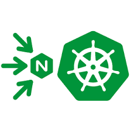

#  Cafe Demo / Redis Deployment 

## Introduction

In this lab, you deploy the Nginx Cafe Demo, and Redis In Memory cache applications to AKS.  You will configure Nginx Ingress to expose these applications external to the Clusters. Then you will test and verify they are working as expected.  You will use the Nginx Plus Dashboard to watch the Ingress Resources.

NGINX aaS | Nginx Ingress | Cafe | Redis
:--------------:|:--------------:|:--------------:|:--------------:
  | | |
  
## Learning Objectives

By the end of the lab you will be able to:

- Deploy the Cafe Demo application
- Deploy the Redis In Memory Cache
- Expose the Cafe Demo app with NodePort
- Expose the Redis Cache with NodePort
- Test and Verify Cafe and Redis are working

## Pre-Requisites

- You must have both AKS clusters up and running
- You must have both Nginx Ingress Controllers running
- You must have the NIC Dashboard available
- See `Lab0` for instructions on setting up your system for this Workshop
- Familiarity with basic Linux commands and commandline tools
- Familiarity with basic Kubernetes concepts and commands
- Familiarity with basic HTTP protocol

<br/>

## Deploy the Nginx CAFE Demo app

In this section, you will deploy the "Cafe Nginx" Ingress Demo, which represents a Coffee Shop website with Coffee and Tea applications. You will be adding the following components to your Kubernetes Cluster: Coffee and Tea pods, matching coffee and tea services, and a Cafe VirtualServer.

The Cafe application that you will deploy looks like the following diagram below. Coffee and Tea pods and services, with NGINX Ingress routing the traffic for /coffee and /tea routes, using the `cafe.example.com` Hostname.  There is also a hidden third service - more on that later!

< cafe diagram here >

1. Inspect the `lab4/cafe.yaml` manifest.  You will see we are deploying 3 replicas of each the coffee and tea Pods, and create a matching Service for each.  

1. Inspect the `lab4/cafe-vs.yaml` manifest.  This is the VirtualServer CRD used by Nginx Ingress to expose these apps, using the `cafe.example.com` Hostname.  You will also see that active healthchecks are enabled, and the /coffee and /tea routes are being used.  

1. Deploy the Cafe application by applying these two manifests:

```bash
kubectl apply -f lab4/cafe.yaml
kubectl apply -f lab4/cafe-vs.yaml

```

```bash
###Sample output###
deployment.apps/coffee created
service/coffee-svc created
deployment.apps/tea created
service/tea-svc created
virtualserver.k8s.nginx.org/cafe-vs created

```

1. Check that all pods and services are running, you should see three Coffee and three Tea pods.  Verify that your `cafe-vs` VirtualServer STATE is `Valid`.

```bash
kubectl get pods,svc
###Sample output###
NAME                      READY   STATUS    RESTARTS   AGE
coffee-56b7b9b46f-9ks7w   1/1     Running   0             28s
coffee-56b7b9b46f-mp9gs   1/1     Running   0             28s
coffee-56b7b9b46f-v7xxp   1/1     Running   0             28s
tea-568647dfc7-54r7k      1/1     Running   0             27s
tea-568647dfc7-9h75w      1/1     Running   0             27s
tea-568647dfc7-zqtzq      1/1     Running   0          27s

NAME                     TYPE        CLUSTER-IP    EXTERNAL-IP   PORT(S)    AGE
service/kubernetes       ClusterIP   10.0.0.1      <none>        443/TCP    34d
service/coffee-svc       ClusterIP   None          <none>        80/TCP     34d
service/tea-svc          ClusterIP   None          <none>        80/TCP     34d

```

1. In your AKS1 cluster, you will run only 2 Replicas of the coffee and tea pods, so Scale down both deployments:

```bash
kubectl scale deployment coffee --replicas=2
kubectl scale deployment tea --replicas=2

```

Now there should be only 2 of each running:

```bash
kubectl get pods
###Sample output###
NAME                      READY   STATUS    RESTARTS   AGE
coffee-56b7b9b46f-9ks7w   1/1     Running   0             28s
coffee-56b7b9b46f-mp9gs   1/1     Running   0             28s
tea-568647dfc7-54r7k      1/1     Running   0             27s
tea-568647dfc7-9h75w      1/1     Running   0             27s

```

1. Check that the Cafe `VirtualServer`, **cafe-vs**, is running and the STATE is Valid:

```bash
kubectl get virtualserver cafe-vs

```
```bash
###Sample output###
NAME      STATE   HOST               IP    PORTS   AGE
cafe-vs   Valid   cafe.example.com                 4m6s

```

**Note:** The `STATE` should be `Valid`. If it is not, then there is an issue with your yaml manifest file (cafe-vs.yaml). You could also use `kubectl describe vs cafe-vs` to get more information about the VirtualServer you just created.

1. Check your Nginx Plus Ingress Controller Dashboard for Cluster1, http://dashboard.example.com:9001/dashboard.html.  You should now see `cafe.example.com` in the HTTP Zones tab, and 2 each of the coffee and tea Pods in the HTTP Uptreams tab.  Nginx is health checking the Pods, so they should show a Green status.

< cafe dashboard ss here >

## Deploy the Nginx CAFE Demo app in the 2nd cluster

1. Repeat the previous section to deploy the CAFE Demo app in your second AKS2 cluster, dont' forget to change your Kubectl Context.

1.  Use the same /lab4 `cafe` and `cafe-vs` manifests.  *However - do not Scale down the coffee and tea replicas, leave three of each pod running.*

1. Check your Second Nginx Plus Ingress Controller Dashboard, at http://dashboard.example.com:9002/dashboard.html.  You should find the same HTTP Zones, and 3 each of the coffee and tea pods for HTTP Upstreams.

## Deploy Redis In Memory Caching in AKS Cluster 2

In this exercise, you will deploy Redis in your Second AKS2 Cluster, and use both Nginx Ingress and Nginx for Azure to expose this Redis Cache to the Internet.  Similar to the Cafe Demo deployment, we start with AKS pods and services, add Nginx Ingress Transport Server for TCP, expose with NodePort, create Upstreams, and then finally add new Server block for `redis.example.com`.  As Redis operates at the TCP level, you will be using the `Nginx stream` context for your configurations, not the HTTP context.

1. Inspect the Redis Leader and Follower manifest.  `Thank You to our friends at Google` for this sample Redis Kubernetes configuration, it seems to work well.

1. Deploy Redis Leader and Follower to your AKS2 Cluster.

    ```bash
    kubectl config use-context n4a-aks2
    kubectl apply -f lab4/redis-leader.yaml
    kubectl apply -f lab4/redis-follower.yaml

    ```

1. Check they are running:

    ```bash
    kubectl get pods,svc

    ```

    ```bash
    #Sample Output / Coffee and Tea removed for clarity
    NAME                                  READY   STATUS    RESTARTS   AGE
    pod/redis-follower-847b67dd4f-f8ct5   1/1     Running   0          22h
    pod/redis-follower-847b67dd4f-rt5hg   1/1     Running   0          22h
    pod/redis-leader-58b566dc8b-8q55p     1/1     Running   0          22h

    NAME                     TYPE        CLUSTER-IP    EXTERNAL-IP   PORT(S)    AGE
    service/redis-follower   ClusterIP   10.0.222.46   <none>        6379/TCP   24m
    service/redis-leader     ClusterIP   10.0.125.35   <none>        6379/TCP   24m

    ```

1. Configure Nginx Ingress Controller to enable traffic to Redis.  Use the following manifests to Open the Redis TCP Ports, and create a Transport Server for TCP traffic.

    Inspect the `lab4/global-configuration-redis.yaml` manifest.  This configures Nginx Ingress for new Stream Server blocks and listen on two more ports:

    ```yaml
    # NIC Global Config manifest for custom TCP ports for Redis
    # Chris Akker Jan 2024
    #
    apiVersion: k8s.nginx.org/v1alpha1
    kind: GlobalConfiguration 
    metadata:
    name: nginx-configuration
    namespace: nginx-ingress
    spec:
    listeners:
    - name: redis-leader-listener
        port: 6379
        protocol: TCP
    - name: redis-follower-listener
        port: 6380
        protocol: TCP

    ```    

1. Create the Global Configuration:

    ```bash
    kubectl apply -f lab4/global-configuration-redis.yaml

    ```

    ```bash
    #Sample output
    globalconfiguration.k8s.nginx.org/nginx-configuration created

    ```

1. Check and inspect the Global Configuration:

    ```bash
    kubectl describe gc nginx-configuration -n nginx-ingress

    ```
    ```bash
    #Sample output
    Name:         nginx-configuration
    Namespace:    nginx-ingress
    Labels:       <none>
    Annotations:  <none>
    API Version:  k8s.nginx.org/v1alpha1
    Kind:         GlobalConfiguration
    Metadata:
    Creation Timestamp:  2024-03-25T21:12:27Z
    Generation:          1
    Resource Version:    980829
    UID:                 7afbed08-364c-43bc-acc4-dcbeab3afee8
    Spec:
    Listeners:
        Name:      redis-leader-listener
        Port:      6379
        Protocol:  TCP
        Name:      redis-follower-listener
        Port:      6380
        Protocol:  TCP
    Events:        <none>

    ```

1. Create the Nginx Ingress Transport Servers, for Redis Leader and Follow traffic:

    ```bash
    kubectl apply -f lab4/redis-leader-ts.yaml
    kubectl apply -f lab4/redis-follower-ts.yaml

    ```

1. Verify the Nginx Ingress Controller is now running 2 Transport Servers for Redis traffic, the STATE should be Valid:

    ```bash
    kubectl get transportserver

    ```

    ```bash
    #Sample output
    NAME                STATE   REASON           AGE
    redis-follower-ts   Valid   AddedOrUpdated   24m
    redis-leader-ts     Valid   AddedOrUpdated   24m

    ```

1. Do a quick check with your Nginx Ingress Dashboard for AKS2, you should now see `TCP Zones` and `TCP Upstreams`.  These are the Transport Servers and Pods that NIC will use for Redis traffic.

    << NIC Redis SS here >>

1. Inspect the `lab4/nodeport-static-redis.yaml` manifest.  This will update the NodePort definitions to include ports for Redis Leader and Follower.  Once again, these are static NodePorts.

    ```yaml
    apiVersion: v1
    kind: Service
    metadata:
    name: nginx-ingress
    namespace: nginx-ingress
    spec:
    type: NodePort
    ports:
    - port: 80
        nodePort: 32080
        protocol: TCP
        name: http
    - port: 443
        nodePort: 32443
        protocol: TCP
        name: https
    - port: 6379
        nodePort: 32379
        protocol: TCP
        name: redis-leader
    - port: 6380
        nodePort: 32380
        protocol: TCP
        name: redis-follower
    - port: 9000
        nodePort: 32090
        protocol: TCP
        name: dashboard    
    selector:
        app: nginx-ingress

    ```

1. Apply the new NodePort manifest:

    ```bash
    kubectl apply -f lab4/nodeport-static-redis.yaml

    ```

1. Verify there are now 5 Open Nginx Ingress NodePorts on your AKS2 cluster:

    ```bash
    kubectl get svc -n nginx-ingress

    ```

    ```bash
    #Sample output
    NAME            TYPE        CLUSTER-IP    EXTERNAL-IP   PORT(S)                                                                   AGE
    dashboard-svc   ClusterIP   10.0.226.36   <none>        9000/TCP                                                                  28d
    nginx-ingress   NodePort    10.0.84.8     <none>        80:32080/TCP,443:32443/TCP,6379:32379/TCP,6380:32380/TCP,9000:32090/TCP   28m

    ```


<br/>

**This completes Lab4.**

<br/>

## References:

- [NGINX As A Service for Azure](https://docs.nginx.com/nginxaas/azure/)
- [NGINX Plus Product Page](https://docs.nginx.com/nginx/)
- [NGINX Ingress Controller](https://docs.nginx.com//nginx-ingress-controller/)
- [NGINX Directives Index](https://nginx.org/en/docs/dirindex.html)
- [NGINX Variables Index](https://nginx.org/en/docs/varindex.html)
- [NGINX Technical Specs](https://docs.nginx.com/nginx/technical-specs/)
- [NGINX - Join Community Slack](https://community.nginx.org/joinslack)

<br/>

### Authors

- Chris Akker - Solutions Architect - Community and Alliances @ F5, Inc.
- Shouvik Dutta - Solutions Architect - Community and Alliances @ F5, Inc.
- Adam Currier - Solutions Architect - Community and Alliances @ F5, Inc.

-------------

Navigate to ([Lab5](../lab5/readme.md) | [LabX](../labX/readme.md))
