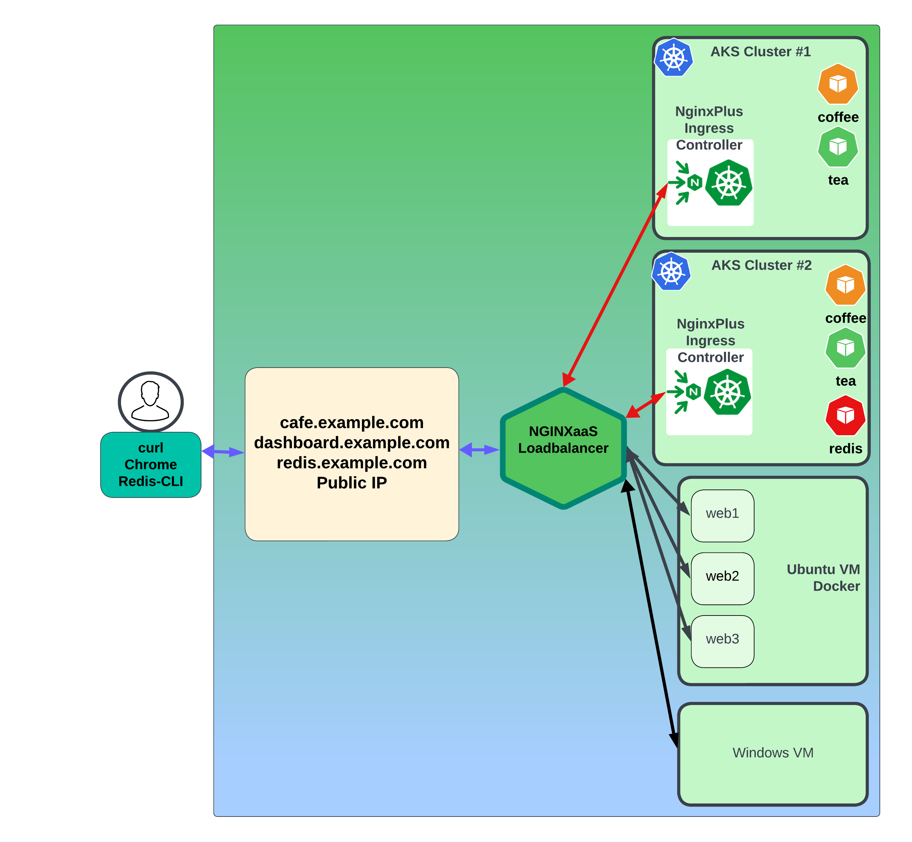

# Cafe Demo Deployment

## Introduction

In this lab, you will deploy the Nginx Cafe Demo app to your AKS Cluster.  You will configure Nginx Ingress to expose this applications external to the Cluster. You will use the Nginx Plus Dashboard to watch the Kubernetes and Ingress Resources.

<br/>

Nginx Ingress | Cafe
:--------------:|:--------------:
 |

<br/>
  
## Learning Objectives

By the end of the lab you will be able to:

- Deploy the Cafe Demo application
- Expose the Cafe Demo app with NodePort
- Monitor with Nginx Plus Ingress dashboard
- Optional: Deploy the Redis application
- Optional: Expose the Redis Cache with NodePort

## Pre-Requisites

- You must have your AKS Cluster up and running
- You must have your Nginx Ingress Controller running
- You must have your NIC Dashboard available
- Optional:  You must have your Second AKS cluster, Nginx Ingress, and Dashboard running
- Familiarity with basic Linux commands and commandline tools
- Familiarity with basic Kubernetes concepts and commands
- Familiarity with Kubernetes NodePort
- Familiarity with Nginx Ingress Controller CRDs - Custom Resource Definitions
- Familiartiy with Nginx Ingress VirtualServers and TransportServers
- See `Lab0` for instructions on setting up your system for this Workshop

<br/>

## Deploy the Nginx Cafe Demo app in AKS1 Cluster


In this section, you will deploy the "Cafe Nginx" Ingress Demo, which represents a Coffee Shop website with Coffee and Tea applications. You will be adding the following components to your Kubernetes Clusters:
  
- Coffee and Tea pods
- Matching coffee and tea services
- Cafe VirtualServer

The Cafe application that you will deploy looks like the following diagram below. The AKS cluster will have the Coffee and Tea pods and services, with NGINX Ingress routing the traffic for /coffee and /tea routes, using the `cafe.example.com` Hostname. There is also a third hidden service, more on that later!



1. Inspect the `lab4/cafe.yaml` manifest.  You will see we are deploying 3 replicas of each the coffee and tea Pods, and create a matching Service for each.  

2. Inspect the `lab4/cafe-vs.yaml` manifest.  This is the Nginx Ingress VirtualServer CRD (Custom Resource Definition) used by Nginx Ingress to expose these apps, using the `cafe.example.com` Hostname.  You will also see that active healthchecks are enabled, and the /coffee and /tea routes are being used. (NOTE: The VirtualServer CRD from Nginx unlocks all the Plus features of Nginx, and is an `upgrade` to the standard Kubernetes Ingress object).

3. Deploy the Cafe application by applying these two manifests in the first cluster:

   > Make sure your Terminal is the `nginx-azure-workshops/labs` directory for all commands during this Workshop.

    ```bash
    # Set context to 1st cluster(n4a-aks1)
    kubectl config use-context n4a-aks1

    kubectl apply -f lab4/cafe.yaml
    kubectl apply -f lab4/cafe-vs.yaml

    ```

    ```bash
    ##Sample Output##
    Switched to context "n4a-aks1".
    deployment.apps/coffee created
    service/coffee-svc created
    deployment.apps/tea created
    service/tea-svc created
    virtualserver.k8s.nginx.org/cafe-vs created
    ```

4. Check that all pods and services are running within first cluster, you should see three Coffee and three Tea pods, and the coffee-svc and tea-svc Services.

    ```bash
    kubectl get pods,svc
    ```

    ```bash
    ##Sample Output##
    NAME                      READY   STATUS    RESTARTS   AGE
    coffee-56b7b9b46f-9ks7w   1/1     Running   0             28s
    coffee-56b7b9b46f-mp9gs   1/1     Running   0             28s
    coffee-56b7b9b46f-v7xxp   1/1     Running   0             28s
    tea-568647dfc7-54r7k      1/1     Running   0             27s
    tea-568647dfc7-9h75w      1/1     Running   0             27s
    tea-568647dfc7-zqtzq      1/1     Running   0          27s

    NAME                     TYPE        CLUSTER-IP    EXTERNAL-IP   PORT(S)    AGE
    service/kubernetes       ClusterIP   10.0.0.1      <none>        443/TCP    34d
    service/coffee-svc       ClusterIP   None          <none>        80/TCP     34d
    service/tea-svc          ClusterIP   None          <none>        80/TCP     34d
    ```

5. *For your first cluster (`n4a-aks1`) only*, you will run `2 Replicas` of the coffee and tea pods, so Scale down both deployments:

    ```bash
    kubectl scale deployment coffee --replicas=2
    kubectl scale deployment tea --replicas=2
    ```

    ```bash
    deployment.apps/coffee scaled
    deployment.apps/tea scaled
    ```

    Now there should be only 2 of each Pod running:

    ```bash
    kubectl get pods
    ```

    ```bash
    ##Sample Output##
    NAME                      READY   STATUS    RESTARTS   AGE
    coffee-56b7b9b46f-9ks7w   1/1     Running   0             28s
    coffee-56b7b9b46f-mp9gs   1/1     Running   0             28s
    tea-568647dfc7-54r7k      1/1     Running   0             27s
    tea-568647dfc7-9h75w      1/1     Running   0             27s
    ```

6. Check that the Cafe VirtualServer (`cafe-vs`), is running and the STATE is `Valid`:

    ```bash
    kubectl get virtualserver cafe-vs
    ```

    ```bash
    ##Sample Output##
    NAME      STATE   HOST               IP    PORTS   AGE
    cafe-vs   Valid   cafe.example.com                 4m6s
    ```

    >**NOTE:** The `STATE` should be `Valid`. If it is not, then there is an issue with your yaml manifest file (cafe-vs.yaml). You could also use `kubectl describe vs cafe-vs` to get more information about the VirtualServer you just created.

7. Check your Nginx Plus Ingress Controller Dashboard for first cluster(`n4a-aks1`), at http://dashboard.example.com:9001/dashboard.html.  You should now see `cafe.example.com` in the **HTTP Zones** tab, and 2 each of the coffee and tea Pods in the **HTTP Upstreams** tab.  Nginx is health checking the Pods, so they should show a Green status, and the successfull Health Checks counter increasing.

    

    

    >**NOTE:** You should see two Coffee/Tea pods in Cluster 1.

<br/>

## Optional: Deploy the Nginx Cafe Demo app in the 2nd cluster

If you have completed the Optional deployment of a Second AKS Cluster (n4a-aks2), running with the Nginx Ingress Controller and the Dashboard, you can use the following steps to deploy the Nginx Cafe Demo app to your Second cluster.

1. Repeat the previous section to deploy the Cafe Demo app in your second cluster (`n4a-aks2`), don't forget to change your Kubectl Context using below command.

    ```bash
    kubectl config use-context n4a-aks2
    ```

    ```bash
    ##Sample Output##
    Switched to context "n4a-aks2".
    ```

2. Use the same /lab4 `cafe` and `cafe-vs` manifests.  

    >*However - do not Scale down the coffee and tea replicas, leave three of each pod running in AKS2.*

    ```bash
    kubectl apply -f lab4/cafe.yaml
    kubectl apply -f lab4/cafe-vs.yaml
    ```

3. Check your Second Nginx Plus Ingress Controller Dashboard, at http://dashboard.example.com:9002/dashboard.html.  You should find the same HTTP Zones, and 3 each of the coffee and tea pods for HTTP Upstreams.


<br/>

## Optional: Deploy Redis In Memory Caching in AKS Cluster 2 (n4a-aks2)

Azure | Redis
:--------------:|:--------------:
 | 

<br/>

In this exercise, you will deploy Redis in your second cluster (`n4a-aks2`), and use both Nginx Ingress and Nginx for Azure to expose this Redis Cache to the Internet. Similar to the Cafe Demo deployment, you will deploy:

- `Redis Leader and Follower` pods and services in n4a-aks2 cluster.
- Add Nginx Ingress `Transport Server` for TCP traffic.
- Expose Redis with NodePorts.

>**NOTE:** As Redis operates at the TCP level, you will be using the `Nginx stream` context in your Nginx Ingress configurations, not the HTTP context.  

### Deploy Redis Leader and Follower in AKS2

1. Inspect the Redis-Leader and Redis-Follower manifests.  `Shout-out: Thank You to our friends at Google` for this sample Redis for Kubernetes configuration, it works well.  You will see a single Leader Pod, and 2 Follower pods with matching services.

1. Deploy Redis Leader and Follower to your AKS2 Cluster.

    ```bash
    kubectl config use-context n4a-aks2
    kubectl apply -f lab4/redis-leader.yaml
    kubectl apply -f lab4/redis-follower.yaml
    ```

    ```bash
    ##Sample Output##
    Switched to context "n4a-aks2".
    deployment.apps/redis-leader created
    service/redis-leader created
    deployment.apps/redis-follower created
    service/redis-follower created
    ```

1. Check they are running:

    ```bash
    kubectl get pods,svc -l app=redis
    ```

    ```bash
    ##Sample Output## 
    NAME                                  READY   STATUS    RESTARTS   AGE
    pod/redis-follower-847b67dd4f-f8ct5   1/1     Running   0          22h
    pod/redis-follower-847b67dd4f-rt5hg   1/1     Running   0          22h
    pod/redis-leader-58b566dc8b-8q55p     1/1     Running   0          22h

    NAME                     TYPE        CLUSTER-IP    EXTERNAL-IP   PORT(S)    AGE
    service/redis-follower   ClusterIP   10.0.222.46   <none>        6379/TCP   24m
    service/redis-leader     ClusterIP   10.0.125.35   <none>        6379/TCP   24m
    ```

1. Configure Nginx Ingress Controller to enable traffic to Redis.  This requires three things:

    - Open the TCP ports on Nginx Ingress
    - Create a TransportServer for Redis Leader
    - Create a TransportServer for Redis Follower

1. Use the following manifests to Open the Redis Leader and Follower TCP Ports, using the Nginx Ingress Global Configuration CRD:

    Inspect the `lab4/global-configuration-redis.yaml` manifest.  This configures Nginx Ingress for new `Stream context` Server blocks and listens on two additional ports for Redis.  Take note that you are using the Redis standard `6379` port for the Leader, and port `6380` for the Follower.  (If you are unfamiliar with Redis, you can find a link in the References section to read more about it).

    ```yaml
    # NIC Global Config manifest for custom TCP ports for Redis
    # Chris Akker Jan 2024
    #
    apiVersion: k8s.nginx.org/v1alpha1
    kind: GlobalConfiguration 
    metadata:
    name: nginx-configuration
    namespace: nginx-ingress
    spec:
    listeners:
    - name: redis-leader-listener
        port: 6379
        protocol: TCP
    - name: redis-follower-listener
        port: 6380
        protocol: TCP
    ```

1. Create the Global Configuration:

    ```bash
    kubectl apply -f lab4/global-configuration-redis.yaml
    ```

    ```bash
    ##Sample Output##
    globalconfiguration.k8s.nginx.org/nginx-configuration created
    ```

1. Check and inspect the Global Configuration:

    ```bash
    kubectl describe gc nginx-configuration -n nginx-ingress
    ```

    ```bash
    ##Sample Output##
    Name:         nginx-configuration
    Namespace:    nginx-ingress
    Labels:       <none>
    Annotations:  <none>
    API Version:  k8s.nginx.org/v1alpha1
    Kind:         GlobalConfiguration
    Metadata:
    Creation Timestamp:  2024-03-25T21:12:27Z
    Generation:          1
    Resource Version:    980829
    UID:                 7afbed08-364c-43bc-acc4-dcbeab3afee8
    Spec:
    Listeners:
        Name:      redis-leader-listener
        Port:      6379
        Protocol:  TCP
        Name:      redis-follower-listener
        Port:      6380
        Protocol:  TCP
    Events:        <none>
    
    ```

1. Create the Nginx Ingress Transport Servers, for Redis Leader and Follow traffic, using the Transport Server CRD:

    ```bash
    kubectl apply -f lab4/redis-leader-ts.yaml
    kubectl apply -f lab4/redis-follower-ts.yaml
    ```

    ```bash
    ##Sample Output##
    transportserver.k8s.nginx.org/redis-leader-ts created
    transportserver.k8s.nginx.org/redis-follower-ts created
    ```

1. Verify the Nginx Ingress Controller is now running 2 Transport Servers for Redis traffic, the STATE should be Valid:

    ```bash
    kubectl get transportserver
    ```

    ```bash
    ##Sample Output##
    NAME                STATE   REASON           AGE
    redis-follower-ts   Valid   AddedOrUpdated   24m
    redis-leader-ts     Valid   AddedOrUpdated   24m

    ```

    >**NOTE:**  The Nginx Ingress Controller uses `VirtualServer CRD` for HTTP context/traffic, and uses `TransportServer CRD` for TCP stream context/traffic.

1. Do a quick check of your Nginx Plus Ingress Dashboard for AKS2, you should now see `TCP Zones` and `TCP Upstreams`.  These are the Transport Servers and Pods that Nginx Ingress will use for Redis traffic.

    
    

1. Inspect the `lab4/nodeport-static-redis.yaml` manifest.  This will update the previous `nginx-ingress` NodePort definitions to include the ports for Redis Leader and Follower.  Once again, these are static NodePorts.

    ```yaml
    # Nginx 4 Azure, AKS2 NIC NodePort for Redis
    # Chris Akker, Shouvik Dutta, Adam Currier - Mar 2024
    #
    apiVersion: v1
    kind: Service
    metadata:
    name: nginx-ingress
    namespace: nginx-ingress
    spec:
    type: NodePort
    ports:
    - port: 80
        nodePort: 32080
        protocol: TCP
        name: http
    - port: 443
        nodePort: 32443
        protocol: TCP
        name: https
    - port: 6379
        nodePort: 32379
        protocol: TCP
        name: redis-leader
    - port: 6380
        nodePort: 32380
        protocol: TCP
        name: redis-follower
    - port: 9000
        nodePort: 32090
        protocol: TCP
        name: dashboard    
    selector:
        app: nginx-ingress

    ```

1. Apply the new NodePort manifest (n4a-aks2 cluster only - Redis is not running in n4a-aks1 cluster!):

    ```bash
    kubectl config use-context n4a-aks2
    kubectl apply -f lab4/nodeport-static-redis.yaml
    ```

    ```bash
    ##Sample Output##
    Switched to context "n4a-aks2".
    service/nginx-ingress created
    ```

1. Verify there are now `5 Open Nginx Ingress NodePorts` on your AKS2 cluster:

    ```bash
    kubectl get svc -n nginx-ingress
    ```

    ```bash
    ##Sample Output##
    NAME            TYPE        CLUSTER-IP    EXTERNAL-IP   PORT(S)                                                                   AGE
    dashboard-svc   ClusterIP   10.0.226.36   <none>        9000/TCP                                                                  28d
    nginx-ingress   NodePort    10.0.84.8     <none>        80:32080/TCP,443:32443/TCP,6379:32379/TCP,6380:32380/TCP,9000:32090/TCP   28m
    
    ```

To recap, the 5 open port mappings for `nginx-ingress` are as follows:

Service Port | External NodePort | Name
:--------:|:------:|:-------:
80 | 32080 | http
443 | 32443 | https
6379 | 32379 | redis leader
6380 | 32380 | redis follower
9000 | 32090 | dashboard

You will use these new Redis NodePorts for your Nginx for Azure upstreams in the next Lab.

<br/>

**This completes Lab4.**

<br/>

## References:

- [NGINX As A Service for Azure](https://docs.nginx.com/nginxaas/azure/)
- [NGINX Cafe Demo](https://hub.docker.com/r/nginxinc/ingress-demo)
- [Redis Product Page](https://redis.io/)
- [Redis with Nginx Ingress Lab](https://github.com/nginxinc/nginx-ingress-workshops/tree/main/AdvancedNIC/labs/lab9)
- [NGINX Plus Product Page](https://docs.nginx.com/nginx/)
- [NGINX Ingress Controller](https://docs.nginx.com//nginx-ingress-controller/)
- [NGINX Ingress Transport Server CRD](https://docs.nginx.com/nginx-ingress-controller/configuration/transportserver-resource/)
- [NGINX Directives Index](https://nginx.org/en/docs/dirindex.html)
- [NGINX Variables Index](https://nginx.org/en/docs/varindex.html)
- [NGINX Technical Specs](https://docs.nginx.com/nginx/technical-specs/)
- [NGINX - Join Community Slack](https://community.nginx.org/joinslack)

<br/>

### Authors

- Chris Akker - Solutions Architect - Community and Alliances @ F5, Inc.
- Shouvik Dutta - Solutions Architect - Community and Alliances @ F5, Inc.
- Adam Currier - Solutions Architect - Community and Alliances @ F5, Inc.

-------------

Navigate to ([Lab5](../lab5/readme.md) | [LabGuide](../readme.md))
