# NGINX Load Balancing / Reverse Proxy

## Introduction

In this lab, you will configure Nginx4Azure to Proxy and Load Balance several different backend systems, including Nginx Ingress Controllers in AKS, and a Windows VM. You will create and configure the needed Nginx config files, and then verify access to these systems. The Docker containers, VMs, or AKS Pods are running simple websites that represent web applications. You will also configure and load balance traffic to a Redis in-memory cache running in the AKS cluster. The AKS Clusters and Nginx Ingress Controllers provide access to these various K8s workloads.

NGINX aaS | AKS | Nginx Ingress | Redis
:-----------------:|:-----------------:|:-----------------:|:-----------------:
  | | |
  
## Learning Objectives

By the end of the lab you will be able to:

- Configure Nginx4Azure to Proxy and Load balance AKS workloads
- Configure Nginx4Azure to Proxy a Windows Server VM
- Test access to your N4A configurations with Curl and Chrome
- Inspect the HTTP content coming from these systems
- Run an HTTP Load Test on your systems
- Enable HTTP Split Clients for Blue/Green, A/B Testing
- Configure Nginx4Azure for Redis Cluster
- Configure Nginx4Azure to Proxy to Nginx Ingress Headless

## Pre-Requisites

- You must have your Nginx4Azure instance up and running
- You must access to the N4A Configuration Panel in Azure Portal
- You must have both AKS Clusters with Nginx Ingress Controllers running
- You must have the sample application running in both clusters
- You must have curl and a modern Browser installed on your system
- You should have Redis Client Tools installed on your local system
- See `Lab0` for instructions on setting up your system for this Workshop


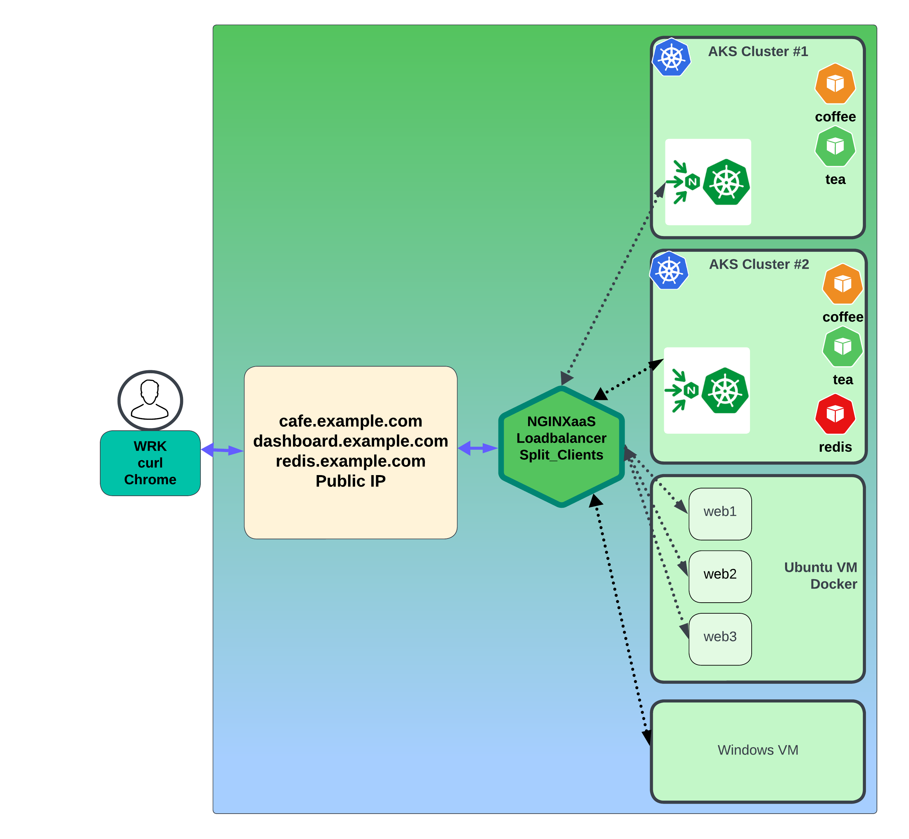


### Nginx 4 Azure Proxy to AKS Clusters

This exercise will create Nginx Upstream configurations for the AKS Clusters. You will use the Nodepool node names, and you will add the port number `32080` from the NodePort of the Nginx Ingress Controllers running in AKS cluster 1, and AKS Cluster 2. These were previously deployed and configured in a previous lab. Now the fun part, sending traffic to them!

Configure the Upstream for AKS Cluster1.

1. Using kubectl, get the Nodepool nodes for AKS Cluster1:  (You can also find these in your Azure Portal - AKS Nodepool definitions.)

    ```bash
    kubectl config use-context n4a-aks1
    kubectl get nodes
    ```

    ```bash
    ##Sample Output##
    aks-userpool-76919110-vmss000001  #aks1 node1
    aks-userpool-76919110-vmss000002  #aks1 node2
    aks-userpool-76919110-vmss000003  #aks1 node3
    ```

1. Using the Nginx4Azure configuration tool, create a new file called `/etc/nginx/conf.d/aks1-upstreams.conf`. Copy and Paste the contents of the provided file. You will have to EDIT this example config file, and change the `server` entries to match your AKS Cluster1 Nodepool node names. You can find your AKS1 nodepool nodenames from `kubectl get nodes` or the Azure Portal. Make sure you use `:32080` for the port number, this is the static `nginx-ingress NodePort Service` for HTTP traffic that was defined earlier.

    ```nginx
    # Nginx 4 Azure to NIC, AKS Nodes for Upstreams
    # Chris Akker, Shouvik Dutta, Adam Currier, Steve Wagner - Mar 2024
    #
    # AKS1 nginx ingress upstreams
    #
    upstream aks1_ingress {
      zone aks1_ingress 256k;

      least_time last_byte;
    
      # from nginx-ingress NodePort Service / aks Node names
      # Note: change servers to match
      #
      server aks-userpool-76919110-vmss000001:32080;    #aks1 node1
      server aks-userpool-76919110-vmss000002:32080;    #aks1 node2
      server aks-userpool-76919110-vmss000003:32080;    #aks1 node3

      keepalive 32;

    }
    ```

    Submit your Nginx Configuration.  If you have the Server names:port correct, Nginx for Azure will validate and return a Success message.

    >**Important!**  If you stop then re-start your AKS cluster, or scale the Nodepool up/down, or add/remove nodes in the AKS NodePools, this Upstream list `WILL have to be updated to match!`. Any changes to the Worker nodes in the Cluster will need to be matched exactly, as it is a static Nginx configuration that must match the Kubernetes workers -  Nodes:NodePort definition in your AKS cluster. If you change the static nginx-ingress NodePort Service Port number, you will have to match it here as well.

    *Currently, there is no auto-magic way to synchronize the Nginx for Azure upstream list with the AKS node list, but don't worry - Nginx Devs are working on that!*

Configure the Upstream for AKS Cluster2.

1. Repeat the previous Step, using the Nginx4Azure configuration tool, create a new file called `/etc/nginx/conf.d/aks2-upstreams.conf`. Copy and Paste the contents of the provided file. You will have to EDIT this example config file and change the `server` entries to match your AKS Cluster2 Nodepool node names. You can find your AKS2 nodepool nodenames from `kubectl get nodes` or the Azure Portal. Make sure you use `:32080` for the port number; this is the static `nginx-ingress NodePort Service` for HTTP traffic that was defined earlier.

1. Using kubectl, get the Nodepool nodes for AKS Cluster2: (You can also find these in your Azure Portal - AKS Nodepool definitions.)

    ```bash
    kubectl config use-context n4a-aks2
    kubectl get nodes
    ```

    ```bash
    ##Sample Output##
    aks-nodepool1-19485366-vmss000003   #aks2 node1
    aks-nodepool1-19485366-vmss000004   #aks2 node2
    aks-nodepool1-19485366-vmss000005   #aks2 node3
    aks-nodepool1-19485366-vmss000006   #aks2 node4
    ```

    ```nginx
    # Nginx 4 Azure to NIC, AKS Node for Upstreams
    # Chris Akker, Shouvik Dutta, Adam Currier, Steve Wagner - Mar 2024
    #
    # AKS2 nginx ingress upstreams
    #
    upstream aks2_ingress {
      zone aks2_ingress 256k;

      least_time last_byte;
    
      # from nginx-ingress NodePort Service / aks Node names
      # Note: change servers to match
      #
      server aks-nodepool1-19485366-vmss000003:32080;    #aks2 node1
      server aks-nodepool1-19485366-vmss000004:32080;    #aks2 node2
      server aks-nodepool1-19485366-vmss000005:32080;    #aks2 node3 
      server aks-nodepool1-19485366-vmss000006:32080;    #aks2 node4

      keepalive 32;

    }
    ```

Note that there are 4 upstreams, matching the 4 Nodepool nodes in AKS2 cluster.

Submit your Nginx Configuration. If you have the Server name:port correct, Nginx4Azure will validate and return a Success message.

**Warning:**  The same warning applies to Upstream configuration for AKS2, *if you make any Nodepool changes, Nginx must be updated to match those changes.*

### Update Nginx Config and add HTTP/1.1 Keepalive

In order for Nginx 4 Azure and Nginx Ingress to work correctly, the HTTP Host Headers, and perhaps other headers, will need to be passed. This is done by changing the HTTP Version to 1.1, so that the Host Header can be included.

1. Inspect the `lab5/includes/keepalive.conf`. This is where the HTTP Protocol and Headers are set for proxied traffic. This is a common requirement so it is shared among all the different Nginx configurations.

    Using the Nginx for Azure console, create a new file, `/etc/nginx/includes/keepalive.conf`.  Use the example provided, just copy/paste.

    ```nginx
    # Nginx 4 Azure - Mar 2024
    # Chris Akker, Shouvik Dutta, Adam Currier, Steve Wagner - Mar 2024
    #
    # Default is HTTP/1.0 to upstreams, keepalives is only enabled for HTTP/1.1
    proxy_http_version 1.1;

    # Set the Connection header to empty 
    proxy_set_header Connection "";

    # Host request header field, or the server name matching a request
    proxy_set_header Host $host;
    ```

    Submit your Nginx Configuration.

1. Inspect the `lab5/nginx.conf` file. Uncomment the `include` directive near the bottom, as shown:

    ```nginx
    # Nginx 4 Azure - Default - Updated Nginx.conf
    # Chris Akker, Shouvik Dutta, Adam Currier, Steve Wagner - Mar 2024
    #
    user nginx;
    worker_processes auto;
    worker_rlimit_nofile 8192;
    pid /run/nginx/nginx.pid;

    events {
        worker_connections 4000;
    }

    error_log /var/log/nginx/error.log error;

    http {
        log_format  main  '$remote_addr - $remote_user [$time_local] "$request" '
                        '$status $body_bytes_sent "$http_referer" '
                        '"$http_user_agent" "$http_x_forwarded_for"';
                        
        access_log off;
        server_tokens "";
        server {
            listen 80 default_server;
            server_name localhost;
            location / {
                # Points to a directory with a basic html index file with
                # a "Welcome to NGINX as a Service for Azure!" page
                root /var/www;
                index index.html;
            }
        }

        include /etc/nginx/conf.d/*.conf;
        include /etc/nginx/includes/*.conf;    # shared files
    
    }

    # stream {
        
    #     include /etc/nginx/stream/*.conf;          # Stream TCP nginx files

    # }
    ```

Submit your Nginx Configuration.

### Test Nginx 4 Azure to AKS1 Cluster Nginx Ingress Controller

Now that you have these new Nginx Upstream blocks created, you can test them.

1. Inspect, then modify the `# comments for proxy_pass` in the `location /` block in the `/etc/nginx/conf.d/cafe.example.com.conf` file, making these changes as shown.

    - Disable the proxy_pass to `cafe-nginx`
    - Enable the proxy_pass to `aks1_ingress`  
    - Change the comments for the X-Proxy-Pass Header as well.

    ```nginx
    ...

        location / {
            #
            # return 200 "You have reached cafe.example.com, location /\n";
            # proxy_pass http://cafe_nginx;          # Proxy AND load balance to a list of servers
            # add_header X-Proxy-Pass cafe_nginx;    # Custom Header
            
            proxy_pass http://aks1_ingress;          # Proxy to AKS1 Nginx Ingress Controller NodePort
            add_header X-Proxy-Pass aks1_ingress;    # Custom Header
            
            # proxy_pass http://aks2_ingress;        # Proxy to AKS2 Nginx Ingress Controller NodePort
            # add_header X-Proxy-Pass aks2_ingress;  # Custom Header

        }
    ...
    ```

    This changes where Nginx will `proxy_pass` the requests.  Nginx will now proxy and load balance requests to your AKS1 Nginx Ingress Controller, listening on port 32080 on each AKS1 Node.  The X-Proxy-Pass Header will now show `aks1-ingress` instead of cafe-nginx.

    Submit your Nginx Configuration.

1. Test your change with curl.  Do you see the X-Proxy-Pass Header that you added, so you know which Upstream block is being used ?

    ```bash
    curl -I http://cafe.example.com/coffee
    ```

    ```bash
    ##Sample Output##
    HTTP/1.1 200 OK
    Server: N4A-1.25.1-cakker
    Date: Fri, 05 Apr 2024 20:08:24 GMT
    Content-Type: text/html; charset=utf-8
    Connection: keep-alive
    Expires: Fri, 05 Apr 2024 20:08:23 GMT
    Cache-Control: no-cache
    X-Proxy-Pass: aks1_ingress
    ```

1. Test your change in proxy_pass with Chrome at http://cafe.example.com/coffee, hitting Refresh several times - what do you see - Docker Containers or AKS1 Pods?
    
    Cafe Docker | Cafe AKS1
    :-----------------:|:-----------------:
    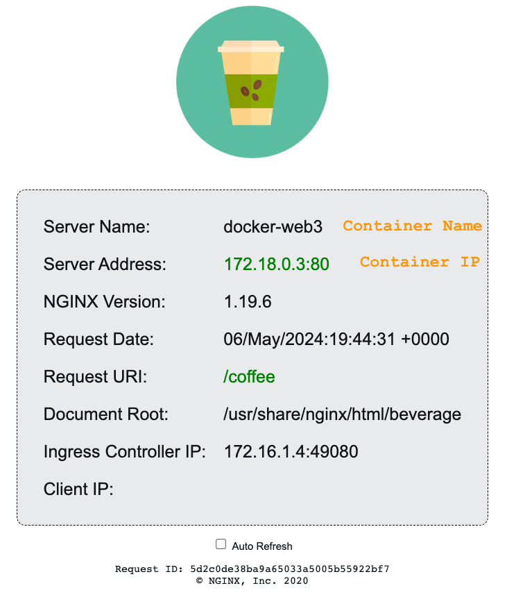 | 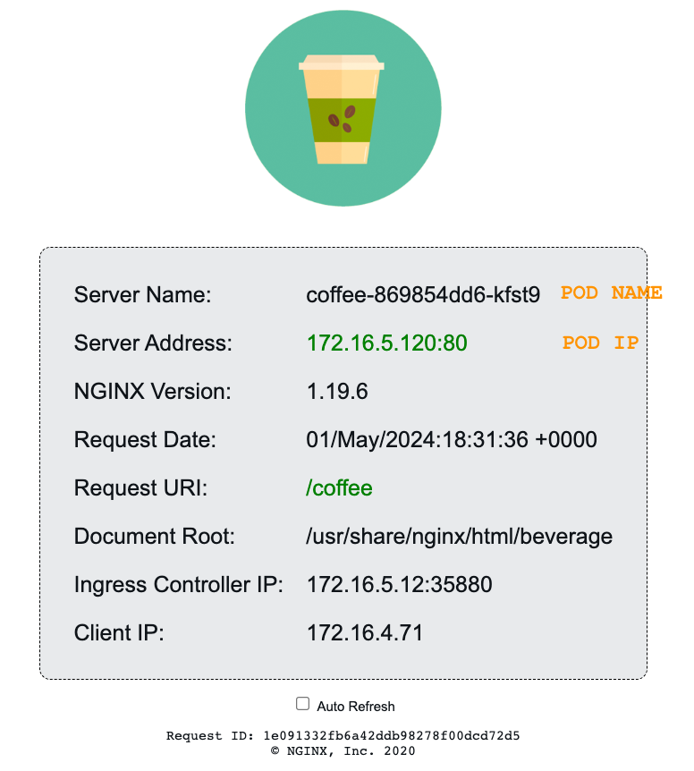

1. Verify this with `kubectl`.  Set your Kubectl Config Context to n4a-aks1:

    ```bash
    kubectl config use-context n4a-aks1
    kubectl get pods
    ```

    ```bash
    ##Sample Output##
    NAME                              READY   STATUS    RESTARTS   AGE
    coffee-869854dd6-bs8t6            1/1     Running   0          3d3h
    coffee-869854dd6-wq9lp            1/1     Running   0          3d3h
    ...
    ```

    Notice the Names of the `coffee` pods.  For the coffee Pod IPs, check the `coffee-svc` Endpoints:

    ```bash
    kubectl describe svc coffee-svc
    ```

    ```bash
    ##Sample Output##
    Name:              coffee-svc
    Namespace:         default
    Labels:            <none>
    Annotations:       <none>
    Selector:          app=coffee
    Type:              ClusterIP
    IP Family Policy:  SingleStack
    IP Families:       IPv4
    IP:                None
    IPs:               None
    Port:              http  80/TCP
    TargetPort:        80/TCP
    Endpoints:         10.244.0.10:80,10.244.0.20:80
    Session Affinity:  None
    Events:            <none>
    ```

    You should see a list of the (2) POD IPs for the Coffee Service.

    You can also see this list, using the Nginx Plus Dashboard for the Ingress Controller, check the HTTP Upstreams Tab as before, you should see the Pod IPs for both the coffee-svc and tea-svc.

    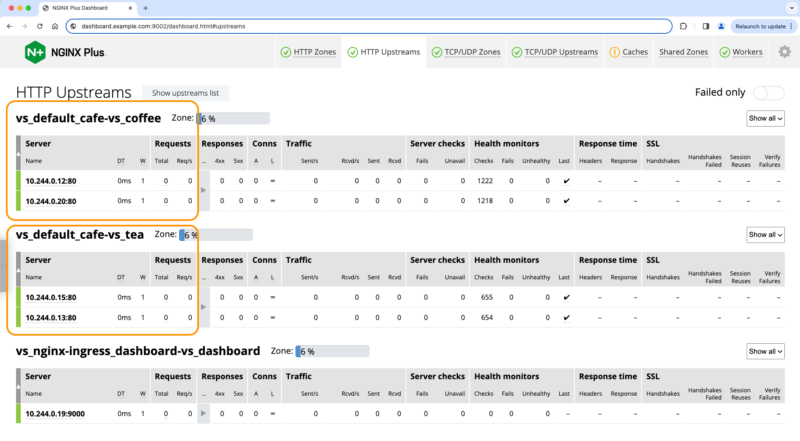

1.  **Loadtest Time!**  While you are in the Nginx Ingress Dashboard watching the coffee upstreams, throw some load at them using WRK HTTP Load tool.

    Using your local Docker Desktop, you will start and run the WRK loadtest from a container.  Try this for a 1 minute loadtest:

    ```bash
    docker run --name wrk --rm williamyeh/wrk -t4 -c200 -d1m --timeout 2s http://cafe.example.com/coffee
    ```

    ```bash
    ##Sample Output##
    Running 1m test @ http://cafe.example.com/coffee
    4 threads and 200 connections
    Thread Stats   Avg      Stdev     Max   +/- Stdev
        Latency    97.45ms    6.79ms 401.32ms   94.86%
        Req/Sec   515.15     23.08     0.94k    92.31%
    123138 requests in 1.00m, 202.21MB read
    Requests/sec:   2048.84
    Transfer/sec:      3.36MB
    ```

And your Nginx Ingress Dashboard should show similar stats. How many requests did you get in 1 minute?  Post your AKS1 Loadtest Results in Zoom Chat!

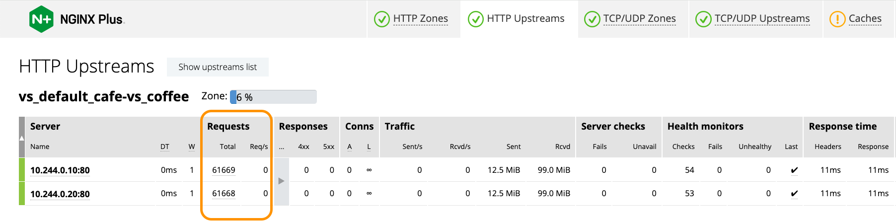

### Test Nginx 4 Azure to AKS2 Cluster Nginx Ingress Controller

Repeat the last procedure, to test access to the AKS2 Cluster and pods.

1. Change the `# comments for proxy_pass` in the `location /` block in the `/etc/nginx/conf.d/cafe.example.com.conf` file.

    - Disable the proxy_pass to aks1_ingress
    - Enable the proxy_pass to `aks2_ingress`, as shown
    - Change the X-Proxy_Pass Header

    ```nginx
    ...

        location / {
            #
            # return 200 "You have reached cafe.example.com, location /\n";
            
            # proxy_pass http://cafe_nginx;          # Proxy AND load balance to a list of servers
            # add_header X-Proxy-Pass cafe_nginx;    # Custom Header
            #proxy_pass http://aks1_ingress;         # Proxy to AKS1 Nginx Ingress Controller NodePort
            # add_header X-Proxy-Pass aks1_ingress;  # Custom Header

            proxy_pass http://aks2_ingress;          # Proxy to AKS2 Nginx Ingress Controller NodePort
            add_header X-Proxy-Pass aks2_ingress;    # Custom Header

        }
    ...
    ```

    This again changes where Nginx will `proxy_pass` the requests.  Nginx will now forward and load balance requests to your AKS2 Ingress Controller, also listening on port 32080 on each AKS2 Node.

    Submit your Nginx Configuration.

1. Test your change with curl.  Do you see the X-Proxy-Pass Header that you added, so you know which Upstream block is being used ?

    ```bash
    curl -I http://cafe.example.com/coffee
    ```

    ```bash
    HTTP/1.1 200 OK
    Server: N4A-1.25.1-cakker
    Date: Fri, 05 Apr 2024 20:08:24 GMT
    Content-Type: text/html; charset=utf-8
    Connection: keep-alive
    Expires: Fri, 05 Apr 2024 20:08:23 GMT
    Cache-Control: no-cache
    X-Proxy-Pass: aks2_ingress
    ```

1. Test your change in Upstreams with Chrome, hitting Refresh several times - what do you see ?

    The Server Name and IP address should now match PODS running in your AKS2 cluster!  (they were AKS1 names before) But how do you verify this ?  Observe again, the Server name is a Kubernetes assigned POD name, and the Server IP address is the POD IP address, also assiged by Kubernetes.  

    Verify this with `kubectl`.  Set your Kubectl Config Context to aks2:

    ```bash
    kubectl config use-context n4a-aks2
    kubectl get pods
    ```

    Then list the Pods:

    ```bash
    ##Sample Output##
    coffee-869854dd6-fchxm   1/1     Running   0          3d3h
    coffee-869854dd6-nn5d4   1/1     Running   0          3d3h
    coffee-869854dd6-zqbbv   1/1     Running   0          3d3h
    ...
    ```

    Notice the names of the coffee and and tea pods. For Pod IPs check the `coffee-svc` Endpoints:

    ```bash
    kubectl describe svc coffee-svc
    ```

    ```bash
    ##Sample Output##
    Name:              coffee-svc
    Namespace:         default
    Labels:            <none>
    Annotations:       <none>
    Selector:          app=coffee
    Type:              ClusterIP
    IP Family Policy:  SingleStack
    IP Families:       IPv4
    IP:                None
    IPs:               None
    Port:              http  80/TCP
    TargetPort:        80/TCP
    Endpoints:         172.16.4.99:80,172.16.5.101:80,172.16.5.118:80
    Session Affinity:  None
    Events:            <none>
    ```

    You should see a list of the (3) POD IPs for the coffee Service.

**TAKE NOTE:** The Pod IPs are on a completely different IP subnet, from Docker or the first and second AKS cluster, which was configured using the Azure CNI - did you catch that distinction? Understanding the Backend IP/networking is critical to configuring your Nginx for Azure Upstreams properly.  

You built and used different CNIs and subnets so that you can see the differences. Nginx for Azure can work with `any` of these different backend applications and networks, as long as there is an IP Path to the Upstreams. 

(Yes, if you add the appropriate routing with VNet Gateways, you can use Upstreams in other Regions/Clusters/VMs.)


Platform | Docker | AKS1 | AKS2
:--------------:|:--------------:|:-----------------:|:-----------------:
Network Type | Docker | Kubenet | Azure CNI
IP Subnet | 172.18.x.y | 172.16.10.y | 172.16.20.y


You can also see this list, using the Nginx Plus Dashboard for the Ingress Controller in AKS2 - check the HTTP Upstreams, you should see the Pod IPs for both the coffee-svc and tea-svc.

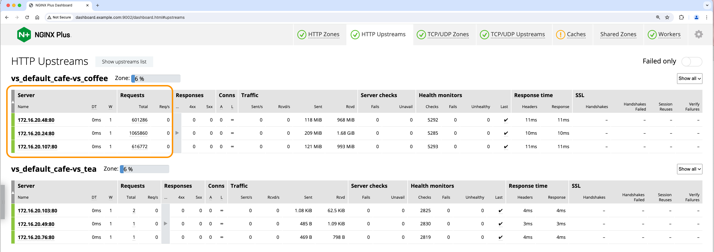

1.  **Loadtest Time!**  While you are in the Nginx Ingress Dashboard watching the coffee upstreams, throw some load at them:

    Using your local Docker Desktop, you will start and run the WRK loadtest from a container. Try this for a 1 minute loadtest:

    ```bash
    docker run --name wrk --rm williamyeh/wrk -t4 -c200 -d1m --timeout 2s http://cafe.example.com/coffee
    ```

    ```bash
    ##Sample Output##
    Running 1m test @ http://cafe.example.com/coffee
    4 threads and 200 connections
    Thread Stats   Avg      Stdev     Max   +/- Stdev
        Latency   112.42ms   38.11ms 705.15ms   81.00%
        Req/Sec   450.43     83.36   720.00     73.49%
    107730 requests in 1.00m, 177.09MB read
    Requests/sec:   1792.74
    Transfer/sec:      2.95MB
    ```

1. Your Nginx Ingress Dashboard should show similar stats. How many requests did you get in 1 minute? Post your Results in the Zoom Chat!

    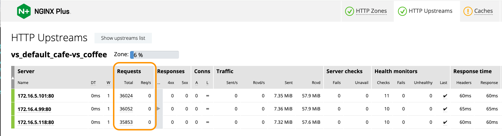

### Nginx for Azure, Upstream Configuration Recap

During this lab exercise, you created and tested THREE different Upstream configurations to use with Nginx for Azure.  This demonstrates how easy it is to have different platforms for your backend applications, and Nginx can easily be configured to change where it sends the Requests with `proxy_pass`. You can use Azure VMs, Docker, Containers, AKS Clusters, and/or Windows VMs for your apps. You also added a custom HTTP Header, to help you track which Upstream block is being used.


## Nginx for Azure Split Clients for Blue/Green, A/B, Canary Testing


Now you will be introduced to a very popular Nginx feature - `HTTP Split Clients`. This is an Nginx module that can split traffic to multiple Upstreams or Servers, based on a hash of the Request. This Split Clients tool is very handy for the testing of new versions of code, most likely part of QA testing phases of CI/CD pipeline progressions.  

This concept of using `Live Traffic`, to test a new version or release of an application has several names, like `Blue/Green, or A/B, or Canary testing.` We will use the term Blue/Green for this exercise, and show you how to control 0-100% of your incoming requests, and route/split them to different backend Upstreams with Nginx for Azure. You will use the Nginx `http_split_clients` feature, to support these common application software Dev/Test/Pre-Prod/Prod patterns.  

Docker | NGINXaaS | Kubernetes
:-----------------:|:-----------------:|:-----------------:
  | |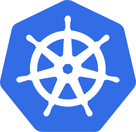 


As your team is diligently working towards all applications being developed and tested in Kubernetes, you could really use a process to make the migration from old Legacy Docker VMs to Kubernetes MicroServices easier. Wouldn't it be nice if you could test and migrate Live Traffic with NO DOWNTIME?  `(Service Outages and Tickets are a DRAG... ugh!)`

You will start with the Nginx Cafe Demo, and your Docker VMs, as the current running Version of your application.  

Also using Cafe Demo, you decide that AKS Cluster1 is your Pre-Production test environment, where final QA checks of software releases are `signed-off` before being rolled out into Production.

- As the software QA tests in your pipeline continue to pass, you will incrementally `increase the split ratio to AKS1`, and eventually migrate ALL 100% of your Live Traffic to the AKS1 Cluster - `with NO DOWNTIME, lost packets, connections, or user disruption.` No WAY - it can't be that EASY?
- Just as importantly, if you do encounter any serious application bugs or even infrastructure problems, you can just as quickly `roll-back` sending 100% of the traffic to the Docker VMs.  *You just might be an NGINXpert HERO.*

Your first CI/CD test case is taking just 1% of your Live incoming traffic and sending it to AKS Cluster 1.  There you likely have enabled debug level logging and monitoring of your containers. Now you can see how the new version of Nginx Cafe is running.  (You do run these types of pre-release tests, correct?)

To accomplish the Split Client functionality with Nginx, you only need 3 things.  
- The `split_clients directive`
- A Map block to configure the incoming request object of interest (a cookie name, cookie value, Header, or URL, etc)
- The destination Upstream Blocks, with percentages declared for the split ratios, with a new `$upstream` variable
-- As you want 1% traffic for AKS1, leaving 99% for Docker, that is the configuration you will start with
-- The other ratios are provided, but commented out, you will use them as more of the QA tests pass

1. Inspect the `/lab5/split-clients.conf` file. This is the Map Block you will use, configured to look at the `$request_id` Nginx variable. As you should already know, the $request_id is a unique 64-bit number assigned to every incoming request by Nginx. You are telling Nginx to look at `every single request` when performing the Split hash algorithm. You can use any Nginx Request $variable that you choose, and combinations of $variables are supported as well. You can find more details on the http_split_clients module in the References section.

1.  Create a new Nginx config file for the Split Clients directive and Map Block, called `/etc/nginx/includes/split-clients.conf`.  You can use the example provided, just Copy/Paste:

    ```nginx
    # Nginx 4 Azure to AKS1/2 NICs and/or UbuntuVMs for Upstreams
    # Chris Akker, Shouvik Dutta, Adam Currier, Steve Wagner - Mar 2024
    # HTTP Split Clients Configuration for AKS Cluster1/Cluster2 or UbuntuVM ratios
    #
    split_clients $request_id $upstream {

    # Uncomment the percent wanted for AKS Cluster #1, #2, or UbuntuVM
    #0.1% aks1_ingress;
    1.0% aks1_ingress;    # Starting with 1% Live Traffic
    #5.0% aks1_ingress;
    #30% aks1_ingress; 
    #50% aks1_ingress;
    #80% aks1_ingress;
    #95% aks1_ingress;
    #99% aks1_ingress;
    #* aks1_ingress;
    #* aks2_ingress;
    #30% aks2_ingress;
    * cafe_nginx;          # Ubuntu VM containers
    #* aks1_nic_headless;   # Direct to NIC pods - headless/no nodeport

    }
    ```

1. In your `/etc/nginx/conf.d/cafe.example.com.conf` file, modify the `proxy_pass` directive in your `location /` block, to use the `$upstream variable`.  This tells Nginx to use the Map Block where Split Clients is configured.

    ```nginx
    ...
        location / {
            #
            # return 200 "You have reached cafe.example.com, location /\n";

            proxy_pass http://$upstream;            # Use Split Clients config

            add_header X-Proxy-Pass $upstream;      # Custom Header
            
            #proxy_pass http://cafe_nginx;          # Proxy AND load balance to Docker VM
            #add_header X-Proxy-Pass cafe_nginx;    # Custom Header

            #proxy_pass http://aks1_ingress;        # Proxy AND load balance to AKS1 Nginx Ingress
            #add_header X-Proxy-Pass aks1_ingress;  # Custom Header

            #proxy_pass http://aks2_ingress;        # Proxy AND load balance to AKS2 Nginx Ingress
            #add_header X-Proxy-Pass aks2_ingress;  # Custom Header

        }

    ...
    ```

Submit your Nginx Configuration.

1. Test with Chrome, hit Refresh several times, and Inspect the page, look at your custom Header. It should say `cafe_nginx` or `aks1_ingress` depending on which Upstream was chosen by Split Client.

Unfortunately, refreshing about 100 times and trying to catch the 1% sent to AKS1 will be difficult with a browser. Instead, you will use an HTTP Loadtest tool called `WRK` which runs as a local Docker container sending HTTP requests to your Nginx for Azure's Cafe Demo.

1. Open a separate Terminal, and start the WRK load tool. Use the example here, but change the IP address to your Nginx for Azure Public IP:

    ```bash
    ## Set environment variables
    export MY_RESOURCEGROUP=c.akker-workshop
    export MY_N4A_IP=$(az network public-ip show \
    --resource-group $MY_RESOURCEGROUP \
    --name n4a-publicIP \
    --query ipAddress \
    --output tsv)    
   
    docker run --name wrk --rm williamyeh/wrk -t4 -c200 -d20m -H 'Host: cafe.example.com' --timeout 2s http://$MY_N4A_IP/coffee
    ```

This will open 200 Connections, and run for 20 minutes while we try different Split Ratios.  The Host Header `cafe.example.com` is required, to match your Server Block in your Nginx for Azure configuration.

1. Open your AKS1 NIC Dashboard (the one you bookmarked earlier), the HTTP Upstreams Tab, coffee upstreams.  These are the Pods running the latest version of your Nginx Cafe Application. You should see about 1% of your Requests trickling into the AKS1 Ingress Controller, and it is load balancing those requests to a couple coffee Pods. In the NIC Dashboard, you should see about 20-30 Requests/sec for AKS1 coffee.

You can check your Azure Monitor where you would find about 99% going to the cafe_nginx upstreams, the three Docker containers running on Ubuntu VM.

1. Using the Nginx for Azure - Monitoring - Metrics menu, open Azure Monitoring.  In the top middle of the graph, under Metric Namespace, Select `nginx upstream statistics`. Then select `plus.http.upstream.peers.request.count`. Then Click the `Add filter` button, Property `upstream`, `=` with Values of `cafe-nginx` and `aks1-ingress` and `aks2-ingress` checked.  Click the `Apply splitting` button, and select `upstream.` In the upper right corner, change the Graph Time to `Last 30 minutes with 1 minute display`. Now you can watch the Request count stats for these 2 upstream blocks, the same two you enabled in the Split Clients config.

  It will take a few minutes for Azure Logging to show these values, and it Aggregates the values to the minute. Leave this Azure Monitor graph open in a separate window, you will watch it while we change the Ratios!

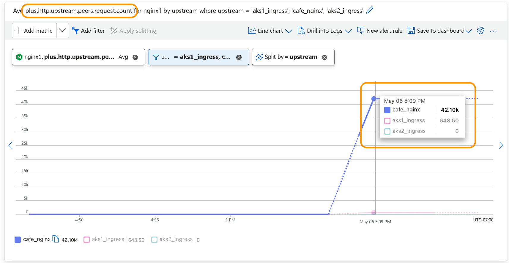

*Great news* - the QA Lead has signed off on the 1% test and your code, and you are `good to go` for the next test.  Turn down your logging level as now you will try `30% Live traffic to AKS1`, you are confident and bold, *make it or break it* is your motto.  

1. Again modify your `/etc/nginx/includes/split-clients.conf` file, this time setting `aks1_ingress` to 30%:

    ```nginx
    # Nginx 4 Azure to AKS1/2 NICs and/or UbuntuVMs for Upstreams
    # Chris Akker, Shouvik Dutta, Adam Currier, Steve Wagner - Mar 2024
    # HTTP Split Clients Configuration for AKS Cluster1/Cluster2 or UbuntuVM ratios
    #
    split_clients $request_id $upstream {

    # Uncomment the percent wanted for AKS Cluster #1, #2, or UbuntuVM
    #0.1% aks1_ingress;
    #1.0% aks1_ingress;
    #5.0% aks1_ingress;
    30% aks1_ingress;      # Next test, 30% Live Traffic
    #50% aks1_ingress;
    #80% aks1_ingress;
    #95% aks1_ingress;
    #99% aks1_ingress;
    #* aks1_ingress;
    #30% aks2_ingress;
    * cafe_nginx;          # Ubuntu VM containers
    #* aks1_nic_direct;    # Direct to NIC pods - headless/no nodeport

    }
    ```

Submit your Nginx Configuration, while watching the AKS1 NIC Dashboard. In a few seconds, traffic stats should jump now to 30%! Hang on to your debugger ...

Checking the Nginx for Azure Monitor Window that you left open, you should see something like this:

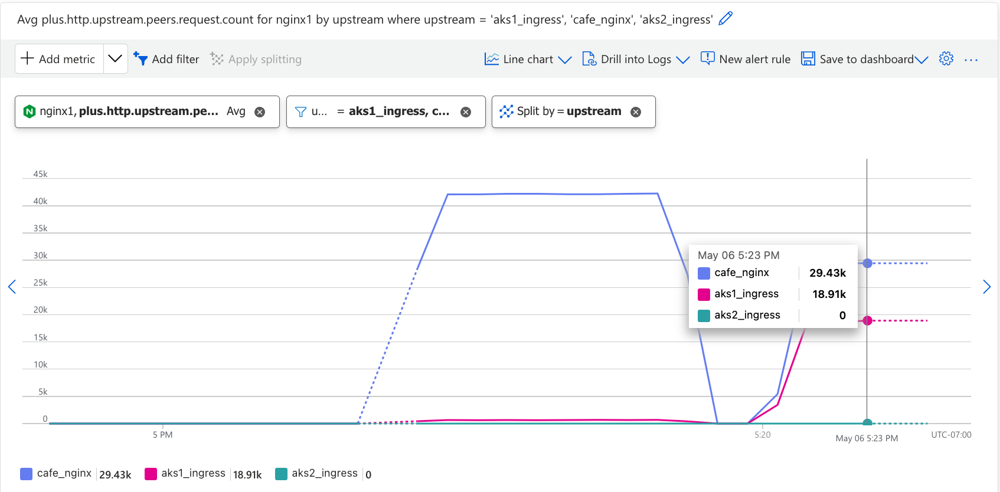

After a couple hours of 30%, all the logs are clean, the dev and test tools are happy, there are NO support tickets, and all is looking peachy.

1. Next up is the 50% test. You know what to do. Modify your `split-clients.conf` file, setting AKS1 Ingress to `50% Live Traffic`. Watch the NIC Dashboard and your Monitoring tools closely.

    ```nginx
    # Nginx 4 Azure to AKS1/2 NICs and/or UbuntuVMs for Upstreams
    # Chris Akker, Shouvik Dutta, Adam Currier, Steve Wagner - Mar 2024
    # HTTP Split Clients Configuration for AKS Cluster1/Cluster2 or UbuntuVM ratios
    #
    split_clients $request_id $upstream {

    # Uncomment the percent wanted for AKS Cluster #1, #2, or UbuntuVM
    #0.1% aks1_ingress;
    #1.0% aks1_ingress;
    #5.0% aks1_ingress;
    #30% aks1_ingress; 
    50% aks1_ingress;     # Next test, 50% Live Traffic
    #80% aks1_ingress;
    #95% aks1_ingress;
    #99% aks1_ingress;
    #* aks1_ingress;
    #* aks2_ingress;
    #30% aks2_ingress;
    * cafe_nginx;          # Ubuntu VM containers
    #* aks1_nic_headless;   # Direct to NIC pods - headless/no nodeport

    }
    ```

Submit your 50% Split configuration and cross your fingers. HERO or ZERO, what will it be today? If the WRK load test has stopped, start it again.

Looking pretty good, traffic is even, no logging errors or tickets, no whining and complaining and texting from Mgmt. Nginx is making you a Rock Star!

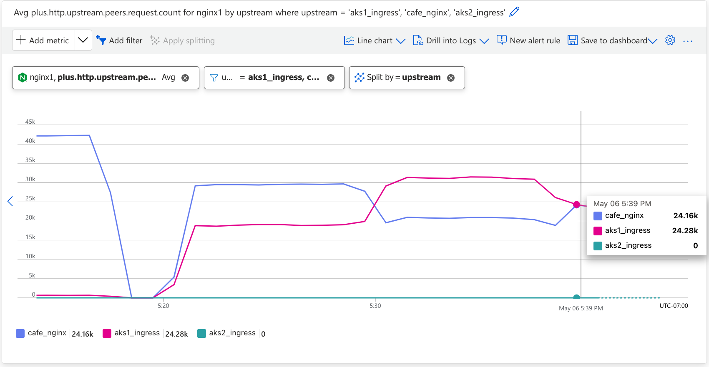
50% Split

>Go for it!  - Increase to 99%, or 100% (but not on a Friday!).

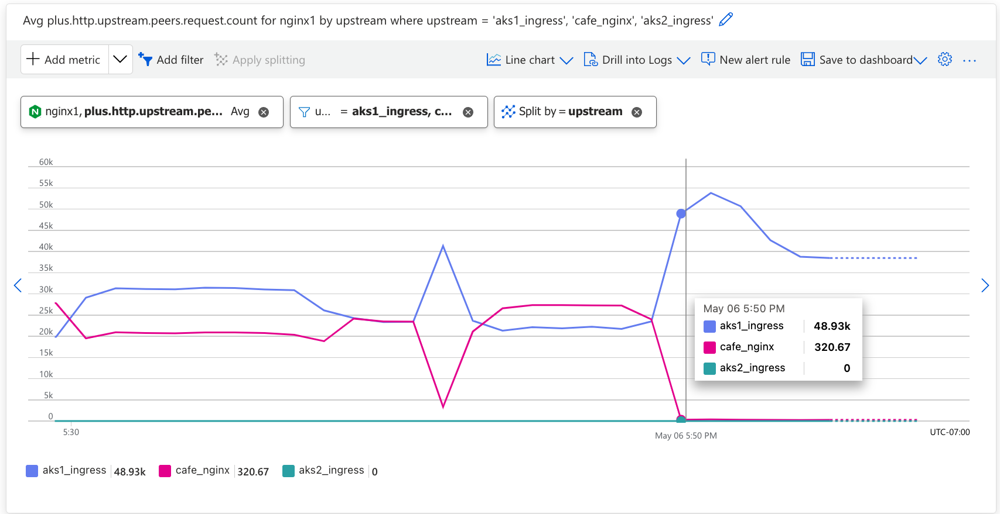
99% Split

>Now that you get the concept and the configuration steps, you can see how EASY it is with Nginx Split Clients to route traffic to different backend applications, including different versions of apps - it's as easy as creating a new Upstream block, and determining the Split Ratio. Consider this not so subtle point - *you did not have to create ONE ticket, change a single DNS record and WAIT, change any firewall rules, update cloud XYZ devices - nothing!*  All you did was tell Nginx to Split existing Live traffic, accelerating your app development velocity into OverDrive.

>>The Director of Development has heard about your success with Nginx for Azure Split Clients, and now also wants a small percentage of Live Traffic for the next App version, but this Alpha version is `running in AKS Cluster2`.  Oh NO!! - Success usually does mean more work.  But lucky for you, Split clients can work with many Upstreams.  So after several beers, microwaved pizza and intense discussions, your QA team decides on the following Splits:

- AKS2 will get 1% traffic - for the Dev Director's request
- AKS1 will get 80% traffic - for new version
- Docker VM will get 19% traffic - for legacy/current version


1. Once again, modify the `split-clients.conf` file, with the percentages needed. Open your Dashboards and Monitoring so that you can watch in real time. You tell the Director, here it comes:

    ```nginx
    # Nginx 4 Azure to AKS1/2 NICs and/or UbuntuVMs for Upstreams
    # Chris Akker, Shouvik Dutta, Adam Currier, Steve Wagner - Mar 2024
    # HTTP Split Clients Configuration for AKS Cluster1/Cluster2 or UbuntuVM ratios
    #
    split_clients $request_id $upstream {

    # Uncomment the percent wanted for AKS Cluster #1, #2, or UbuntuVM
    #0.1% aks1_ingress;
    1.0% aks2_ingress;      # For the Dev Director
    #5.0% aks1_ingress;
    #30% aks1_ingress; 
    #50% aks1_ingress;
    80% aks1_ingress;       # For new version
    #95% aks1_ingress;
    #99% aks1_ingress;
    #* aks1_ingress;
    #* aks2_ingress;
    #30% aks2_ingress;
    * cafe_nginx;           # Ubuntu VM containers
    #* aks1_nic_headless;   # Direct to NIC pods - headless/no nodeport

    }
    ```

Submit your Nginx Configuration.

Check your Nginx Ingress Dashboards, do you see traffic on both, making use of the (5) coffee upstream pods?  What about Azure Monitor ... 

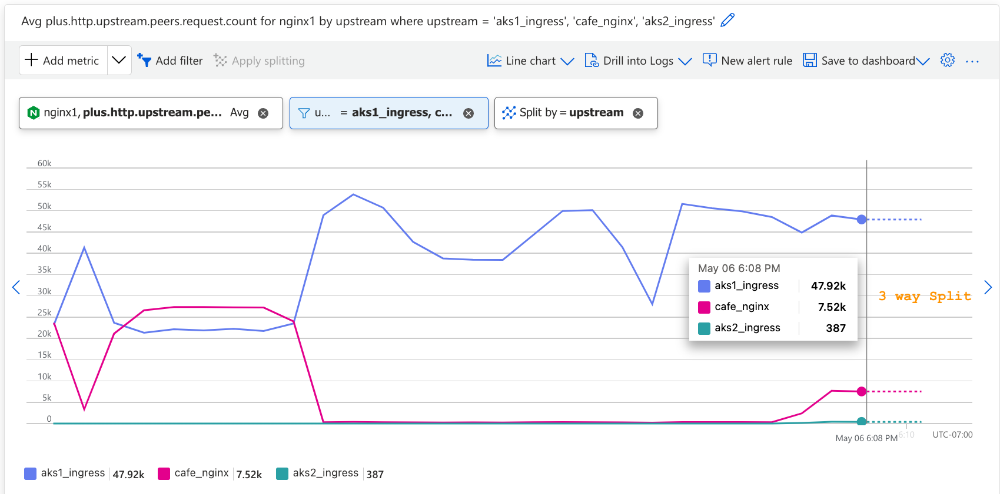

Cafe Nginx - Split 3 ways: DockerVM, AKS1, AKS2

**TADA!!**  You are now splitting Live traffic to THREE separate backend platforms, simulating multiple versions of Cafe Nginx / your application code. (To be fair, in this lab exercise we used the same Cafe Demo image, but you get the idea). Just as quick and easy, you can fire up another Upstream target, and add it to the Splits configuration.

**NOTE:** Several words of caution with Split Clients.

- The ratios must add up to 100% or Nginx will not apply the configuration.
- .01% is the smallest split ratio available, that = 1/10,000th.  
- The * asterick means either 100%, or the remainder after other ratios.
- If all the servers in an Upstream Block are DOWN, you will get that ratio of 502 errors, so always test your Upstreams prior to adding them to Split configurations. There is no elegant way to "re-try" when using Splits.  Changing Splits under HIGH load is not recommended, there is always a chance something could go wrong and you will drop clients/traffic. A maintenance window for changes is always a Best Practice.
- Split Clients is also available for TCP traffic, like your Redis Cluster. It splits traffic based on new incoming TCP connections. Ever heard of Active/Active Redis Clusters? Yes, you can do that and control the ratios, just like shown here for HTTP traffic.

>*HIT a nasty bug! - Director of Dev says the new code can't handle that 1% load, and several other backend systems have crashed!*  - not quite ready for testing like his devs told him...

No worries, you comment out the `aks2_ingress` in the Split Config, and his 1% Live traffic is now going somewhere safe, as soon as you Submit your Nginx Configuration!

But don't be surprised - in a few days he will ask again to send traffic to AKS2, and you can begin the Split migration process, this time from AKS1 to AKS2.  


>>Now you've reached the Ultimate Kubernetes Application Solution, `Mutli Cluster Load Balancing, Active/Active, with Dynamic Split Ratios.` No one else can do this for your app team this easily, it's just Nginx!  

>Cherry on top - not only can you do Split Client `outside` the Cluster with Nginx for Azure, but Nginx Ingress Controller can also do Split Clients `inside` the cluster, ratios between different Services. You can find that example in `Lab10 of the Nginx Plus Ingress Workshop` :-)

### Nginx HTTP Split Client Solutions Overview

Using the HTTP Split Clients module from Nginx can provide multiple traffic management Solutions. Consider some of these that might be applicable to your Kubernetes environments:

- Multi Cluster Active/Active Load Balancing
- Horizontal Cluster Scaling
- HTTP Split Clients - for A/B, Blue/Green, and Canary test and production traffic steering. Allows Cluster operations/maintainence like:
- - Node upgrades / additions
- - Software upgrades/security patches
- - Cluster resource expansions - memory, compute, storage, network, nodes
- - QA and Troubleshooting, using Live Traffic if needed
- - ^^ With NO downtime or reloads
- API Gateway testing/upgrades/migrations

## Configure Nginx for Azure for Redis traffic 


NGINXaaS | Redis
:-------:|:------:
| 


In this exerices, you will use Nginx for Azure to expose the `Redis Leader Service` running in AKS Cluster #2. As Redis communicates with TCP instead of HTTP, the Nginx Stream Context will be used.  Following Nginx Best Practices, and standard Nginx folders/files layout, the `TCP Stream context` configuration files will be created in a new folder, called `/etc/nginx/stream/`.

1. Using the Nginx for Azure Console, modify the `nginx.conf` file, to enable the Stream Context, and include the appropriate config files.  Place this stanza at the bottom of your nginx.conf file:

    ```nginx
    ...
    stream {
        
        include /etc/nginx/stream/*.conf;      # Stream Context nginx files
    }
    ```

    Submit your Nginx Configuration.

1. Using the Nginx for Azure Console, create a new Nginx config file called `/etc/nginx/stream/redis-leader-upstreams.conf`.  Use your AKS2 Nodepool names for server names, and add `:32379` for your port number, matching the Static NodePort for Redis Leader.  Use the example provided, just change the server names:

    ```nginx
    # Nginx 4 Azure to NIC, AKS Node for Upstreams
    # Chris Akker, Shouvik Dutta, Adam Currier, Steve Wagner - Mar 2024
    #
    # nginx ingress upstreams for Redis Leader
    #
    upstream aks2_redis_leader {
       zone aks2_redis_leader 256k;
       least_time last_byte;
    
    # from nginx-ingress NodePort Service / aks Node IPs
       server aks-nodepool1-19485366-vmss000003:32379;    #aks2 node1:
       server aks-nodepool1-19485366-vmss000004:32379;    #aks2 node2:
       server aks-nodepool1-19485366-vmss000005:32379;    #aks2 node3: 
       server aks-nodepool1-19485366-vmss000006:32379;    #aks2 node4: 

    }
    ```

    Submit your Nginx Configuration.

1. Using the Nginx for Azure Console, create a second Nginx config file called `/etc/nginx/stream/redis.example.com.conf`. This will create the Server block for Nginx for Azure, using the Stream TCP Context. Just copy/paste the example provided:

    ```nginx
    # Nginx 4 Azure to NIC, AKS Node for Upstreams
    # Stream for Redis Leader
    # Chris Akker, Shouvik Dutta, Adam Currier, Steve Wagner - Mar 2024
    #
    server {
        
        listen 6379;                      # Standard Redis Port
        status_zone aks2-redis-leader;

        proxy_pass aks2_redis_leader;
    }
    ```

    Submit your Nginx Configuration.

1. Update your Nginx for Azure NSG `n4a-nsg` to allow port 6379 inbound, so you can connect to the Redis Leader:

    Set your `$Enviroment Variables` as appropriate for your Resource Group.

    ```bash
    ## Set environment variables
    export MY_RESOURCEGROUP=c.akker-workshop
    export MY_PUBLICIP=$(curl -4 ifconfig.co)
    ```

    Use Azure CLI to add a new Rule for Redis.

    ```bash
    ## Rule for Redis traffic

    az network nsg rule create \
    --resource-group $MY_RESOURCEGROUP \
    --nsg-name n4a-nsg \
    --name Redis \
    --priority 400 \
    --source-address-prefix $MY_PUBLICIP \
    --source-port-range '*' \
    --destination-address-prefix '*' \
    --destination-port-range 6379 \
    --direction Inbound \
    --access Allow \
    --protocol Tcp \
    --description "Allow Redis traffic"
    ```

    ```bash
    ##Sample Output##
    {
    "access": "Allow",
    "description": "Allow Redis traffic",
    "destinationAddressPrefix": "*",
    "destinationAddressPrefixes": [],
    "destinationPortRange": "6379",
    "destinationPortRanges": [],
    "direction": "Inbound",
    "etag": "W/\"19a674d2-2cc0-481e-b642-f7db545e9f07\"",
    "id": "/subscriptions/<SUBSCRIPTION ID>/resourceGroups/c.akker-workshop/providers/Microsoft.Network/networkSecurityGroups/n4a-nsg/securityRules/Redis",
    "name": "Redis",
    "priority": 400,
    "protocol": "Tcp",
    "provisioningState": "Succeeded",
    "resourceGroup": "c.akker-workshop",
    "sourceAddressPrefix": "209.166.XX.XX",
    "sourceAddressPrefixes": [],
    "sourcePortRange": "*",
    "sourcePortRanges": [],
    "type": "Microsoft.Network/networkSecurityGroups/securityRules"
    }

    ```

### Update local DNS

As you are using FQDN hostnames for the labs, and you will need to update your local computer's `/etc/hosts` file, to use these names with Nginx for Azure.

Edit your local hosts file, adding the `redis.example.com` FQDN as shown below. Use the `External-IP` Address of your Nginx for Azure instance:

```bash
cat /etc/hosts

# Added for N4A Workshop
13.86.100.10 cafe.example.com dashboard.example.com redis.example.com

```

>**Note:** All hostnames are mapped to the same N4A External-IP. Your N4A External-IP address will be different than the example.


## Test Access to the Redis Leader with Redis Tools

If you need to install redis and tools locally, you can follow the instructions on the official site: https://redis.io/docs/latest/operate/oss_and_stack/install/install-redis/

1. Using the `Redis-cli` tool, see if you can connect/ping to the Redis Leader:

    ```bash
    redis-cli -h redis.example.com PING
    ```

    ```bash
    #Response
    PONG
    ```

    ```bash
    redis-cli -h redis.example.com HELLO 2
    ```

    ```bash
    #Response
    1) "server"
    2) "redis"
    3) "version"
    4) "6.0.5"
    5) "proto"
    6) (integer) 2
    7) "id"
    8) (integer) 7590
    9) "mode"
    10) "standalone"
    11) "role"
    12) "master"
    13) "modules"
    14) (empty array)
    ```

Now how cool is that? A Redis Cluster running in AKS, exposed with Nginx Ingress and NodePort, with access provided by Nginx for Azure on the Internet, using a standard hostname and port to connect to.

**Optional:** Run Redis-benchmark on your new Leader, see what performance you can get. Watch your Nginx Ingress Dashboard to see the traffic inside the cluster. Watch your Nginx for Azure with Azure Monitoring as well.


```bash
redis-benchmark -h redis.example.com -c 50 -n 10000 -q --csv
```

```bash
##Sample Output##
"test","rps","avg_latency_ms","min_latency_ms","p50_latency_ms","p95_latency_ms","p99_latency_ms","max_latency_ms"
"PING_INLINE","1882.53","26.406","20.720","24.847","29.263","81.599","268.287"
"PING_MBULK","1875.47","26.478","20.880","24.799","29.359","91.647","176.255"
"SET","1871.26","26.571","20.368","24.911","29.391","84.607","274.175"
"GET","1948.94","25.487","20.912","24.911","29.119","42.175","76.543"
"INCR","1895.38","26.223","20.976","24.991","29.535","68.671","264.703"
"LPUSH","1943.26","25.578","20.384","24.847","28.399","39.551","106.815"
"RPUSH","1870.56","26.538","20.976","24.911","29.999","85.631","268.799"
"LPOP","1926.41","25.761","20.928","24.879","29.183","52.799","173.823"
"RPOP","1949.70","25.480","20.576","24.911","28.703","41.567","232.063"
"SADD","1893.58","26.237","20.912","24.943","29.343","76.031","120.063"
"HSET","1841.96","26.989","20.944","25.023","30.847","91.135","307.455"
"SPOP","1891.79","26.277","20.928","24.767","28.335","77.887","268.799"
"ZADD","1870.21","26.547","20.912","24.927","28.623","96.127","280.063"
"ZPOPMIN","1855.98","26.485","20.704","24.847","28.607","83.007","269.311"
"LPUSH (needed to benchmark LRANGE)","1997.20","24.886","21.008","24.751","27.423","29.983","45.567"
"LRANGE_100 (first 100 elements)","1776.83","27.972","21.232","25.311","31.055","107.967","526.847"
"LRANGE_300 (first 300 elements)","1160.77","42.292","21.616","35.455","98.367","118.527","291.071"
"LRANGE_500 (first 500 elements)","738.50","65.716","23.792","59.391","109.759","119.999","342.015"
"LRANGE_600 (first 600 elements)","603.86","76.472","25.344","70.399","121.087","125.247","446.975"
"MSET (10 keys)","1827.49","27.192","22.352","26.863","30.415","34.399","179.839"
"XADD","1972.39","25.176","21.152","24.975","27.887","30.655","43.071"

```

Some screenshots for you:

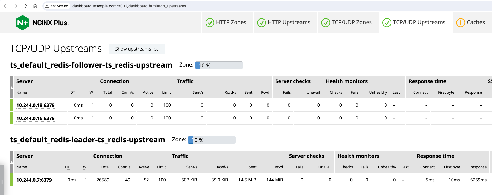

You will likely find that the Redis performance is dimished by the Round trip latency of your Internet and Cloud network path. Redis performance/latency is directly related to network performance. However, the value of running a Redis cluster in any Kubernetes cluster you like, and have access to it anywhere in the world could be a potential solution for you.

>**Security Warning!**  There is no Redis Authentication, or other protections in this Redis configuration, just your Azure NSG IP/port filters. Do NOT use this configuration for Production workloads. The example provided in the Workshop is to show that running Redis is easy, and Nginx makes it easy to access. Take appropriate measures to secure Redis data as needed.

*NOTE:* You only exposed the `Redis Leader` Service with Nginx for Azure. As an Optional Exercise, you can also expose the `Redis Follower` Service with Nginx for Azure. Create a new Upstream block, and then update the `redis.example.com.conf` to add a listener on the Follower port and proxy_pass to the Followers in AKS2.  *Redis is not running in AKS1, only AKS2 (unless you want to add it).*

Nginx Split Clients is also available for the TCP Stream context. You can run Multiple Redis Clusters, and use Split Clients to control the Ratio of traffic between them, just like you did earlier for HTTP requests. Ever thought of `Active/Active Redis Clusters`, with Dynamic Split Ratios ... Nginx can do that!

## Optional - Nginx for Azure / Load Balancing the Nginx Ingress Headless Service

This an Advanced 400 Level Lab Exercise, you will configure a Headless Kubernetes Service, and configure Nginx for Azure to load balance requests directly to the Nginx Ingress Controller(s) running in AKS2, leveraging the Azure CNI / Calico.  This architecture will `bypass NodePort` on the Kubernetes Nodes, allowing `Nginx 4 Azure to connect to Nginx Ingress Pod(s) directly on the same Subnet, n4a-aks2`. You will use the `Nginx Plus Resolver`, to dynamically create the Upstream list, by querying Kube-DNS for the Pod IPs.  

>**NOTE:** This exercise requires detailed understanding and expertise with Kubernetes networking/CNI, Kube-DNS, Nginx Ingress, and the Nginx Plus Resolver. The Nginx Plus DNS Resolver is *NOT* the same as a Linux OS DNS client, it is separate and built into Nginx Plus only. You will configure this Nginx Resolver to query Kube-DNS for the A records, Pod IP Addresses, of the Nginx Ingress Pods. These Pod IPs are `dynamically added to the Upstream block` by Nginx Plus.

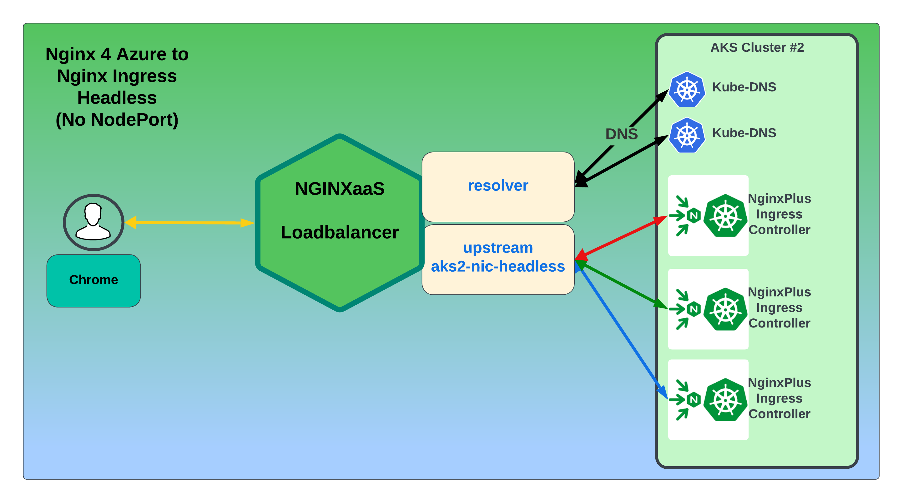

In order to configure this correctly, you will need the following items.

- New Kubernetes Service, for nginx-ingress-headless
- Kube-DNS Pod IP Addresses
- New Nginx for Azure upstream block
- Change the `proxy_pass` to use the new upstream block

1. Inspect the `lab5/nginx-ingress-headless.yaml` manifest.  You are creating another Service, that represents the Nginx Plus Ingress Controller Pod(s).  

- Notice the NodePort is commented out, so you can see that it is not being used.  
- Notice the ClusterIP is set to None. 
- The service name is also different, it's called `nginx-ingress-headless`.
- This is in addition to the existing NodePort Service you created earlier.

```yaml
apiVersion: v1
kind: Service
metadata:
  name: nginx-ingress-headless
  namespace: nginx-ingress
spec:
  type: ClusterIP
  clusterIP: None
  ports:
  - port: 80
    targetPort: 80
    #nodePort: 32080
    protocol: TCP
    name: http
  - port: 443
    targetPort: 443
    #nodePort: 32443
    protocol: TCP
    name: https
  selector:
    app: nginx-ingress
```

1. Create the `nginx-ingress-headless` Service in AKS2, using the manifest provided.

```bash
kubectl config use-context n4a-aks2
kubectl apply -f lab5/nginx-ingress-headless.yaml

```

Check it out:

```bash
kubectl get svc -n nginx-ingress
```

```bash
##Sample Output##
NAME                     TYPE        CLUSTER-IP    EXTERNAL-IP   PORT(S)                                                                   AGE
dashboard-svc            ClusterIP   10.0.58.119   <none>        9000/TCP                                                                  24d
nginx-ingress            NodePort    10.0.169.30   <none>        80:32080/TCP,443:32443/TCP,6379:32379/TCP,6380:32380/TCP,9000:32090/TCP   24d
nginx-ingress-headless   ClusterIP   None          <none>        80/TCP,443/TCP
```

1. Verify the Headless Service points to the actual IP Address for the Nginx Ingress Controller:

    ```bash
    kubectl describe svc nginx-ingress-headless -n nginx-ingress
    ```

    ```bash
    ##Sample Output##
    Name:              nginx-ingress-headless
    Namespace:         nginx-ingress
    Labels:            <none>
    Annotations:       <none>
    Selector:          app=nginx-ingress
    Type:              ClusterIP
    IP Family Policy:  SingleStack
    IP Families:       IPv4
    IP:                None
    IPs:               None
    Port:              http  80/TCP
    TargetPort:        80/TCP
    Endpoints:         172.16.4.240:80
    Port:              https  443/TCP
    TargetPort:        443/TCP
    Endpoints:         172.16.4.240:443
    Session Affinity:  None
    Events:            <none>
    ```

1. Take NOTE of the Endpoint IP Address, `172.16.4.240` in this example.  It should be the same as the IP Address of the NIC Pod, check it out:

    ```bash
    kubectl describe pod $NIC -n nginx-ingress |grep IP
    ```

    ```bash
    ##Sample Output##
    IP:               172.16.4.240
    IPs:
    IP:           172.16.4.240
    ```

Yes, they both match, so your Service definition and Headless manifests are configured correctly.

1. Next you will need the Pod IP Addresses of the Kube-DNS Servers running in AKS2 (!not the Service/Cluster IP Address!). These IPs will be used by the Nginx Resolver for DNS queries. These are, after all, the primary/secondary DNS Servers running in your cluster!

    ```bash
    kubectl describe svc kube-dns -n kube-system
    ```

    ```bash
    ##Sample Output##
    Name:              kube-dns
    Namespace:         kube-system
    Labels:            addonmanager.kubernetes.io/mode=Reconcile
                    k8s-app=kube-dns
                    kubernetes.io/cluster-service=true
                    kubernetes.io/name=CoreDNS
    Annotations:       <none>
    Selector:          k8s-app=kube-dns
    Type:              ClusterIP
    IP Family Policy:  SingleStack
    IP Families:       IPv4
    IP:                10.0.0.10
    IPs:               10.0.0.10
    Port:              dns  53/UDP
    TargetPort:        53/UDP
    Endpoints:         172.16.4.115:53,172.16.4.178:53   # Use these IPs for Nginx Resolver
    Port:              dns-tcp  53/TCP
    TargetPort:        53/TCP
    Endpoints:         172.16.4.115:53,172.16.4.178:53
    Session Affinity:  None
    Events:            <none>
    ```

You will use these two IP Addresses from DNS Service Endpoints in your Nginx for Azure configuration. `172.16.4.115 and 172.16.4.178` in this example.

1. Inspect the `lab5/aks2-nic-headless.conf` file.  

- Notice the Nginx `Resolver` directive configured with the 2 Kube-DNS Endpoint IPs. 
- The `valid=10s` parameter tells Nginx to re-query every 10 seconds, in case there are changes, like scaling up/down or re-starting.
- The `ipv6=off` disables IPv6
- The `status_zone=kube-dns` parameter collects the metrics for Nginx Resolver's queries, successes and failures, which can be seen in Azure Monitoring.
- Notice the server `resolve` directive is added, to query `kube-dns` for the IP Address(es) of the Nginx Ingress Controller's Pod IP(s).
- If there are more than 1 Nginx Ingress Controller running, a list IPs will be returned, and Nginx 4 Azure will load balance all of them.  You can see the list of Nginx Ingress Pod IPs in the Azure Monitor, in the `aks2_nic_headless` Upstream.

Now that the Nginx Headless Service has been configured, and you have the Kube-DNS Pod IP Addresses, you can configure Nginx for Azure.

1. Using the Nginx 4 Azure Console, create a new Nginx config file, `/etc/nginx/conf.d/aks2-nic-headless.conf`. Copy/paste using the example file provided. Just change the IP Addresses to your Kube-DNS IPs.

    ```nginx
    # Nginx 4 Azure direct to NIC for Upstreams
    # Chris Akker, Shouvik Dutta, Adam Currier, Steve Wagner - Mar 2024
    #
    # direct to nginx ingress Headless Service ( no NodePort )
    #
    upstream aks2_nic_headless {
    zone aks2_nic_headless 256k;
    least_time last_byte;
    
    # direct to nginx-ingress Headless Service Endpoint
    # Resolver set to kube-dns IPs

        resolver 172.16.4.115 172.16.4.178 valid=10s ipv6=off status_zone=kube-dns;
    
    # Server name must follow this Kubernetes Service Name format
    # server <service name>.<namespace>.svc.cluster.local

        server nginx-ingress-headless.nginx-ingress.svc.cluster.local:80 resolve;

    keepalive 32;
    }
    ```

Submit your Nginx Configuration.

### Test Nginx for Azure to NIC Headless

1. Once again, change your `proxy_pass` directive in `/etc/nginx/conf.d/cafe.example.com.conf`, to use the new `aks2_nic_headless` upstream.

    ```nginx
    ...
        location / {
            #
            # return 200 "You have reached cafe.example.com, location /\n";
            
            #proxy_pass http://cafe_nginx;          # Proxy AND load balance to Docker VM
            #add_header X-Proxy-Pass cafe_nginx;    # Custom Header
            #proxy_pass http://aks1_ingress;        # Proxy AND load balance to AKS1 Nginx Ingress
            #add_header X-Proxy-Pass aks1_ingress;  # Custom Header
            #proxy_pass http://aks2_ingress;        # Proxy AND load balance to AKS2 Nginx Ingress
            #add_header X-Proxy-Pass aks1_ingress;  # Custom Header
            #proxy_pass http://$upstream;           # Proxy AND load balance to Split Client
            #add_header X-Proxy-Pass $upstream;     # Custom Header
            proxy_pass http://aks2_nic_headless;    # Proxy to AKS2 Nginx Ingress Controllers Headless
            add_header X-Proxy-Pass aks2_nic_headless;  # Custom Header
        }
    ```

Submit your Nginx Configuration.

### Test Nginx for Azure to NIC Headless

1. Open Chrome to http://cafe.example.com/coffee, and hit refresh several times. Inspect the page with Dev Tools, you should see the updated Header value = `aks2_nic_headless`. Notice the `Ingress Controller IP` address is the same as your NIC Pod. Watch your Nginx Ingress Dashboard on AKS2, you will see traffic on all three coffee pods.

*Optional:*  Fire up a loadtest with WRK again, modify your Upstream Selected Filter in Azure Monitor and add `aks2_nic_headless`. All the traffic should be going there.  

**Advanced Deep Dive Exercise:** If you `SCALE UP` the number of Nginx Ingress Pods, the Nginx Ingress Headless Service will represent all of the NIC Replicas. As the Nginx for Azure Resolver is set to re-query every 10 seconds, it should pick up this change in the Nginx Headless Endpoints list quickly. Using the A records from Kube-DNS, Nginx for Azure will update its `aks2_nic_headless` Upstream list, and load balance traffic to ALL the NIC Replicas. You can see the Upstreams List in Azure Monitoring.

Give it a try:

1. Scale UP the number of Nginx Ingress Controllers running to 3:

    ```bash
    kubectl scale deployment nginx-ingress -n nginx-ingress --replicas=3
    ```

    Confirm they started:

    ```bash
    kubectl get pods -n nginx-ingress
    ```

    ```bash
    ##Sample Output##
    NAME                             READY   STATUS    RESTARTS   AGE
    nginx-ingress-69b95fb8ff-n8mn8   1/1     Running   0          16s
    nginx-ingress-69b95fb8ff-ntdwz   1/1     Running   0          2d17h
    nginx-ingress-69b95fb8ff-sgv2b   1/1     Running   0          16s
    ```
        
    Check again, the `nginx-ingress` Headless Service, you should now see THREE Endpoints.
        
    ```bash
    kubectl describe svc nginx-ingress-headless -n nginx-ingress
    ```

    ```bash
    ##Sample Output##
    Name:              nginx-ingress-headless
    Namespace:         nginx-ingress
    Labels:            <none>
    Annotations:       <none>
    Selector:          app=nginx-ingress
    Type:              ClusterIP
    IP Family Policy:  SingleStack
    IP Families:       IPv4
    IP:                None
    IPs:               None
    Port:              http  80/TCP
    TargetPort:        80/TCP
    Endpoints:         172.16.4.201:80,172.16.4.221:80,172.16.4.240:80
    Port:              https  443/TCP
    TargetPort:        443/TCP
    Endpoints:         172.16.4.201:443,172.16.4.221:443,172.16.4.240:443
    Session Affinity:  None
    Events:            <none>
    ```

If you recall, 172.16.2.240 was your first Nginx Ingress Pod, now you have 2 more, 172.16.4.221 and .201. If you `kubectl describe pod` on each one, the NIC Pod IP Addresses will match the Headless Service list, that's how Kubernetes Services work.

1. Test with Chrome. Open your browser to http://cafe.example.com/coffee, and Refresh several times. Watch the `Ingress Controller IP address`, it will change to the 3 NIC Pod IPs, 172.16.4.240, .221, and .201 in this example. Nginx for Azure is load balancing all three Ingress Controllers. 

NOTE:  The aks2_nic_headless Upstream is configured for `least_time last_byte`, so Nginx for Azure will choose the fastest NIC Pod. If you want to see it in Round-Robin mode, comment out the `least_time last_byte` directive.

1. Scale your NICs back to just ONE Pod, and check again with Chrome. Now there is only one Nginx Ingress Controller IP being used, as when you started.

**NOTE:**  It is considered a Best Practice, to run at least THREE Nginx Ingress Controllers for Production workloads, to provide High Availability and additional traffic processing power for your Applications' Pods and Services. Nginx for Azure can work with your Nginx Ingress Controllers nicely to achieve this requirement, as shown here.

**Optional Exercise:** Install a DNS testing Pod in your Cluster, like busy-box or Ubuntu, and use `dig or nslookup` to query the A records from Kube-DNS.


## Wrap Up

As you have seen, using Nginx for Azure is quite easy to create various backend Systems, Services, platforms of different types and have Nginx Load Balance them through a single entry point. Using Advanced Nginx directives/configs with Resolver, Nginx Ingress Controllers, Headless, and even Split Clients help you control and manage dev/test/pre-prod and even Production workloads with ease. Dashboards and Monitoring give you insight with over 240 useful metrics, providing data needed for decisions based on both real time and historical metadata about your Apps and Traffic.

**This completes Lab5.**


## References:

- [NGINX As A Service for Azure](https://docs.nginx.com/nginxaas/azure/)
- [NGINX Plus Product Page](https://docs.nginx.com/nginx/)
- [NGINX Ingress Controller](https://docs.nginx.com//nginx-ingress-controller/)
- [NGINX on Docker](https://docs.nginx.com/nginx/admin-guide/installing-nginx/installing-nginx-docker/)
- [NGINX Directives Index](https://nginx.org/en/docs/dirindex.html)
- [NGINX Variables Index](https://nginx.org/en/docs/varindex.html)
- [NGINX Technical Specs](https://docs.nginx.com/nginx/technical-specs/)
- [NGINX - Join Community Slack](https://community.nginx.org/joinslack)


### Authors

- Chris Akker - Solutions Architect - Community and Alliances @ F5, Inc.
- Shouvik Dutta - Solutions Architect - Community and Alliances @ F5, Inc.
- Adam Currier - Solutions Architect - Community and Alliances @ F5, Inc.
- Steve Wagner - Solutions Architect - Community and Alliances @ F5, Inc.

-------------

Navigate to ([Lab6](../lab6/readme.md) | [LabGuide](../readme.md))
