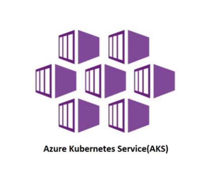

#  Nginx for Azure Load Balancing / Reverse Proxy 

## Introduction

In this lab, you will configure Nginx4Azure to Proxy and Load Balance several different backend systems, including Nginx Ingress Controllers in AKS, and a Windows VM.  You will create and configure the needed Nginx config files, and then verify access to these systems.  The Docker containers, VMs, or AKS Pods are running simple websites that represent web applications.  You will also configure and load balance traffic to a Redis in-memory cache running in the AKS cluster. The AKS Clusters and Nginx Ingress Controllers provide access to these various K8s workloads.


NGINX aaS | AKS | Nginx Ingress | Redis
:-----------------:|:-----------------:|:-----------------:|:-----------------:
  | | |
  
## Learning Objectives

By the end of the lab you will be able to:

- Configure Nginx4Azure to Proxy and Load balance AKS workloads
- Configure Nginx4Azure to Proxy a Windows Server VM
- Test access to your N4A configurations with Curl and Chrome
- Inspect the HTTP content coming from these systems
- Run an HTTP Load Test on your systems
- Configure Nginx4Azure to Proxy to Nginx Ingress Headless
- Enable HTTP Split Clients for Blue/Green, A/B Testing

## Pre-Requisites

- You must have your Nginx4Azure instance up and running
- You must access to the N4A Configuration Panel in Azure Portal
- You must have both AKS Clusters with Nginx Ingress Controllers running
- You must have the Cafe application running in both clusters
- You must have Redis application running in AKS2
- You must have curl or other Browser installed on your system
- You should have Redis-CLI and Redis-Benchmark Client Tools installed on your local system
- See `Lab0` for instructions on setting up your system for this Workshop

<br/>

< Lab specific Image here >

<br/>

## Nginx 4 Azure Fronting AKS Clusters

This exercise will create Nginx Upstream and Server configurations for the AKS Clusters.  You will use the AKS Nodenames, and add the NodePorts of the Nginx Ingress Controllers running in AKS Cluster 1, and AKS Cluster 2.  These were previously deployed and configured in a previous lab.  *Now the fun part, sending traffic to all of them!*

1. Using the Nginx4Azure configuration tool, create a new file called `/etc/nginx/conf.d/aks1-upstreams.conf`.  Copy and Paste the contents of the provided file.  You will have to EDIT this example config file, and change the `server` entries to match your AKS Cluster1 Nodepool Nodenames.  You can find your AKS1 Nodepool Nodenames with `Kubectl` or the Azure Portal.  Make sure you use `:32080` for the port number, this is the static `nginx-ingress NodePort Service` for HTTP traffic that was defined earlier.

1. Get AKS Cluster1 Nodepool Node names:

   ```bash
   kubectl config use-context n4a-aks1
   kubectl get nodes
  
   ```

   ```bash
   #Sample output
   NAME                                STATUS   ROLES   AGE   VERSION
   aks-userpool-76919110-vmss000002    Ready    agent   25h   v1.27.9
   aks-userpool-76919110-vmss000003    Ready    agent   25h   v1.27.9
 
   ```

1. Using these node names for Nginx server names, add `:32080`.

  ```nginx
  # Nginx 4 Azure to NIC, AKS Nodes for Upstreams
  # Chris Akker, Shouvik Dutta, Adam Currier - Mar 2024
  #
  # AKS1 nginx ingress upstreams
  #
  upstream aks1_ingress {
    zone aks1_ingress 256k;

    least_time last_byte;
    
    # from nginx-ingress NodePort Service / aks Node names
    # Note: change servers to match
    #
    server aks-userpool-76919110-vmss000002:32080;    #aks1 node1:
    server aks-userpool-76919110-vmss000003:32080;    #aks1 node2:

    keepalive 32;

   }

  ```

  Submit your Nginx Configuration.  If you have the Server names:port correct, Nginx4Azure will validate and return a Success message.

  **Notice!**  If you stop then re-start your AKS cluster, or scale up/down, or add/remove VMSS worker nodes in the AKS NodePools, this Upstream list `WILL have to be updated to match!`  Any changes to the Nodepool nodes in the Cluster will need to be matched exactly, as the static Upstream configuration must match the Nodepool Nodes:NodePort in your AKS cluster.  If you change the static nginx-ingress NodePort Service, you will have to match it here as well.  *Unfortunately, there is no auto-magic way to synchronize Nginx Upstreams with AKS Nodepool Nodes:ports...yet (we are working on it!).*

1. Repeat the step above, using the Nginx4Azure configuration tool, create a new file called `/etc/nginx/conf.d/aks2-upstreams.conf`.  Copy and Paste the contents of the provided file.  You will have to EDIT this example config file, and change the `server` entries to match your AKS Cluster2 Nodepool Nodenames.  You can find your AKS2 Nodepool Nodenames with `Kubectl` or the Azure Portal.  Make sure you use `:32080` for the port number, this is the static `nginx-ingress NodePort Service` for HTTP traffic that was defined earlier.

1. Get AKS Cluster2 Nodepool Node names:

  ```bash
  kubectl config use-context n4a-aks2
  kubectl get nodes

  ```
  ```bash
  #Sample output
  NAME                                STATUS   ROLES   AGE   VERSION
  aks-nodepool1-19485366-vmss000003   Ready    agent   25h   v1.27.9
  aks-nodepool1-19485366-vmss000004   Ready    agent   25h   v1.27.9
  aks-nodepool1-19485366-vmss000005   Ready    agent   25h   v1.27.9

  ```

  ```nginx
  # Nginx 4 Azure to NIC, AKS Node for Upstreams
  # Chris Akker, Shouvik Dutta, Adam Currier - Mar 2024
  #
  # AKS2 nginx ingress upstreams
  #
  upstream aks2_ingress {
    zone aks2_ingress 256k;

    least_time last_byte;
    
    # from nginx-ingress NodePort Service / aks Node names
    # Note: change servers to match
    #
    server aks-nodepool1-19485366-vmss000003:32080;    #aks2 node1:
    server aks-nodepool1-19485366-vmss000004:32080;    #aks2 node2:
    server aks-nodepool1-19485366-vmss000005:32080;    #aks2 node3: 

    keepalive 32;

  }

  ```

Note, there are 3 upstreams, matching the 3 Nodes in AKS2 cluster.

Submit your Nginx Configuration.  If you have the Server name:port correct, Nginx4Azure will validate and return a Success message.

**Notice!**  If you stop and start your AKS cluster, or add/remove Nodes in the Pools, this Upstream list `WILL` have to be updated to match.  It is a static configuration that must match the Nodepool Nodes:NodePort definition in your AKS cluster. If you change the static nginx-ingress NodePort Service, you will have to match it here as well.  Unfortunately, there are no auto-magic way to synchronize AKS/NodePorts with N4A Upstreams... yet :-)

## Test Nginx 4 Azure to AKS1 Cluster Ingress Controller

Now that you have these new Nginx Upstream blocks created, you can test them.

1. Inspect, then modify the `# comments for proxy_pass` in the `location /` block in the `/etc/nginx/conf.d/cafe.example.com.conf` file, to disable the proxy_pass to `cafe-nginx`, and enable the proxy_pass to `aks1_ingress`, as shown:

  ```nginx
  ...

      location / {
          #
          # return 200 "You have reached cafe.example.com, location /\n";
          
          # proxy_pass http://cafe_nginx;        # Proxy AND load balance to a list of servers
          # proxy_pass http://vm1:32779;          # Proxy to another server
          # proxy_pass http://nginx.org;       # Proxy to another website
          
          proxy_pass http://aks1_ingress;       # Proxy to AKS1 Nginx Ingress Controller NodePort
          add_header X-Proxy-Pass aks1_ingress;  # Custom Header
          
          # proxy_pass http://aks2_ingress;       # Proxy to AKS2 Nginx Ingress Controller NodePort
          # proxy_pass http://aks1_nic_headless;       # Proxy to AKS Nginx Ingress Controller Headless
          # proxy_pass http://$upstream;          # Use Split Clients config

      }
  ...

  ```

  This changes where Nginx will `proxy_pass` the requests.  Nginx will now forward and load balance requests to your `AKS1 Nginx Ingress Controller`, listening on port 32080 on each AKS1 Node.  The Ingress Controller, will then match the VirtualServer hostname, cafe.example.com, and load balance the requests to the Pods.

  >> **Important!**  There are TWO layers of load balancing being used here, Nginx 4 Azure outside the Cluster, and Nginx Ingress Controller inside the cluster.  It's the same Nginx Plus code in both locations, so you can pick and choose which features will work best for every workload, taking advantage of the benefits of Nginx Plus.  You can learn, use, and administer both environments with the same Nginx skillset.

  Submit your Nginx Configuration.

1. Test your change with curl.  Do you see the X-Proxy-Pass Header that you added, so you know which Upstream block is being used ?

```bash
curl -I http://cafe.example.com/coffee

```

```bash
#Sample output
HTTP/1.1 200 OK
Server: N4A-1.25.1-cakker
Date: Fri, 05 Apr 2024 20:08:24 GMT
Content-Type: text/html; charset=utf-8
Connection: keep-alive
Expires: Fri, 05 Apr 2024 20:08:23 GMT
Cache-Control: no-cache
X-Proxy-Pass: aks1_ingress

```

1. Test your change to `proxy_pass` with Chrome, http://cafe.example.com/coffee, hitting Refresh several times - what do you see ?

The Server Name and IP address should now match Cafe PODS running in your AKS1 cluster!  (they were Docker-webX names before, remember?) But how do you verify this ?  Observe the grey box, it uses Nginx variables to populate the metadata fields - the Server name is a K8s assigned POD name, and the Server IP address is the POD IP address, also assiged by K8s. If you Right-Click and `Inspect`, Chrome Dev Tools will open - can you find your `X-Proxy-Pass Header` and Value ?

1. Verify that (Server name = POD name) with `kubectl`.  Set your Kubectl Config Context to n4a-aks1, and get the running Pods:

```bash
kubectl config use-context n4a-aks1
kubectl get pods

```
```bash
#Sample output
NAME                              READY   STATUS    RESTARTS   AGE
coffee-869854dd6-bm2nc            1/1     Running   0          43h
coffee-869854dd6-qmcjh            1/1     Running   0          43h
tea-f6df58c88-k8w5b               1/1     Running   0          43h
tea-f6df58c88-vnjhr               1/1     Running   0          43h

```

Notice the names of the coffee and tea pods, they match the Server name in the grey box.  Check the `coffee-svc` Endpoints:

```bash
kubectl describe svc coffee-svc

```

```bash
#Sample output
Name:              coffee-svc
Namespace:         default
Labels:            <none>
Annotations:       <none>
Selector:          app=coffee
Type:              ClusterIP
IP Family Policy:  SingleStack
IP Families:       IPv4
IP:                None
IPs:               None
Port:              http  80/TCP
TargetPort:        80/TCP
Endpoints:         10.244.0.12:80,10.244.0.20:80   #Nginx Coffee Upstreams
Session Affinity:  None
Events:            <none>

```

You should see a list of the Endpoint POD IPs for the Service, your POD Ips will be different, of course.

But even better, you can also see this list, using the Nginx Plus Dashboard for the Ingress Controller in AKS1, http://dashboard.example.com:9001/dashboard.html.  Check the `HTTP Upstreams`, you should see the Pod IPs for both the `coffee-svc` and `tea-svc`.  This is why you configured and exposed the NIC Dashboard, so you can see real time what Nginx Ingress is doing.

So, why the funny names for the Upstreams with Nginx Ingress ?  If follows a Standard Naming format, which is:

>vs_namespace_virtualservername_servicename

So that displays the Cafe Upstreams as:
- vs_default_cafe-vs_coffee
- vs_default_cafe-vs_test

This naming convention helps you identify the VirtualServers, namespaces, and Services that Nginx Ingress is using.

### Test Nginx 4 Azure to AKS2 Cluster Ingress Controller

Repeat the last procedure, to test access to the AKS2 Cluster and pods.

1. Change the `# comments for proxy_pass` in the `location /` block in the `/etc/nginx/conf.d/cafe.example.com.conf` file, to disable the proxy_pass to aks1_ingress, and enable the proxy_pass to `aks2_ingress`, as shown:

```nginx
...

    location / {
        #
        # return 200 "You have reached cafe.example.com, location /\n";
         
        # proxy_pass http://cafe_nginx;        # Proxy AND load balance to a list of servers
        # proxy_pass http://vm1:32779;          # Proxy to another server
        #proxy_pass http://aks1_ingress;       # Proxy to AKS1 Nginx Ingress Controller NodePort

        proxy_pass http://aks2_ingress;       # Proxy to AKS2 Nginx Ingress Controller NodePort
        add_header X-Proxy-Pass aks2_ingress;  # Custom Header
        
        # proxy_pass http://aks1_nic_headless;       # Proxy to AKS Nginx Ingress Controller Direct
        # proxy_pass http://$upstream;          # Use Split Clients config

    }
...

```

This again changes where Nginx will `proxy_pass` the requests.  Nginx will now forward and load balance requests to your AKS2 Ingress Controller, also listening on port 32080 on each AKS2 Node.

Submit your Nginx Configuration.

Test your change with curl.  Do you see the X-Proxy-Pass Header that you added, so you know which Upstream block is now being used ?

```bash
HTTP/1.1 200 OK
Server: N4A-1.25.1-cakker
Date: Fri, 05 Apr 2024 20:08:24 GMT
Content-Type: text/html; charset=utf-8
Connection: keep-alive
Expires: Fri, 05 Apr 2024 20:08:23 GMT
Cache-Control: no-cache
X-Proxy-Pass: aks2_ingress

```

Test your change in Upstreams with Chrome, hitting Refresh several times - what do you see ?

The Server Name and IP address should now match PODS running in your AKS2 cluster!  (they were AKS1 names before) But how do you verify this ?  Observe again, the Server name is a K8s assigned POD name, and the Server IP address is the POD IP address, also assiged by K8s.  If you Right-Click and `Inspect`, Chrome Dev Tools will open - did your `X-Proxy-Pass Header` and Value change?

1. Verify again that Server name = POD name with `kubectl` in AKS2.  Set your Kubectl Config Context to aks2:

```bash
kubectl config use-context n4a-aks2
kubectl get pods

```

Notice the names of the coffee and tea pods.  Check the `coffee-svc` Endpoints:

```bash
kubectl describe svc coffee-svc

```
You should see a list of the (3) POD IPs for the Service.

Not only can you see this with kubectl, you can also see this list using the Nginx Plus Dashboard for the Ingress Controller.  Check your NIC2 Dashboard at http://dashboard.example.com:9002/dashboard.html, check the HTTP Upstreams, you should see the Pod IPs for both the coffee-svc and tea-svc.  Notice there are 3 each of the coffee and tea Pods, matching the Replicas in the deployments.

## Configure Nginx for Azure for Redis traffic

In this exerices, you will use Nginx for Azure to expose the Redis Leader service running in AKS Cluster #2. As Redis communicates with TCP instead fo HTTP, the Nginx Stream Context will be used.  Following Nginx Best Practices, and standard Nginx disk folder/files layout, the `TCP Stream context` configuration files will be created in a new folder, called `/etc/nginx/stream/`.

1. Using the Nginx for Azure Console, modify the `nginx.conf` file, to enable the Stream Context, to include the appropriate config files.  Place this stanza at the bottom of your nginx.conf file:

    ```nginx
    ...

    stream {
        
        include /etc/nginx/stream/*.conf;      # Stream Context nginx files

    }

    ```

    Submit your Nginx Configuration.

1. Using the Nginx for Azure Console, create a new Nginx conf file called `/etc/nginx/stream/redis-leader-upstreams.conf`.  Use your AKS2 Node names for server names, and add `:32379` for your port number, matching the NodePort for Redis Leader.  Use the example provided, just change the server names:

    ```nginx
    # Nginx 4 Azure to NIC, AKS Node for Upstreams
    # Chris Akker, Shouvik Dutta, Adam Currier - Mar 2024
    #
    # nginx ingress upstreams for Redis Leader
    #
    upstream aks2_redis_leader {
    zone aks2_redis_leader 256k;

    least_time last_byte;
    
    # from nginx-ingress NodePort Service / aks Node IPs
    server aks-nodepool1-19485366-vmss000003:32379;    #aks2 node1:
    server aks-nodepool1-19485366-vmss000004:32379;    #aks2 node2:
    server aks-nodepool1-19485366-vmss000005:32379;    #aks2 node3: 

    }

    ```

    Submit your Nginx Configuration.

1. Using the Nginx for Azure Console, create a new Nginx conf file called `/etc/nginx/stream/redis.example.com.conf`. Use the example provided:

    ```nginx
    # Nginx 4 Azure to NIC, AKS Node for Upstreams
    # Stream for Redis Leader
    # Chris Akker, Shouvik Dutta, Adam Currier - Mar 2024
    #
    server {
        
        listen 6379;
        status_zone aks2-redis-leader;

        proxy_pass aks2_redis_leader;

    }

    ```

    Submit your Nginx Configuration.

1. Update your Nginx for Azure NSG to allow port 6379 inbound, so you can connect to the Redis Leader:

<< TODO - add NSG update here >>

## Update local DNS

As you are using FQDN hostnames for the labs, and you will need to update your local computer's `/etc/hosts` file, to use these names with Nginx for Azure.

Edit your local hosts file, adding the FQDNs as shown below.  Use the `External-IP` Address of your Nginx for Azure instance:

    ```bash
    cat /etc/hosts

    # Added for N4A Workshop
    13.86.100.10 cafe.example.com dashboard.example.com redis.example.com
    
    ```
    >**Note:** All hostnames are mapped to the same N4A External-IP. Your N4A External-IP address will be different than the example.

## Test Access to the Redis Leader with Redis Tools

1. Using the `Redis-cli` tool, see if you can connect/ping to the Redis Leader:

    ```bash
    redis-cli -h redis.example.com PING

    ```
    ```bash
    #Response
    PONG
    ```
    ```bash
    redis-cli -h redis.example.com HELLO 2

    ```
    ```bash
    #Response
    1) "server"
    2) "redis"
    3) "version"
    4) "6.0.5"
    5) "proto"
    6) (integer) 2
    7) "id"
    8) (integer) 7590
    9) "mode"
    10) "standalone"
    11) "role"
    12) "master"
    13) "modules"
    14) (empty array)
    ```

Now how cool is that?  A Redis Cluster running in AKS, exposed with NIC and NodePort, and access provided by Nginx for Azure on the Internet, using a standard hostname and port to connect to.

**Optional:** Run Redis-benchmark on your new Leader, see what performance you can get.  Watch your Nginx Ingress Dashboard to see the traffic inside the cluster.  Watch your Nginx for Azure with Azure Monitoring as well.  

    ```bash
    redis-benchmark -h redis.nginxazure.build -c 100 -q

    ```
    ```bash
    #Sample output
    PING_INLINE: 1585.84 requests per second, p50=61.855 msec
    PING_MBULK: 1604.57 requests per second, p50=61.343 msec
    SET: 1596.37 requests per second, p50=61.759 msec
    GET: 1596.12 requests per second, p50=61.567 msec
    INCR: 1594.44 requests per second, p50=61.663 msec
    LPUSH: 1592.66 requests per second, p50=61.855 msec
    RPUSH: 1577.39 requests per second, p50=62.111 msec
    LPOP: 1603.69 requests per second, p50=61.503 msec
    RPOP: 1610.72 requests per second, p50=61.279 msec
    SADD: 1596.63 requests per second, p50=61.567 msec
    HSET: 1522.12 requests per second, p50=61.951 msec
    SPOP: 1414.31 requests per second, p50=61.791 msec
    ZADD: 1587.96 requests per second, p50=61.759 msec
    ZPOPMIN: 1578.38 requests per second, p50=61.887 msec
    LPUSH (needed to benchmark LRANGE): 1581.40 requests per second, p50=62.207 msec
    LRANGE_100 (first 100 elements): 1552.14 requests per second, p50=62.175 msec
    LRANGE_300 (first 300 elements): 1380.80 requests per second, p50=68.991 msec
    LRANGE_500 (first 500 elements): 1047.39 requests per second, p50=90.175 msec
    LRANGE_600 (first 600 elements): 1014.97 requests per second, p50=91.903 msec
    MSET (10 keys): 1559.36 requests per second, p50=62.783 msec
    XADD: 1581.40 requests per second, p50=61.983 msec

    ```

    Some screenshots for you:

    << Redis Benchmark SS here >>

You will likely find that the Redis performance is dimished by the Round trip latency of your Internet and Cloud network path. Redis performance/latency is directly related to network performance. However, the value of running a Redis cluster, in any Kubernetes cluster you like, and have access to it anywhere in the world could be a possible Solution for you.

>**Security Warning!**  There is no Redis Authentication, or other protections in this Redis configuration, just your Azure NSG IP/port filters.  Do NOT use this configuration for Production workloads.  The example provided in the Workshop is to show that running Redis is easy, and Nginx makes it easy to access.  Take appropriate measures to secure Redis data as needed.

*NOTE:* You only exposed the `Redis Leader` Service with Nginx for Azure.  As an Optional Exercise, you can also expose the `Redis Follower` Service with Nginx for Azure.  Just create a new Upstream block, and then update the `redis.example.com.conf` to listen on the Follower port and proxy_pass to the Followers in AKS2.   *Redis is not running in AKS1, only AKS2 (unless you want to add it).*

## Nginx for Azure for AKS Recap

So far in this Workshop, you created and tested THREE different HTTP Upstream configurations to use with Nginx, for the same application.  Consider that your application Dev Teams could develop new versions of their App, deploy and test them in one Cluster, and then just `switch the proxy_pass` to start using the new version, allowing for simple and easy application upgrades.  And if you find a bad bug, easily `fall-back` to the prior verion; but of course, this never happens with your code, right?

You also created and exposed a Redis cluster with Nginx for Azure, just a couple files needed.  Every thought about 2 Redis Clusters, active/active in different AKS Clusters ... food for thought?  Yes, you could easily do that!

This demonstrates how easy it is to have different platforms/versions for your backend applications, and Nginx can easily be configured to change where it sends the Requests coming in.  You can use Azure VMs, Docker, Containers, or even AKS clusters for your backend apps.  You also added a custom HTTP Header, to help you track which upstream block is being used.  And of course, there are literally hundreds of other Nginx $variables you could use as needed.

> And One Technical Tidbit to point out, if you missed it.  Did you notice the `Difference` in Pod IPs, between AKS1, and AKS2 clusters?  Check your AKS1 and AKS2 Overview > Networking in the Azure Portal.

- Notice that the AKS1 Pods are using an Address from the AKS1-Subnet provided by `kubenet`.  
- Notice that the AKS2 Pods are using an Address from the AKS2-Subnet provided by `Azure CNI / Calico`.  

Nginx for Azure can find and load balance traffic, with whichever Kubernetes CNI your Cluster is using.

## Nginx for Azure Load Balancing for Nginx Ingress Headless Service

In this Advanced Lab Exercise, you will configure Nginx for Azure to load balance requests directly to the Nginx Ingress Controller running in AKS2, leveraging the Azure CNI / Calico.  This architecture will `bypass NodePort` on the Kubernetes Nodes, allowing N4A to connect to Nginx Ingress Pod directly.  This is called a Kubernetes Headless Service.

1. Inspect the `lab5/nginx-ingress-headless.yaml` manifest.  You are creating another Service, that represents the Nginx Plus Ingress Controller(s).  

- Notice the NodePort is commented out, so you can see that it is not being used.  
- Notice the ClusterIP is set to None. 
- The service name is also different, it's called `nginx-ingress-headless`.
- This is in addition to the existing NodePort Service you created earlier.

```yaml
apiVersion: v1
kind: Service
metadata:
  name: nginx-ingress-headless
  namespace: nginx-ingress
spec:
  type: ClusterIP
  clusterIP: None
  ports:
  - port: 80
    targetPort: 80
    #nodePort: 32080
    protocol: TCP
    name: http
  - port: 443
    targetPort: 443
    #nodePort: 32443
    protocol: TCP
    name: https
  selector:
    app: nginx-ingress

```
1. Create the `nginx-ingress-headless` Service in AKS2, using the manifest provided.

```bash
kubectl config use-context n4a-aks2
kubectl apply -f lab5/nginx-ingress-headless.yaml

```

Check it out:

```bash
kubectl get svc -n nginx-ingress

```

```bash
#Sample output
NAME                     TYPE        CLUSTER-IP    EXTERNAL-IP   PORT(S)                                                                   AGE
dashboard-svc            ClusterIP   10.0.58.119   <none>        9000/TCP                                                                  24d
nginx-ingress            NodePort    10.0.169.30   <none>        80:32080/TCP,443:32443/TCP,6379:32379/TCP,6380:32380/TCP,9000:32090/TCP   24d
nginx-ingress-headless   ClusterIP   None          <none>        80/TCP,443/TCP

```

1. Next you will need the IP addresses, of the Kube-DNS Servers running in AKS2.  These IPs will be used by the Nginx Resolver for DNS queries.  These are, after all, the DNS Servers running in your cluster!

```bash
kubectl describe svc kube-dns -n kube-system

```

```bash
#Sample output
Name:              kube-dns
Namespace:         kube-system
Labels:            addonmanager.kubernetes.io/mode=Reconcile
                   k8s-app=kube-dns
                   kubernetes.io/cluster-service=true
                   kubernetes.io/name=CoreDNS
Annotations:       <none>
Selector:          k8s-app=kube-dns
Type:              ClusterIP
IP Family Policy:  SingleStack
IP Families:       IPv4
IP:                10.0.0.10
IPs:               10.0.0.10
Port:              dns  53/UDP
TargetPort:        53/UDP
Endpoints:         172.16.4.115:53,172.16.4.178:53   # Use these IPs for Nginx Resolver
Port:              dns-tcp  53/TCP
TargetPort:        53/TCP
Endpoints:         172.16.4.115:53,172.16.4.178:53
Session Affinity:  None
Events:            <none>

```

You will use the two IP address from DNS Endpoints in your Nginx for Azure configuration.  `172.16.4.115 and 172.16.4.178` in this example.

1. Inspect the `lab5/aks2-nic-headless.conf` file.  

- Notice that Nginx for Azure is using the Nginx `Resolver` directive configured with 2 Kube-DNS Endpoint IPs. 
- The `valid=10s` parameter tells Nginx to re-query every 10 seconds, in case there are changes.
- The `ipv6=off` disables IPv6
- The `status_zone=kube-dns` parameter collects the metrics for Nginx's queries, successes and failures, which can be seen in Azure Monitoring.
- Notice the server `resolve` directive is added to the end, to query `kube-dns Service` for the IP Address of the Nginx Ingress Controller's Pod IP.
- If there are more than 1 Nginx Ingress Controller running, a list IPs will be returned, and N4A will load balance all of them.

Now that the AKS2 Headless Service has been configured, and you have the Kube-DNS IP addresses, you can configure Nginx for Azure.

1. Using the Nginx 4 Azure Console, create a new Nginx config file, `/etc/nginx/conf.d/aks2-nic-headless.conf`.  Copy/paste using the example file provided.  Just change the IP addresses to your Kube-DNS IPs.

```nginx
# Nginx 4 Azure direct to NIC for Upstreams
# Chris Akker, Shouvik Dutta, Adam Currier - Mar 2024
#
# direct to nginx ingress Headless Service ( no NodePort )
#
upstream aks2_nic_headless {
  zone aks2_nic_headless 256k;

  least_time last_byte;
  
  # direct to nginx-ingress Headless Service Endpoint
  # Resolver set to kube-dns Endpoints List
  resolver 172.16.4.115 172.16.4.178 valid=10s ipv6=off status_zone=kube-dns;

  # Server name must follow this Kubernetes Service Name format
  # server <service name>.<namespace>.svc.cluster.local
  server nginx-ingress-headless.nginx-ingress.svc.cluster.local:80 resolve;

  keepalive 32;

}

```

Submit your Nginx Configuraition.

### Test Nginx for Azure to NIC Headless

1. Once again, change your `proxy_pass` directive in `/etc/nginx/conf.d/cafe.example.com.conf`, to use the new `aks2_nic_headless` upstream.

```nginx
...

    location / {
        #
        # return 200 "You have reached cafe.example.com, location /\n";
         
        #proxy_pass http://cafe_nginx;        # Proxy AND load balance to Docker VM
        #add_header X-Proxy-Pass cafe_nginx;  # Custom Header

        #proxy_pass http://aks1_ingress;        # Proxy AND load balance to AKS1 Nginx Ingress
        #add_header X-Proxy-Pass aks1_ingress;  # Custom Header

        #proxy_pass http://aks2_ingress;        # Proxy AND load balance to AKS2 Nginx Ingress
        #add_header X-Proxy-Pass aks1_ingress;  # Custom Header

        proxy_pass http://aks2_nic_headless;    # Proxy to AKS2 Nginx Ingress Controllers Headless
        add_header X-Proxy-Pass aks2_nic_headless;  # Custom Header

    }
    
```

Submit your Nginx Configuration.

### Test Nginx for Azure to NIC Headless

1.  Just open Chrome to http://cafe.example.com/coffee, and hit refresh several times.  Inspect the page with Dev Tools, you should see the updated Header value = `aks2_nic_headless`.


<br/>

**This completes Lab5.**

<br/>

## References:

- [NGINX As A Service for Azure](https://docs.nginx.com/nginxaas/azure/)
- [NGINX Plus Product Page](https://docs.nginx.com/nginx/)
- [NGINX Ingress Controller](https://docs.nginx.com//nginx-ingress-controller/)
- [NGINX on Docker](https://docs.nginx.com/nginx/admin-guide/installing-nginx/installing-nginx-docker/)
- [NGINX Directives Index](https://nginx.org/en/docs/dirindex.html)
- [NGINX Variables Index](https://nginx.org/en/docs/varindex.html)
- [NGINX Technical Specs](https://docs.nginx.com/nginx/technical-specs/)
- [NGINX - Join Community Slack](https://community.nginx.org/joinslack)

<br/>

### Authors

- Chris Akker - Solutions Architect - Community and Alliances @ F5, Inc.
- Shouvik Dutta - Solutions Architect - Community and Alliances @ F5, Inc.
- Adam Currier - Solutions Architect - Community and Alliances @ F5, Inc.

-------------

Navigate to ([Lab6](../lab6/readme.md) | [LabX](../labX/readme.md))
