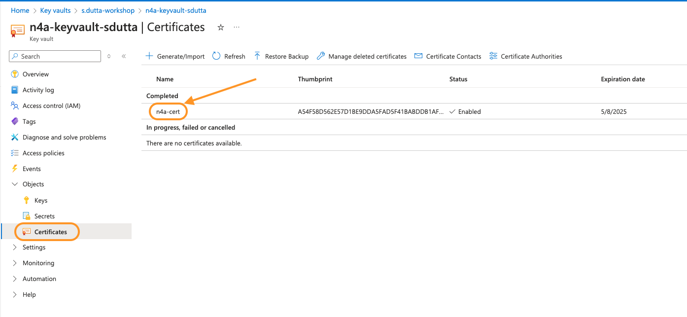
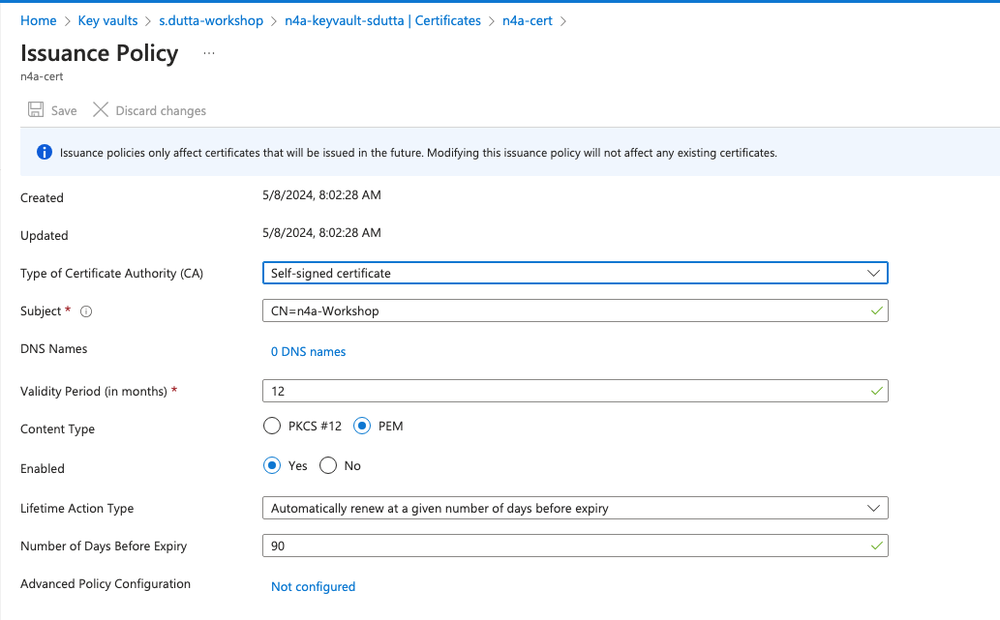
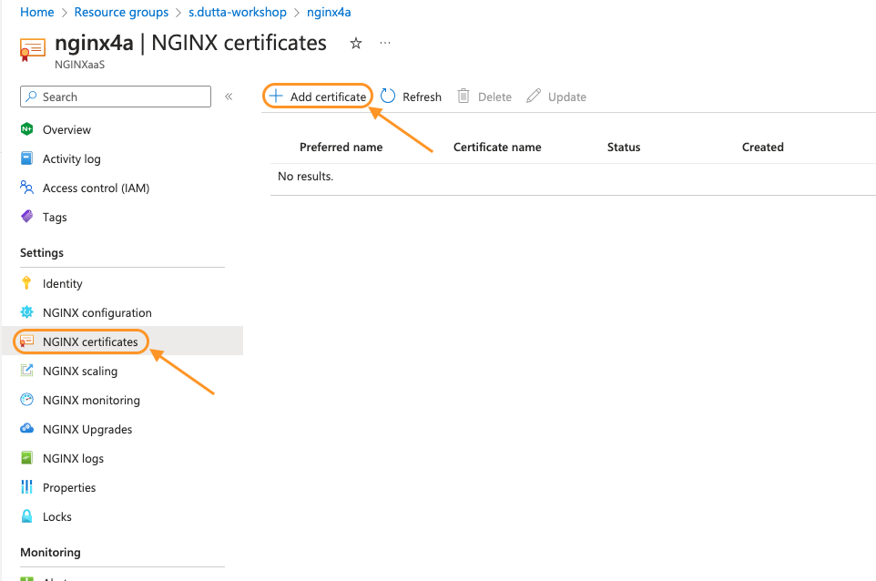
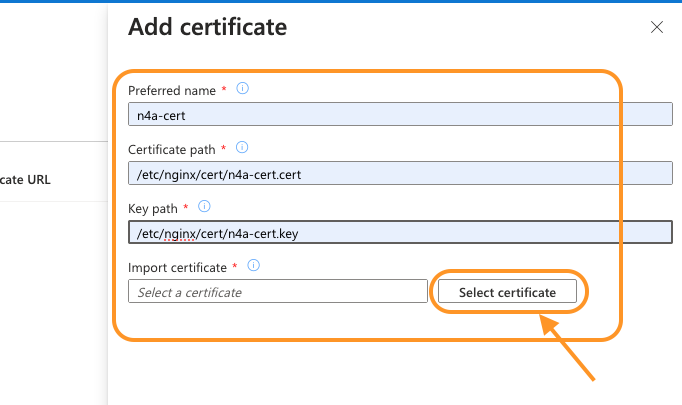
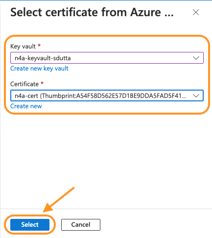
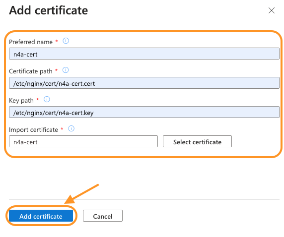
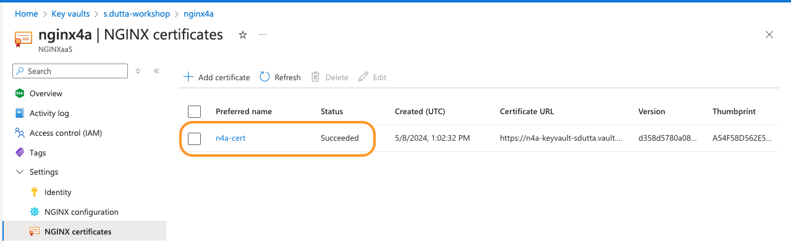
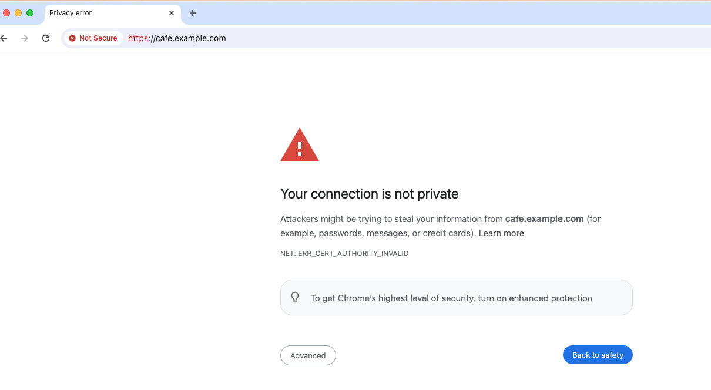
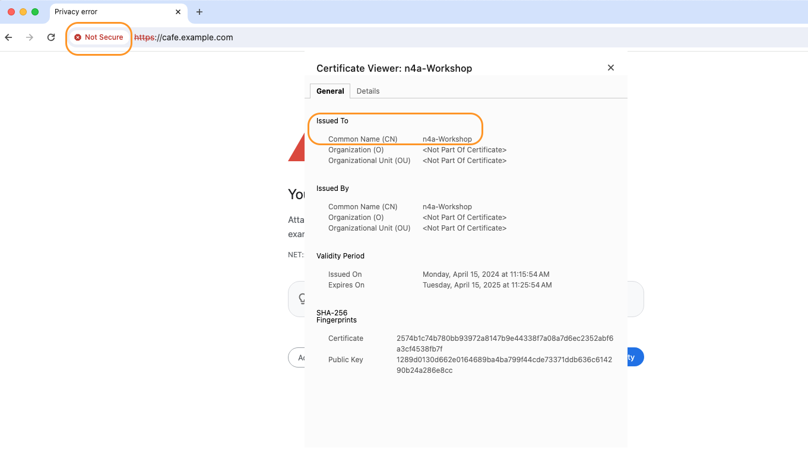

# Azure Key Vault / TLS Essentials

## Introduction

In this lab, you will create a new key-vault resource that would be storing self-signed certificates. You will then configure Nginx for Azure to listen for https traffic and then terminate TLS before proxying and load balancing back to the backend system.

< Lab specific Images here, in the /media sub-folder >

NGINX aaS | Docker
:-------------------------:|:-------------------------:
  |
  
## Learning Objectives

By the end of the lab you will be able to:

- Build your own Azure Key Vault resource.
- Create your self-signed TLS certificate.
- Configure NGINX for Azure to listen and terminate TLS traffic
- Test and validate TLS traffic components and settings

## Pre-Requisites

- You must have  your Nginx for Azure resource up and running
- You must have `Owner` role on the resource group that includes NGINX for Azure resource
- You must also have backend system resources up and running.
- See `Lab0` for instructions on setting up your system for this Workshop

### Create Azure Key Vault resource

1. Create an Azure key vault within the same resource group which holds your NGINX for azure resource.

    ```bash
    ## Set environment variable
    export MY_RESOURCEGROUP=s.dutta-workshop
    export MY_INITIALS=sdutta
    export MY_KEYVAULT=n4a-keyvault-$MY_INITIALS
    ```

    Once the environment variables are all set, run below command to create the key vault resource

    ```bash
    az keyvault create \
    --resource-group $MY_RESOURCEGROUP \
    --name $MY_KEYVAULT \
    --enable-rbac-authorization false
    ```

    ```bash
    ##Sample Output##
    {
    "id": "/subscriptions/<SUBSCRIPTION_ID>/resourceGroups/s.dutta-workshop/providers/Microsoft.KeyVault/vaults/n4a-keyvault-sdutta",
    "location": "centralus",
    "name": "n4a-keyvault-sdutta",
    "properties": {
        "accessPolicies": [
        {
            "applicationId": null,
            "objectId": "xxxx-xxxx-xxxx-xxxx-xxxx",
            "permissions": {
            "certificates": [
                "all"
            ],
            "keys": [
                "all"
            ],
            "secrets": [
                "all"
            ],
            "storage": [
                "all"
            ]
            },
            "tenantId": "xxxx-xxxx-xxxx-xxxx-xxxx"
        }
        ],
        "createMode": null,
        "enablePurgeProtection": null,
        "enableRbacAuthorization": false,
        "enableSoftDelete": true,
        "enabledForDeployment": false,
        "enabledForDiskEncryption": null,
        "enabledForTemplateDeployment": null,
        "hsmPoolResourceId": null,
        "networkAcls": null,
        "privateEndpointConnections": null,
        "provisioningState": "Succeeded",
        "publicNetworkAccess": "Enabled",
        "sku": {
        "family": "A",
        "name": "standard"
        },
        "softDeleteRetentionInDays": 90,
        "tenantId": "xxxx-xxxx-xxxx-xxxx-xxxx",
        "vaultUri": "https://n4a-keyvault-sdutta.vault.azure.net/"
    },
    "resourceGroup": "s.dutta-workshop",
    "systemData": {
        "createdAt": "2024-05-08T12:51:45.338000+00:00",
        "createdBy": "<YOUR EMAIL ID>",
        "createdByType": "User",
        "lastModifiedAt": "2024-05-08T12:51:45.338000+00:00",
        "lastModifiedBy": "<YOUR EMAIL ID>",
        "lastModifiedByType": "User"
    },
    "tags": {},
    "type": "Microsoft.KeyVault/vaults"
    }
    ```

    > **NOTE:** Within the output json you should have a `"provisioningState": "Succeeded"` field which validates the command successfully provisioned the resource.

2. Next you would provide permissions to access this keyvault to the user assigned managed identity that you created while creating NGINX for Azure resource.
3. Copy the `PrincipalID` of the user identity into an environment variable using below command.

    ```bash
    ## Set environment variable
    MY_PRINCIPALID=$(az identity show \
    --resource-group $MY_RESOURCEGROUP \
    --name n4a-useridentity \
    --query principalId \
    --output tsv)
    ```

4. Now assign GET secrets and GET certificates permission to this user assigned managed identity for your keyvault using below command.

    ```bash
    az keyvault set-policy \
    --name $MY_KEYVAULT \
    --certificate-permissions get \
    --secret-permissions get \
    --object-id $MY_PRINCIPALID
    ```

    > **NOTE:** Within the output json you should have a `"provisioningState": "Succeeded"` field which validates the command successfully set the policy.

### Create a self-signed TLS certificate

1. In this section, you will create a self-signed certificate using the Azure CLI.

   >**NOTE:** It should be clearly understood, that Self-signed certificates are exactly what the name suggest - they are created and signed by you or someone else. **They are not signed by any official Certificate Authority**, so they are not recommended for any use other than testing in lab exercises within this workshop. Most Modern Internet Browsers will display Security Warnings when they receive a Self-Signed certificate from a webserver. In some environments, the Browser may actually block access completely. So use Self-signed certificates with **CAUTION**.

2. Create a self-signed certificate by running the below command.

    > Make sure your Terminal is the `nginx-azure-workshops/labs` directory before running the below command.

    ```bash
    az keyvault certificate create \
    --vault-name $MY_KEYVAULT \
    --name n4a-cert \
    --policy @lab6/self-certificate-policy.json
    ```

    ```bash
    ##Sample Output##
    {
    "cancellationRequested": false,
    "csr": "<Your Certificate Signing Request Data>",
    "error": null,
    "id": "https://n4a-keyvault-sdutta.vault.azure.net/certificates/n4a-cert/pending",
    "issuerParameters": {
        "certificateTransparency": null,
        "certificateType": null,
        "name": "Self"
    },
    "name": "n4a-cert",
    "requestId": "9e3abe3b0977420cba1733c326fe26e5",
    "status": "completed",
    "statusDetails": null,
    "target": "https://n4a-keyvault-sdutta.vault.azure.net/certificates/n4a-cert"
    }
    ```

    > **NOTE:** Within the output json you should have a `"status": "completed"` field which validates the command successfully created the certificate.

3. Now log into Azure portal and navigate to your resource-group and then click on the `n4a-keyvault-$MY_INITIALS` key-vault resource.

4. Within the keyvault resources window, click on `Certificates` under `Objects` from the left pane. You should see a self-signed certificate named `n4a-cert` within the certificates pane.
    

5. Click on the newly created certificate and then open up `Issuance Policy` tab for more details on the certificate. You will use this certificate with NGINX for Azure resource to listen for HTTPS traffic.
    

### Configure NGINX for Azure to listen listen and terminate TLS traffic

Now that you have a self signed TLS certificate for testing, you will configure NGINX for Azure resource to use them.

1. Within your resource-group, click on the NGINX for Azure resource (`nginx4a`).

1. From the left pane, click on `NGINX certificates` under `Settings` and then click on the `+ Add certificate` button to add your self signed certificate that you created in previous section.

    

1. Within the `Add Certificate` pane, fill in below details:
    - **Preferred name:** Any unique name for the certificate (eg. n4a-cert)
    - **Certificate path:** Logical path where the certificate would recide. (eg. /etc/nginx/cert/n4a-cert.cert)
    - **Key path:** Logical path where the key would recide. (eg. /etc/nginx/cert/n4a-cert.key)
        
    - Click on the `Select Certificate` button and then fill in below certificate details. Once done click `Select`
      - **Key vault:** Select your key vault (eg. n4a-keyvault-sdutta)
      - **Certificate name:** Select a certificate (eg. n4a-cert)

        
  
1. Once all the fields have been filled, click on `Add Certificate` to save the certificate within NGINX for Azure.

    

1. You should see your certificate in a `Succeeded` status if the values that you entered in previous step was all correct.

    

1. Now you will modify your `cafe.example.com.conf` file that you created in `lab2` to set up cafe.example.com as a HTTPS server. First you will add the `ssl` parameter to the `listen` directive in the `server` block. You will then specify the server certificate and private key file within the configuration to point to the certificate that you added in previous steps.

1. Open `lab6/cafe.example.com.conf`. Below is the list of changes that you can observe which has changed from `lab2/cafe.example.com.conf` file to enable HTTPS traffic on cafe.example.com.
   - On line #6, the listen port has been updated from port 80 to 443. Also `ssl` parameter has been added to enable TLS termination for this `server` block.
   - On line #11-12, the `ssl_certificate` and `ssl_certificate_key` directives have been added and points to the certificate path that you provided when you added certificate to the NGINX for Azure resource.
  
    ```nginx
    server {
        
        listen 443 ssl; # Listening on port 443 with "ssl" parameter for terminating TLS on all IP addresses on this machine

        server_name cafe.example.com;   # Set hostname to match in request
        status_zone cafe.example.com;   # Metrics zone name

        ssl_certificate /etc/nginx/cert/n4a-cert.cert;
        ssl_certificate_key /etc/nginx/cert/n4a-cert.key;

        snip...
    } 
    ```

1. Within the Azure portal, open your resource-group, click on the NGINX for Azure resource (`nginx4a`).

1. From the left pane, click on `NGINX configuration` under `Settings` and then open the `cafe.example.com.conf` file under `/etc/nginx/conf.d` directory. This would open the config file in the editor.

1. Copy the content of `lab6/cafe.example.com.conf` file and replace the existing `cafe.example.com.conf` content with it.

1. Click on `Submit` to push the config changes to the NGINX for Azure resource.

### Test and validate TLS traffic components and settings

1. Make sure you have mapped your NGINX for Azure resource public IP to `cafe.example.com` hostname within your host file. If not present then please do insert it as you would require the mapping for testing.

   ```bash
   cat /etc/hosts | grep cafe.example.com
   ```

1. Using your terminal, try to run the below curl command

    ```bash
    curl https://cafe.example.com
    ```

    ```bash
    ##Sample Output##
    curl: (60) SSL certificate problem: unable to get local issuer certificate
    More details here: https://curl.se/docs/sslcerts.html

    curl failed to verify the legitimacy of the server and therefore could not establish a secure connection to it. To learn more about this situation and how to fix it, please visit the web page mentioned above.
    ```

    As you can see, **curl reports an error** that the certificate is not legitimate (because it is self-signed) and refuses to complete the request. Adding the `-k` flag means `-insecure`, would tell curl to ignore this error. This flag is required for self-signed certificates.

1. Try again now with a `-k` flag added to curl

    ```bash
    curl -k https://cafe.example.com
    ```

    << Copy sample output once cafe upstream has been added >>

1. Now try it with a browser, go to https://cafe.example.com. YIKES - what's this?? Most modern browsers will display an **Error or Security Warning**:

    

1. You can use browser's built-in certificate viewer to look at the details of the TLS certificate that was sent from NGINX to your browser. In address bar, click on the `Not Secure` icon, then click on `Certificate is not valid`. This will display the certificate. You can verify looking at the `Comman Name` field that this is the same certificate that you provided to NGINX for Azure resource.

    

1. Within the browser, close the Certificate Viewer, click on the `Advanced` button, and then click on `Proceed to cafe.example.com (unsafe)` link, to bypass the warning and continue.
   > CAUTION:  Ignoring Browser Warnings is **Dangerous**, only Ignore these warnings if you are 100% sure it is safe to proceed!!

1. After you safely Proceed, you should see the cafe.example.com output as below

    << Add output screenshot once cafe upstream has been added >>

<br/>

**This completes Lab6.**

<br/>

## References:

- [NGINX As A Service for Azure](https://docs.nginx.com/nginxaas/azure/)
  
- [NGINX As A Service SSL/TLS Docs](https://docs.nginx.com/nginxaas/azure/getting-started/ssl-tls-certificates/)
- [NGINX Directives Index](https://nginx.org/en/docs/dirindex.html)
- [NGINX - Join Community Slack](https://community.nginx.org/joinslack)

<br/>

### Authors

- Chris Akker - Solutions Architect - Community and Alliances @ F5, Inc.
- Shouvik Dutta - Solutions Architect - Community and Alliances @ F5, Inc.
- Adam Currier - Solutions Architect - Community and Alliances @ F5, Inc.

-------------

Navigate to ([Lab7](../lab7/readme.md) | [LabX](../labX/readme.md))
