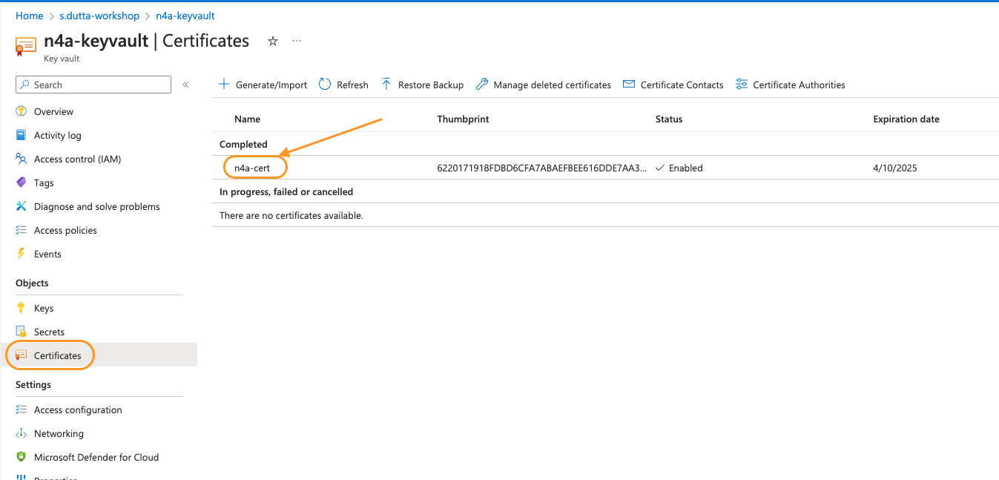
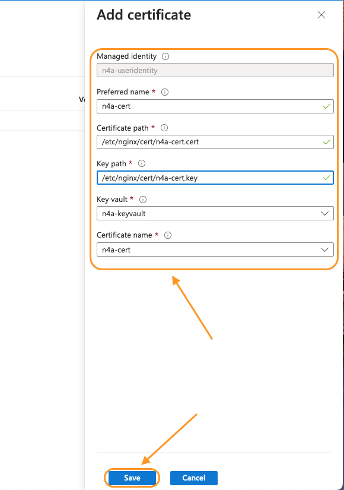
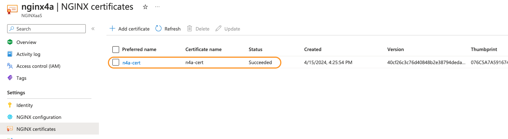

# Azure Key Vault / TLS Essentials

## Introduction

In this lab, you will create a new key-vault resource that would be storing self-signed certificates. You will then configure Nginx for Azure to listen for https traffic and then terminate TLS before proxying and load balancing back to the backend system.

< Lab specific Images here, in the /media sub-folder >

NGINX aaS | Docker
:-------------------------:|:-------------------------:
  |
  
## Learning Objectives

By the end of the lab you will be able to:

- Build your own Azure Key Vault resource.
- Create your self-signed certificate.
- Configure NGINX for Azure to listen for HTTPS traffic.
- And finally, terminate TLS before proxying traffic back to backend application

## Pre-Requisites

- You must have  your Nginx for Azure resource up and running
- You must have `Owner` role on the resource group that includes NGINX for Azure resource
- You must also have backend system resources up and running.
- See `Lab0` for instructions on setting up your system for this Workshop

### Create Azure Key Vault resource

1. Create an Azure key vault within the same resource group which holds your NGINX for azure resource.

    ```bash
    ## Set environment variable
    MY_RESOURCEGROUP=s.dutta-workshop
    ```

    Once the environment variables are all set, run below command to create the key vault resource

    ```bash
    az keyvault create \
    --resource-group $MY_RESOURCEGROUP \
    --name n4a-keyvault \
    --enable-rbac-authorization false
    ```

2. The above command should provide a json output. If you look at its content then it should have a `provisioningState` key with `Succeeded` as it value. This field is an easy way to validate the command successfully provisioned the resource.

3. Next you would provide permissions to access this keyvault to the user identity that you created while creating NGINX for Azure resource.
4. Copy the `PrincipalID` of the user identity into an environment variable using below command.

    ```bash
    ## Set environment variable
    MY_PRINCIPALID=$(az identity show \
    --resource-group $MY_RESOURCEGROUP \
    --name n4a-useridentity \
    --query principalId \
    --output tsv)
    ```

5. Now assign GET secrets and GET certificates permission to this user identity for your keyvault using below command.

    ```bash
    az keyvault set-policy \
    --name n4a-keyvault \
    --certificate-permissions get \
    --secret-permissions get \
    --object-id $MY_PRINCIPALID
    ```

### Create a self-signed certificate

1. In this section, you will create a self-signed certificate using the Azure CLI.

   **NOTE:** It should be clearly understood, that Self-signed certificates are exactly what the name suggest - they are created and signed by you or someone else. **They are not signed by any official Certificate Authority**, so they are not recommended for any use other than testing in lab exercises within this workshop. Most Modern Internet Browsers will display Security Warnings when they receive a Self-Signed certificate from a webserver. In some environments, the Browser may actually block access completely. So use Self-signed certificates with **CAUTION**.

2. Create a self-signed certificate by running the below command.

    ```bash
    az keyvault certificate create \
    --vault-name n4a-keyvault \
    --name n4a-cert \
    --policy @labs/lab6/self-certificate-policy.json
    ```

3. The above command should provide a json output. If you look at its content then it should have a `status` key with `completed` as it value. This field is an easy way to validate the command successfully created the certificate.

4. Now log into Azure portal and navigate to your resource-group and then click on the `n4a-keyvault` key vault resource.

5. Within the keyvault resources window, click on `Certificates` from the left pane. You should see a self-signed certificate named `n4a-cert` within the certificates pane.
    

6. Click on the newly created certificate and then open up `Issuance Policy` tab for more details on the certificate. You will use this certificate with NGINX for Azure resource to listen for HTTPS traffic.

### Configure NGINX for Azure to listen for HTTPS traffic

Now that you have a self signed TLS certificate for testing, you will configure NGINX for Azure resource to use them.

1. Within your resource-group, click on the NGINX for Azure resource (`nginx4a`).

1. From the left pane, click on `NGINX certificates` under `Settings` and then click on the `+ Add certificate` button to add your self signed certificate that you created in previous section.

    

1. Within the `Add Certificate` pane, fill in below details:
    - **Preferred name:** Any unique name for the certificate (eg. n4a-cert)
    - **Certificate path:** Logical path where the certificate would recide. (eg. /etc/nginx/cert/n4a-cert.cert)
    - **Key path:** Logical path where the key would recide. (eg. /etc/nginx/cert/n4a-cert.key)
    - **Key vault:** Select your key vault (eg. n4a-keyvault)
    - **Certificate name:** Select a certificate (eg. n4a-cert)
  
    Once all the fields have been filled, click on `Save` to save the certificate within NGINX for Azure.
    

1. You should see your certificate in a `Succeeded` status if the values that you entered in previous step was all correct.

    

1. Now you will modify your `cafe.example.com.conf` file that you created in `lab2` to set up cafe.example.com as a HTTPS server. First you will add the `ssl` parameter to the `listen` directive in the `server` block. You will then specify the server certificate and private key file within the configuration to point to the certificate that you added in previous steps.

1. Open `lab6/cafe.example.com.conf`. Below is the list of changes that you can observe which has changed from `lab2/cafe.example.com.conf` file to enable HTTPS traffic on cafe.example.com.
   - On line #6, the listen port has been updated from port 80 to 443. Also `ssl` parameter has been added to enable TLS termination for this `server` block.
   - On line #11-12, the `ssl_certificate` and `ssl_certificate_key` directives have been added and points to the certificate path that you provided when you added certificate to the NGINX for Azure resource.
  
    ```nginx
    server {
        
        listen 443 ssl; # Listening on port 443 with "ssl" parameter for terminating TLS on all IP addresses on this machine

        server_name cafe.example.com;   # Set hostname to match in request
        status_zone cafe.example.com;   # Metrics zone name

        ssl_certificate /etc/nginx/certs/n4a-cert.cert;
        ssl_certificate_key /etc/nginx/certs/n4a-cert.key;

        snip...
    } 
    ```

1. Within the Azure portal, open your resource-group, click on the NGINX for Azure resource (`nginx4a`).

1. From the left pane, click on `NGINX configuration` under `Settings` and then open the `cafe.example.com.conf` file under `/etc/nginx/conf.d` directory. This would open the config file in the editor.

1. Copy the content of `lab6/cafe.example.com.conf` file and replace the existing `cafe.example.com.conf` content with it.

1. Click on `Submit` to push the config changes to the NGINX for Azure resource.

1. 


<br/>

**This completes Lab6.**

<br/>

## References:

- [NGINX As A Service for Azure](https://docs.nginx.com/nginxaas/azure/)
- [NGINX Plus Product Page](https://docs.nginx.com/nginx/)
- [NGINX Ingress Controller](https://docs.nginx.com//nginx-ingress-controller/)
- [NGINX on Docker](https://docs.nginx.com/nginx/admin-guide/installing-nginx/installing-nginx-docker/)
- [NGINX Directives Index](https://nginx.org/en/docs/dirindex.html)
- [NGINX Variables Index](https://nginx.org/en/docs/varindex.html)
- [NGINX Technical Specs](https://docs.nginx.com/nginx/technical-specs/)
- [NGINX - Join Community Slack](https://community.nginx.org/joinslack)

<br/>

### Authors

- Chris Akker - Solutions Architect - Community and Alliances @ F5, Inc.
- Shouvik Dutta - Solutions Architect - Community and Alliances @ F5, Inc.
- Adam Currier - Solutions Architect - Community and Alliances @ F5, Inc.

-------------

Navigate to ([Lab7](../lab7/readme.md) | [LabX](../labX/readme.md))
