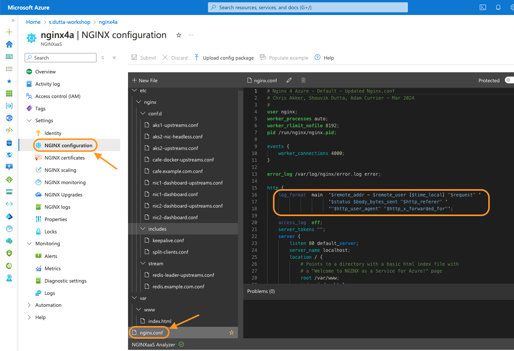
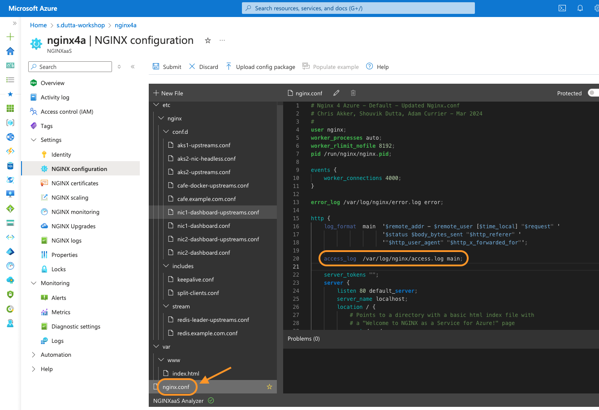
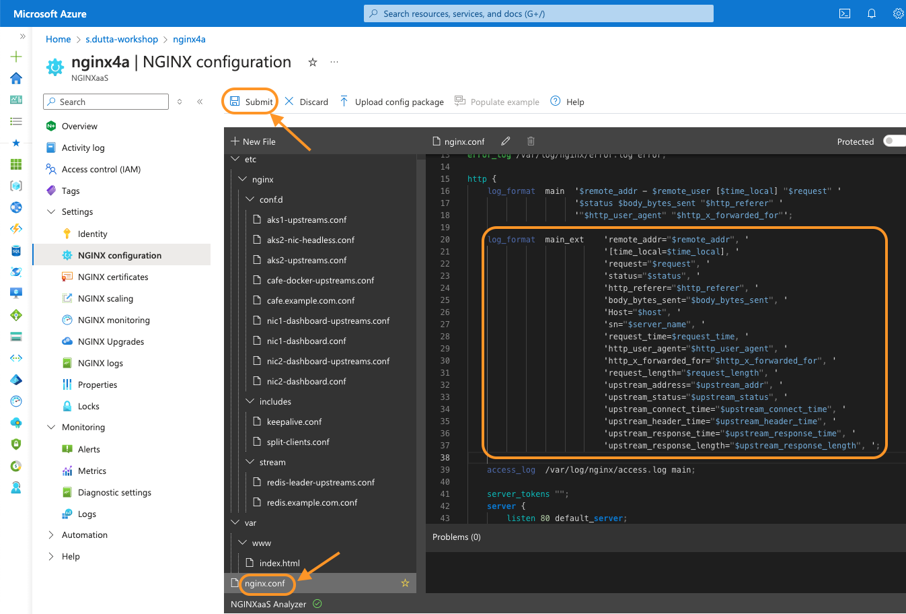
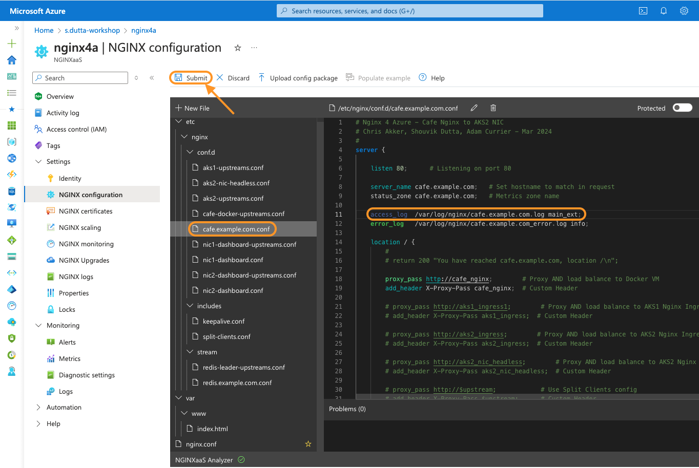
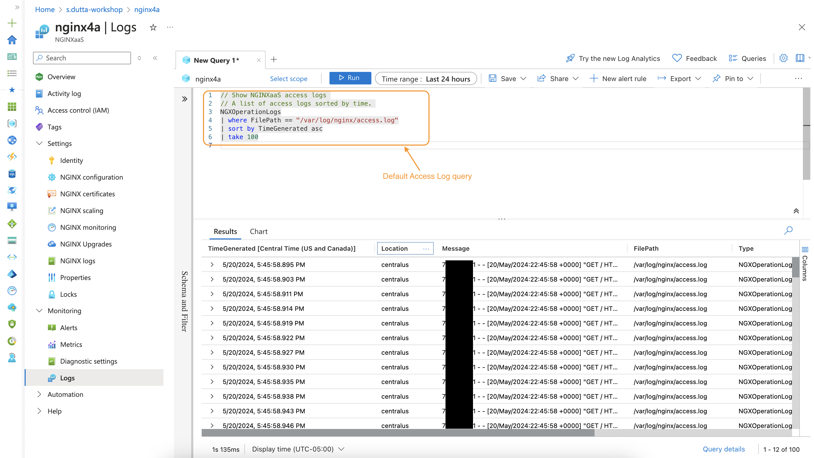
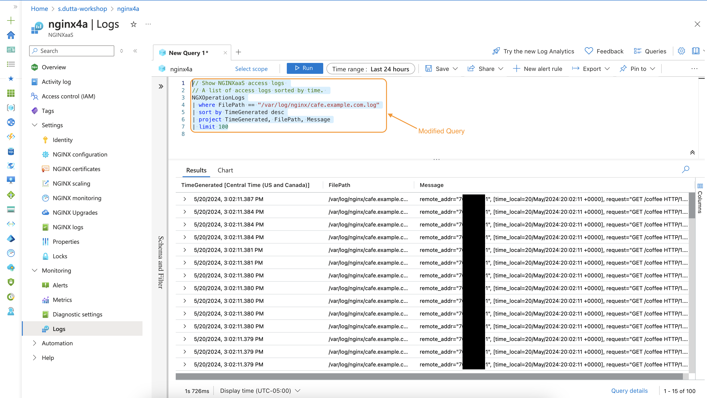
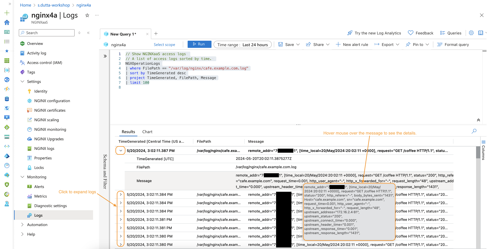
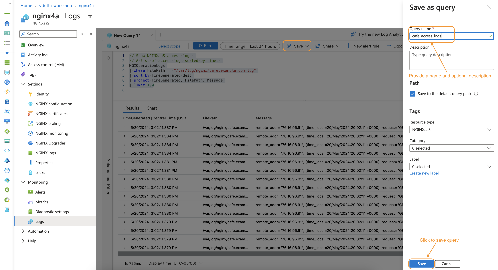

# Azure Montoring / Logging Analytics

## Introduction

In this lab, you will explore Azure based monitoring and Logging capabilities. You will create the basic access log_format within NGINX for Azure resource. As the basic log_format only contains a fraction of the information, you will then extend it and create a new log_format to include much more information, especially about the Upstream backend servers. You will add access logging to your NGINX for Azure resource and finally capture/see those logs within Azure monitoring tools.

NGINX aaS | Docker
:-------------------------:|:-------------------------:
  |
  
## Learning Objectives

By the end of the lab you will be able to:

- Enable basic log format within NGINX for Azure resource

- Create enhance log format with additional logging metrics

- Test access logs within log analytics workspace

## Pre-Requisites

- Within your NGINX for Azure resource, you must have enabled sending metrics to Azure monitor.
  
- You must have created `Log Analytics workspace`.
- You must have created an Azure diagnostic settings resource that will stream the NGINX logs to the Log Analytics workspace.
- See `Lab1` for instructions if you missed any of the above steps.

<br/>

### Enable basic log format

1. Within Azure portal, open your resource group and then open your NGINX for Azure resource (nginx4a). From the left pane click on `Settings > NGINX Configuration`. This should open the configuration editor section. Open `nginx.conf` file.

    

1. You will notice in previous labs, you have added the default basic log format inside the `http` block within the `nginx.conf` file as highlighted in above screenshot. You will make use of this log format initially to capture some useful metrics within NGINX logs.

    ```nginx
    log_format main '$remote_addr - $remote_user [$time_local] "$request" '
                    '$status $body_bytes_sent "$http_referer" '
                    '"$http_user_agent" "$http_x_forwarded_for"';
    ```

1. Update the `access_log` directive to enable logging. Within this directive, you will pass the full path of the log file (eg. `/var/log/nginx/access.log`) and also the `main` log format that you created in previous step. Click on `Submit` to apply the changes.

    ```nginx
    access_log  /var/log/nginx/access.log  main;
    ```

    

1. In subsequent sections you will test out the logs inside log analytics workspace.

### Create enhance log format with additional logging metrics

In this section you will create an extended log format which you will use with `cafe.example.com` server's access log.

1. Within the NGINX for Azure resource (nginx4a), open the `Settings > NGINX Configuration` pane.

1. Within the `nginx.conf` file add a new extended log format named `main_ext` as shown in the below screenshot. Click on `Submit` to save the config file

    ```nginx
    # Extended Log Format
    log_format  main_ext    'remote_addr="$remote_addr", '
                            '[time_local=$time_local], '
                            'request="$request", '
                            'status="$status", '
                            'http_referer="$http_referer", '
                            'body_bytes_sent="$body_bytes_sent", '
                            'Host="$host", '
                            'sn="$server_name", '
                            'request_time=$request_time, '
                            'http_user_agent="$http_user_agent", '
                            'http_x_forwarded_for="$http_x_forwarded_for", '
                            'request_length="$request_length", '
                            'upstream_address="$upstream_addr", '
                            'upstream_status="$upstream_status", '
                            'upstream_connect_time="$upstream_connect_time", '
                            'upstream_header_time="$upstream_header_time", '
                            'upstream_response_time="$upstream_response_time", '
                            'upstream_response_length="$upstream_response_length", ';
    ```

    

1. Once the extended log format has been created, open `cafe.example.com.conf` file and update the `access_log` to make use of the extended log format as shown in the below screenshot. Click on `Submit` to apply the changes.

    ```nginx
    access_log  /var/log/nginx/cafe.example.com.log main_ext;
    ```

    

1. In subsequent sections you will test out the extended log format within inside log analytics workspace.

### Test the access logs within log analytics workspace

1. To test out access logs, generate some traffic on your `cafe.example.com` server.

1. You can generate some traffic using your local Docker Desktop. Start and run the `WRK` load generation tool from a container using below command to generate traffic:

   First save your NGINX for Azure resource public IP in a environment variable.

    ```bash
    ## Set environment variables
    export MY_RESOURCEGROUP=s.dutta-workshop
    export MY_N4A_IP=$(az network public-ip show \
    --resource-group $MY_RESOURCEGROUP \
    --name n4a-publicIP \
    --query ipAddress \
    --output tsv)    
    ```

    Make request to the default server block which is using the `main` log format for access logging by running below command.

    ```bash
    docker run --name wrk --rm williamyeh/wrk -t4 -c200 -d1m --timeout 2s http://$MY_N4A_IP
    ```

    Make request to the `cafe.example.com` server block which is using the `main_ext` log format for access logging by running below command.

    ```bash
    docker run --name wrk --rm williamyeh/wrk -t4 -c200 -d1m --timeout 2s -H 'Host: cafe.example.com'  http://$MY_N4A_IP/coffee
    ```

1. Within Azure portal, open your NGINX for Azure resource (nginx4a). From the left pane click on `Monitoring > Logs`. This should open a new Qeury pane. Select `Resource type` from drop down and then type in `nginx` in the search box. This should show all the sample queries related to NGINX for Azure. Under `Show NGINXaaS access logs` click on `Run` button

    

1. This should open a `new query` window, which is made up of a query editor pane at the top and query result pane at the bottom as shown in below screenshot.

    

    > **NOTE:** The logs may take couple of minutes to show up. If the results pane doesn't show the logs then wait for a minute and then click on the `Run` button to run the query again.

1. Azure makes use of Kusto Query Language(KQL) to query logs. Have a look in the [references](#references) section to learn more about KQL.

1. You will modify the default query to show logs for `cafe.example.com` server block. Update the default query with the below query in the query editor pane. Click on the `Run` button to execute the query.

    ```kql
    // Show NGINXaaS access logs 
    // A list of access logs sorted by time. 
    NGXOperationLogs
    | where FilePath == "/var/log/nginx/cafe.example.com.log"
    | sort by TimeGenerated desc
    | project TimeGenerated, FilePath, Message
    | limit 100
    ```

    

1. Within the Results pane, expand one of the logs to look into its details. You can also hover your mouse over the message to show the message details as shown in below screenshot. Note that the message follows the `main_ext` log format.

    

1. You can save the custom query if you wish by clicking on the `Save` button and then selecting `Save as query`. Within the `Save as query` pane provide a query name and optional description and then finally click on `Save` button.

    

<br/>

**This completes Lab7.**

## References:

- [NGINX As A Service for Azure](https://docs.nginx.com/nginxaas/azure/)
  
- [Kusto Query Language](https://learn.microsoft.com/en-us/azure/data-explorer/kusto/query/tutorials/learn-common-operators)

- [NGINX Directives Index](https://nginx.org/en/docs/dirindex.html)
- [NGINX Variables Index](https://nginx.org/en/docs/varindex.html)

- [NGINX - Join Community Slack](https://community.nginx.org/joinslack)

<br/>

### Authors

- Chris Akker - Solutions Architect - Community and Alliances @ F5, Inc.
- Shouvik Dutta - Solutions Architect - Community and Alliances @ F5, Inc.
- Adam Currier - Solutions Architect - Community and Alliances @ F5, Inc.

-------------

Navigate to ([Lab8](../lab8/readme.md) | [LabX](../labX/readme.md))
