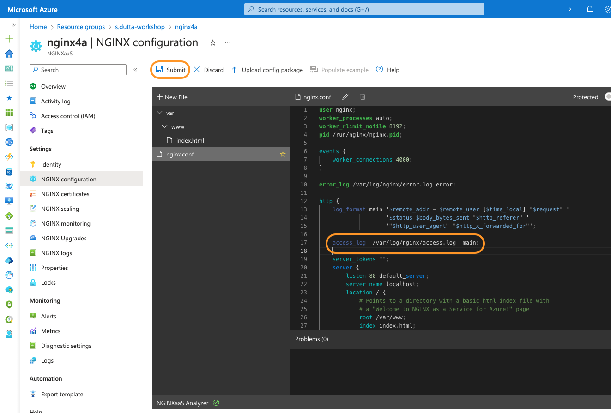

# Azure Montoring / Logging Analytics

## Introduction

In this lab, you will explore Azure based monitoring and Logging capabilities. You will create the basic access log_format within NGINX for Azure resource. As the basic log_format only contains a fraction of the information, you will then extend it and create a new log_format to include much more information, especially about the Upstream backend servers. You will add access logging to your NGINX for Azure resource and finally capture/see those logs within Azure monitoring tools.

< Lab specific Images here, in the /media sub-folder >

NGINX aaS | Docker
:-------------------------:|:-------------------------:
  |
  
## Learning Objectives

By the end of the lab you will be able to:

- Create and enable basic log format within NGINX for Azure resource

- Create enhance log format with additional logging metrics

- Test the new log format within log analytics workspace.

- Understanding Kusto Query Language (KQL) to pull out and print all access and error logs from log analytics workspace

## Pre-Requisites

- Within your NGINX for Azure resource, you must have enabled sending metrics to Azure monitor.
  
- You must have created `Log Analytics workspace`.
- You must have created an Azure diagnostic settings resource that will stream the NGINX logs to the Log Analytics workspace.
- See `Lab1` for instructions if you missed any of the above steps.

<br/>

### Create and enable basic log format

1. Within Azure portal, open your resource group and then open your NGINX for Azure resource (nginx4a). From the left pane click on `NGINX Configuration`. This should open the configuration editor section. Open `nginx.conf` file.
    

2. Add below default basic log format inside the `http` block within the `nginx.conf` file as shown in screenshot. Click on `Submit` to save the config file.

    ```nginx
    log_format main '$remote_addr - $remote_user [$time_local] "$request" '
                    '$status $body_bytes_sent "$http_referer" '
                    '"$http_user_agent" "$http_x_forwarded_for"';
    ```

    

3. Update the `access_log` directive to enable logging. Within this directive, you will pass the full path of the log file (eg. `/var/log/nginx/access.log`) and also the `main` log format that you created in previous step. Click on `Submit` to apply the changes.

    ```nginx
    access_log  /var/log/nginx/access.log  main;
    ```

    

4. In subsequent sections you will test out the logs inside log analytics workspace.

### Create enhance log format with additional logging metrics

<numbered steps are here>

### Lab exercise 3

<numbered steps are here>

### << more exercises/steps>>

<numbered steps are here>

<br/>

**This completes Lab7.**

<br/>

## References:

- [NGINX As A Service for Azure](https://docs.nginx.com/nginxaas/azure/)
- [NGINX Plus Product Page](https://docs.nginx.com/nginx/)
- [NGINX Ingress Controller](https://docs.nginx.com//nginx-ingress-controller/)
- [NGINX on Docker](https://docs.nginx.com/nginx/admin-guide/installing-nginx/installing-nginx-docker/)
- [NGINX Directives Index](https://nginx.org/en/docs/dirindex.html)
- [NGINX Variables Index](https://nginx.org/en/docs/varindex.html)
- [NGINX Technical Specs](https://docs.nginx.com/nginx/technical-specs/)
- [NGINX - Join Community Slack](https://community.nginx.org/joinslack)

<br/>

### Authors

- Chris Akker - Solutions Architect - Community and Alliances @ F5, Inc.
- Shouvik Dutta - Solutions Architect - Community and Alliances @ F5, Inc.
- Adam Currier - Solutions Architect - Community and Alliances @ F5, Inc.

-------------

Navigate to ([Lab8](../lab8/readme.md) | [LabX](../labX/readme.md))
