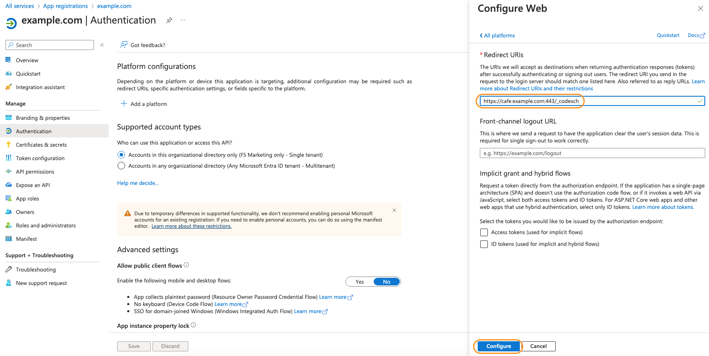
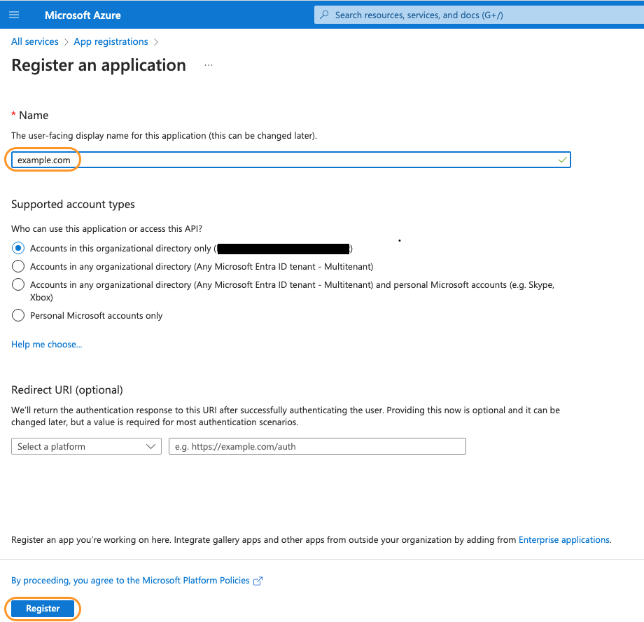
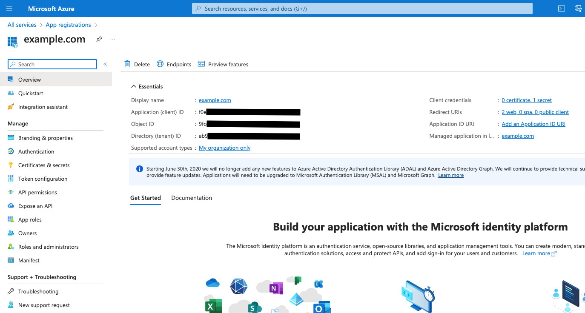
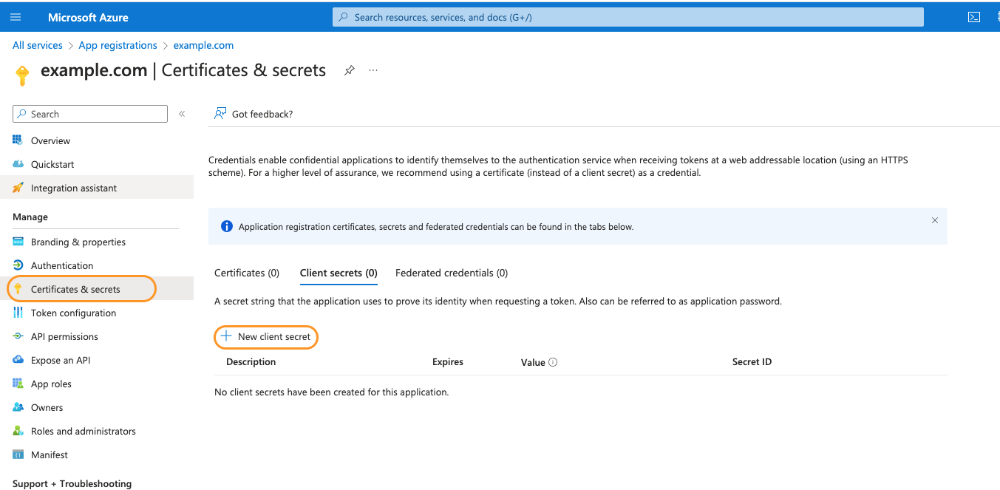
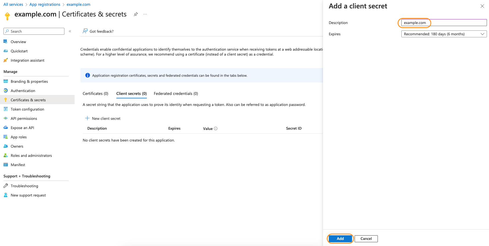
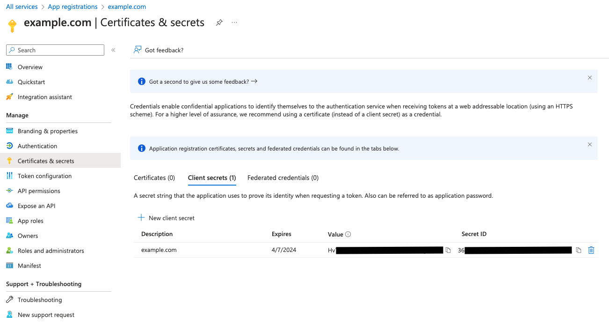
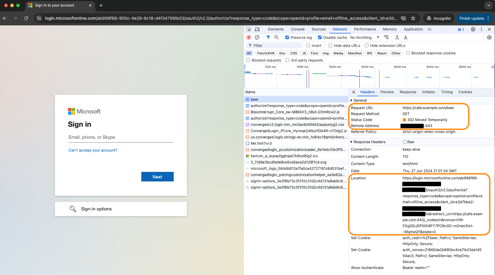
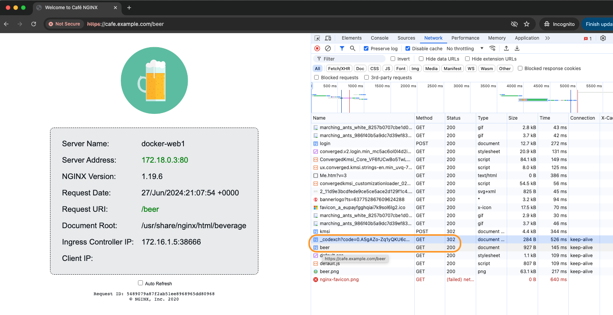

# Lab 8: Nginx for Azure with Entra ID / Azure AD

<br/>

## Introduction

As your company builds and deploys different applications on VMs, AKS clusters, and other Azure Resources, you will likely be required to control user access to these important Applications. These applications and web content should be Publicly available, but also require restricted access for employees, business partners, executives, and other groups.  

You have successfully deployed the Nginx Cafe for coffee and tea applications to the Public. You have been asked to create similar applications for beer and wine tasting at the Cafe in the evenings. The company has decided to extend the business and operating hours - expanding the business at the Cafe is good news! However, the access to beer and wine content cannot be Public - you have be tasked with restricting access to these applications to users over the age of 21. This lab exercise will show you how to use Azure Entra ID to control access: visitors to the Cafe's beer and wine content will need to have a valid Entra ID login to view it. You already have an Entra ID being used for accessing the Azure Portal and this workshop's Resources and will extend that access to Nginx Cafe beer/wine running behind Nginx for Azure.

Great news, Nginx already has all the components needed to create an Enforcement point for access to website content. Using the modern protocols and standards of OIDC (OpenID Connect), OAuth 2.0, JSON Web Tokens (JWT), and Nginx Java Script (NJS), you will set up Nginx for Azure to do exactly this. Nginx for Azure is running Nginx Plus and this solution also makes use of 2 very important features. The `auth_jwt_module` will be used for JWT token validation and `ngx_http_keyval_module` for Key-Value storage which is used to cache the users' valid tokens for subsequent visits. Caching of these tokens eliminates repeated Auth requests/responses and network round trips, **greatly improving the user experience**.

Better news, Azure Entra ID / Azure AD is the second half of this Solution, providing the Identity Provider (IDP) services where you can use existing Azure users/credentials/access controls and Nginx to determine if someone should be granted access to the beer and wine applications. Visitors to beer/wine applications will be challenged to enter their valid Entra ID credentials before they are granted access.

<br/>

<logos here>

NGINXaaS Azure | Entra ID | Cafe App
:-----------------:|:-----------------:|:-----------------:
  | | 

<br/>

## Learning Objectives

- Register a new application with Entra ID / Azure AD
- Creating Client Credentials
- Configure Nginx 4 Azure for OIDC/JWT/NJS
- Testing user access to Beer and Wine Applications

## Register an application with Entra ID / Azure AD

To enable an application to use Entra ID / Azure AD for authentication, you will need to create a new `app registration` from within the Azure Entra ID Portal.

1. Login into Microsoft Azure Portal and navigate to `App registrations`.
2. CLick the `+` button at the top for `New registration`
3. Fill out the name your application registration.
   For this workshop we provided the name of `example.com`.
4. Select the necessary account types based on who would be using this application.  For this lab exercise, you will select *"Accounts in this organizational directory only (<name> - Single tenant)"*, which means users of your current Subscription. (Using other Account types is not covered in this workshop).
5. Click `+ Platform`, and select `Web` for the Platform.

   On the `Configure Web` panel, you will need to provide a `redirect URI`. You can optionally also provide a  `Front-channel logout URL`. For the `redirect URI`, you will want to fill in with the hostname of the application you want to Protect, including the port number, with `/_codexch`.

   For example, in this workshop, NGINXaaS will be configured for OIDC to access `cafe.example.com`. So the `redirect URI` for the workshop will be the following:

   ```bash
   https://cafe.example.com:443/_codexch

   ```

   Click `Configure` on the bottom of the Configure Web panel.

   

   >**Note:** Make sure you are specifing `HTTPS` and port 443. This is a required setting.

6. Click on `Register` to register your application.
   
    

7. Once the application has been registered you will be redirected to the `Overview` page of the newly created application.

    

    Take note of the `Application (client) ID` and `Directory (tenant) ID`.

8. Copy and set the following ENVIRONMENT variables for the Client and Tenant IDs, to be used in the next section:

   ```bash
   export $MY_CLIENT_ID=<ApplicationClientID>
   export $MY_TENANT_ID=<DirectoryTenantID>

   ```

## Creating N4A Client Credentials

You will need to create a new `Client credentials secret` that will be used by NGINXaaS to make use of Entra ID as an IDP - Identity Provider. This Secret is only used by Nginx for Azure, not the actual users.

1. Within your new App Registration, click on `Certificates & Secrets` option from left menu. This should open the `Certificate & Secrets` section.

2. Click the `+ New client secret` button within the `Client Secrets` tab to create a new client secret that will be used by NGINXaaS. This secret will be used in the Nginx config as part of the Auth workflow.
   
   

3. Fill out the description for the client secret. For this workshop we provided the name as `example.com`.

4. You can also change the Duration for the client secret expiriration or keep the default recommended value. Click on `Add` to generate the new client secret.
   
   

5. Once you click on the `Add` button, you will see the secret within the `Client Secrets` tab as seen in below screenshot. The `Value` column will be the field you want to look for and copy. This Client Secret will be used by Nginx to communicate with Entra ID.
   
   

6. Copy the `Value` portion of the client secret to the clipboard, and also save it on your computer as you will use it in next section of this lab.  **NOTE:** It is important that you have a backup of this `Client Secret Value`, *as it is only shown here at creation time.*  If you lose the Client Secret, you can easily create a new one in this same Azure Portal page and you will have to update your N4A configuration.

7. Copy and set the following ENVIRONMENT variable for the Client Secret, to be used in the next section:

   ```bash
   export $MY_CLIENT_SECRET=<Client Secret Value>

   ```

### Collecting the Required URLs

1. Using curl to collect all the Azure Entra ID openid URLs

```bash
curl https://login.microsoftonline.com/$MY_TENANT_ID/v2.0/.well-known/openid-configuration | jq

```

There are three URLs required, which you will use in your Nginx for Azure configuration:

   1. token_endpoint
   2. jwks_uri
   3. authorization_endpoint

Examples as follows:

```bash
{
  "token_endpoint": "https://login.microsoftonline.com/<MY_TENANT_ID>/oauth2/v2.0/token",   # Needed by Nginx
  "token_endpoint_auth_methods_supported": [
    "client_secret_post",
    "private_key_jwt",
    "client_secret_basic"
  ],
  "jwks_uri": "https://login.microsoftonline.com/<MY_TENANT_ID>/discovery/v2.0/keys",       # Needed by Nginx
  "response_modes_supported": [
    "query",
    "fragment",
    "form_post"
  ],
  "subject_types_supported": [
    "pairwise"
  ],
  "id_token_signing_alg_values_supported": [
    "RS256"
  ],
  "response_types_supported": [
    "code",
    "id_token",
    "code id_token",
    "id_token token"
  ],
  "scopes_supported": [
    "openid",
    "profile",
    "email",
    "offline_access"
  ],
  "issuer": "https://login.microsoftonline.com/<MY_TENANT_ID>/v2.0",
  "request_uri_parameter_supported": false,
  "userinfo_endpoint": "https://graph.microsoft.com/oidc/userinfo",
  "authorization_endpoint": "https://login.microsoftonline.com/<MY_TENANT_ID>/oauth2/v2.0/authorize",  # Needed by Nginx
  "device_authorization_endpoint": "https://login.microsoftonline.com/<MY_TENANT_ID>/oauth2/v2.0/devicecode",
  "http_logout_supported": true,
  "frontchannel_logout_supported": true,
  "end_session_endpoint": "https://login.microsoftonline.com/<MY_TENANT_ID>/oauth2/v2.0/logout",
  "claims_supported": [
    "sub",
    "iss",
    "cloud_instance_name",
    "cloud_instance_host_name",
    "cloud_graph_host_name",
    "msgraph_host",
    "aud",
    "exp",
    "iat",
    "auth_time",
    "acr",
    "nonce",
    "preferred_username",
    "name",
    "tid",
    "ver",
    "at_hash",
    "c_hash",
    "email"
  ],
  "kerberos_endpoint": "https://login.microsoftonline.com/<MY_TENANT_ID>/kerberos",
  "tenant_region_scope": "NA",
  "cloud_instance_name": "microsoftonline.com",
  "cloud_graph_host_name": "graph.windows.net",
  "msgraph_host": "graph.microsoft.com",
  "rbac_url": "https://pas.windows.net"
}

```

<br/>

## Setting up NGINXaaS with OIDC for Entra ID

Now that the Azure Entra ID configurations are complete, you will configure Nginx for Azure to use those Resources to control access to /beer and /wine paths on cafe.example.com. There are only a few steps required:

- Enable Zone Sync for Nginx's shared memory *(Not required for Nginx4Azure Basic Subscription)*
- Customize the OpenID Connect Server file for your Azure Subscription, Resource, and Application
- Add the Nginx OpenID Connect files to your N4A environment
- Enable OpenID for the /beer and /wine URL paths

### Enable Zone Sync on NGINXaaS deployment instances

As there are 2 Active/Active instances of Nginx `under the hood` of an N4A deployment, synchronizing the KeyValue shared memory zone used for OIDC tokens is required. This NginxPlus feature uses a module called `ngx_stream_zone_sync_module`. The module uses a dedicated TCP connection between N4A pairs to send updates of the shared memory to each other. For the Nginx OIDC solution, the shared memory is used to cache the users' Auth Tokens, so that subsequent requests do NOT have to be validated with the IDP. Caching these Auth Tokens provides a large performance improvement to users accessing OIDC protected content. Without this Nginx caching feature, `every request would suffer the Round Trip delay` of going back and forth to the Identity provider, slowing your application Response Time to a dismal crawl, and potentially prompting for user credentials repeatedly.

<< N4A zone sync diagram here >>

1. Using the N4A console, create a new `/etc/nginx/stream/zonesync.conf` file in the `stream context`. Use the example file provided, just copy/paste:

```nginx
# Nginx for Azure Zone Sync config
# Chris Akker, Shouvik Dutta, Adam Currier - Mar 2024
#
# zonesync.conf
#
resolver 127.0.0.1:49153 valid=20s;
  
server {

  listen 9000; # should match the port specified with zone_sync_server
  status_zone n4a-zonesync;

  zone_sync;
  zone_sync_server internal.nginxaas.nginx.com:9000 resolve;

}

```

Submit your Nginx Configuration.

### Customize the Nginx OpenID Connect files

1. Copy the three `openid_connect` files from the /lab8 folder, to your Nginx for Azure `/etc/nginx/oidc` folder. You will have to create each file and copy/paste the contents from the examples provided in the lab8 folder.

1. Modify the `/etc/nginx/oidc/openid_connect_configuration.conf` file as follows:

   There are 5 lines to edit in this configuration file, shown as follows:

   1. Line #6, change the `authorization_endpoint` to your URL

   2. Line #23, change the `token_endpoint` to your URL

   3. Line #28, change the `jwks_uri` to your URL

   4. Line #33, change the `client_id` to your Value

   5. Line #42, change the `client_secret` to your Value

   ```nginx
   # Nginx for Azure / OpenID Connect configuration
   # Chris Akker, Shouvik Dutta, Adam Currier - Mar 2024
   #
   map $host $oidc_authz_endpoint {
      cafe.example.com <authorization_endpoint>;    # Your Authorization Endpoint URL
      #default "http://127.0.0.1:8080/auth/realms/master/protocol/openid-connect/auth";
   }

   map $host $oidc_authz_extra_args {
      # Extra arguments to include in the request to the IdP's authorization
      # endpoint.
      # Some IdPs provide extended capabilities controlled by extra arguments,
      # for example Keycloak can select an IdP to delegate to via the
      # "kc_idp_hint" argument.
      # Arguments must be expressed as query string parameters and URL-encoded
      # if required.
      default "";
      #www.example.com "kc_idp_hint=another_provider"
   }

   map $host $oidc_token_endpoint {
      cafe.example.com <token_endpoint>;     # Your Token Endpoint URL
      #default "http://127.0.0.1:8080/auth/realms/master/protocol/openid-connect/token";
   }

   map $host $oidc_jwt_keyfile {
      cafe.example.com <jwks_uri>;           # Your jwks_uri URL
      #default "http://127.0.0.1:8080/auth/realms/master/protocol/openid-connect/certs";
   }

   map $host $oidc_client {
      cafe.example.com <client_id>;           # Your $MY_CLIENT_ID value
      #default "<default-value>";
   }

   map $host $oidc_pkce_enable {
      default 0;
   }

   map $host $oidc_client_secret {
      cafe.example.com <client_secret>;        # Your $MY_CLIENT_SECRET value
      #default "<default-value>";
   }

   ...

   ```


1. There are no changes needed for the `/etc/nginx/oidc/openid_connect.server_conf`.

1. There are no changes needed for the `/etc/nginx/oidc/openid_connect.js` Javascript file. This is the core Nginx Javascript code that gets executed for this OIDC Solution.

1. Copy the `cafe.example.com.conf` file provided to `/etc/nginx/conf.d/cafe.example.com.conf`. Notice the new /location block with a REGEX that captures the `/beer and /wine` URIs. This new location block will be protected by Azure Entra ID using OIDC.  

### Update Nginx.conf

1. Update your `/etc/nginx/nginx.conf` to add the following items.

- Line #9, add the `load_module` directive to add Nginx JavaScript Dynamic Module (NJS) to your config.
- Line #20, add a new Log Format that logs JWT claims information.
- Line #61, add an additional `include directive` that points to the OIDC configuration files in `/etc/nginx/oidc`, as shown:

```nginx
# Nginx 4 Azure - Entra ID and OIDC - Updated Nginx.conf
# Chris Akker, Shouvik Dutta, Adam Currier - Mar 2024
#
user nginx;
worker_processes auto;
worker_rlimit_nofile 8192;
pid /run/nginx/nginx.pid;

load_module modules/ngx_http_js_module.so;   #Added for OIDC

events {
    worker_connections 4000;
}

error_log /var/log/nginx/error.log error;

http {

    # Custom log format to include the 'sub' claim in the REMOTE_USER field
    log_format  main_jwt '$remote_addr - $jwt_claim_sub [$time_local] "$request" $status '
                    '$body_bytes_sent "$http_referer" "$http_user_agent" "$http_x_forwarded_for"';

    log_format  main  '$remote_addr - $remote_user [$time_local] "$request" '
                      '$status $body_bytes_sent "$http_referer" '
                      '"$http_user_agent" "$http_x_forwarded_for"';

    log_format  main_ext    'remote_addr="$remote_addr", '
                            '[time_local=$time_local], '
                            'request="$request", '
                            'status="$status", '
                            'http_referer="$http_referer", '
                            'body_bytes_sent="$body_bytes_sent", '
                            'Host="$host", '
                            'sn="$server_name", '
                            'request_time=$request_time, '
                            'http_user_agent="$http_user_agent", '
                            'http_x_forwarded_for="$http_x_forwarded_for", '
                            'request_length="$request_length", '
                            'upstream_address="$upstream_addr", '
                            'upstream_status="$upstream_status", '
                            'upstream_connect_time="$upstream_connect_time", '
                            'upstream_header_time="$upstream_header_time", '
                            'upstream_response_time="$upstream_response_time", '
                            'upstream_response_length="$upstream_response_length", '
                            'cachestatus=“$upstream_cache_status“, '
                            'limitstatus=“$limit_req_status“ ';
                      
    access_log off;
    server_tokens "";
    server {
        listen 80 default_server;
        server_name localhost;
        location / {
            # Points to a directory with a basic html index file with
            # a "Welcome to NGINX as a Service for Azure!" page
            root /var/www;
            index index.html;
        }
    }

    include /etc/nginx/oidc/openid_connect.server_conf; # OIDC authorization code flow and Relying Party processing
    include /etc/nginx/conf.d/*.conf;
    include /etc/nginx/includes/*.conf;    # shared files
    

}

stream {
    
    include /etc/nginx/stream/*.conf;          # Stream TCP nginx files

}

```

Submit your Nginx Configuration.

<br/>

## Test Nginx 4 Azure with Entra ID

1. You can now test your Azure Entra ID with OIDC config with NGINXaaS. To test open up your browser, open Dev Tools, and try `https://cafe.example.com/beer`. **NOTE:** You will likely have to use a new `Chrome Incognito` browser, because it is caching and using your current credentials, *and you need to start with fresh browser.*

   If everything has been configured correctly, you should see the browser Redirect you to Entra ID for an Azure user authentication logon prompt, and Dev Tools should show you the details of the Redirect to `microsoftonline.com`, highlighted below. Take a moment to look as some of the other objects/headers in the Dev Tools, it should look familiar if you have used OpenID before.

   

   After entering your Azure creds, you should be able to see the /beer web page:

   

1. Once your credentials have been successfully verified by Microsoft Entra ID, NGINXaaS will allow your request to the backend resource. It will cache your Auth Token in memory on Nginx for subsequent requests. If you click Refresh several times, you will note that you do not have to login again.

1. Open a new Chrome Incognito browser, and test again for `https://cafe.example.com/wine`. Does it work as expected?

< Maybe - You can see the Nginx Zone Sync metrics, and caching of user Auth Tokens in the N4A Metrics, as shown here: >

< Azure monitor ss here >

>Notice how easy it was, to configure Nginx to protect a hostname/location in the configuration? It only required obtaining a few settings from Entra ID, and then using those settings in the Nginx configuration.

<br/>

### Optional Exercise - Protect more beverages than Beer and Wine

There are additional applications that are running on the Docker containers, Nginx Cafe.

1. Can you find out what the other `over 21 beverages` are that should be protected with Entra ID?

<Hint here - Docker exec into one of the ingress-demo containers on the Ubuntu VM, and review the Nginx configurations. You should discover there are 5 `over 21 beverages`. Beer, wine, cosmo, daiquiri, mojito.>

1. Now that you have a list of the beverages, can you modify the `/beer location block` to add all of those `over 21 beverages`? How many location blocks will you need - will it require a block for each beverage, or can you do it with just ONE?

<Hint here - Use this Regular Expression: >

   ```nginx
   ...

      location ~ ^/(beer|wine|cosmo|daiquiri|mojito)$ {
         ...
         <rest of block>
         ... 
      }

   ```

As you can see, it is quite easy to update the location block, and use a `Regular Expression` to capture those paths, and provide Entra ID protection.

<br/>

**This completes the Lab.** 

<br/>

## References: 

- [NGINXaaS Azure OIDC configuration](https://docs.nginx.com/nginxaas/azure/quickstart/security-controls/oidc/)
- [Nginx Github Openid Connect](https://github.com/nginxinc/nginx-openid-connect)
- [Nginx Plus JWT Auth configuration](https://docs.nginx.com/nginx/admin-guide/security-controls/configuring-jwt-authentication/)
- [Nginx Plus JavaScript module](https://docs.nginx.com/nginx/admin-guide/dynamic-modules/nginscript/)
- [Azure Entra ID Overview](https://learn.microsoft.com/en-us/entra/fundamentals/whatis)
- [Oauth 2.0 Overview](https://oauth.net/2/)
- [JSON Web Token Overview](https://jwt.io/introduction)

<br/>

### Authors
- Chris Akker - Solutions Architect - Community and Alliances @ F5, Inc.
- Shouvik Dutta - Solutions Architect - Community and Alliances @ F5, Inc.
- Adam Currier - Solutions Architect - Community and Alliances @ F5, Inc.
- Jason Williams - Principle Technical Product Management Engineer @ F5, Inc.

-------------

Navigate to ([Lab9](../lab9/readme.md) | [LabGuide](../readme.md))
