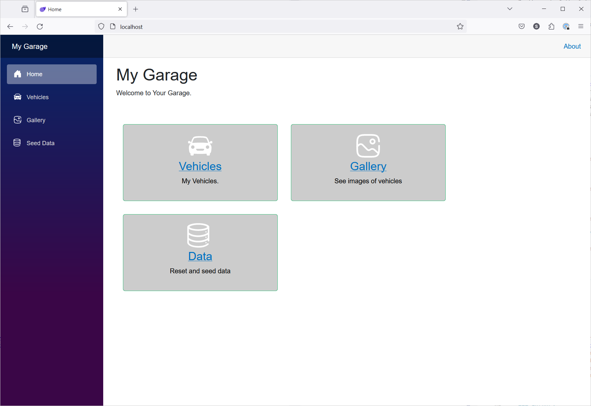
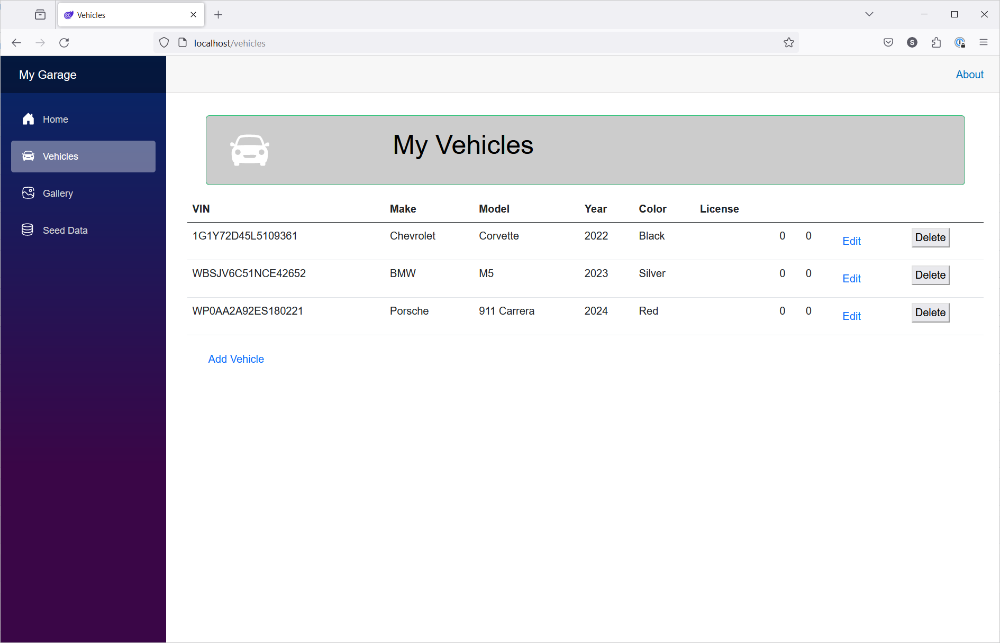
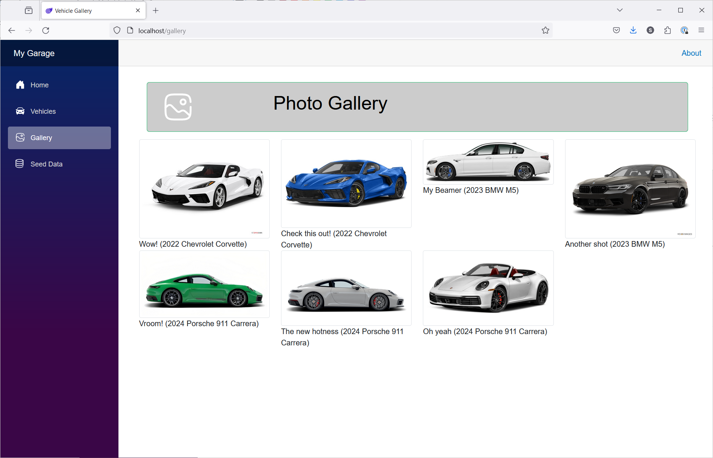
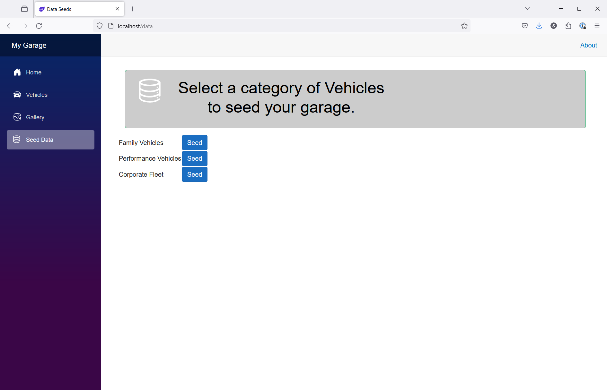

#  NGINX My Garage

<style>
.tabbed-area {
    overflow: hidden;
    border: 1px solid #ccc;
    background-color: #f9f9f9;
}

.tabbed-area input[type=radio] {
    display: none;
}

.tabbed-area label {
    float: left;
    padding: 10px 20px;
    cursor: pointer;
    background-color: #ddd;
}

.tabbed-area input[type=radio]:checked + label {
    background-color: #ccc;
}

.tabbed-area .tab {
    display: none;
}

.tabbed-area input[type=radio]:checked ~ .tab {
    display: block;
    padding: 20px;
}
</style>

## Introduction


In this lab, you will install the My Garage application, configure it for external access, learn to scale the web service, and set up caching for the image gallery (optional).

The My Garage application is a modern web application built using Microsoft .Net technologies. It is comprised of a frontend application and supporting web service backend. The front-end is a Single Page Application (SPA) that uses [Blazor WebAssembly](https://dotnet.microsoft.com/en-us/apps/aspnet/web-apps/blazor) to render the UI in the browser. The back-end is a RESTful API built using [ASP.Net Core MVC](https://learn.microsoft.com/en-us/aspnet/core/mvc/overview?view=aspnetcore-8.0).

|  |  |
|------|------|
|  |  |


## Learning Objectives

By the end of the lab you will be able to:

- Create all the resources necessary to deploy the My Garage application
- Ensure the My Garage application is accessible from the internet
- Monitor traffic to the My Garage application using the NGINX Dashboard

## Pre-Requisites

You need to have followed the labs up to this point. Specifically, Lab 0 and Lab 4 are required to have been completed. 

- You must have the Azure CLI installed and configured to manage Azure Resources
- Familiarity with basic Linux commands and commandline tools
- Familiarity with basic Docker concepts and commands
- You must have created a Resource Group

<br/>

### Lab exercise 1

In this exercise you will establish the necessary Azure resources to deploy the My Garage application. There are two Azure resources that need to be created: 

1. A Storage Account to store the images for the photo gallery	
1. An AppConfig to store configuration settings for the My Garage application

First, let's establish the Storage Account.

<div class="tabbed-area">
    <input id="tab1" type="radio" name="tabs" checked>
    <label for="tab1">Bash</label>
    
    <input id="tab2" type="radio" name="tabs">
    <label for="tab2">PowerShell</label>
    
    <div class="tab">
        ```bash
        # Bash code here
        ```
    </div>
    
    <div class="tab">
        ```powershell
<#
    establish-azure-resources.ps1

    This script creates all the Micorosft Azure Resources needed to run the My Garage application.

    The script assumes that you have the Azure CLI installed and configured to point to the desired Azure Subscription.
#>

$Ticks = (Get-Date).Ticks
$Location = "westus2"
$ResourceGroupName = "<YOUR_RESOURCE_GROUP_NAME>"
$StorageAccountName = "mygsa" + $Ticks
$StorageContainerName = "mygsc" + $Ticks
$SasTokenName = "mygsas" + $Ticks
$SasExpiry = "2024-05-31T23:59:59Z"
$AppConfigName = "mygac" + $Ticks
$SasTokenAppConfigKey = "AzureStorageSasToken"
$StorageConnectionStringConfigKey = "AzureStorageConnectionString"
$StorageContainerNameConfigKey = "AzureStorageContainerName"
$RedisConnectionStringConfigKey = "RedisConnectionString"
$owner = $(whoami)

clear

<# -------------------------------- #>
<# Clean Up Previous Run #>

echo "Deleting existing resources..."

az group delete --name $ResourceGroupName --yes

<# -------------------------------- #>
<# Create a new set of stuff #>

echo "Creating resources..."
    
#-- Storage Account, The Place to Store Stuff
# * The --allow-blob-public-access true is required to allow the container to be public
az storage account create --name $StorageAccountName --resource-group $ResourceGroupName --location $Location --sku Standard_LRS --kind StorageV2 --access-tier Cool --allow-blob-public-access true --tags environment=production owner=$owner

#-- The Account Key is needed for subsequent resources
$accountKey=$(az storage account keys list --resource-group $ResourceGroupName --account-name $StorageAccountName --query "[0].value" --output tsv)

#-- CORS ensure that the storage account can be accessed from the web
az storage cors add --account-name $StorageAccountName --account-key $accountKey --services b --origins "*" --methods GET HEAD --allowed-headers "*" --exposed-headers "*" --max-age 3600

#-- The Storage Connection String is necessary for the App Configuration Store, it is used to let the Application store images
$storageConnectionString=$(az storage account show-connection-string --name $StorageAccountName --resource-group $ResourceGroupName --output tsv)

#-- Storage Container, The Place to Store Images
az storage container create --name $StorageContainerName --account-name $StorageAccountName --account-key $accountKey --public-access blob

#-- Is this really necessary??
#az storage container set-permission --name $StorageContainerName --account-name $StorageAccountName --account-key $accountKey --public-access blob

#-- The App Configuration Store, The Place to Store Configuration
az appconfig create --name $AppConfigName --resource-group $ResourceGroupName --location $Location --sku Standard --query id --output tsv

#-- The Web Application -- My Garage -- needs this to be able to connect to the AppConfig instance and grab configuration
$appConfigConnectionString=$(az appconfig credential list --name $AppConfigName --resource-group $ResourceGroupName --query "[?name=='Primary Read Only'].connectionString" -o tsv)

#-- The values required by the application need to be seeded. Note that all except for the RedisConnectionString have been gathered by this script
az appconfig kv set --yes --name $AppConfigName --key $StorageConnectionStringConfigKey --value "$storageConnectionString"
az appconfig kv set --yes --name $AppConfigName --key $StorageContainerNameConfigKey --value "$StorageContainerName"
az appconfig kv set --yes --name $AppConfigName --key $RedisConnectionStringConfigKey --value "kungdu.wagner-x.net"

#echo "Resource Group ID: $(az group show --name $ResourceGroupName --query id --output tsv)"
#echo "Storage Account ID: $(az storage account show --name $StorageAccountName --resource-group $ResourceGroupName --query id --output tsv)"
#echo "App Configuration Store ID: $(az appconfig show --name $AppConfigName --resource-group $ResourceGroupName --query id --output tsv)"
#echo "Storage Container ID: $(az storage container show --name $StorageContainerName --account-name $StorageAccountName --account-key $accountKey --query id --output tsv)"
#echo "Account Key: $accountKey"
#echo "Storage Connection String: $storageConnectionString"
#echo "Storage Container Name: $StorageContainerName"

#-- Burp out the AppConfig ConnectionString so it can be included in the MyGarage application startup. It is an argument to the docker-compose command:
# docker-compose -e AppConfigurationConnectionString=$appConfigConnectionString up 
echo "AppConfig Connection String: $appConfigConnectionString"

        ```
    </div>
</div>


<numbered steps are here>

### Lab exercise 2

<numbered steps are here>

### Lab exercise 3

<numbered steps are here>

### << more exercises/steps>>

<numbered steps are here>

<br/>

**This completes Lab8.**

<br/>

## References:

- [NGINX As A Service for Azure](https://docs.nginx.com/nginxaas/azure/)
- [NGINX Plus Product Page](https://docs.nginx.com/nginx/)
- [NGINX Ingress Controller](https://docs.nginx.com//nginx-ingress-controller/)
- [NGINX on Docker](https://docs.nginx.com/nginx/admin-guide/installing-nginx/installing-nginx-docker/)
- [NGINX Directives Index](https://nginx.org/en/docs/dirindex.html)
- [NGINX Variables Index](https://nginx.org/en/docs/varindex.html)
- [NGINX Technical Specs](https://docs.nginx.com/nginx/technical-specs/)
- [NGINX - Join Community Slack](https://community.nginx.org/joinslack)

<br/>

### Authors

- Chris Akker - Solutions Architect - Community and Alliances @ F5, Inc.
- Shouvik Dutta - Solutions Architect - Community and Alliances @ F5, Inc.
- Adam Currier - Solutions Architect - Community and Alliances @ F5, Inc.
- Steve Wagner - Solutions Architect - Community and Alliances @ F5, Inc.

-------------

Navigate to ([Lab9](../lab9/readme.md) | [LabX](../labX/readme.md))
