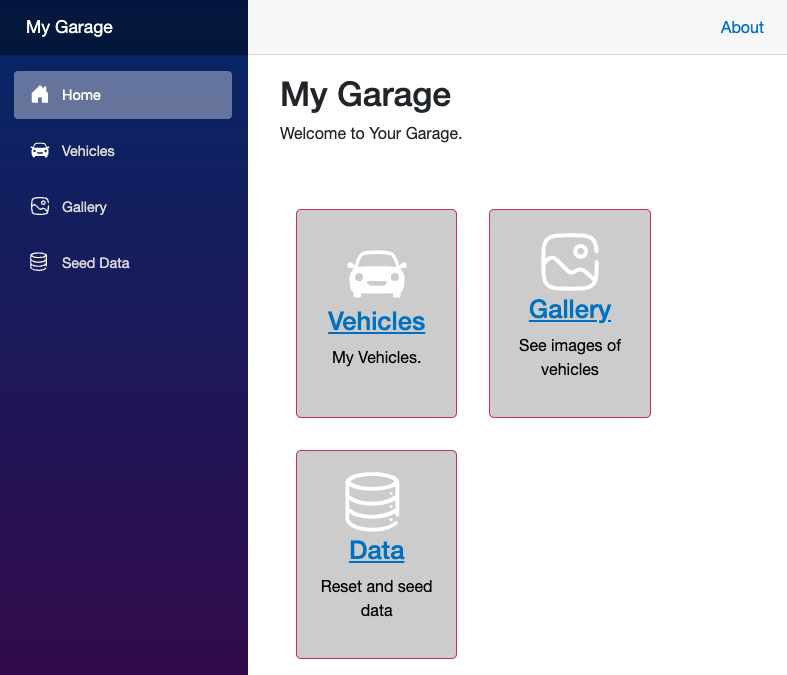
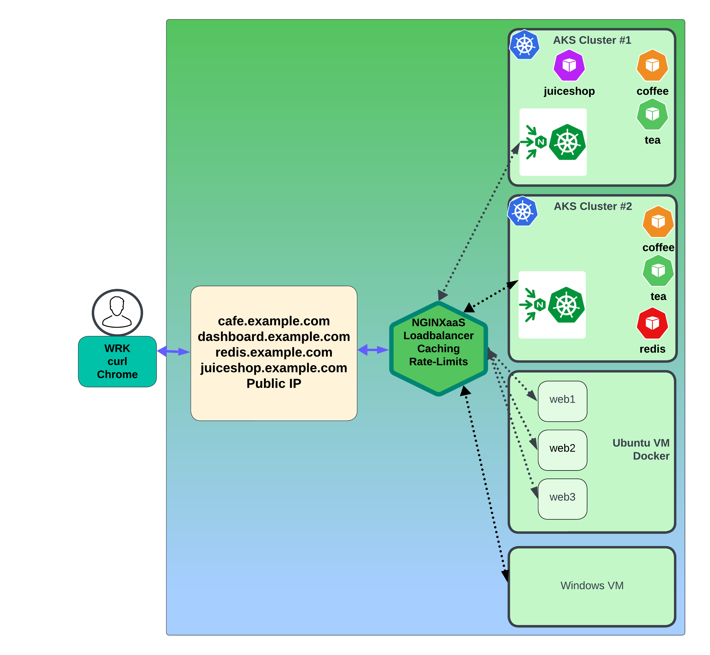

#  Nginx Caching / Rate Limits / Juiceshop / My Garage

## Introduction

In this lab, you will deploy an image rich application, and use Nginx Caching to cache images to improve performance and provide a better user experience.  This will offload the image delivery workload from your applications, saving resources.  You will also explore, configure, and test Rate Limits with Nginx for Azure, allowing you to control incoming request levels for different applications.

<br/>

NGINX aaS | Cache | Juiceshop | My Garage
:-----------------:|:-----------------:|:-----------------:|:-----------------:
  | | | 
  
## Learning Objectives

- Deploy JuiceShop in AKS cluster.
- Expose JuiceShop with Nginx Ingress Controller.
- Configure Nginx for Azure for load balancing JuiceShop.
- Configure Nginx for Azure for load balancing Mygarage.
- Add Nginx Caching to improve delivery of images.
- Explore, configure, and test HTTP Request Limits


## Pre-Requisites

- You must have your Nginx for Azure instance running
- You must have your AKS Cluster running
- You must have your Docker VM running

- See `Lab0` for instructions on setting up your system for this Workshop
- Familiarity with basic Linux commands and commandline tools
- Familiarity with basic Docker concepts and commands
- Familiarity with basic HTTP protocol
- Familiarity with HTTP Caching parameters, directives, headers

<br/>



Lab9 Diagram

<br/>

## Deploy Juiceshop to AKS Cluster #1

In this exercise, you will deploy the demo Juiceshop application to AKS1.  Juiceshop is a demo application example of a Retail store, selling different juices, smoothies, and snacks.  The images used on the various web pages make ideal candidates for image caching. You will configure Nginx Ingress Controller for this application.    

1. Inspect the `lab9/juiceshop.yaml` and then `lab9/juiceshop-vs.yaml` manifests.  You will see definitions for three Juiceshop application pods being deployed, and a new VirtualServer being added to Nginx Ingress to expose the app outside the Cluster.

1. Using your Terminal, create a new namespace `juice` and deploy the Juiceshop application to AKS1.  Also deploy the Nginx Ingress VirtualServer, to create the Service and VirtualServer for `juiceshop.example.com`.  Use the Manifests provided in the `lab9` folder:

    ```bash
    kubectl config use-context n4a-aks1
    kubectl create namespace juice
    kubectl apply -f lab9/juiceshop.yaml
    kubectl apply -f lab9/juiceshop-vs.yaml

    ```

    ```bash
    #Sample output
    namespace/juice created
    deployment.apps/juiceshop created
    service/juiceshop-svc created
    secret/juice-secret created
    virtualserver.k8s.nginx.org "juiceshop-vs" deleted

    ```

1. Check your Nginx Ingress Dashboard for AKS1, you should now find `juiceshop.example.com` in the HTTP Zones, and a new `vs_juice_juiceshop-vs_juiceshop` Upstream block in the HTTP Upstreams tab, with 3 Pods running on port 3000. (You can safely ignore the 400 errors you see for this lab - those are from socket.io polling not properly configured).

## Add Caching to Nginx for Azure

In this exercise, you will create an Nginx for Azure configuration, to add Caching for the images of the Juiceshop application. You will also configure Nginx for Azure to expose your Juiceshop application to the Internet. You will test it, and use various tools to verify that caching is working as expected. 

1. Inspect the `lab9/juiceshop.example.com.conf` configuration file.  Make note of the following items, which enable `Nginx Proxy Caching` for images:

- Line #7 - create the Cache - /path on disk, cache name=image_cache, :memory zone and size, max image size, disable temp files.
- Line #13 - set the hostname
- Line #14 - create a status zone for metrics
- Line #17,18 - set the logging filenames
- Line #30 - send requests to Nginx Ingress in AKS1
- Line #31 - set the Header for tracking
- Lines #37-62 - A new `location block`, with the following parameters
- - Line #39 - Use a Regular Expression (regex) to identify image types.
- - Line #42 - new status zone for image metrics
- - - Lines #44-46 - use the `image_cache` created earlier on Line #7 
- - - cache 200 responses for 60 seconds
- - - use a cache key, made up of three Nginx request $variables
- - Lines #49-51 - Set and Control Caching Headers
- - Line #55 - Set a Custom Header for Cache Status = HIT, MISS, EXPIRED
- - Line #57 - Send requests to Nginx Ingress in AKS1
- - Line #58 - Set another Custom Header for tracking

As you can see, there are quite a few Caching directives and parameters that must be set properly.  There are Advanced Nginx Caching classes available from Nginx University that cover architectures and many more details and use cases if you would like to learn more.  You will also find quite a few blogs and a Webinar on Nginx Caching, it is a popular topic.  See the References Section.

But for this exercise, you will just enable it with the minimal configuration and test it out with Chrome.

1. Create the Nginx for Azure configuration needed for `juiceshop.example.com.`

Using the Nginx for Azure Console, create a new config file, `/etc/nginx/conf.d/juiceshop.example.com.conf`.  You can use the example file provided, just Copy/Paste.

```nginx
# Nginx 4 Azure - Juiceshop Nginx HTTP
# Chris Akker, Shouvik Dutta, Adam Currier - Mar 2024
#
# Image Caching for Juiceshop
# Rate Limits testing
#
proxy_cache_path /var/cache/nginx levels=1:2 keys_zone=image_cache:10m max_size=100m use_temp_path=off;
#
server {
    
    listen 80;      # Listening on port 80 on all IP addresses on this machine

    server_name juiceshop.example.com;   # Set hostname to match in request
    status_zone juiceshop;

    # access_log  /var/log/nginx/juiceshop.log main;
    access_log  /var/log/nginx/juiceshop.example.com.log main_ext;   # Extended Logging
    error_log   /var/log/nginx/juiceshop.example.com_error.log info;

    location / {
        
        # return 200 "You have reached juiceshop server block, location /\n";

        # Set Rate Limit, uncomment below
        # limit_req zone=limit100;  #burst=110;       # Set  Limit and burst here
        # limit_req_status 429;           # Set HTTP Return Code, better than 503s
        # limit_req_dry_run on;           # Test the Rate limit, logged, but not enforced
        # add_header X-Ratelimit-Status $limit_req_status;   # Add a custom status header

        proxy_pass http://aks1_ingress;       # Proxy to AKS1 Nginx Ingress Controllers
        add_header X-Proxy-Pass aks1_ingress_juiceshop;  # Custom Header

    }

    # Cache Proxy example for static images / page components
    # Match common files with Regex
    location ~* \.(?:ico|jpg|png)$ {
        
        ### Uncomment for new status_zone in dashboard
        status_zone images;

        proxy_cache image_cache;
        proxy_cache_valid 200 60s;
        proxy_cache_key $scheme$proxy_host$request_uri;

        # Override cache control headers
        proxy_ignore_headers X-Accel-Expires Expires Cache-Control Set-Cookie;
        expires 365d;
        add_header Cache-Control "public";

        # Add a Cache status header - MISS, HIT, EXPIRED
        
        add_header X-Cache-Status $upstream_cache_status;
        
        proxy_pass http://aks1_ingress;    # Proxy AND load balance to AKS1 NIC
        add_header X-Proxy-Pass nginxazure_imagecache;  # Custom Header

    }  

} 

```

Submit your Nginx Configuration.

1. Update your local DNS `/etc/hosts` file, add `juiceshop.example.com` to your list of FQDNs for this Workshop, using the Public IP of your Nginx for Azure instance.  This now makes it FOUR hostnames active on 1 IP Address.

```bash
cat /etc/hosts
# Nginx for Azure Workshop
13.86.100.10 cafe.example.com dashboard.example.com redis.example.com juiceshop.example.com

```

### Test out Nginx for Azure Caching with Juiceshop

1. Open Chrome and go to `http://juiceshop.example.com`.  You should see the main Juiceshop page, explore around a bit if you like.

1. Right+Click, and choose `Inspect` on the Chrome menu to open Developer tools.  On the top Nav bar, click the Network Tab, and make sure the `Disable cache` is checked, you don't want Chrome caching our images for this exercise.

1. Click Refresh, and you will see a long list of items being sent from the application.

1. In the second Nav Bar, where you see `Name Status Type Size, etc`, Right+Click again, then `Response Headers`, then `Manage Header Columns`.  You will be adding your THREE custom Nginx headers to the display.  Click on `Add custom header...` , input these names one at a time:

- X-Cache-Status 
- X-Proxy-Pass 
- X-RateLimit-Status

This add these Headers to the display, making it easy to see the Header Values.

Now your second Nav Bar should have these three columns you can watch.

1. Click Refresh again, what do you see?  `The X-Cache-Status` header will display `HIT, MISS, EXPIRED`, depending on how Nginx is caching, or not caching, each object. A MISS means the object was not in the cache at all, of course. Clear the Dev tool display, and Click Refresh a couple more times - see if you can find some HITS?   If you wait more than 60 seconds, Refresh, and these same objects will show EXPIRED.  Click on one of the objects of interest, and check the Response Headers.

What does X-Proxy-Pass show?  Does it show 2 different Values?
- one for `aks1_ingress_juiceshop` for your first `location / block` 
- and `nginxazure_imagecache` for your `REGEX location block` for the image types?  

>Does Nginx for Azure actually proxy_pass to the aks1_ingress?  That is a trick question!!

- YES, for Cache MISS and EXPIRED, right?
- YES, for items not in the REGEX, right?
- NO, for Cache HITS, they are served from cache and do not need to be sent to the origin server.

**Optional Exercise:**  If you are comfortable with Regex, modify it to ADD `.js` and `.css` objects, Javascript and Cascading Style Sheet files, and re-test.  What are your observations? 

< Click for a hint: >

```nginx
location ~* \.(?:ico|jpg|png|js|css)$

```

*Knowledge Test*

Find the `carrot_juice` and `melon_bike` objects.  What are different about them?  Can you figure out what's going on?

>Provide your Answer via Private Zoom Chat if you figure it out and fix it!

## Add Caching for My Garage images

In this exercise, you will add Caching to Nginx for Azure for the My Garage images, just like you did for Juiceshop.

1.

<br/>

## Nginx for Azure Caching Wrap Up

Notice that is was pretty easy to define, and enable Nginx Caching for images and even other static page objects.  Also notice that you set the Valid time = 60 seconds.  This was intentional so you can see object Expire quickly.  However, in Production, you will coordinate with your app team to determine the proper Cache age timer for different object types.  You can create multiple caches, with different names and Regex's, to have granular control over type, age time, size, etc.  It's EASY with Nginx for Azure!

<br/>

## Explore, configure, and test HTTP Request Limits

In this exercise, Nginx HTTP Rate Limiting will be explored.  You will configure some Limits, apply them to the Juiceshop application, and see the results of introducing various Limits.  Rate Limiting has many practical use cases - limiting attacks, limiting bots, protecting request load sensitive URLs/APIs, classes of service, and others.

1. Inspect the `lab9/rate-limits.conf` file.  You will see 4 different Rate Limits defined, using the `limit_req_zone` directive.  This directive creates an Nginx memory zone where the limit Keys and counters are stored.  When a request matches a Key, the counter is incremented.  If no key exists, it is added to the zone and the counter is incremented, as you would expect.  Keys are ephemeral, they are lost if you restart Nginx, but are preserved during an Nginx Reload.

A. The first parameter, `$binary_remote_addr` is the Key used in the memory zone for tracking.  In this example, the client's IP Address in binary format is used.  Binary being shorter, using less memory, than a dot.ted.dec.imal IP Address string.  You can use whatever Key $variable you like, as long as it is an Nginx $variable available when Nginx receives an HTTP request, like a cookie, URL argument, HTTP Header, TLS Serial Number, etc.  There are literally hundreds of request $variables you could use, and you can combine multiple $variables together.

B. The second parmater, `zone=limitX:10m`, is the name of the zone, and the size of 10MB.  You can define larger memory zones if needed, 10MB is a good starting point. Each zone must have a unique name, which matches the actual limit being defined in this example.

- - limitone is the zone for 1 request/second
- - limit10 is the zone for 10 requests/second
- - limit100 is the zone for 100 requests/second
- - limit1000 is the zone for 1,000 requests/second

C. The third parameter is the actual Rate Limit Value, expressed as `r/s` for `requests/second`.

You can define as many zones as you need, as long as you have enough memory for it.  You can use a zone more than once in an Nginx configuration.  You can see the number of requests that are being counted in each limit zone with Azure Monitoring.  You can also use Nginx Logging $variables to track when Limits are being counted and used for the request.  You will create an HTTP Header that will also show you the limit status of the request when Nginx sends back the response.  So you will have very good visibility into how/when the limits are being used.

1. Using the Nginx for Azure Console, create a new file called `/etc/nginx/includes/rate-limits.conf`.  You can use the example file provided, just Copy/Paste.

```nginx
# Nginx 4 Azure - Mar 2024
# Chris Akker, Shouvik Dutta, Adam Currier - Mar 2024
#
# Define HTTP Request Limit Zones
#
limit_req_zone $binary_remote_addr zone=limitone:10m rate=1r/s;
limit_req_zone $binary_remote_addr zone=limit10:10m rate=10r/s;
limit_req_zone $binary_remote_addr zone=limit100:10m rate=100r/s;
limit_req_zone $binary_remote_addr zone=limit1000:10m rate=1000r/s;

```

1. Enable the Rate Limit section of the `/etc/nginx/conf.d/juiceshop.example.com.conf` file, by removing the comments - these have already been provided for this exercise.  You will test them all, but one at a time, starting with `limit100`, 100 reqs/second:

```nginx
...

    location / {
        
        # return 200 "You have reached juiceshop server block, location /\n";

        # Set Rate Limit, uncomment below
        limit_req zone=limit100;  #burst=110;       # Set  Limit and burst here
        # limit_req_status 429;           # Set HTTP Return Code, better than 503s
        # limit_req_dry_run on;           # Test the Rate limit, logged, but not enforced
        add_header X-Ratelimit-Status $limit_req_status;   # Add a custom status header

        proxy_pass http://aks1_ingress;       # Proxy to AKS1 Nginx Ingress Controllers
        add_header X-Proxy-Pass aks1_ingress_juiceshop;  # Custom Header

        # proxy_pass http://aks1_juice_headless;  # Proxy directly to Juiceshop Headless Service

    }

```

Notice the 2 directives enabled:

- `limit_req` sets the active zone being used, in this example, limit100, meaning 100 requests/second.  `Burst` is optional, allowing you to define an overage of 100+10, allowing for some elasticity in the limit enforcement.
- `add_header` creates a Custom Header, and adds the limit_req_status $variable, so you can see it with Chrome Dev Tools or curl.

Submit your Nginx Configuration.

### Test Rate Limit on Juiceshop application

Using Chrome, navigate to `http://juiceshop.example.com`, and open the Chrome Dev Tools.  You previously added the Nginx Custom Headers to the display, so you should already have a Header Column labeled `X-Ratelimit-Status`.  Click Refresh Several times, what do you see?

You will see a partial Juiceshop webpage, as Nginx is only allowing your computer to send 100 req/s.  You see the Header status set to PASSED for requests that were allowed.  Other requests were stopped for `Exceeding the Rate Limit`. Check the HTTP Status Code on an item that failed, you will find the `503 Service Temporarily Unavailable`.  Well, this is not actually the real situation, right?  You have set a limit, not turned off the Service.  So you will `change the HTTP Status code`, using the `limit_req_status` directive, which lets you set a custom HTTP Status code.  The HTTP standard for "excessive requests" is normally `429.`  So you will change it to that.


1. Using the Nginx for Azure Console, uncomment the  `limit_req_status 429`, as shown.  This will change the 503 Status Code to a more friendly HTTP Status Code of 429, which means `Too Many Requests`.  This could be useful for clients that can use this 429 code to perform a back-off of the Requests, and try again after a time delay.  (Most Browsers do not do this).

```nginx
...
    location / {
        
        # return 200 "You have reached juiceshop server block, location /\n";

        # Set Rate Limit, uncomment below
        limit_req zone=limit100;  #burst=110;       # Set  Limit and burst here
        limit_req_status 429;           # Set HTTP Status Code, better than 503s
        # limit_req_dry_run on;           # Test the Rate limit, logged, but not enforced
        add_header X-Ratelimit-Status $limit_req_status;   # Add a custom status header

        proxy_pass http://aks1_ingress;       # Proxy to AKS1 Nginx Ingress Controllers
        add_header X-Proxy-Pass aks1_ingress_juiceshop;  # Custom Header
        # proxy_pass http://aks1_juice_headless;  # Proxy directly to Juiceshop Headless Service

    }

```

Submit your Nginx Configuration.

1. Test again with Chrome and Dev Tools, and verify that you now see HTTP Status Code 429 for limited requests.

Ater consulation with your Dev team and testing different limits, you decide to change the limit to `1,000 Requests/Second`, to accommodate the normal traffic profile of the Juiceshop application.  *This is likely an exercise you will have to do for every application using limits - determine normal traffic patterns and backend system performance, and set limits appropriately.*

1. Using the Nginx for Azure Console, change the `req_limit` to the `limit1000` zone.

```nginx
    location / {
        
        # return 200 "You have reached juiceshop server block, location /\n";

        # Set Rate Limit, uncomment below
        limit_req zone=limit1000;  #burst=110;       # Set  Limit and burst here
        limit_req_status 429;           # Set HTTP Status Code, better than 503s
        # limit_req_dry_run on;           # Test the Rate limit, logged, but not enforced
        add_header X-Ratelimit-Status $limit_req_status;   # Add a custom status header

        proxy_pass http://aks1_ingress;       # Proxy to AKS1 Nginx Ingress Controllers
        add_header X-Proxy-Pass aks1_ingress_juiceshop;  # Custom Header
        # proxy_pass http://aks1_juice_headless;  # Proxy directly to Juiceshop Headless Service

    }

```

Submit your Nginx Configuration.

1. Clear the Chrome Dev Tools display, and try Juiceshop again, much better!

However, 1,000 Reqs/s may not quite be enough, if you Refresh several times, you will still see some 429 Status codes.

### Test Nginx Rate Limit Dry Run

To make it easier to `fine-tune and test` your Rate Limits, Nginx provides the `limit_req_dry_run` directive. This creates the limit, but DOES NOT enforce the limit. So you can see the impact of the limit without actually dropping traffic - a very nice tool indeed!

1. Using the Nginx for Azure Console, uncomment the `limit_req_dry_run on` directive.

```nginx
    location / {
        
        # return 200 "You have reached juiceshop server block, location /\n";

        # Set Rate Limit, uncomment below
        limit_req zone=limit1000;  #burst=110;       # Set  Limit and burst here
        limit_req_status 429;           # Set HTTP Status Code, better than 503s
        limit_req_dry_run on;           # Test the Rate limit, logged, but not enforced
        add_header X-Ratelimit-Status $limit_req_status;   # Add a custom status header

        proxy_pass http://aks1_ingress;       # Proxy to AKS1 Nginx Ingress Controllers
        add_header X-Proxy-Pass aks1_ingress_juiceshop;  # Custom Header
        # proxy_pass http://aks1_juice_headless;  # Proxy directly to Juiceshop Headless Service

    }

```

Submit your Nginx Configuration.

1. Test again with Chrome and Dev Tools.  What do you see?  You should see the `X-RateLimit-Status` Header now have some more metadata, like `REJECTED_DRY_RUN` - which means, this request exceeded the limit and `would be dropped` if dry run is disabled.  You will also find this info in your Enhanced Logging format.

>**IMPORTANT NOTE:** The Rate Limit does NOT apply to the Regex location block for Juiceshop Images, because you enabled the limit in the `/  location` block.  As image requests do NOT match that location block, so the Limit1000 does not apply, and the X-RateLimit-Status is not set for either.

<br/>

## Nginx Rate Limit Wrap Up

During these exercises, you configured, enabled various Request Limit directives, and tested them with an example application. You improved the information for your Dev team to help tune the Limits to match the application.  Nginx can also set headers and logging values to monitor how your Requests Limits work.

As a side note, NGINX also provides Limit directives for TCP, and for Bandwidth:

- limit_conn for TCP Connection controls (https://nginx.org/en/docs/http/ngx_http_limit_conn_module.html#limit_conn)
- limit_rate for bandwidth/throughput controls (https://nginx.org/en/docs/http/ngx_http_limit_conn_module.html#limit_conn)

And you can use multiple limit directives together for very fine-grain control of your traffic.

<br/>

**This completes Lab9.**

<br/>

## References:

- [NGINX As A Service for Azure](https://docs.nginx.com/nginxaas/azure/)
- [NGINX Caching](https://www.nginx.com/products/nginx/caching/)
- [NGINX Caching Blog](https://www.nginx.com/blog/nginx-caching-guide/)
- [NGINX Caching Admin Guide](https://docs.nginx.com/nginx/admin-guide/content-cache/content-caching/)
- [NGINX Plus Product Page](https://docs.nginx.com/nginx/)
- [NGINX Ingress Controller](https://docs.nginx.com//nginx-ingress-controller/)
- [NGINX on Docker](https://docs.nginx.com/nginx/admin-guide/installing-nginx/installing-nginx-docker/)
- [NGINX Directives Index](https://nginx.org/en/docs/dirindex.html)
- [NGINX Variables Index](https://nginx.org/en/docs/varindex.html)
- [NGINX Technical Specs](https://docs.nginx.com/nginx/technical-specs/)
- [NGINX - Join Community Slack](https://community.nginx.org/joinslack)

<br/>

### Authors

- Chris Akker - Solutions Architect - Community and Alliances @ F5, Inc.
- Shouvik Dutta - Solutions Architect - Community and Alliances @ F5, Inc.
- Adam Currier - Solutions Architect - Community and Alliances @ F5, Inc.

-------------

Navigate to ([Lab10](../lab10/readme.md) | [LabX](../labX/readme.md))
