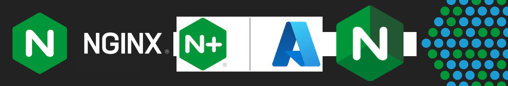

 

## NGINXaaS for Azure Workshop

 

### Overview

 

> ><strong>Welcome to the NGINXaaS for Azure Workshop!</strong>

 

This **NGINXperts Workshop** will introduce **`NGINXaaS for Azure`** with hands-on practice through lab exercises.

You will learn and explore NGINX for Azure, deploy and configure it with various Azure Resources. You will use many NGINX Plus features, for routing traffic, terminate TLS, splitting traffic, and caching.  You will build a sample Enterprise environment in Azure with apps and services in Linux and Windows VMs, use Docker, and multiple Kubernetes AKS clusters.  You will terminate TLS, route HTTP/S traffic, load balance running VMs, containers, pods and Nginx Ingress Controllers.  You will configure Advanced Nginx Plus features like Caching and Dynamic Split Clients for Blue/Green testing, using live traffic.  You will expose both Web and TCP applications on the Internet.  You will explore the integrations of Nginx with Azure Cloud Resources like Key Vault, Monitoring, Logging/Analytics, and Grafana.

The Hands-on Lab Exercises are designed to build upon each other, adding additional services and features as you progress through them, completing the labs in sequential order is required.  You will follow along as an instructor guides you through these exercises.

This is the third Workshop in the `NGINXperts Series' from the Nginx Communities and Alliances Team at Nginx.

 

NGINXaaS for Azure  |  NGINXperts Workshops
:-------------------------:|:-------------------------:
  |  

 

The Hands-On Lab Exercises are designed to build upon each other, adding additional services and features as you progress through them.  `It is important to complete the lab exercises in sequential order.`

By the end of this Workshop, you will have a working, operational NGINX for Azure deployment and Lab environment, with the skills to deploy and operate one for your Modern Application projects in Azure.

 

### Prerequisites

See the [Lab0 Readme.md](lab0/readme.md) for details on Student Prerequisites for this Workshop.

 

NGINXaaS for Azure  |  NGINX Plus  |  Kubernetes | Docker | Redis
:-------------------------:|:-------------------------:|:-------------------------:|:-------------------------:|:-------------------------:
  |     |   |   |  

 

## Lab Outline

### Lab 0: Prerequesites - Azure Subscription / Resources
- [Lab 0: Prerequesites - Azure Subscription / Resources](lab0/readme.md)

### Lab 1: Azure VNet and Subnet and Network Security Group
- [Lab 1: Azure VNet and Subnet and Network Security Group](lab1/readme.md)

### Lab 2: Nginx for Azure Overview and Deployment
- [Lab 2: Nginx for Azure Overview and Deployment](lab2/readme.md)

### Lab 3: Ubuntu VM / Docker / Windows VM / Cafe Demo  
- [Lab 3: Ubuntu VM / Docker / Windows VM / Cafe Demo](lab3/readme.md)

### Lab 4: AKS / Nginx Ingress Controller / Cafe Demo / Redis
- [Lab 4: AKS / Nginx Ingress Controller / Cafe Demo / Redis](lab4/readme.md)

### Lab 5: Nginx Load Balancing / Blue-Green / Split Clients
- [Lab 5: Nginx Load Balancing / Blue-Green / Split Clients](lab5/readme.md)

### Lab 6: Azure Monitoring / Logging Analytics
- [Lab 6: Azure Monitoring / Logging Analytics](lab6/readme.md)

### Lab 7: Azure Key Vault / TLS Essentials
- [Lab 7: Azure Key Vault / TLS Essentials](lab7/readme.md)

### Lab 8: Nginx Garage Demo
- [Lab 8: Nginx Garage Demo](lab8/readme.md)

### Lab 9: Nginx Caching / Rate Limits / Juiceshop
- [Lab9: Nginx Caching / Rate Limits / Juiceshop](lab9/readme.md)

### Lab 10: Nginx with Grafana for Azure
- [Lab10: Nginx with Grafana for Azure](lab10/readme.md)

#### Labs Optional: Optional Exercises
- [Labs Optional: Optional Exercises](labs-optional/readme.md)

 

### Authors

- Chris Akker - Solutions Architect - Community and Alliances @ F5, Inc.
- Shouvik Dutta - Solutions Architect - Community and Alliances @ F5, Inc.
- Adam Currier - Solutions Architect - Community and Alliances @ F5, Inc.
- Steve Wagner - Solutions Architect - Community and Alliances @ F5, Inc.

 

Click [Lab0: Student Prerequisites](lab0/readme.md) for details on Student Prerequisite Requirements for this Workshop.

Click [Lab1: Azure VNet and Subnet and Network Security Group](lab1/readme.md) to get started! 

