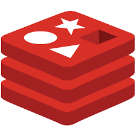

 

# NGINXaaS for Azure Workshop

 

## Welcome!

 

> ><strong>Welcome to the NGINX as a Service for Azure Workshop!</strong>

 

This NGINXperts Workshop will introduce **`NGINXaaS for Azure`** with hands-on practice through lab exercises.

You will learn how to configure NGINX for Azure, deploy it with various Azure Resources. 
- You will use many NGINX Plus features, for routing traffic, terminate TLS, splitting traffic, and caching.  
- You will build a sample Enterprise environment with apps and services in Linux and Windows VMs, use Docker, and multiple AKS Kubernetes clusters. 
- You will terminate TLS, route HTTP/S traffic, load balance running VMs, containers, pods and Nginx Ingress Controllers.  
- You will configure Advanced Nginx Plus features like Caching, Dynamic Split Clients for Blue/Green testing, using live traffic.  
- You will expose both Web and TCP applications on the Internet.  
- You will explore the integrations of Nginx with the Azure Cloud Resources like Key Vault, Monitoring, Logging/Analytics, and Grafana.

The Hands-on Lab Exercises are designed to build upon each other, adding additional services and features as you progress through them, completing the labs in sequential order is required.  You will follow along as an instructor guides you through these exercises.

>By the end of this Workshop, you will have a working, operational NGINX for Azure deployment, routing and load balancing traffic to and from VMs, Docker containers, and Nginx Ingress Controllers in Kubernetes with application pods and services. You will learn the necessary skills to deploy and operate N4A for your own Modern Applications running in Azure Cloud.  Thank You for taking the time to attend this NGINXperts Workshop!

## About NGINX as a Service for Azure

NGINX for Azure is an Enterprise-Ready solution for directing traffic to/from Azure Resources.  NGINX for Azure is available in most Azure Regions, in the Azure Marketplace.  NGINX for Azure is built from the same source code you know and trust from NGINX Plus.  You can find the full Nginx for Azure support and technical specifications on the https://www.f5.com/products/nginx/f5-nginxaas-for-azure website.  

 

 

Combining the speed and performance of NGINX with the trust and security behind F5 Networks, NGINX for Azure is synonymous with high‑performing, scalable, and secure modern apps in production.

[NGINXaaS for Azure Product Page](https://docs.nginx.com/nginxaas/azure/)

<<<<<<< Updated upstream
[NGINXaaS for Azure Frequently Asked Questions](https://docs.nginx.com/nginxaas/azure/faq/)
=======
 

### Prerequisites

See the [Lab0 Readme.md](lab0/readme.md) for details on Student Prerequisites for this Workshop.

 

NGINXaaS for Azure  |  NGINX Plus  |  Kubernetes | Docker | Redis
:-------------------------:|:-------------------------:|:-------------------------:|:-------------------------:|:-------------------------:
  |     |   |   |  

 

## Lab Outline

### Lab 0: Prerequesites - Azure Subscription / Resources
- [Lab 0: Prerequesites - Azure Subscription / Resources](lab0/readme.md)

### Lab 1: Azure VNet and Subnet and Network Security Group
- [Lab 1: Azure VNet and Subnet and Network Security Group](lab1/readme.md)

### Lab 2: Nginx for Azure Overview and Deployment
- [Lab 2: Nginx for Azure Overview and Deployment](lab2/readme.md)

### Lab 3: Ubuntu VM / Docker / Windows VM / Cafe Demo  
- [Lab 3: Ubuntu VM / Docker / Windows VM / Cafe Demo](lab3/readme.md)

### Lab 4: AKS / Nginx Ingress Controller / Cafe Demo / Redis
- [Lab 4: AKS / Nginx Ingress Controller / Cafe Demo / Redis](lab4/readme.md)

### Lab 5: Nginx Load Balancing / Blue-Green / Split Clients
- [Lab 5: Nginx Load Balancing / Blue-Green / Split Clients](lab5/readme.md)

### Lab 6: Azure Key Vault / TLS Essentials
- [Lab 6: Azure Key Vault / TLS Essentials](lab6/readme.md)

### Lab 7: Azure Monitoring / Logging Analytics
- [Lab 7: Azure Monitoring / Logging Analytics](lab7/readme.md)

### Lab 8: Nginx Garage Demo
- [Lab 8: Nginx Garage Demo](lab8/readme.md)

### Lab 9: Nginx Caching / Rate Limits / Juiceshop
- [Lab9: Nginx Caching / Rate Limits / Juiceshop](lab9/readme.md)

### Lab 10: Nginx with Grafana for Azure
- [Lab10: Nginx with Grafana for Azure](lab10/readme.md)

#### Labs Optional: Optional Exercises
- [Labs Optional: Optional Exercises](labs-optional/readme.md)
>>>>>>> Stashed changes

 

### Authors

- Chris Akker - Solutions Architect - Community and Alliances @ F5, Inc.
- Shouvik Dutta - Solutions Architect - Community and Alliances @ F5, Inc.
- Adam Currier - Solutions Architect - Community and Alliances @ F5, Inc.
- Steve Wagner - Solutions Architect - Community and Alliances @ F5, Inc.

-------------

 

**This completes the Introduction.**

  

Click on ([LabGuide](LabGuide.md)) to begin the Workshop.
