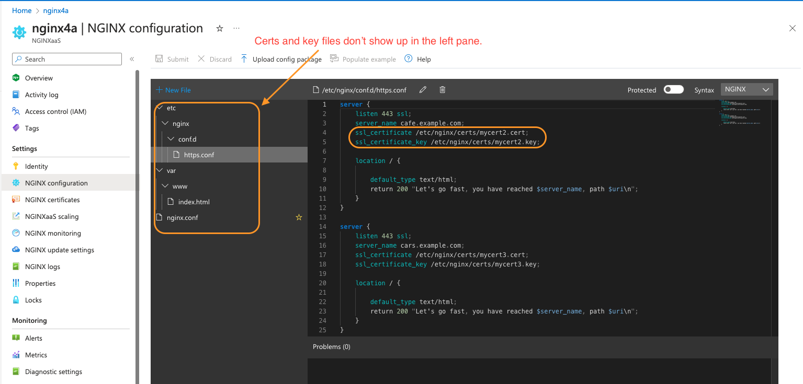

# Setup steps

## Create Azure Key Vault resource

1. Create an Azure key vault within the same resource group which has the NGINX as a service resource.

2. Below are the things it would prompt you to select/enter
    - Resource Group
    - Key vault name
    - Region
    - Pricing Tier : Default value is `Standard`.
    - Purge protection: Keep default value which is `Disable purge protection`
    - Click `Next`
  
    In next `Access Configuration` section, select below values
    - Permission model: Keep default value which is `Azure role-based access control`
    - Resource access: No need to check any box.
    - click `Next`

    In next `Networking` section, keep everything as default and click `Next`

    In next `Tags` section, add any tags if you like.

    Click on `Review + Create` to create the key vault.

    If it is successfully deployed then you should see a "Your deployment is complete" message.

## Create a new self-signed certificate

1. Within the newly created key vault, create a self signed certificate.

2. To do so open the `keyvault` resource and then click on `Certificates` from the left pane.

3. In the `Certificates` section, click on `Generate/Import` button present in top pane.
4. Make sure your account has necessary permissions to generate a new certificate. (Role needed `Key Vault Certificates Officer`).
5. Within the `Create a certificate` section, enter all the required fields
   1. Certificate Name
   2. Subject (eg. "CN=*.example.com")
   3. Content Type (Select `PEM`)
6. Click on `Create` to create your new self signed certificate.

## Use new self signed certificate with N4A

1. Open your N4A resource.

2. From the left pane select `NGINX certificate` section.

3. Within the `NGINX certificates` section, you will click on `+ Add certificate` option from top pane to add your newly created self-signed certificate to N4A.

4. In the `Add Certificate` sub section, fill in below required fields
   1. Preferred name (Provide a name of your choice)
   2. Certificate Path (This is where the cert would reside within N4A eg. `/etc/nginx/certs/example.cert`)
   3. Key Path (This is where the key would reside within N4A eg. `/etc/nginx/certs/example.key`)
   4. Key Vault (Select the key vault name that you created in above section)
   5. Certificate name (Select the self signed certificate that your created within the selected keyvault)
   6. Click on `Save`

5. Once you have added a certificate next task is to reference the certificate within nginx configuration.

6. From the left pane select `NGINX configuration` section.

7. Within the server block provide the reference of the certificate and key to the `ssl_certificate` and `ssl_certificate_key` directives to make use of your self-signed certificate.

   ```nginx
   ...
   server {

        listen 443 ssl;   
        server_name www.example.com;  

        ssl_certificate /etc/nginx/cert/example.cert;
        ssl_certificate_key /etc/nginx/cert/example.key;
        
        ...
   }
   ```

# Things to improve:

1. Once the tls cert and key are tied to n4a resource, if you navigate to the nginx configuration pane, the cert and key don't show up in the file explorer pane. Adding them to the file explorer would provide a visual confirmation that the cert and keys have been added to the relevant directory. If it is a security concern then those files can be present as greyed out and non-clickable.

   

